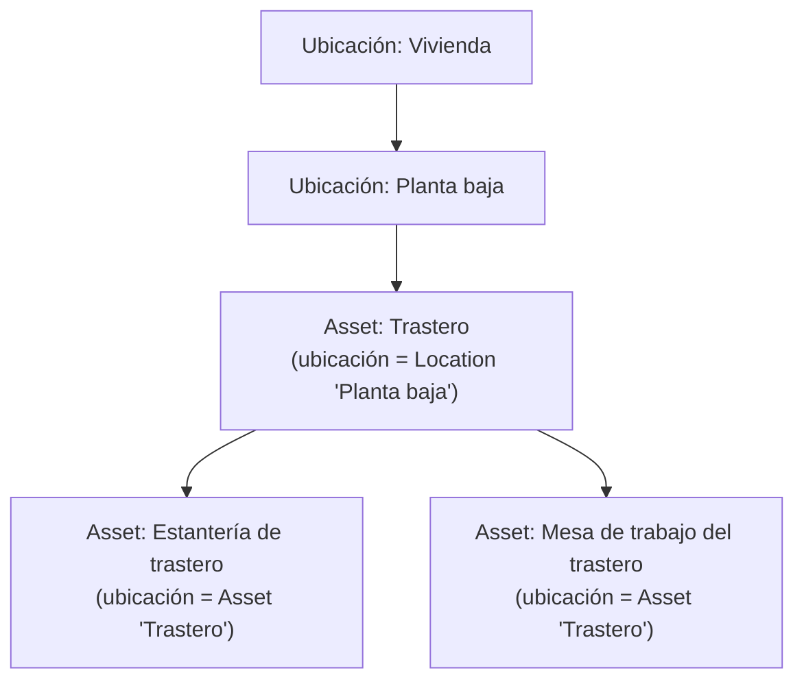
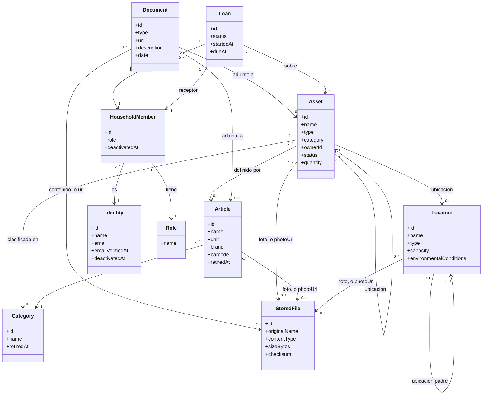
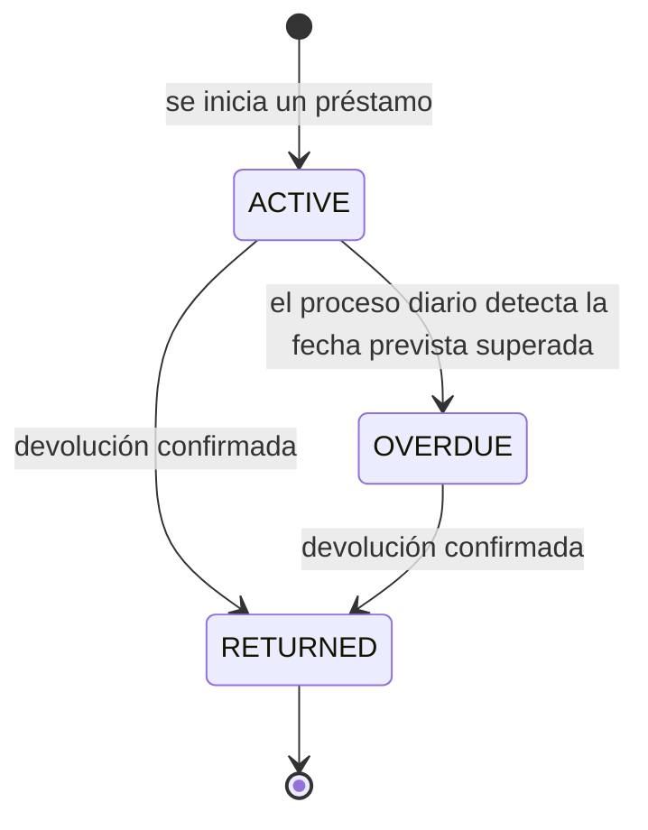
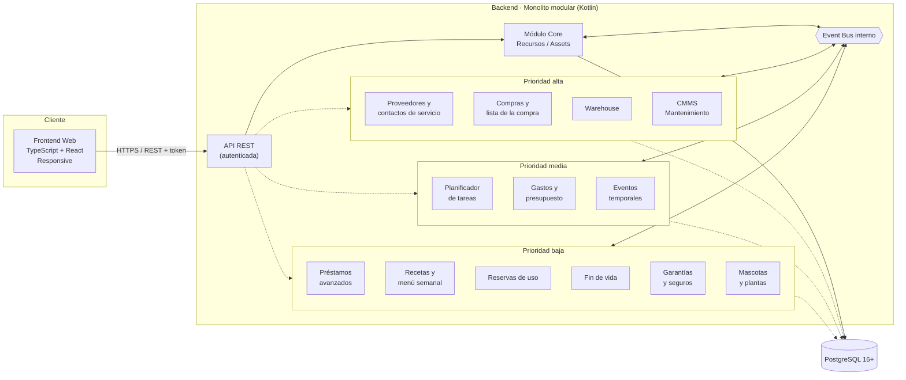
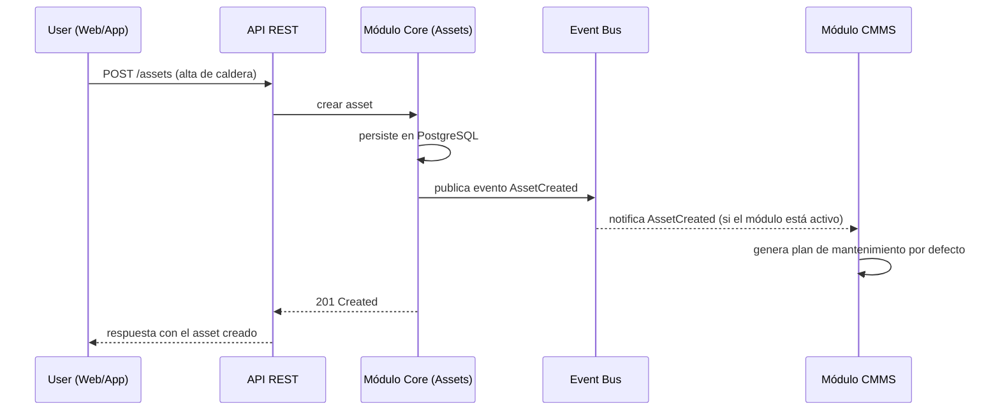
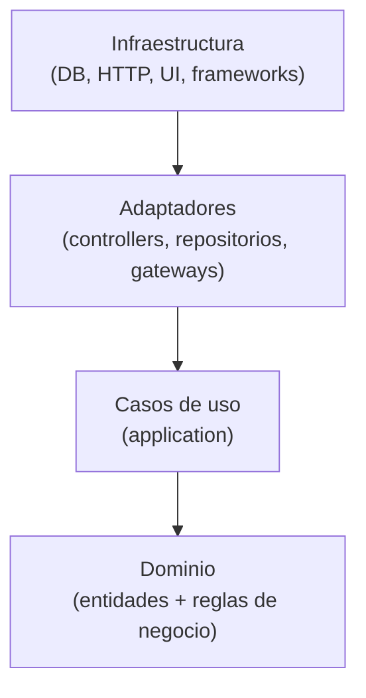
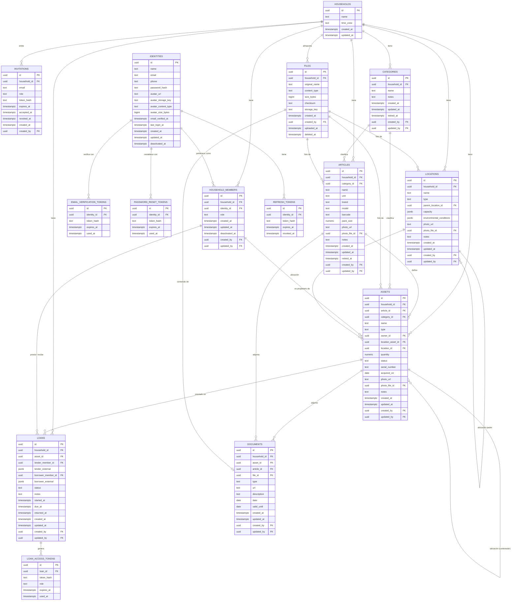
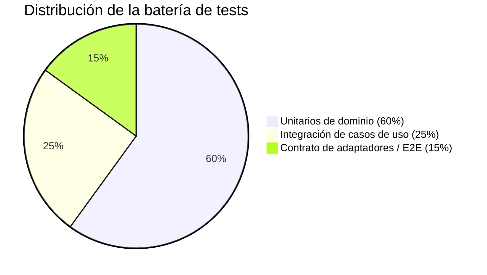

# DRP · Domestic Resource Planning

> **Estado del documento:** vivo — se actualiza a medida que el proyecto avanza.
> **Última actualización:** 2026-08-10
> **Fase actual:** Fase 0 completada — core mínimo definido y sin decisiones de diseño abiertas; lista para iniciar la Fase 1 (Core MVP)

---

## 1. Resumen ejecutivo

**DRP (Domestic Resource Planning)** es una solución para la gestión de recursos y assets en el entorno doméstico. Traslada al hogar el enfoque modular que ya ha demostrado su valor en los ERP empresariales: un **core mínimo** que resuelve lo esencial (dar de alta, ubicar y clasificar los recursos del hogar) sobre el que se pueden ir **activando módulos** a medida que aparece la necesidad (mantenimiento, inventario, planificación, eventos puntuales...).

El proyecto se construye como dos componentes claramente diferenciados —**backend** y **frontend web responsive**— que se comunican mediante una **API REST autenticada**.

---

## 2. Objetivo del proyecto

**Problema:** la información sobre los recursos de un hogar (electrodomésticos, vehículos, mobiliario, herramientas, garantías, revisiones...) suele estar dispersa entre hojas de cálculo, carpetas de papeles, recordatorios sueltos del móvil y la memoria de quien gestiona la casa. No existe un punto único de verdad, y mucho menos algo que crezca con las necesidades de cada hogar.

**Visión:** aplicar al hogar la disciplina de gestión que aporta un ERP a una empresa: un sistema central de recursos, extensible por módulos, sin obligar a implementar de golpe funcionalidades que un hogar concreto no necesita.

> **Ejemplo ilustrativo:** una familia con caldera, dos coches, electrodomésticos y un garaje lleno de herramientas.
> - **Sin DRP:** la fecha de la ITV está en el calendario del móvil, el manual de la caldera en un cajón, el inventario del garaje "en la cabeza", y las tareas de mantenimiento se recuerdan (o no) por costumbre.
> - **Con DRP:** todos los assets están dados de alta en el core con su documentación asociada. Si más adelante el hogar activa el módulo de **mantenimiento (CMMS)**, el sistema puede generar automáticamente los planes de revisión sin tener que rehacer nada de lo ya cargado.

---

## 3. Analogía ERP → DRP

| Concepto en un ERP empresarial | Equivalente en DRP (hogar) |
|---|---|
| Activos productivos (maquinaria, líneas) | Electrodomésticos, vehículos, mobiliario, herramientas |
| Mantenimiento preventivo/correctivo (CMMS) | Revisión de caldera, ITV, cambio de filtros, garantías |
| Gestión de almacén / inventario | Despensa, garaje, trastero, botiquín |
| Compras y aprovisionamiento | Lista de la compra, reposición de lo que se agota |
| Maestro de proveedores | Fontanero, servicio técnico de la caldera, taller |
| Planificación de producción / tareas | Tareas domésticas, turnos, rutinas familiares, menú semanal |
| Gestión de proyectos / eventos puntuales | Mudanzas, reformas, celebraciones, viajes |

---

## 4. Alcance funcional

### 4.1 Core mínimo (obligatorio)

- **Gestión del hogar:** unidad de aislamiento multi-tenant — varios hogares comparten la misma base de datos; agrupa a los usuarios, assets, ubicaciones y préstamos de una misma vivienda (ver el modelo de datos en 5.6).
- **Gestión de recursos/assets:** alta, baja, modificación, categorización, ubicación (jerárquica), propietario/responsable y documentación asociada. Cubre **todo el material del hogar**, no solo los bienes económicamente relevantes: desde una caldera hasta un paquete de harina (ver 4.1.1).
- **Gestión de ubicaciones:** estructura jerárquica de espacios físicos con características mínimas de almacenaje.
- **Gestión de usuarios del hogar:** autenticación y roles, incluyendo roles de acceso acotado para préstamos entre personas.
- **Event bus interno:** canal de comunicación entre módulos, para que el core no dependa de que un módulo esté activo o no.
- **API REST autenticada:** único canal de comunicación entre backend y frontend.

> Las subsecciones 4.1.1 a 4.1.7 recogen la primera pasada de profundización sobre el core mínimo.

#### 4.1.1 Recursos y assets

Un **asset** es **cualquier material presente en el hogar**, no solo el que resulta relevante por su valor económico, su depreciación, su seguro o su mantenimiento. Un taladro es un asset, pero también lo son un bote de detergente, un paquete de arroz o un cuadro del salón. Restringir el concepto a los bienes "importantes" dejaría fuera la mayor parte de lo que un hogar realmente gestiona.

Ahora bien, no todo el material se comporta igual, y esa diferencia condiciona el modelo:

| Naturaleza | Qué es | Cómo se cuenta | Ejemplos |
|---|---|---|---|
| **`DURABLE`** | Tiene identidad propia y se usa de forma repetida sin agotarse | Una fila por unidad física | Caldera, taladro, sofá, coche, cuadro |
| **`CONSUMABLE`** | Se agota o se repone con el uso; las unidades son intercambiables entre sí | Una fila por existencia —un artículo en una ubicación—, con `quantity` | Harina, detergente, pilas, bombillas |

Dar de alta trescientos gramos de harina como trescientas filas no tendría sentido; tampoco lo tendría gestionar dos taladros idénticos como "cantidad: 2", porque cada uno tiene su propia ubicación, su propio préstamo y su propio mantenimiento. De ahí la distinción.

> **Alcance deliberado:** el core mantiene un contador simple (`quantity`) y nada más. El seguimiento de existencias real — consumos, mínimos, reposición, caducidades, lotes — pertenece al módulo **Warehouse** (ver 4.2), que se engancha vía event bus. El core no debe convertirse en un gestor de inventario (ver la decisión en 4.1.7).

**Artículo y existencia: el alta de un consumible no se repite.**

Traer a casa un paquete de azúcar de 1 kg no da de alta nada nuevo: el hogar ya sabe qué es el azúcar y en qué unidad lo lleva. Por eso la **definición** de un consumible se separa de sus **existencias**:

| Concepto | Qué es | Qué guarda | Equivalente ERP |
|---|---|---|---|
| **`Article`** | La ficha reutilizable de *qué* es algo | `name`, `category`, `unit`, y opcionalmente marca y código de barras | Material maestro |
| **Asset `CONSUMABLE`** | Una existencia concreta de ese artículo en un sitio | `quantity`, ubicación, propietario, estado | Stock |

Un artículo **no es un asset**: no es material, no ocupa sitio, no tiene cantidad y no se presta. Es solo la ficha que evita reescribir «Azúcar / Alimentación / `GRAM`» en cada compra.

> **Nomenclatura.** En castellano el concepto es «artículo»; en código es `article` — tabla `articles`, campo `articleId`, recurso `/api/v1/articles`. Las tablas de atributos de aquí en adelante dan las dos formas: **Nombre de definición (`nombreDePrograma`)**, con la regla completa en 4.1.7.

De ahí que dar entrada a un consumible sea siempre la misma operación, `RegisterConsumableIntake` (ver 5.7): se indica el artículo —eligiéndolo del catálogo del hogar, o creándolo en el mismo gesto si aún no existe—, la ubicación y la cantidad que entra. Si ya hay una existencia de ese artículo en esa ubicación, **la operación suma sobre ella**; si no la hay, la crea. Nunca aparece una segunda fila «Azúcar» en la despensa.

Reglas que sostienen ese comportamiento:

- **Una existencia por artículo y ubicación.** El azúcar de la despensa y el del trastero son dos existencias del mismo artículo, cada una con su cantidad y su propietario.
- **La `unit` la fija el artículo**, no la existencia. Si el azúcar se lleva en gramos, todas sus existencias van en gramos; comprar «un paquete de 1 kg» es una conversión en la entrada, no otra unidad guardada. Convertir entre unidad de compra y unidad de consumo es del módulo Warehouse, no del core.
- **En un `DURABLE` el artículo es opcional.** Dos taladros idénticos pueden compartir artículo (misma marca, mismo modelo, mismo manual) sin dejar de ser dos assets con su ubicación, su préstamo y su mantenimiento propios. Un sofá único no necesita artículo: se da de alta con su `name` y su `category` propios.
- El catálogo es **de cada hogar**, como el resto de tablas del core (ver 5.6). Un catálogo compartido entre hogares, o sembrado desde una base de códigos de barras, sería una evolución posterior.

> **Esto tampoco es gestión de inventario.** El catálogo es dato maestro: qué cosas existen y cómo se llaman. Cuánto queda, cuándo caduca y cuándo hay que reponer sigue siendo de Warehouse.

**Jerarquía y composición.** Un asset puede definirse como un conjunto de otros assets (composición). Por ejemplo, el asset **"Trastero"** puede estar compuesto por los assets **"Estantería de trastero"** y **"Mesa de trabajo del trastero"**.

Esta jerarquía se construye a través del campo **ubicación** de cada asset, que es polimórfico: un asset puede tener como ubicación **otro asset** (por ejemplo, la mesa de trabajo "está en" el asset Trastero) **o bien** una **ubicación** propiamente dicha (ver 4.1.2). Un asset puede no tener ubicación asignada todavía (por ejemplo, recién dado de alta y pendiente de clasificar).



**Atributos mínimos de un Asset:**

| Atributo | Aplica a | Descripción |
|---|---|---|
| Identificador (`id`) | Ambos | — |
| Tipo (`type`) | Ambos | `DURABLE` o `CONSUMABLE`. Se fija en el alta y **no es modificable** después: cambiar la naturaleza de un asset equivale a darlo de baja y crear otro |
| Artículo (`articleId`) | Obligatorio en `CONSUMABLE`, opcional en `DURABLE` | Referencia al artículo del catálogo del hogar que define qué es este asset |
| Nombre (`name`) | Ambos | Propio del asset, o heredado de su artículo cuando lo tiene. Un asset sin artículo debe informarlo |
| Categoría (`categoryId`) | Ambos | Clasificación funcional, independiente del tipo. Referencia al catálogo de categorías del hogar (ver más abajo). Se hereda del artículo igual que el nombre |
| Propietario (`ownerId`) | Ambos | Referencia a un usuario del hogar. Opcional: queda vacío cuando su propietario causa baja (ver 4.1.4) |
| Ubicación (`location`) | Ambos | Referencia a otro Asset **o** a una Location — nunca ambas a la vez |
| Estado (`status`) | Ambos | `AVAILABLE`, `LENT`, `DECOMMISSIONED` |
| Cantidad (`quantity`) | Solo `CONSUMABLE` | Existencia actual, expresada en la unidad de su artículo |
| Número de serie (`serialNumber`) | Solo `DURABLE`, opcional | Lo que distingue dos unidades por lo demás idénticas, y lo que pide un fabricante al reclamar una garantía |
| Fecha de adquisición (`acquiredOn`) | Solo `DURABLE`, opcional | Cuándo entró en el hogar. Es procedencia, no valor: el importe pertenece al módulo de gastos |
| Foto (`photoUrl` / `photoFileId`) | Ambos, opcional | Una imagen, en forma de **enlace externo o de fichero guardado en el servidor** —nunca las dos a la vez— igual que en la documentación (ver «Ficheros almacenados»). Reconocer una cosa de un vistazo es la mitad de un inventario doméstico |
| Notas (`notes`) | Ambos, opcional | Texto libre |
| Fecha de alta (`createdAt`) | Ambos | — |
| Última modificación (`updatedAt`) | Ambos | — |
| Creado por (`createdBy`) | Ambos | Ver «Autoría de los cambios» |
| Modificado por (`updatedBy`) | Ambos | Ídem |
| Documentación asociada | Opcional, típicamente `DURABLE` | Facturas, garantías, manuales. No es un campo del asset sino una entidad propia (ver más abajo): un paquete de arroz no tiene manual |

**Atributos mínimos de un Articulo:**

| Atributo | Descripción |
|---|---|
| Identificador (`id`) | — |
| Nombre (`name`) | Único dentro del hogar (comparado normalizado, sin distinguir mayúsculas ni acentos) |
| Categoría (`categoryId`) | La misma clasificación funcional que en un asset, contra el mismo catálogo |
| Unidad (`unit`) | Unidad de medida en la que se llevan todas sus existencias (`UNIT`, `GRAM`, `KILOGRAM`, `MILLILITER`, `LITER`, `METER`, `PACK`) |
| Marca (`brand`) | Opcional |
| Modelo (`model`) | Opcional. Marca y modelo juntos son la identidad real de un duradero, y lo que hace que compartir artículo entre dos unidades signifique algo |
| Código de barras (`barcode`) | Opcional. Si se informa, es único en el hogar y sirve para localizar el artículo al dar entrada |
| Contenido por envase (`packSize`) | Opcional, en la unidad del artículo. Es lo que permite dar entrada a «dos paquetes» de algo que se lleva en gramos sin que nadie multiplique a mano — la fricción que quedó señalada al subir la unidad al artículo |
| Foto (`photoUrl` / `photoFileId`) | Opcional, enlace o fichero como en el asset. Sirve a todas sus existencias a la vez |
| Notas (`notes`) | Texto libre, opcional |
| Fecha de alta (`createdAt`) | — |
| Última modificación (`updatedAt`) | — |
| Fecha de retirada (`retiredAt`) | Informada si el artículo está retirado del catálogo |
| Creado por (`createdBy`) | Ver «Autoría de los cambios» |
| Modificado por (`updatedBy`) | Ídem |

**Categorías: un catálogo por hogar.**

La clasificación funcional no es una lista fija del sistema sino una **entidad propia**, `Category`, con una fila por categoría y por hogar. Cada hogar arranca con un juego sembrado al crearse —«Mobiliario», «Alimentación», «Limpieza», «Herramientas», «Decoración»— y a partir de ahí lo edita: quien guarda material de escalada o repuestos de bici no tiene por qué encajarlos en «herramienta».

| Atributo | Descripción |
|---|---|
| Identificador (`id`) | — |
| Nombre (`name`) | Único entre las categorías vigentes del hogar, comparado normalizado |
| Notas (`notes`) | Texto libre, opcional |
| Fecha de alta (`createdAt`) | — |
| Última modificación (`updatedAt`) | — |
| Fecha de retirada (`retiredAt`) | Informada si la categoría está retirada |
| Creado por (`createdBy`) | Ver «Autoría de los cambios» |
| Modificado por (`updatedBy`) | Ídem |

A diferencia de `type`, `status` o `unit`, los nombres de categoría **no son valores de un enumerado**: son datos que el hogar edita y que se le muestran tal cual, así que van en su idioma y no siguen la regla de nomenclatura de 4.1.7.

Se retira igual que un artículo, y por el mismo motivo: los assets la referencian por clave ajena, así que borrar la fila rompería el historial. Una categoría retirada deja de ofrecerse al clasificar, pero los assets que ya la tenían la conservan.

**Documentación asociada.**

Facturas, garantías y manuales se modelan como una entidad `Document` que apunta **a un enlace externo o a un fichero guardado en el servidor**, nunca a los dos. Las dos vías conviven porque las dos son reales: la factura ya está en el correo y el manual en la web del fabricante, así que obligar a descargarlos y volverlos a subir sería trabajo inventado; pero la garantía que llegó en un sobre y el manual que solo existe en papel no tienen URL ninguna, y hasta ahora no cabían en el modelo.

| Atributo | Descripción |
|---|---|
| Identificador (`id`) | — |
| Tipo (`type`) | `INVOICE`, `WARRANTY`, `MANUAL`, `OTHER` |
| Enlace (`url`) | URL al documento, cuando vive fuera. **Exactamente uno** de `url` o `fileId` |
| Fichero (`fileId`) | Referencia al `StoredFile` subido, cuando vive aquí. Ver «Ficheros almacenados» |
| Descripción (`description`) | Texto libre, opcional |
| Fecha del documento (`date`) | Cuándo se emitió: la fecha de la factura, la de la garantía. Opcional |
| Válido hasta (`validUntil`) | Cuándo deja de valer, que en una garantía es el dato que importa. Opcional, y distinto del anterior: tenerlos en un solo campo obligaba a elegir cuál de los dos se pierde |
| Alta (`createdAt`) | — |
| Última modificación (`updatedAt`) | — |
| Creado por (`createdBy`) | Ver «Autoría de los cambios» |
| Modificado por (`updatedBy`) | Ídem |

Un documento cuelga **de un asset o de un artículo, nunca de ambos**, y la distinción es la que ya estaba implícita en el modelo: la factura y la garantía son de la unidad física que compraste, y el manual es del modelo. Colgarlo del artículo es lo que hace que dos taladros idénticos compartan manual sin duplicarlo, que es justo lo que 4.1.7 prometía al abrir el artículo a los duraderos.

**Ficheros almacenados.**

Un `StoredFile` es un binario guardado en el servidor: la foto que alguien acaba de hacer con el móvil, el manual escaneado, la garantía que llegó en papel. **No es un asset** —no ocupa sitio en el hogar, no se clasifica ni se presta— igual que tampoco lo es un artículo: es un adjunto, con dueño, tamaño y fecha.

| Atributo | Descripción |
|---|---|
| Identificador (`id`) | — |
| Nombre original (`originalName`) | El nombre con el que llegó, saneado. Es **solo un dato**: nunca forma parte de la ruta en disco (ver 5.8) |
| Tipo de contenido (`contentType`) | El **detectado** al inspeccionar el contenido, no el que declaró quien subió el fichero |
| Tamaño (`sizeBytes`) | El del fichero ya almacenado, después de recodificarlo si era una imagen. Es lo que suma la cuota |
| Suma de verificación (`checksum`) | SHA-256 del contenido. Detecta corrupción silenciosa y permite cuadrar una restauración contra la base de datos |
| Clave de almacenamiento (`storageKey`) | Ruta relativa dentro del volumen de ficheros. **La genera la aplicación** a partir del identificador y no se acepta jamás de la petición. Se guarda en vez de recalcularse al vuelo para que cambiar la distribución en disco —o migrar a otro almacén— no obligue a reescribir la historia |
| Fecha de alta (`createdAt`) | — |
| Creado por (`createdBy`) | Ver «Autoría de los cambios» |
| Subida completada (`uploadedAt`) | Nulo mientras la subida está en curso: la fila existe y **ya ocupa cuota**, pero el fichero todavía no se puede adjuntar (ver 5.8.3) |
| Borrado (`deletedAt`) | Marca de retirada. Los bytes los desenlaza un proceso diario, no la transacción que borra la fila |

No lleva `updatedAt` ni `updatedBy`: un fichero no se modifica. Cambiar la foto de un asset es subir otra y apuntar a ella, no editar la que había — así el `checksum` sigue significando algo.

**Toda imagen tiene miniatura**, generada al subirla y servida en los listados para que un móvil no descargue el original a tamaño completo. No es un atributo: existe siempre que el fichero sea una imagen, porque generarla forma parte de la misma recodificación que le quita el EXIF — si no se puede generar, es que tampoco se ha podido recodificar, y entonces el fichero se rechaza. Un PDF no tiene.

**Un gigabyte por hogar.** Varios hogares comparten un mismo servidor, así que el almacenamiento es un recurso común, y sin límite se lo queda entero el primero que suba los vídeos de la reforma. Cada hogar dispone de **1 GB**, que es la suma de `sizeBytes` de sus ficheros vivos. De ahí salen cuatro consecuencias que conviene no descubrir tarde:

- **La cuota se comprueba dos veces**: contra el tamaño declarado antes de recibir nada, y contra el real mientras se recibe, abortando en cuanto se pasa. Lo declarado lo escribe el cliente, así que no es una fuente de verdad.
- **Cuenta lo que hay, no lo que se usa.** Un fichero subido y nunca adjuntado ocupa cuota mientras exista; si nadie lo adjunta, el proceso diario lo retira a las 24 horas.
- **Dar de baja un asset no libera nada.** Su foto y sus facturas siguen ahí, porque el historial es justo lo que protege la baja lógica. Liberar espacio es un gesto explícito —borrar el documento, quitar la foto—, nunca un efecto colateral.
- **Las miniaturas no cuentan.** Las genera el sistema para que un listado en un móvil no descargue el original, así que no son decisión del hogar. El disco realmente ocupado por un hogar es algo mayor que su cuota, y eso es cosa del dimensionado (ver 5.8), no del usuario.

**El avatar no es un fichero del hogar.** Una `Identity` no pertenece a ninguno (ver 4.1.4), así que su avatar no se puede cargar a ninguna cuota ni proteger con Row-Level Security. Por eso **no** es un `StoredFile`: vive en columnas de la propia `identities`, es uno solo y **siempre se sustituye**, y su límite no es una cuota acumulable sino un tamaño máximo por fichero —1 MB—. Sin acumulación posible no hay nada que contar.

Cómo se guardan, se validan y se sirven estos ficheros es materia de arquitectura, y está en **5.8**.

**Autoría de los cambios (transversal).**

Un hogar es un sitio compartido, y la pregunta que más se hace no es qué cambió sino **quién lo cambió**: quién movió el taladro, quién se llevó la última bombilla. Por eso toda entidad del core lleva dos referencias más, junto a sus fechas:

| Atributo | Descripción |
|---|---|
| Creado por (`createdBy`) | Usuario que dio de alta la fila |
| Modificado por (`updatedBy`) | Usuario del último cambio |

Tres cosas que se derivan y conviene no olvidar:

- **Ambos pueden estar vacíos, y vacío significa «el sistema».** El proceso diario que marca los préstamos vencidos (4.1.5) no actúa en nombre de nadie, así que deja `updatedBy` a nulo. Inventar un usuario técnico para rellenarlo daría una autoría falsa.
- **Nunca se aceptan del cliente.** Salen del token de quien hace la petición, igual que el `householdId`. Un campo de autoría que el cliente pueda rellenar no vale para nada, porque se puede falsear.
- **El usuario referenciado puede estar de baja.** Como los usuarios no se borran (ver 4.1.4), la referencia sigue resolviendo: el historial no pierde el nombre de quien hizo las cosas cuando esa persona deja el hogar.

El hogar es la excepción: no lleva autoría propia porque, en el instante en que su fila nace, todavía no existe ningún usuario que pueda figurar. Un fichero lleva solo la mitad —`createdBy`—, porque no se modifica nunca (ver «Ficheros almacenados»).

**Reglas mínimas de negocio:**
- Un asset no puede ser su propio ancestro en la jerarquía de composición (evita ciclos).
- Un asset no puede tener como ubicación simultáneamente otro asset y una Location: es una u otra.
- Un asset no puede darse de baja si tiene assets hijos o un préstamo **abierto** —`ACTIVE` o `OVERDUE`—, sin resolver antes esa dependencia. La baja es siempre lógica (`status = DECOMMISSIONED`): nada se borra, para no perder el historial.
- Un `CONSUMABLE` nunca está `LENT`, porque no se presta: su estado es `AVAILABLE` o `DECOMMISSIONED`.
- Dar de baja una existencia que aún tenía cantidad la deja a 0 — se da por perdida — en lugar de dejar un resto colgando en una fila muerta que ninguna suma de existencias volvería a mirar.
- Un `CONSUMABLE` debe tener `articleId` y `quantity` (≥ 0); un `DURABLE` no puede tener `quantity` — la suya implícita es siempre 1.
- El nombre y la categoría efectivos de un asset son los de su artículo cuando lo tiene; un asset sin artículo debe informarlos él. No se guardan por duplicado.
- Una categoría no se borra: se retira cuando el hogar deja de usarla, y los assets que ya la tenían la conservan.
- Un documento cuelga de un asset **o** de un artículo, nunca de los dos ni de ninguno.
- Un documento apunta a un enlace **o** a un fichero, nunca a los dos ni a ninguno. Una foto también es enlace **o** fichero, pero ahí sí caben los dos vacíos: no tener foto es lo normal.
- Un fichero pertenece a un hogar y **no puede referenciarse desde otro**, ni siquiera adjuntándolo a mano por identificador.
- Un fichero se adjunta **una sola vez**: ni dos documentos ni un documento y una foto comparten fichero. Compartir haría ambiguo qué pasa al borrar y qué cuenta en la cuota; para que dos unidades idénticas compartan manual ya está el artículo.
- La suma de los ficheros vivos de un hogar no puede superar **1 GB**, y ningún fichero suelto puede pasar de **25 MB**.
- Borrar un fichero no borra sus bytes en el acto: marca la fila, y un proceso diario los desenlaza. La **cuota sí se libera en el acto**, aunque el disco tarde hasta 24 horas en enterarse; ese desfase lo absorbe el dimensionado del volumen (ver 5.8.2), no el usuario esperando. Ese margen no es una función de deshacer —no hay ningún gesto que restaure lo borrado— sino la ventana en la que un operador todavía puede recuperar un borrado por error sin ir a la copia de seguridad.
- **Cerrar la cuenta borra el avatar.** Es la única imagen que retrata a una persona, y la baja de la identidad es el momento en que deja de haber motivo para conservarla. Los ficheros del hogar no se van con ella: son del hogar, no suyos.
- El propietario de un asset es opcional: queda vacío cuando quien lo tenía a su nombre causa baja en el hogar (ver 4.1.4).
- No puede haber dos existencias vivas del mismo artículo en la misma ubicación: dar entrada sobre una existente suma cantidad. Cuando dos existencias del mismo artículo ya están creadas por separado y se quieren juntar, eso es `MergeStockItems` (ver 5.7), no un movimiento.
- Una existencia dada de baja deja de ocupar su hueco: se puede volver a dar entrada de ese artículo en esa ubicación, y la fila antigua se conserva por historial.
- Un artículo no se borra nunca: se **retira** del catálogo cuando ya no le queda ninguna existencia viva, y deja de ofrecerse en el alta. Las existencias dadas de baja siguen apuntando a él, así que la fila tiene que permanecer.
- Solo un `DURABLE` puede actuar como ubicación de otros assets: una estantería contiene cosas, un paquete de harina no.
- Solo un `DURABLE` puede prestarse. Un consumible no se presta, se consume o se entrega; la semántica de devolución no le aplica (ver 4.1.5).
- Un `CONSUMABLE` con `quantity = 0` **sigue existiendo** como asset (agotado, pendiente de reposición). Llegar a cero no da de baja nada: esa es una decisión del hogar, no del sistema. Su artículo sigue en el catálogo en cualquier caso.

#### 4.1.2 Ubicaciones

Una **ubicación (Location)** representa un espacio físico de almacenaje y, al igual que los assets, admite jerarquía (p. ej. Vivienda → Planta baja → Garaje → Estantería 2). A diferencia del asset, una ubicación no es un recurso del hogar en sí misma, sino el contenedor físico donde se guardan los recursos.

**Atributos mínimos de una Location:**

| Atributo | Descripción |
|---|---|
| Identificador (`id`) | — |
| Nombre (`name`) | Único entre las ubicaciones hermanas, es decir, con el mismo padre: dos «Estantería 2» pueden convivir en garajes distintos, pero no en el mismo |
| Tipo (`type`) | `HOUSE`, `FLOOR`, `ROOM`, `FURNITURE`, `SHELF`, `OTHER`. Lista fija: describe la naturaleza del contenedor, no lo que el hogar guarda en él |
| Ubicación padre (`parentLocationId`) | Opcional, para la jerarquía |
| Capacidad (`capacity`) | Opcional, y con forma única: un tipo (`WEIGHT`, `VOLUME`, `UNITS`), un máximo numérico y su unidad. No se modela por tipo de ubicación — un estante aguanta kilos y un armario litros, pero ambos caben en la misma terna |
| Condiciones ambientales (`environmentalConditions`) | Opcionales, todas: temperatura mínima y máxima en °C, humedad mínima y máxima en %, y exposición a la luz (`DIRECT`, `INDIRECT`, `DARKNESS`). Solo se informan si son relevantes para esa ubicación |
| Foto (`photoUrl` / `photoFileId`) | Opcional, enlace o fichero como en el asset. Una foto del estante ahorra describir dónde está la caja |
| Notas (`notes`) | Texto libre, opcional |
| Fecha de alta (`createdAt`) | — |
| Última modificación (`updatedAt`) | — |
| Creado por (`createdBy`) | Ver «Autoría de los cambios» |
| Modificado por (`updatedBy`) | Ídem |

**Varias viviendas bajo un mismo hogar.** El hogar no es una casa: es el conjunto de personas y cosas que se gestionan juntas. De él pueden colgar **varias viviendas** —la principal, la de verano, el trastero alquilado aparte—, y cada una es simplemente una `Location` sin padre y de tipo `HOUSE`. No hace falta entidad nueva: la jerarquía ya admite varias raíces.

Lo que **no** se hace es colgar el resto del dominio de la vivienda. Categorías, artículos, usuarios y assets pertenecen al **hogar**, no a una vivienda concreta: el mismo catálogo de artículos sirve para la despensa de las dos casas, y un taladro puede viajar de una a otra sin cambiar de dueño ni de categoría. Un asset tampoco está obligado a estar en ninguna vivienda — su ubicación es opcional (ver 4.1.1).

**Reglas mínimas de negocio:**
- Una ubicación no puede ser su propia ancestra (evita ciclos).
- Si se informa una capacidad, superarla al asignar un asset **advierte pero no bloquea**: el sistema no sabe cuánto ocupa cada cosa —el asset no lleva peso ni volumen— así que solo puede contar unidades con certeza. Bloquear con datos incompletos impediría guardar algo que sí cabe.
- Una ubicación no puede eliminarse si tiene ubicaciones hijas o assets dentro.

> **Por decidir, y no aquí:** que el aviso de capacidad sea útil más allá de contar unidades exige que el asset lleve peso o volumen, y eso solo tiene sentido si alguien los rellena. Es terreno del módulo **Warehouse** (ver 4.2), que es quien va a necesitar medir lo que ocupa cada cosa; se resolverá al definir los módulos, no antes. Queda anotado como pregunta en 4.1.7 en lugar de inventar aquí un campo que nadie mantendría.

#### 4.1.3 Modelo de dominio del core (vista conjunta)



#### 4.1.4 Usuarios y roles

Se contemplan cuatro roles, agrupados en dos tipos según su alcance:

| Rol | Tipo | Alcance | Permisos típicos |
|---|---|---|---|
| Administrador del hogar | Estructural | Todo el hogar | CRUD completo de assets, ubicaciones y usuarios; gestión de roles; activar/desactivar módulos |
| Miembro del hogar | Estructural | Todo el hogar | CRUD de assets y ubicaciones; iniciar y gestionar préstamos; sin gestión de usuarios ni módulos |
| Prestador | Contextual (ligado a un préstamo) | Un préstamo concreto | Consultar el estado del préstamo; confirmar la entrega del asset |
| Receptor del préstamo | Contextual (ligado a un préstamo) | Un préstamo concreto | Consultar el estado y la fecha prevista de devolución; confirmar la devolución |

**Atributos mínimos de un Hogar:**

El hogar es la unidad de aislamiento que agrupa a todo lo demás (ver 5.6), y hasta ahora solo tenía nombre.

| Atributo | Descripción |
|---|---|
| Identificador (`id`) | — |
| Nombre (`name`) | — |
| Zona horaria (`timeZone`) | Identificador IANA, p. ej. `Europe/Madrid`. **La necesita el proceso diario de vencidos** (ver 4.1.5): «la fecha prevista ya pasó» no significa nada sin saber respecto a qué huso, y un hogar no tiene por qué estar donde esté el servidor |
| Fecha de alta (`createdAt`) | — |
| Última modificación (`updatedAt`) | — |

**Quién eres y qué eres aquí: identidad y pertenencia.**

Una persona y su papel en un hogar son dos cosas distintas, y el core las separa en dos entidades:

| Concepto | Qué es | Qué guarda |
|---|---|---|
| **`Identity`** | Quién eres en la instalación | Correo, contraseña, verificación, últimos accesos |
| **`HouseholdMember`** | Qué eres dentro de un hogar concreto | Rol, y todo lo que el dominio cuelga de «un usuario» |

En el MVP **una identidad tiene como mucho una pertenencia activa**, así que en la práctica se comporta igual que antes. Se separan ahora porque los casos que rompen esa suposición son cotidianos —custodia compartida, un piso de estudiantes además de la casa familiar, quien lleva también el inventario de sus padres— y porque hacerlo después obligaría a tocar la identidad, el token y todas las consultas a la vez. Se prepara la estructura y se limita el comportamiento.

De la separación salen cuatro consecuencias que conviene tener presentes:

- **El correo es único en toda la instalación**, no dentro del hogar, y ya no se libera al dejar uno: la identidad sobrevive a la pertenencia y podrá entrar en otro hogar más adelante.
- **Todo lo que el dominio llama «usuario» apunta a la pertenencia**, no a la identidad: el propietario de un asset, el prestador y el receptor de un préstamo, y el `createdBy`/`updatedBy` de cualquier fila. Así sigue funcionando la clave ajena compuesta que impide atribuir algo a alguien de otro hogar (ver 5.6).
- **Los refresh tokens cuelgan de la identidad**, porque la sesión es de la persona, no de su papel.
- **`Identity` no lleva `householdId`**, y por tanto queda fuera de Row-Level Security. Es la primera tabla con datos personales sin esa segunda capa, así que su control de acceso vive **solo** en la aplicación: una identidad solo puede leerse a sí misma. Conviene no perderlo de vista al escribir ese repositorio.

**Atributos mínimos de una Identity:**

| Atributo | Descripción |
|---|---|
| Identificador (`id`) | — |
| Nombre (`name`) | Nombre de la persona |
| Correo electrónico (`email`) | Identifica a la persona en toda la instalación. Se compara **normalizado a minúsculas**: `Kike@x.com` y `kike@x.com` son la misma persona |
| Teléfono (`phone`) | Opcional. Al participante externo de un préstamo ya se le exige un canal para mandarle el enlace; al miembro del hogar no se le pedía ninguno |
| Hash de contraseña (`passwordHash`) | `Argon2id`, nunca la contraseña en claro (ver 5.4.1) |
| Correo verificado (`emailVerifiedAt`) | Mientras esté vacío no se puede iniciar sesión |
| Avatar (`avatarUrl` / `avatarFile`) | Opcional. Enlace a una imagen **o** un fichero subido, nunca los dos. El subido **no** es un `StoredFile`: son columnas de esta misma tabla, uno solo, siempre sustituido y con 1 MB de tope, porque una identidad no tiene hogar al que cargarle cuota (ver 4.1.1) |
| Último acceso (`lastLoginAt`) | Deja ver cuentas dormidas antes de decidir una baja |
| Baja (`deactivatedAt`) | La cuenta entera, que es distinto de dejar un hogar |
| Fecha de alta (`createdAt`) | — |
| Última modificación (`updatedAt`) | — |

No lleva autoría propia, por el mismo motivo que el hogar: la identidad que abre un hogar no la crea nadie de dentro, y una autoría sin `householdId` no podría apoyarse en la clave ajena compuesta.

**Atributos mínimos de un HouseholdMember:**

| Atributo | Descripción |
|---|---|
| Identificador (`id`) | — |
| Identidad (`identityId`) | La persona detrás de esta pertenencia |
| Rol (`role`) | `HOUSEHOLD_ADMIN` o `HOUSEHOLD_MEMBER` (ver arriba) |
| Baja (`deactivatedAt`) | Informado si esa persona ha dejado **este** hogar |
| Fecha de alta (`createdAt`) | — |
| Última modificación (`updatedAt`) | — |
| Creado por (`createdBy`) | Ver «Autoría de los cambios» |
| Modificado por (`updatedBy`) | Ídem |

**Alta de un hogar: autoservicio con verificación.**

Crear un hogar es lo que da existencia a un inquilino, así que es **la única escritura que no exige credencial alguna** — ni contraseña ni token. Las otras operaciones abiertas de la API sí llevan algo: el login lleva credenciales, y verificar el correo o aceptar una invitación llevan un token de un solo uso recibido por correo. El recorrido tiene dos pasos, y el hogar no sirve hasta completar el segundo:

1. **`CreateHousehold`** recibe el nombre y la zona horaria del hogar junto al nombre, correo y contraseña de quien lo abre. En una sola transacción genera el `householdId`, crea la identidad sin verificar, el hogar, la pertenencia con rol `HOUSEHOLD_ADMIN` y siembra las categorías por defecto (ver 4.1.1). Emite un token de verificación de un solo uso y lo envía por correo. **No devuelve tokens de sesión**: no hay nada que hacer todavía.
2. **`VerifyEmail`** consume ese token, marca la identidad como verificada y entonces sí devuelve el par de tokens. Es también el momento en que se publica `HouseholdCreated` (ver 5.2.3): un módulo activo no debería sembrar datos para un hogar que quizá no llegue a existir de verdad.

Iniciar sesión con el correo sin verificar se rechaza; `ResendVerification` reenvía el enlace si caducó o se perdió.

> **La infraestructura de correo deja de ser aplazable.** La decisión de 4.1.7 dejaba la invitación por email para más adelante porque no había con qué enviar correos. Exigir verificación en el alta cambia esa premisa: si hay correo el primer día, lo que sostenía el aplazamiento desaparece (ver 4.1.7).

Dos cosas que se derivan de que el endpoint sea anónimo:

- **No puede delatar quién está registrado.** Responder «ese correo ya existe» permitiría a cualquiera comprobar si una persona usa el sistema. La respuesta es siempre la misma, y es el correo recibido —o su ausencia— el que explica lo que ha pasado.
- **Habrá hogares creados y nunca verificados.** Es el precio del registro abierto. Se purgan **a los 7 días**, junto con la identidad que los abrió si no llegó a verificarse. El token de verificación caduca mucho antes, así que una semana da margen de sobra para reenviarlo; alargarlo solo acumula hogares fantasma y mantiene retenido un correo que quizá ni era de quien lo tecleó. Es **el único borrado real del core** —todo lo demás es baja lógica— y se justifica porque ahí no hay nada que conservar: unas categorías sembradas y una identidad que nunca llegó a entrar.

**Sumar a alguien al hogar: invitación, no alta directa.**

Un administrador no crea cuentas ajenas: **invita**. `InviteUser` recibe el correo y el rol, emite un token de un solo uso y lo envía; `AcceptInvitation` lo consume y es quien acepta el que elige su contraseña. Si esa persona ya tiene identidad en la instalación, la invitación **la vincula** en lugar de duplicarla.

Aceptar una invitación **verifica el correo por sí solo**: haber recibido el token demuestra el control de esa dirección, que es exactamente lo que la verificación comprueba. Por eso no hay un segundo paso de verificación para quien entra invitado.

| Atributo de una Invitation | Descripción |
|---|---|
| Identificador (`id`) | — |
| Correo invitado (`email`) | Normalizado a minúsculas, como en la identidad |
| Rol propuesto (`role`) | `HOUSEHOLD_ADMIN` o `HOUSEHOLD_MEMBER` |
| Hash del token (`tokenHash`) | Nunca el token en claro, igual que en préstamos y verificación |
| Caducidad (`expiresAt`) | 7 días, la misma ventana que la retención de hogares sin verificar y por el mismo motivo |
| Aceptada (`acceptedAt`) | — |
| Revocada (`revokedAt`) | Un administrador puede retirarla, p. ej. si se equivocó de dirección |
| Fecha de alta (`createdAt`) | — |
| Creado por (`createdBy`) | Ver «Autoría de los cambios» |

El estado de una invitación no es un campo: se deduce de esas tres fechas y del reloj. Solo puede haber **una invitación viva por correo y hogar**.

Esto sustituye al alta directa, y con ella desaparece `mustChangePassword`: era el apaño para que alguien cambiara una contraseña que otro le había puesto, y ya nadie pone la contraseña de nadie. La contrapartida es que un miembro sin correo —un menor, alguien mayor que no lo usa— no puede entrar por esta vía; si aparece esa necesidad, será una decisión nueva y no la recuperación del alta directa tal cual.

**Contraseñas: olvidarla y cambiarla.**

La contraseña vive en la identidad, así que ambas operaciones son de la persona y no de ninguno de sus hogares.

**Olvidarla** son dos pasos, con el mismo patrón que la verificación: `RequestPasswordReset` recibe un correo y, si hay identidad activa detrás, emite un token de un solo uso y lo envía; `ResetPassword` lo consume y fija la contraseña nueva. Como el alta de hogar, **responde siempre igual** exista o no ese correo — es un endpoint anónimo, y contestar otra cosa diría a cualquiera quién usa el sistema.

Tres cosas que lo diferencian de los demás tokens del sistema:

- **Dura una hora, no siete días.** Este token cambia una credencial; una invitación solo propone entrar en un hogar. No corren el mismo riesgo, así que no merecen el mismo plazo. Una hora cubre de sobra ir al correo y volver.
- **Restablecer cierra todas las sesiones.** Se revocan todos los refresh tokens de esa identidad. Si el motivo del restablecimiento era que alguien más había entrado, dejarle la sesión abierta anula el gesto entero. La revocación ocurre **antes** de emitir el par de tokens nuevo, no después.
- **Restablecer verifica el correo.** Por lo mismo que aceptar una invitación: recibir el token demuestra el control de la dirección, que es justo lo que la verificación comprueba. Un hogar creado y nunca verificado se rescata restableciendo la contraseña, y sale de la cola de purga.

Solo hay **un token de restablecimiento vivo por identidad**: pedir otro invalida el anterior.

**Cambiarla estando dentro** es `ChangePassword`, y exige la contraseña actual además de la nueva. No es burocracia: sin ese requisito, quien se hiciera con un access token robado podría cambiar la contraseña y dejar fuera al dueño de la cuenta. Revoca las **demás** sesiones y conserva la que está en uso.

> Una identidad dada de baja no puede restablecer contraseña. No recibe correo, y la respuesta es la misma que en cualquier otro caso.

**Qué se admite como contraseña.**

Una sola regla de forma: **mínimo 12 caracteres**, y ninguna exigencia de mayúsculas, dígitos ni símbolos. Las reglas de composición no producen contraseñas más difíciles de adivinar, sino más difíciles de recordar: empujan hacia el patrón `Password1!` y hacia el papel pegado al monitor. Lo que de verdad encarece un ataque es la longitud.

Sobre eso, una única comprobación de contenido: **se rechazan las contraseñas más comunes**, contra una lista empaquetada con la aplicación. Cubre el grueso del problema real sin depender de ningún servicio externo, que en un camino crítico como el alta significaría latencia y un plan B para cuando no responda; una instalación sin salida a internet se comporta igual.

Lo que **no** hay, y es deliberado: ni caducidad periódica, que solo produce variaciones triviales del mismo secreto, ni historial de contraseñas anteriores, que obligaría a conservar credenciales viejas — un pasivo, no un activo. Una contraseña se cambia cuando hay motivo, no por calendario.

La regla se aplica en los **cuatro** puntos donde se fija una contraseña: al crear un hogar, al aceptar una invitación, al restablecerla y al cambiarla estando dentro.

> **Por eso el hash es `Argon2id` y no `BCrypt`.** BCrypt ignora en silencio todo lo que pase de 72 bytes: no falla, trunca. Con una política que favorece frases largas, dos contraseñas distintas que compartan los primeros 72 bytes serían la misma para el sistema. Argon2id no tiene ese límite, viene de serie en Spring Security y es hoy la recomendación habitual. Cambiarlo ahora no cuesta nada —no hay ni una línea de código escrita—, y envuelto en un `DelegatingPasswordEncoder` el algoritmo deja de ser una puerta de una sola dirección. Su configuración mínima es la que recomienda OWASP: **19 MiB de memoria, 2 iteraciones y grado de paralelismo 1**. Es un suelo, no un objetivo — subirlo es correcto si el hardware lo aguanta, y bajarlo no.

**Bajas: dejar un hogar no es cerrar la cuenta.**

Son dos operaciones distintas, y la separación entre identidad y pertenencia es lo que permite distinguirlas:

- **Dejar el hogar** marca `deactivatedAt` en la **pertenencia**. La persona deja de ver ese hogar, pero su identidad sigue existiendo. La fila permanece porque los préstamos y el historial la referencian.
- **Cerrar la cuenta** marca `deactivatedAt` en la **identidad**, revoca sus refresh tokens, le impide autenticarse en cualquier hogar y **borra su avatar**: es lo único del sistema que retrata a una persona, y la fila que se conserva por historial no necesita su cara. Los ficheros del hogar se quedan, porque son del hogar y no suyos.

Al dejar un hogar, sus assets **quedan sin propietario**, no se reasignan solos. Aparecen en un listado de huérfanos (`ListAssets` con el filtro correspondiente, ver 5.7) y se reasignan cuando el hogar decida. La alternativa —exigir el destino de todo lo suyo en el mismo gesto— convierte una baja en un inventario completo, y con cuarenta cosas a su nombre eso significa que la baja no se hace.

Un `HOUSEHOLD_ADMIN` no puede dejar el hogar si es el único que queda: se quedaría sin quien gestione usuarios y módulos.

Los roles **estructurales** (administrador/miembro) pertenecen a usuarios del hogar con cuenta completa. Los roles **contextuales** (prestador/receptor) pueden recaer tanto en miembros del hogar como en personas externas (p. ej. un vecino al que se le presta un taladro); el acceso acotado por token (ver 5.4.1) se aplica únicamente cuando la persona no tiene una cuenta completa en el sistema.

#### 4.1.5 Préstamos (concepto mínimo en el core)

Los roles de prestador y receptor no tienen sentido sin un concepto que los sustente, así que el core incorpora una versión **mínima** de gestión de préstamos: qué asset se presta, quién lo presta, quién lo recibe y en qué estado está.



*Estos son los estados del **préstamo**. El asset acompaña: pasa a `LENT` mientras el préstamo está `ACTIVE` o `OVERDUE`, y vuelve a `AVAILABLE` con la devolución.*

**Atributos mínimos de un Préstamo:**

| Atributo | Descripción |
|---|---|
| Identificador (`id`) | — |
| Asset prestado (`assetId`) | — |
| Prestador (`lender`) | Usuario del hogar **o** persona externa, exactamente uno de los dos |
| Receptor (`borrower`) | Ídem |
| Contacto del externo (`external`) | Nombre y un canal —correo o teléfono, al menos uno— porque es por donde se envía el enlace con el token acotado (ver 5.4.1). Un texto suelto no sirve para eso |
| Fecha de inicio (`startedAt`) | — |
| Fecha prevista de devolución (`dueAt`) | Opcional. Sin ella el préstamo nunca vence: es un préstamo sin plazo, no un plazo infinito |
| Fecha real de devolución (`returnedAt`) | Informada al confirmar la devolución |
| Estado (`status`) | `ACTIVE`, `RETURNED`, `OVERDUE` |
| Notas (`notes`) | Texto libre, opcional |
| Fecha de alta (`createdAt`) | — |
| Última modificación (`updatedAt`) | — |
| Creado por (`createdBy`) | Ver «Autoría de los cambios» |
| Modificado por (`updatedBy`) | Ídem |

**Cómo se llega a `OVERDUE`.** No lo provoca ninguna acción del usuario, así que hace falta algo que lo marque: un **proceso programado** recorre a diario los préstamos `ACTIVE` con `dueAt` ya pasada, los pasa a `OVERDUE` y publica `LoanOverdue` (ver 5.2.3). Es el primer proceso de fondo del sistema, y de ahí cuelgan los recordatorios automáticos que la gestión avanzada de préstamos (4.2) necesitará.

Que el estado se persista, en vez de derivarse al leer, es lo que permite publicar ese evento: un valor calculado no tiene momento en el que ocurrir, y sin evento no hay recordatorio al que engancharse.

> **Cuidado con el aislamiento multi-tenant.** Este proceso no nace de una petición, así que no hay token del que sacar el `householdId` (ver 5.6). No debe resolverse dando `BYPASSRLS` al usuario de base de datos —eso anula la segunda capa de aislamiento para toda la aplicación, no solo para el job—: recorre los hogares uno a uno, fijando `app.household_id` en cada transacción como haría cualquier petición.

**Reglas mínimas de negocio:**
- Un asset no puede tener más de un préstamo en estado `ACTIVE` simultáneamente. Un préstamo `OVERDUE` sigue ocupando ese hueco: vencer no es devolver.
- Solo se prestan assets `DURABLE` (ver 4.1.1): un consumible se consume o se entrega, y la semántica de devolución no le aplica.
- Un préstamo sin `dueAt` no puede vencer, y el proceso lo ignora.

> **¿Y ceder un consumible?** Dar azúcar a un vecino no necesita ningún concepto nuevo: es un `AdjustAssetQuantity` que descuenta la cantidad (ver 5.7). Si te lo reponen, otro ajuste que la suma. Modelarlo como préstamo obligaría a llevar cantidad en el préstamo y a permitir varios préstamos activos sobre el mismo asset, complicando el core para un caso que el contador ya resuelve.

> **Nota de alcance:** esta es una versión mínima, suficiente para que los roles de prestador/receptor tengan algo que consultar. Si en el futuro el negocio de préstamos crece (recordatorios automáticos, penalizaciones, valoraciones, historial extenso), es candidato a extraerse como módulo propio, reutilizando el mismo mecanismo de event bus para no romper el core.

#### 4.1.6 Event bus y API REST

El event bus interno y la API REST autenticada se detallan en profundidad en las secciones 5.2 y 5.4 de este documento, para mantener toda la definición de arquitectura agrupada en la sección 5.

#### 4.1.7 Decisiones de diseño validadas

Las siguientes decisiones, inicialmente abiertas, han quedado validadas:

- **Roles Prestador/Receptor:** pueden ser tanto miembros del hogar como personas externas. El acceso acotado por token (ver 5.4.1) se aplica únicamente cuando la persona no tiene cuenta completa en el sistema.
- **Alcance de la gestión de préstamos:** se mantiene mínima dentro del core (ver 4.1.5) mientras no gane funcionalidad adicional; si en el futuro crece (recordatorios automáticos, penalizaciones, valoraciones, historial extenso), se extraerá como módulo propio.
- **Composición y ubicación física:** quedan unificadas en un único campo `ubicación` por asset (ver 4.1.1); no se distingue, por ahora, entre "de qué está compuesto" un asset y "dónde está físicamente".
- **Préstamo de consumibles:** solo se prestan assets `DURABLE`. La cesión de un consumible (dar azúcar a un vecino) se modela como un ajuste de cantidad, no como un préstamo (ver la nota en 4.1.5). Se descartaron las alternativas de llevar cantidad en el préstamo —que obligaría a permitir varios préstamos activos sobre el mismo asset, rompiendo el índice único parcial de 5.6— y de añadir una entidad "cesión" al core, que no aporta nada que el contador de cantidad no cubra ya.
- **Alcance del concepto de asset y gestión de cantidad:** un asset es todo material del hogar, no solo el económicamente relevante. Se distingue `DURABLE` de `CONSUMABLE` (ver 4.1.1), y el core se limita a un contador simple (`quantity` + `unit`) sobre los consumibles. Todo el seguimiento de existencias — consumos, mínimos, reposición, caducidad, lotes — queda fuera del core y pertenece al módulo **Warehouse** (4.2), que se suscribe a `AssetQuantityChanged`. La alternativa de no guardar cantidad alguna en el core se descartó porque dejaría los consumibles sin representación útil hasta que Warehouse exista.
- **Alta de consumibles y catálogo de artículos:** la definición de un consumible (`name`, `category`, `unit`, marca y código de barras) se separa en una entidad propia, `Article`, y el asset `CONSUMABLE` pasa a ser una **existencia** de ese artículo en una ubicación, con `quantity` (ver 4.1.1). Dar entrada a un consumible ya existente suma sobre su existencia en vez de crear una fila nueva, así que traer otro paquete de azúcar no obliga a reintroducir nada. El artículo es obligatorio en `CONSUMABLE` y opcional en `DURABLE`, donde permite compartir modelo y documentación entre unidades idénticas sin forzar a fichar un mueble único. Se descartaron dos alternativas: resolver el alta como *find-or-create* sobre el nombre del asset, porque la clave sería texto libre y la definición se reteclearía en cada ubicación nueva, y dejarlo en un autocompletado del frontend, porque la regla anti-duplicados viviría solo en la UI y la API seguiría admitiendo duplicados. Se acepta a sabiendas de que añade una entidad al core: retrofitarla cuando llegue Warehouse —que colgará mínimos, caducidades y lotes del artículo— obligaría a migrar cada consumible existente partiendo texto libre. Juntar dos existencias del mismo artículo que ya se crearon por separado es un caso de uso explícito, `MergeStockItems` (ver 5.7), y no un efecto colateral de `MoveAsset`: la fusión tiene que decidir qué ubicación y qué propietario sobreviven, y esa decisión es del usuario, no del sistema.

- **Aislamiento multi-tenant con Row-Level Security:** se activa RLS de PostgreSQL desde el principio, **además** del filtrado por `household_id` en la aplicación (ver 5.6). Son dos capas independientes: si un repositorio olvida el filtro, la base de datos sigue sin devolver filas de otro hogar. Se descartó dejarlo solo en la aplicación porque convierte cada consulta nueva en una posible fuga entre hogares, y diferirlo a antes de producción porque retrofitar RLS obliga a revisar todas las consultas ya escritas. Registrado en [ADR-003](docs/common/architecture/decisions/ADR-003-row-level-security.md).
- **Alta de usuarios en un hogar existente:** **invitación por correo**, no alta directa (`InviteUser` + `AcceptInvitation`, ver 4.1.4 y 5.7). La decisión anterior —alta directa con contraseña inicial— se difirió a la invitación por no haber infraestructura de correo; exigir verificación al crear un hogar la trae al primer día, junto con el mecanismo entero de token de un solo uso, hasheado y con caducidad, así que el motivo del aplazamiento desapareció. Se descartó mantener el alta directa, que deja a un administrador tecleando la contraseña de otra persona y el correo del miembro sin verificar, y se descartó sostener las dos vías, que duplica el flujo de alta y su batería de pruebas antes de tener el core en pie. Con ella desaparece `mustChangePassword`, que solo existía para el alta directa. El precio: quien no tenga correo no puede entrar en un hogar, y darle cabida será una decisión nueva.

- **Librería de migraciones:** **Flyway**, con migraciones en SQL plano versionado. Se descartó Liquibase porque su principal ventaja —la abstracción sobre el motor— no aporta nada con PostgreSQL ya fijado, y su ceremonia de changelogs complica revisar una política de RLS, que se lee mucho mejor como SQL. Registrado en [ADR-004](docs/common/architecture/decisions/ADR-004-database-migrations.md).

- **Clasificación funcional:** `category` deja de ser texto libre y pasa a ser un **catálogo por hogar** (entidad `Category`, ver 4.1.1), sembrado con un juego por defecto al crear el hogar y editable después. Se descartó la lista fija con `CHECK`, que es más consistente con `type`/`status`/`unit` pero obliga a una migración cada vez que un hogar guarda algo que no encaja en cinco cajones pensados por otro; y se descartó dejarlo en texto libre, que no da filtros ni agrupaciones fiables. Se retira lógicamente, igual que un artículo y por el mismo motivo de clave ajena.
- **Documentación asociada:** se modela como entidad `Document` que guarda **un enlace, no el fichero** (ver 4.1.1). El core no gana almacenamiento de binarios, que exigiría decidir backend de ficheros, tamaños y tipos permitidos, y modificar el stack antes de empezar la Fase 1. Subir el fichero queda como evolución, no como alternativa descartada: cuando exista, será otra forma de rellenar el mismo campo. Un documento cuelga de un asset o de un artículo, lo que hace que el manual se comparta entre unidades idénticas y la factura no.

  **Revisada más abajo** («Almacenamiento local de ficheros»): la evolución que esta decisión dejaba anotada se ha ejecutado, y el enlace convive ahora con el fichero subido. El razonamiento original se conserva tal cual, porque sigue explicando por qué el enlace no desaparece.
- **Baja de un usuario:** baja lógica (`deactivatedAt`), y sus assets **quedan sin propietario** en lugar de reasignarse (ver 4.1.4). Se descartó exigir la reasignación en el mismo gesto porque convierte la baja en un inventario completo y, con muchos assets a nombre de esa persona, en la práctica hace que la baja no se ejecute. El precio es aceptar assets huérfanos, que se acota con un filtro de listado para localizarlos. `owner_id` pasa a ser opcional en `assets`.
- **Transición a `OVERDUE`:** la marca un **proceso programado** diario, que además publica `LoanOverdue` (ver 4.1.5 y 5.2.3). Se descartó derivar el estado al leer —más simple, sin proceso de fondo, pero un valor calculado no tiene un instante en el que ocurra y por tanto no puede publicar el evento del que colgarán los recordatorios— y marcarlo en la consulta, que convierte una lectura en escritura y deja el estado a merced de que alguien mire. El proceso no nace de una petición, así que debe recorrer los hogares fijando `app.household_id` en cada transacción, nunca con `BYPASSRLS`.

- **Nomenclatura:** la documentación va en castellano; **todo nombre destinado a ser programado va en inglés**, sin excepciones. Eso cubre clases y entidades (`Asset`, `Article`, `Category`, `Document`, `User`, `Loan`), atributos y campos de API en `camelCase`, columnas de base de datos en `snake_case`, casos de uso y métodos en `PascalCase` (`CreateAsset`, `RegisterConsumableIntake`, `MarkOverdueLoans`), valores de enumerado en `UPPER_SNAKE_CASE` (`DURABLE`, `HOUSEHOLD_ADMIN`, `OVERDUE`) y payloads de evento. Antes convivían `nombre`, `categoria` y `cantidad` con `ownerId` y `createdAt` en la misma respuesta JSON, que es la peor de las dos opciones. Se descartó unificar hacia el castellano porque aleja el código de la convención habitual en Kotlin y Spring y obligaría a renombrar también las tablas, que ya eran inglesas. Las tablas de atributos de 4.1.x dan las dos formas: **Nombre de definición (`nombreDePrograma`)**.

  La única frontera es la que separa un identificador de un dato: los **nombres de las categorías** que siembra cada hogar (ver 4.1.1) se editan y se muestran al usuario, así que son datos y van en el idioma del hogar. La prosa de este documento tampoco cambia: se sigue hablando de artículos, préstamos y existencias, y solo el identificador entre backticks aparece en inglés.
- **Artículo como `article`:** el concepto pasa a llamarse `article` en programación —tabla `articles`, campo `articleId`, recurso `/api/v1/articles`—, en lugar del anterior `catalog_items`/`catalogItemId`. Había tres nombres para una misma cosa y hacía falta una nota aclaratoria en 4.1.1 para sostenerlo; ahora el nombre de programación sigue al de definición.

- **Enrolamiento de un inquilino:** el alta es **autoservicio abierto** — cualquiera crea su hogar desde la web (`CreateHousehold`, ver 4.1.4 y 5.7). Se descartó el alta por código o invitación, que elimina el registro anónimo pero obliga a alguien a emitir y repartir códigos antes de que exista ningún usuario, y la instalación mono-hogar, que sería lo más simple pero dejaría sin uso real el multi-tenant que justifican ADR-002 y ADR-003. El precio son los hogares creados y nunca usados, que se purgan **a los 7 días** (ver 4.1.4), y una superficie anónima que obliga a no delatar qué correos existen.
- **Verificación del correo:** obligatoria **antes** de poder usar el hogar. Se descartó dejarlo usable de inmediato, que era lo coherente con haber aplazado la infraestructura de correo, porque sin correo verificado no hay recuperación de contraseña y el registro abierto queda sin freno alguno; y se descartó la verificación diferida, que obliga a arrastrar el estado de verificación por todo el sistema. El coste asumido es adelantar la infraestructura de correo a la Fase 1 (ver la decisión de alta de usuarios, más arriba).
- **Identidad y pertenencia separadas:** las credenciales viven en una `Identity` única de la instalación y el papel en un hogar en un `HouseholdMember` propio (ver 4.1.4). En el MVP una identidad tiene **como mucho una pertenencia activa**, garantizado por un índice único parcial que basta con retirar el día que se admitan varias. Se descartó mantener un único `users` con `householdId`, que es más simple pero convierte «la misma persona en dos hogares» en una migración de identidad, token y todas las consultas a la vez; y se descartó abrir el multi-hogar ya, que mete selector de hogar y cambio de contexto antes de tener el core en pie. El coste es partir la tabla desde el principio y aceptar que `identities` queda fuera de RLS.
- **Varias viviendas por hogar:** una vivienda es una `Location` sin padre y de tipo `HOUSE`, no una entidad propia (ver 4.1.2). Se descartó una tabla `dwellings`, que haría explícito el concepto pero duplicaría la raíz de la jerarquía y tendería a volver obligatorio pertenecer a una vivienda — justo lo contrario de lo que se busca: categorías, artículos, usuarios y assets cuelgan del **hogar**, y la ubicación de un asset sigue siendo opcional.

- **Recuperación de contraseña:** dos pasos con token de un solo uso y **una hora** de caducidad, mucho más corta que los 7 días de una invitación porque cambia una credencial en lugar de proponer entrar en un hogar (ver 4.1.4). Vive en su propia tabla, `password_reset_tokens`, en lugar de compartir una genérica con un campo de propósito: la confusión de propósito entre tokens es una clase de vulnerabilidad conocida, y un filtro olvidado convertiría un token de verificación en uno de cambio de contraseña. Restablecer **revoca todas las sesiones** —si el motivo era un acceso ajeno, dejarlas abiertas anula el gesto— y **marca el correo como verificado**, por la misma razón que aceptar una invitación. Se añade además `ChangePassword` para quien ya está dentro, que exige la contraseña actual y conserva la sesión en uso.

- **Política de contraseñas:** **mínimo 12 caracteres y ninguna regla de composición**, más el rechazo de las contraseñas más comunes contra una lista local (ver 4.1.4). Se descartó la composición clásica —ocho caracteres con mayúscula, dígito y símbolo—, que es lo que la gente espera pero produce contraseñas más cortas y más difíciles de recordar sin ser más difíciles de adivinar; y se descartó el mínimo simple de ocho sin más, que en un sistema con registro abierto deja pasar lo trivial. Se descartó consultar Have I Been Pwned pese a su cobertura muy superior, porque mete una dependencia externa con latencia y plan B en un camino crítico, y rompe una instalación sin salida a internet. Sin caducidad periódica ni historial de contraseñas anteriores: la primera produce variaciones triviales del mismo secreto y el segundo obliga a conservar credenciales que ya no hacen falta.
- **Algoritmo de hash:** pasa de **BCrypt a `Argon2id`**, revisando lo que fijó la [ADR-002](docs/common/architecture/decisions/ADR-002-multi-tenancy-and-backend-framework.md) — cuyo cuerpo no se reescribe: la revisión queda enlazada al final de esa ADR. El motivo no es preferencia sino un límite real: BCrypt trunca en silencio a partir de 72 bytes, y la política recién adoptada favorece precisamente frases largas. Se descartó mantener BCrypt rechazando entradas de más de 72 bytes, que pone un techo arbitrario justo donde la política empuja, y pre-hashear con SHA-256 antes de BCrypt, que resuelve el límite a costa de una combinación artesanal con trampas conocidas y que habría que documentar para siempre. El cambio es gratis ahora, sin una línea de código escrita, y el `DelegatingPasswordEncoder` de Spring Security deja el algoritmo abierto a futuras migraciones. Su configuración mínima queda fijada en la que recomienda OWASP —19 MiB de memoria, 2 iteraciones y paralelismo 1 ([Password Storage Cheat Sheet](https://cheatsheetseries.owasp.org/cheatsheets/Password_Storage_Cheat_Sheet.html#argon2id))—, entendida como suelo y no como objetivo.

> **Pendiente, y con destinatario (revisada el 2026-08-09):** el aviso por capacidad de una ubicación (4.1.2) solo puede contar unidades, porque un asset no lleva peso ni volumen. ¿Merece la pena que los tenga? Solo si alguien los rellena, y un hogar que no pesa sus cajas obtendría un aviso peor que ninguno.
>
> No es una pregunta del core: **corresponde al módulo Warehouse** (ver 4.2), que es quien necesitará medir lo que ocupa cada cosa para gestionar existencias de verdad. Se resolverá al definir los módulos, y hasta entonces se queda abierta a propósito. Mientras tanto el core no cambia: se descartó tanto añadir los campos como retirar la capacidad de `Location`, y el aviso se limita a lo que el sistema sabe con certeza.

- **Autoría de los cambios:** toda entidad del core lleva `createdBy` y `updatedBy` (ver 4.1.1). Un hogar es un sitio compartido y la pregunta que más se hace no es qué cambió sino quién lo cambió. Ambas son anulables y **nulo significa el sistema**, que es lo que deja el proceso de vencidos al no actuar en nombre de nadie; se descartó inventar un usuario técnico porque daría una autoría falsa. Nunca se aceptan del cliente: salen del token, igual que el `householdId`. El hogar es la única excepción — cuando su fila nace no existe todavía ningún usuario al que apuntar.

- **Almacenamiento local de ficheros:** el core pasa a guardar binarios **en el disco del servidor**, con los metadatos en una tabla `files` y una cuota de **1 GB por hogar** (ver 4.1.1 y 5.8). Revisa la decisión «Documentación asociada» de más arriba, cuyo cuerpo se conserva: el enlace externo **no desaparece**, sino que convive — un documento apunta a una URL o a un fichero, exactamente a uno de los dos. El motivo del cambio es doble: depender de un tercero como Dropbox para el manual escaneado deja una instalación doméstica en manos de un servicio ajeno, y todo lo que llegó en papel —la garantía del sobre, la factura de la tienda de barrio— simplemente no cabía en un modelo que solo admitía URL. Se descartaron tres alternativas. Guardar los binarios en PostgreSQL (`bytea`) sería la única con RLS sobre los propios bytes y una sola copia de seguridad, pero infla los volcados a decenas de gigabytes y alarga cada restauración hasta hacerla un evento. Montar un S3 autoalojado (MinIO, Garage) en la misma máquina da portabilidad real, pero paga otro proceso, otras credenciales y otra superficie de ataque para acabar escribiendo en el mismo disco; la portabilidad se conserva donde no cuesta nada, usando el almacén a través de un puerto `FileStorage`, de modo que migrar a S3 el día que haga falta sea escribir un segundo adaptador. Y sustituir el enlace en lugar de convivir con él obligaría a descargar y volver a subir facturas que ya viven en un correo. **El precio aceptado:** el sistema de ficheros no tiene Row-Level Security, así que la segunda capa de la [ADR-003](docs/common/architecture/decisions/ADR-003-row-level-security.md) no alcanza a los bytes; se mitiga derivando la ruta siempre de una fila que ya pasó por la política —nunca de nada que venga del cliente— y renunciando a deduplicar contenido entre hogares, que rompería esa herencia. Registrado en [ADR-005](docs/common/architecture/decisions/ADR-005-local-file-storage.md).

- **El avatar queda fuera de ese mecanismo:** una identidad no pertenece a ningún hogar, así que su imagen no tiene cuota a la que sumar ni política de RLS que la cubra. En vez de forzarla dentro de `files` con un `household_id` prestado —que es exactamente el tipo de referencia cruzada que 5.6 se esfuerza en impedir—, es un **único fichero sustituible** en columnas de `identities`, con tope propio de 1 MB. Sin acumulación posible no hay cuota que llevar. Se descartó cargarlo al hogar de su pertenencia, que deja de tener sentido el día que una identidad esté en dos hogares, y dejarlo solo como enlace externo, que sería la única foto del sistema que no se puede subir.

- **Entrega de las imágenes con URL firmada:** una imagen se muestra mediante una **URL firmada de vida corta** que sirve nginx sin preguntar a la aplicación, mientras que un documento sigue bajando por el endpoint autorizado, que comprueba el hogar en cada petición (ver 5.8.4). El motivo es un límite del navegador y no una preferencia: un `` **no puede enviar la cabecera `Authorization`**, así que autenticar la imagen por cabecera obliga a descargarla con JavaScript y a renunciar a `loading="lazy"`, `srcset`, caché y renderizado progresivo — un coste que se paga en cada listado y para siempre. Se descartaron las otras dos salidas. Descargar con `fetch()` y pintar desde un blob conserva la autorización por petición, pero añade un preflight CORS **por cada URL**, retiene cada imagen en memoria hasta revocarla a mano y devuelve los bytes al origen de la aplicación —un `blob:` hereda el origen de quien lo crea—, que es justo lo que separar el dominio pretendía evitar. Una cookie acotada al dominio de ficheros funciona con `` nativo, pero exige `SameSite=None` en un contexto que los navegadores llevan años restringiendo, lo que en la práctica empuja a que ficheros y aplicación compartan dominio registrable —la versión débil del aislamiento— y reintroduce superficie de CSRF en un sistema que hoy es inmune por construcción. **El precio aceptado** es que la autorización de una imagen se comprueba al *emitir* la URL y no al descargarla, con una ventana de quince minutos que no es una exposición nueva: el access token de esa misma persona tampoco se puede revocar antes de expirar. Y dos condiciones que lo hacen aceptable: la firma cubre ruta **y** caducidad, y la cadena de consulta **no se registra en ningún log**.

> **Pendiente, y con motivo (2026-08-10):** con ficheros reales aparecen datos personales que pesan —fotos del interior de una vivienda, facturas con nombre y dirección— y el core no tiene más vía de supresión que borrarlos uno a uno. Cerrar la cuenta ya se lleva el avatar (4.1.1), que es lo único que retrata a una persona; lo que falta es qué ocurre con los ficheros de un hogar que quiere marcharse entero. No se resuelve aquí porque no es una pregunta de ficheros sino de **baja de un hogar**, que el core todavía no contempla — hoy el único borrado real es el de los hogares sin verificar. Se anota para resolverla cuando exista ese caso de uso, en lugar de inventar ahora media solución.

> **Pendiente, y anotado a propósito (2026-08-10):** los ficheros subidos **no se analizan con antivirus**. La lista blanca de tipos, la comprobación del contenido real, la recodificación de las imágenes y servirlo todo como adjunto desde otro origen (ver 5.8) cubren buena parte de lo que un antivirus atraparía aquí, y un `clamd` residente cuesta del orden de 1,5 GB de memoria — una fracción notable de la máquina prevista. No es una alternativa descartada: es la defensa que toca añadir el día que un fichero pueda salir del hogar que lo subió, porque hasta entonces el riesgo asumido es que alguien guarde un fichero malicioso y se lo descargue él mismo.

> **Pendiente de validar:** cuatro atributos quedaron propuestos y sin decidir, todos por el mismo motivo — son útiles, pero rozan el alcance de un módulo futuro o meten la UI en el dominio. **Estado de conservación** y **condición en entrega y devolución de un préstamo** («volvió rayado») son lo primero que se llevarán el CMMS y la gestión avanzada de préstamos. **Etiquetas libres** en un asset amplían la clasificación más allá de una sola categoría, a costa de otra entidad recién después de añadir el catálogo de categorías. **Icono y color** de una categoría los va a querer el frontend mobile-first, pero son presentación. Revisados el 2026-08-09, los cuatro siguen fuera: ninguno se añade hasta que haya un caso de uso que lo pida.

> Si en el futuro surgen nuevas decisiones de diseño pendientes de validar, se recomienda añadirlas aquí siguiendo el mismo formato (pregunta + decisión + referencia a la sección afectada) hasta que se resuelvan.

### 4.2 Módulos futuros (activables progresivamente)

| Módulo | Descripción | Estado | Prioridad |
|---|---|---|---|
| Proveedores y contactos de servicio | Fontanero, servicio técnico de la caldera, taller: quién arregla, quién cobra y quién responde de una garantía. Es dato maestro compartido — sin módulo propio lo duplicarían CMMS, gastos y garantías | Por diseñar | Alta |
| Compras y lista de la compra | Qué falta, qué hay que reponer y qué está pedido. Cierra el ciclo que abre Warehouse al detectar la falta y termina en gastos al pagarla | Por diseñar | Alta |
| Warehouse | Inventario doméstico (despensa, garaje, trastero) con stock y consumo. Hereda la pregunta abierta sobre peso y volumen de un asset, de la que depende que el aviso de capacidad de una ubicación sirva para algo (ver 4.1.7) | Por diseñar | Alta |
| CMMS doméstico | Mantenimiento preventivo/correctivo de assets (planes, avisos, histórico) | Por diseñar | Alta |
| Planificador de tareas | Rutinas, turnos entre miembros del hogar, recordatorios | Por diseñar | Media |
| Gastos y presupuesto | Lo que cuesta lo que entra en el hogar, y el presupuesto por periodo. El core guarda de dónde viene un asset, nunca cuánto valió (ver 4.1.1) | Por diseñar | Media |
| Gestión de eventos temporales | Mudanzas, reformas, viajes, celebraciones: proyectos con inicio/fin y recursos asociados | Por diseñar | Media |
| Gestión avanzada de préstamos | Recordatorios, penalizaciones, valoraciones e histórico extenso (el core ya cubre lo mínimo, ver 4.1.5) | Por diseñar | Baja |
| Recetas y menú semanal | Una receta es una lista de materiales y cocinar consume existencias: es la planificación de producción del hogar, y el consumidor natural de Warehouse | Por diseñar | Baja |
| Reservas de uso | Reservar un `DURABLE` para una ventana de tiempo: el coche el sábado, la habitación de invitados. No es un préstamo — no sale de casa y tiene fecha firme | Por diseñar | Baja |
| Fin de vida | Qué fue del asset cuando causa baja: venta, donación o retirada. El core publica `AssetDeactivated`, pero no guarda el destino | Por diseñar | Baja |
| Garantías y seguros | Cobertura y vencimiento de un `DURABLE`, apoyados en su fecha de adquisición y en la documentación que el core ya guarda | Por diseñar | Baja |
| Mascotas y plantas | Cuidados recurrentes de los seres vivos de la casa: vacunas, veterinario, desparasitación, riego, poda. **No son assets** — el core define un asset como todo el material del hogar, y un ser vivo no es material, así que el módulo trae su propia entidad en lugar de forzarla en el core. Tampoco es CMMS ni planificador de tareas, aunque comparta con ambos la forma del aviso recurrente: lo que se cuida aquí no está dado de alta en el core | Por diseñar | Baja |

> Esta tabla es el punto principal a mantener actualizado: a medida que un módulo pase de "por diseñar" a "en desarrollo" o "en producción", se debe reflejar aquí. El catálogo canónico vive en [`docs/backend/modules/`](docs/backend/modules/README.md), que enlaza el documento de cada módulo; el estado y la prioridad se mantienen **solo aquí** para que no se contradigan. Un candidato nuevo entra como fila propia, no como cajón de sastre: la lista no está cerrada, pero no se guardan ideas sin estado.

> **Un patrón que se repite, y no lo posee nadie:** avisar por una fecha aparece en cinco módulos — caducidad en Warehouse, revisión en CMMS, vencimiento en garantías, devolución en préstamos, vacuna o riego en mascotas y plantas. **Cada módulo posee su propia regla** de qué se avisa y cuándo; programar la comprobación y entregar el aviso son capacidad de plataforma, igual que el correo que el core ya usa para verificar una identidad o cursar una invitación. Se descartó un módulo de avisos que lo centralizara: dejaría a cinco módulos dependiendo de que estuviera activo, que es justo lo que el event bus evita (ver 5.2).

---

## 5. Arquitectura

### 5.1 Visión de componentes



*Las líneas discontinuas representan módulos opcionales: pueden no estar activos sin que el core deje de funcionar. El agrupamiento es la **prioridad** de la sección 4.2, no una dependencia: dentro de un grupo los módulos no se necesitan entre sí, y cada uno habla con los demás solo por el event bus.*

### 5.2 Event bus interno

Así es como el core se mantiene independiente de los módulos, y cómo un módulo activo puede "engancharse" a algo que pasa en el core sin que este lo sepa:



Si el módulo CMMS no está activo, el evento `AssetCreated` simplemente no tiene ningún suscriptor: el core no necesita saber que el CMMS existe.

#### 5.2.1 Contrato de evento

Todo evento publicado por el core sigue una misma forma mínima:

```
DomainEvent
├─ eventId        UUID      identificador único del evento
├─ type           String    p.ej. "AssetCreated", "AssetMoved", "LoanStarted"
├─ occurredAt     Instant   marca temporal de cuándo ocurrió
├─ aggregateId    String    id del recurso afectado (p.ej. assetId)
├─ version        Int       versión del esquema del evento, para evolución futura
└─ payload        JSON      datos específicos de ese tipo de evento
```

#### 5.2.2 Mecanismo interno

```kotlin
interface EventBus {
    fun publish(event: DomainEvent)
    fun <T : DomainEvent> subscribe(eventType: KClass<T>, handler: (T) -> Unit)
}
```

- Al ser un monolito modular (no microservicios), el bus se implementa **in-process** (pub/sub en memoria).
- Entrega **at-least-once**: los handlers de los módulos deben ser idempotentes.
- Un fallo en el handler de un módulo **no debe** afectar a la transacción del core: el core persiste y responde con independencia de si los módulos consumidores fallan.
- Candidato de evolución: patrón **Transactional Outbox** (persistir el evento en la misma transacción que el cambio de estado) para no perder eventos si el proceso cae antes de notificarlos.

#### 5.2.3 Catálogo inicial de eventos del core

| Evento | Se publica cuando… | Ejemplo de consumidor futuro |
|---|---|---|
| `HouseholdCreated` | Un hogar queda **verificado y utilizable**, no cuando se inserta su fila | Cualquier módulo activo siembra sus datos iniciales para ese hogar |
| `ArticleCreated` | Se crea un artículo en el catálogo del hogar | Warehouse le asocia su stock mínimo y su política de caducidad por defecto |
| `AssetCreated` | Se da de alta un asset — incluida la primera existencia de un artículo en una ubicación | CMMS genera un plan de mantenimiento por defecto |
| `AssetMoved` | Cambia la ubicación de un asset | Warehouse actualiza el stock por ubicación |
| `AssetHierarchyChanged` | Cambia el asset padre/composición de un asset | Módulos que dependan de la estructura del hogar |
| `AssetQuantityChanged` | Cambia la cantidad de un asset `CONSUMABLE`, por ajuste o por entrada sobre una existencia ya creada | Warehouse registra el movimiento de existencias; compras añade el producto a la lista de la compra al llegar a 0 |
| `AssetDeactivated` | Se da de baja un asset, o una existencia se fusiona en otra | CMMS cancela los planes de mantenimiento asociados |
| `LocationCreated` | Se crea una ubicación | Warehouse la usa como posible punto de stock |
| `DocumentAttached` | Se adjunta un documento a un asset o a un artículo | CMMS enlaza el manual en el plan de mantenimiento que genera |
| `UserDeactivated` | Alguien deja el hogar — su pertenencia, no su cuenta | El planificador de tareas reparte sus rutinas entre el resto |
| `LoanStarted` | Se inicia un préstamo | El planificador de tareas crea un recordatorio de devolución, hasta que exista gestión avanzada de préstamos |
| `LoanOverdue` | El proceso diario detecta un préstamo pasado de fecha | Gestión avanzada de préstamos envía el aviso al receptor |
| `LoanReturned` | Se confirma la devolución de un préstamo | Cierre de recordatorios asociados |

> Crear o retirar una **categoría** no publica evento: es clasificación interna del hogar y ningún módulo previsto reacciona a ella. Se añadirá el día que alguno lo necesite, que es el criterio para entrar en este catálogo — no la simetría con las demás entidades.

> **La columna de consumidores nombra al dueño de hoy, no un compromiso del core**, y se lee contra la tabla de módulos de 4.2. Dos casos tenían dos dueños a la vez y se han resuelto: la **lista de la compra** pasa del planificador de tareas al módulo de compras, que es quien la posee; y el **recordatorio de devolución** nace en el planificador de tareas y se traspasa a gestión avanzada de préstamos cuando ese módulo exista — es el único traspaso previsto, y se anota aquí para que no vuelva a quedar ambiguo. Al core no le afecta ninguno de los dos: publica igual y no sabe quién escucha.

### 5.3 Clean Architecture (aplicable a BE y FE)

Ambos componentes siguen la regla de dependencia de Clean Architecture: las capas externas dependen de las internas, nunca al revés.



> **Ejemplo BE:** la entidad `Asset` y sus reglas (p. ej. "un asset no puede existir sin propietario") viven en el dominio, sin conocer PostgreSQL. El caso de uso `CreateAsset` orquesta esa regla. El adaptador `AssetPostgresRepository` implementa cómo se persiste, y es lo único que "sabe" que existe PostgreSQL.
>
> **Ejemplo FE:** un componente de React no debería contener lógica de negocio; consume un caso de uso/hook que a su vez habla con un adaptador HTTP hacia la API REST.

### 5.4 Comunicación frontend–backend

- API REST autenticada (token), respuestas en JSON.

#### 5.4.1 Autenticación (definitivo)

**Usuarios del hogar (administrador/miembro):**
- Implementación con **Spring Security** + JWT firmado (HS256; clave gestionada como secreto de despliegue, no en el repositorio).
- `POST /api/v1/auth/login` valida `email` + contraseña (hash `Argon2id` vía `PasswordEncoder` de Spring Security, envuelto en `DelegatingPasswordEncoder` para que el prefijo `{argon2}` deje migrar de algoritmo sin invalidar los hashes existentes) y devuelve un **access token** de vida corta (≈15 min) y un **refresh token** de vida larga (≈30 días). Se rechaza mientras el correo no esté verificado (ver 4.1.4).
- Claims del access token: `sub` (`identityId`), `memberId`, `householdId` y `role` (`HOUSEHOLD_ADMIN` | `HOUSEHOLD_MEMBER`).
- El `sub` identifica a la **persona** y el `memberId` a su **pertenencia** al hogar del token. Van los dos desde el principio aunque en el MVP haya una sola pertenencia por identidad: el día que haya varias, el token no cambia de forma — solo deja de resolverse sola cuál es.
- Un filtro (`OncePerRequestFilter`) valida el JWT en cada petición y puebla el `SecurityContext`; la autorización por rol se expresa con `@PreAuthorize` sobre casos de uso/controllers.
- `POST /api/v1/auth/password-reset` y `.../confirm` restablecen la contraseña de una identidad mediante token de un solo uso con **una hora** de caducidad; confirmar revoca todos los refresh tokens de esa identidad **antes** de emitir el par nuevo, y marca el correo como verificado si no lo estaba (ver 4.1.4).
- `POST /api/v1/auth/password` cambia la contraseña estando autenticado, exigiendo la actual, y revoca las demás sesiones.
- Los refresh tokens se guardan **hasheados** en la tabla `refresh_tokens` (ver 5.6), cuelgan de la **identidad** —la sesión es de la persona, no de su papel— y rotan en cada uso (`POST /api/v1/auth/refresh`); son revocables por el propio usuario o un administrador.
- **Aislamiento multi-tenant:** al compartir varios hogares la misma base de datos, todo caso de uso filtra siempre por el `householdId` del token — nunca se confía en un `householdId` recibido como parámetro del cliente.

**Usuarios externos de un préstamo (prestador/receptor sin cuenta completa):**
- Al iniciar un préstamo, el core genera un token acotado (JWT firmado, sin `sub` de usuario) con claims `loanId` y `role` (`LENDER` | `BORROWER`), enviado como enlace por email o SMS.
- El hash del token se guarda en `loan_access_tokens` (ver 5.6) junto a su expiración, lo que permite revocarlo o comprobar reutilización.
- Su alcance queda acotado a `GET /api/v1/loans/{id}` (del préstamo indicado) y a `POST /api/v1/loans/{id}/return`; no da acceso a ningún otro recurso del hogar.

#### 5.4.2 Recursos principales (ilustrativo, sujeto a definición detallada de contratos)

**Hogares**
- `POST /api/v1/households` — crear un hogar con su primer administrador. **Único endpoint de escritura sin autenticar**; responde siempre igual exista o no el correo (ver 4.1.4)

**Autenticación**
- `POST /api/v1/auth/verify-email` — consumir el token de verificación; devuelve el par de tokens
- `POST /api/v1/auth/resend-verification` — reenviar el enlace de verificación
- `POST /api/v1/auth/login` — iniciar sesión (usuarios del hogar)
- `POST /api/v1/auth/password-reset` — solicitar el restablecimiento; **sin credencial**, responde siempre igual
- `POST /api/v1/auth/password-reset/confirm` — fijar la contraseña nueva con el token recibido
- `POST /api/v1/auth/password` — cambiar la contraseña estando autenticado (exige la actual)
- `POST /api/v1/auth/refresh` — renovar el access token

**Catálogo de artículos**
- `GET /api/v1/articles` — listar y buscar (filtros: `q` sobre el nombre, `categoryId`, `barcode`); es lo que alimenta el autocompletado del alta. Devuelve solo artículos vigentes salvo `includeRetired=true`
- `POST /api/v1/articles` — crear un artículo
- `GET /api/v1/articles/{id}` — detalle
- `DELETE /api/v1/articles/{id}` — retirar del catálogo (retirada lógica, ver 5.7)

**Assets**
- `GET /api/v1/assets` — listar (filtros: `locationId`, `parentAssetId`, `ownerId`, `status`, `type`, `articleId`, `categoryId`). **Excluye las bajas** salvo que se pidan con `status=DECOMMISSIONED`: cada fusión deja una, y sin ese criterio la despensa se llenaría de existencias muertas. Con `withoutOwner=true` devuelve los huérfanos que dejó una baja de usuario (ver 4.1.4)
- `POST /api/v1/assets` — dar de alta un `DURABLE` (`articleId` opcional; `quantity` no se acepta)
- `POST /api/v1/assets/intake` — dar entrada a un `CONSUMABLE`: crea la existencia (`201`) o suma sobre la que ya hay en esa ubicación (`200`)
- `POST /api/v1/assets/{id}/merge` — fusionar la existencia `{id}` en otra del mismo artículo; `{id}` es la que **desaparece**
- `GET /api/v1/assets/{id}` — detalle
- `PATCH /api/v1/assets/{id}` — modificar (incluye cambiar ubicación, asset padre o fijar la `quantity` de un consumible). El `type` es inmutable; el `articleId` solo admite **asignarse** a un `DURABLE` que todavía no tenga artículo, nunca cambiarse ni retirarse. **No acepta `status`**: se cambia con las operaciones que lo gobiernan (`DELETE`, préstamo y devolución)
- `DELETE /api/v1/assets/{id}` — dar de baja (baja lógica: `status = DECOMMISSIONED`, ver 5.7)
- `GET /api/v1/assets/{id}/children` — hijos directos en la jerarquía de composición

**Categorías**
- `GET /api/v1/categories` — listar (solo vigentes salvo `includeRetired=true`)
- `POST /api/v1/categories` — crear
- `DELETE /api/v1/categories/{id}` — retirar (retirada lógica)

**Documentos**
- `GET /api/v1/documents` — listar (filtros: `assetId`, `articleId`, `type`)
- `POST /api/v1/documents` — adjuntar a un asset o a un artículo, con `url` **o** con `fileId`
- `DELETE /api/v1/documents/{id}` — eliminar el documento; si tenía fichero, lo marca para su retirada

**Ficheros**
- `POST /api/v1/files` — subir un fichero (`multipart/form-data`). Devuelve sus metadatos; adjuntarlo es un paso aparte, así que el frontend puede subir mientras se rellena el formulario
- `GET /api/v1/files` — listar los del hogar, **por tamaño descendente** (filtros: `attached`, `type`). Con `attached=false` salen los subidos y nunca adjuntados: es la respuesta a «¿qué está ocupando mi gigabyte?»
- `GET /api/v1/files/{id}` — metadatos (nombre, tipo, tamaño, fecha)
- `GET /api/v1/files/{id}/content` — descargar. La aplicación autoriza y los bytes se sirven por delegación. Es el camino de los **documentos**; una imagen se muestra con la URL firmada que ya viene en la entidad (ver 5.8.4)
- `DELETE /api/v1/files/{id}` — retirar uno que no esté adjunto a nada
- `GET /api/v1/storage` — bytes ocupados y cuota del hogar

**Locations**
- `GET /api/v1/locations` — listar
- `POST /api/v1/locations` — crear
- `GET /api/v1/locations/{id}/children` — hijos directos en la jerarquía

**Usuarios**
- `GET /api/v1/users` — listar miembros del hogar (excluye las bajas salvo `includeDeactivated=true`). Devuelve pertenencias, con el nombre y el correo resueltos desde la identidad
- `POST /api/v1/invitations` — invitar a alguien al hogar (solo administrador)
- `GET /api/v1/invitations` — listar las invitaciones vivas
- `DELETE /api/v1/invitations/{id}` — revocar una invitación
- `POST /api/v1/invitations/accept` — aceptar con el token recibido; **sin autenticar**, lo autoriza el token
- `PUT /api/v1/users/me/avatar` — subir o sustituir el avatar (`multipart/form-data`, máx. 1 MB). `me` resuelve a la **identidad** del token, no a la pertenencia: el avatar es de la persona
- `DELETE /api/v1/users/me/avatar` — quitarlo
- `PATCH /api/v1/users/{id}/roles` — modificar roles
- `DELETE /api/v1/users/{id}` — sacar del hogar (solo administrador; sus assets quedan sin propietario). Retira la pertenencia, no la cuenta

**Préstamos**
- `POST /api/v1/loans` — iniciar un préstamo
- `GET /api/v1/loans/{id}` — consultar estado (accesible por el hogar y por el prestador/receptor asociado con su token acotado)
- `POST /api/v1/loans/{id}/return` — confirmar devolución

#### 5.4.3 Contratos JSON (ejemplos)

El contrato completo, con todos los recursos, parámetros y esquemas de error, se mantiene versionado en el archivo `openapi.yaml` adjunto a este documento (especificación OpenAPI 3.0). Aquí se muestran ejemplos ilustrativos de los recursos más representativos.

**`POST /api/v1/assets`** — request, asset **duradero**
```json
{
  "name": "Estantería de trastero",
  "type": "DURABLE",
  "categoryId": "c1a70de5-...-00000000000b",
  "ownerId": "3d0a1e2c-...-000000000001",
  "location": { "type": "ASSET", "id": "9f21b4a0-...-000000000002" }
}
```

**`POST /api/v1/assets`** — response (`201 Created`)
```json
{
  "id": "7c44f8b1-...-000000000003",
  "name": "Estantería de trastero",
  "type": "DURABLE",
  "categoryId": "c1a70de5-...-00000000000b",
  "category": "Mobiliario",
  "ownerId": "3d0a1e2c-...-000000000001",
  "location": { "type": "ASSET", "id": "9f21b4a0-...-000000000002" },
  "status": "AVAILABLE",
  "createdAt": "2026-08-06T10:15:00Z"
}
```
> `categoryId` es lo que se escribe; `category` es su nombre resuelto para lectura. Mismo patrón que `name` y `unit` con el artículo: se guarda una vez y se resuelve al leer.

**`POST /api/v1/documents`** — adjuntar el manual a un **artículo**, no a una unidad
```json
{
  "articleId": "e71c0d93-...-000000000009",
  "type": "MANUAL",
  "url": "https://ejemplo.com/manual-taladro.pdf",
  "description": "Manual de usuario"
}
```
> Colgado del artículo, lo comparten todas las unidades idénticas. La factura y la garantía irían con `assetId`, porque son de la unidad concreta que se compró. Informar los dos, o ninguno, se rechaza con `409` y el código `DOCUMENT_TARGET_INVALID`.

**`POST /api/v1/files`** — response, subir la garantía escaneada
```json
{
  "id": "3f2a55c1-...-00000000001a",
  "originalName": "garantia-caldera.pdf",
  "contentType": "application/pdf",
  "sizeBytes": 184320,
  "checksum": "9f86d081884c7d659a2feaa0c55ad015a3bf4f1b2b0b822cd15d6c15b0f00a08",
  "url": "https://files.drp.example/f/orig/3f2a55c1-...?e=1786400000&s=Wm5rSk...",
  "thumbnailUrl": null,
  "uploadedAt": "2026-08-10T18:22:04Z",
  "createdAt": "2026-08-10T18:22:01Z",
  "createdBy": "b2d1f0a4-...-000000000003"
}
```
> El `contentType` es el **detectado**, no el que declaró el cliente, y el `sizeBytes` es el del fichero ya almacenado — si era una imagen, después de recodificarla. La `url` viene **firmada y caduca en unos quince minutos**: sirve para enseñar el fichero recién subido, no para guardarla. La `thumbnailUrl` es nula porque un PDF no tiene miniatura. Un tipo fuera de la lista blanca se rechaza con `415` y `FILE_TYPE_NOT_ALLOWED`; pasar de 25 MB, con `413`; y agotar el gigabyte del hogar, con `409` y `STORAGE_QUOTA_EXCEEDED`.

**`POST /api/v1/documents`** — el mismo documento, ahora con el fichero recién subido
```json
{
  "assetId": "9c4e1f77-...-000000000004",
  "type": "WARRANTY",
  "fileId": "3f2a55c1-...-00000000001a",
  "description": "Garantía de la caldera",
  "validUntil": "2030-03-14"
}
```
> `url` y `fileId` son excluyentes: informar los dos, o ninguno, se rechaza con `409` y `DOCUMENT_CONTENT_INVALID` — el mismo patrón que `DOCUMENT_TARGET_INVALID` y por el mismo motivo. Adjuntar un fichero que ya cuelga de otro sitio se rechaza con `FILE_ALREADY_ATTACHED`, y uno de otro hogar responde `404`: contestar otra cosa confirmaría que existe.

**`POST /api/v1/households`** — request, alta de un hogar
```json
{
  "name": "Casa de los Escribano",
  "timeZone": "Europe/Madrid",
  "admin": {
    "name": "Kike",
    "email": "kike@ejemplo.com",
    "password": "..."
  }
}
```
> Sin autenticar. Responde `202 Accepted` **sin cuerpo y siempre igual**, exista o no ya ese correo: contestar otra cosa permitiría averiguar quién está registrado. Lo que ocurra de verdad se explica en el correo que llega. No devuelve sesión — el hogar no es utilizable hasta verificar.

**`POST /api/v1/auth/verify-email`** — request y respuesta
```json
{ "token": "9f3c1a...-token-de-un-solo-uso" }
```
> Devuelve `200` con el par de tokens y publica `HouseholdCreated` si era el alta de un hogar. Un token caducado o ya usado se rechaza con `409` y el código `VERIFICATION_TOKEN_INVALID`.

**`POST /api/v1/articles`** — request, artículo del catálogo
```json
{
  "name": "Harina de trigo",
  "categoryId": "8e3b91a4-...-00000000000c",
  "unit": "GRAM",
  "brand": "Marca Blanca",
  "barcode": "8412345678905"
}
```
> Publica `ArticleCreated`. Un nombre ya existente en el hogar (comparado normalizado) o un `barcode` repetido se rechazan con `409` y el código `ARTICLE_DUPLICATE`.

**`POST /api/v1/assets/intake`** — request, entrada de un **consumible** con artículo ya existente
```json
{
  "articleId": "e71c0d93-...-000000000009",
  "ownerId": "3d0a1e2c-...-000000000001",
  "location": { "type": "LOCATION", "id": "5b83c7d2-...-000000000005" },
  "quantity": 1000
}
```
> La `quantity` va siempre en la `unit` del artículo (aquí, gramos). En lugar de `articleId` puede enviarse un objeto `article` con los mismos campos que `POST /api/v1/articles`, y el artículo se crea en la misma operación.

**`POST /api/v1/assets/intake`** — response cuando **ya había** existencia en esa ubicación (`200 OK`)
```json
{
  "id": "b0f5a217-...-00000000000a",
  "name": "Harina de trigo",
  "type": "CONSUMABLE",
  "categoryId": "8e3b91a4-...-00000000000c",
  "category": "Alimentación",
  "articleId": "e71c0d93-...-000000000009",
  "ownerId": "3d0a1e2c-...-000000000001",
  "location": { "type": "LOCATION", "id": "5b83c7d2-...-000000000005" },
  "status": "AVAILABLE",
  "quantity": 1300,
  "unit": "GRAM",
  "createdAt": "2026-08-06T10:15:00Z"
}
```
> `name`, `category` y `unit` se devuelven resueltos desde el artículo, aunque no se guarden en la fila del asset. La respuesta es `200` porque sumó sobre una existencia previa (había 300 g) y publica `AssetQuantityChanged`; si no hubiera existido, sería `201` con `AssetCreated`.

**`POST /api/v1/assets/{id}/merge`** — fusionar dos existencias del mismo artículo
```json
{ "targetAssetId": "b0f5a217-...-00000000000a" }
```
> `{id}` es la existencia que **desaparece**: queda a `quantity = 0` y `status = DECOMMISSIONED`, y su cantidad se suma a la del destino, que conserva su ubicación y su propietario. La respuesta es `200` con el asset destino ya actualizado. Fusionar existencias de artículos distintos se rechaza con `409` y el código `MERGE_ARTICLE_MISMATCH`.

**`PATCH /api/v1/assets/{id}`** — corregir la cantidad de un consumible
```json
{ "quantity": 700 }
```
> A diferencia de la entrada, aquí la cantidad es **absoluta**: sustituye, no suma. Publica `AssetQuantityChanged`. Enviar `quantity` sobre un `DURABLE`, o un valor negativo, se rechaza con `409` y el código `ASSET_QUANTITY_NOT_APPLICABLE` / `ASSET_QUANTITY_NEGATIVE`.

**`GET /api/v1/loans/{id}`** — response con **token acotado de receptor**
```json
{
  "id": "1a2b3c4d-...-000000000004",
  "assetName": "Taladro",
  "status": "ACTIVE",
  "startedAt": "2026-08-01T09:00:00Z",
  "dueAt": "2026-08-15T09:00:00Z"
}
```
> El token acotado solo expone estos campos; la vista completa (usuarios del hogar) añade `assetId`, `lender`, `borrower` y `householdId`.

**Formato de error (todos los endpoints)**
```json
{
  "code": "ASSET_LOCATION_CONFLICT",
  "message": "Un asset no puede tener como ubicación un Asset y una Location a la vez",
  "details": {}
}
```

### 5.5 Frontend responsive

- Objetivo de rango de dispositivos: desde un **iPhone X (375px)** o equivalente en adelante, hasta **pantallas ultrawide** (2560px–3440px+).
- Enfoque **mobile-first**, con un sistema de diseño y breakpoints a definir en el detalle de la capa de UI.

### 5.6 Modelo de datos (PostgreSQL, multi-tenant)

Varios hogares comparten la misma base de datos, y el aislamiento entre ellos se defiende en **dos capas independientes**:

1. **Aplicación:** todo caso de uso y todo repositorio filtra siempre por el `householdId` del token de quien hace la petición. Nunca se confía en un `householdId` recibido como parámetro del cliente.
2. **Base de datos (Row-Level Security):** cada tabla con `household_id` tiene RLS activado y una política que restringe las filas visibles al hogar de la sesión. Si un repositorio olvidase el filtro, PostgreSQL sigue sin devolver filas ajenas.

```sql
ALTER TABLE assets ENABLE ROW LEVEL SECURITY;
ALTER TABLE assets FORCE ROW LEVEL SECURITY;

CREATE POLICY assets_household_isolation ON assets
    USING (household_id = current_setting('app.household_id')::uuid);
```

La aplicación fija `SET LOCAL app.household_id = '<uuid>'` al abrir cada transacción, a partir del claim del token. Dos condiciones que es fácil pasar por alto y que invalidan la protección entera: el usuario de base de datos de la aplicación **no** debe ser superusuario ni tener `BYPASSRLS`, y hace falta `FORCE ROW LEVEL SECURITY` para que la política también se aplique al propietario de la tabla.

Las políticas se versionan como migraciones Flyway, igual que el esquema (ver 4.1.7). El detalle de ambas decisiones está en [ADR-003](docs/common/architecture/decisions/ADR-003-row-level-security.md) y [ADR-004](docs/common/architecture/decisions/ADR-004-database-migrations.md).



**Restricciones y notas por tabla:**

| Tabla | Restricciones clave |
|---|---|
| `households` | `time_zone` con un identificador IANA válido; se valida en el caso de uso, no como `CHECK`. No lleva `created_by` ni `updated_by`: cuando la fila nace no existe ningún usuario al que apuntar. Es lo que usa el proceso de vencidos para saber cuándo ha pasado la fecha en ese hogar |
| `identities` | `email` único en **toda la instalación**, comparado en minúsculas: índice único sobre `lower(email)`. Ya no es parcial por baja — la identidad sobrevive a cualquier hogar, así que su correo no se libera. Sin el `lower()`, `Kike@x.com` y `kike@x.com` serían dos cuentas. **No lleva `household_id`**: queda fuera de RLS (ver más abajo). El avatar subido vive en tres columnas de aquí y no en `files`, con `CHECK (avatar_url IS NULL OR avatar_storage_key IS NULL)` —enlace o fichero, nunca los dos— y `CHECK (avatar_size_bytes IS NULL OR avatar_size_bytes <= 1048576)`, el megabyte de tope. Al ser una sola columna que se sustituye, no hay acumulación que contar |
| `household_members` | `UNIQUE (household_id, identity_id)` — nadie pertenece dos veces al mismo hogar; `role` con `CHECK IN ('HOUSEHOLD_ADMIN','HOUSEHOLD_MEMBER')`. Que en el MVP una identidad tenga como mucho **una** pertenencia activa se garantiza con un índice único parcial `(identity_id) WHERE deactivated_at IS NULL`: quitarlo es todo lo que hará falta el día que se admitan varias. Que no se pueda dar de baja al único `HOUSEHOLD_ADMIN` activo no es expresable como `CHECK`: se valida en el caso de uso |
| `invitations` | `token_hash` único; una sola invitación viva por correo y hogar, con índice único parcial `(household_id, lower(email)) WHERE accepted_at IS NULL AND revoked_at IS NULL`; `role` con `CHECK IN ('HOUSEHOLD_ADMIN','HOUSEHOLD_MEMBER')`. El estado no es una columna: se deduce de `expires_at`, `accepted_at` y `revoked_at` |
| `password_reset_tokens` | `token_hash` único; un solo token vivo por identidad, con índice único parcial `(identity_id) WHERE used_at IS NULL` — pedir uno nuevo marca el anterior como usado antes de insertar. Caduca a la hora. Tabla propia y no un `purpose` compartido con la verificación: con una sola tabla, un filtro mal escrito convierte un token de verificación en uno de cambio de contraseña, que es una clase de vulnerabilidad conocida |
| `email_verification_tokens` | `token_hash` único; un solo uso, marcado con `used_at`; expira. Mismo patrón que `loan_access_tokens`, y por el mismo motivo: el token viaja por correo y hay que poder comprobar reutilización |
| `categories` | `name` único entre las categorías vigentes del hogar, con índice único parcial sobre `(household_id, lower(unaccent(name))) WHERE retired_at IS NULL` — mismo tratamiento que `articles`, y por el mismo motivo: la retirada es lógica porque `assets` y `articles` la referencian |
| `documents` | Cuelga de exactamente uno de los dos, con `CHECK ((asset_id IS NULL) <> (article_id IS NULL))`; `type` con `CHECK IN ('INVOICE','WARRANTY','MANUAL','OTHER')`; el contenido, también en exactamente uno, con `CHECK ((url IS NULL) <> (file_id IS NULL))` — misma forma que el destino, y por el mismo motivo; `CHECK (valid_until IS NULL OR date IS NULL OR valid_until >= date)`, porque una garantía no puede caducar antes de emitirse. Borrar un documento sigue siendo un `DELETE` real: no lo referencia nada y no forma parte del historial de ninguna otra entidad. Si tenía fichero, la misma transacción marca su `deleted_at` en `files`; los bytes los desenlaza el proceso diario |
| `files` | `UNIQUE (household_id, id)`, que es lo que permite declarar las claves ajenas compuestas que impiden adjuntar el fichero de otro hogar — la misma técnica que ya protege la autoría, más abajo; `storage_key` único; `CHECK (size_bytes > 0 AND size_bytes <= 26214400)`, los 25 MB de tope por fichero; `content_type` con `CHECK IN ('image/jpeg','image/png','image/webp','application/pdf')`, que es la lista blanca de 5.8.3 expresada también aquí — ampliarla exige una migración, y esa fricción es deliberada. Índice `(household_id) WHERE deleted_at IS NULL` para que la suma de la cuota no recorra los borrados. `uploaded_at` a nulo marca la reserva de una subida en curso, que ya ocupa cuota y todavía no se puede adjuntar (ver 5.8.3). **La cuota de 1 GB no es un `CHECK`:** es una suma sobre las filas vivas del hogar, y se valida en el caso de uso con la fila del hogar bloqueada durante la reserva. El borrado es lógico aunque no lo referencie nadie, porque los bytes se desenlazan aparte: borrar la fila en el acto dejaría el fichero en disco sin nadie que supiera que sobra |
| `articles` | `name` único entre los artículos **vigentes** del hogar, sin distinguir mayúsculas ni acentos: índice único parcial sobre `(household_id, lower(unaccent(name))) WHERE retired_at IS NULL` — requiere la extensión `unaccent`, que se instala en su propia migración; `barcode` con el mismo tratamiento, `(household_id, barcode) WHERE barcode IS NOT NULL AND retired_at IS NULL`; `unit` con `CHECK IN ('UNIT','GRAM','KILOGRAM','MILLILITER','LITER','METER','PACK')`; `CHECK (pack_size IS NULL OR pack_size > 0)`. La retirada es **lógica** (`retired_at`), no un `DELETE`: las existencias dadas de baja conservan su `article_id`, así que borrar la fila rompería la clave ajena y con ella el historial |
| `assets` | `CHECK (location_asset_id IS NULL OR location_id IS NULL)` — nunca ambas ubicaciones a la vez; `type` con `CHECK IN ('DURABLE','CONSUMABLE')`; `status` con `CHECK IN ('AVAILABLE','LENT','DECOMMISSIONED')`; coherencia de cantidad y artículo con `CHECK ((type = 'CONSUMABLE' AND article_id IS NOT NULL AND quantity IS NOT NULL AND quantity >= 0) OR (type = 'DURABLE' AND quantity IS NULL))`; todo asset tiene nombre y categoría efectivos, con `CHECK (article_id IS NOT NULL OR (name IS NOT NULL AND category_id IS NOT NULL))`; un consumible nunca está prestado, con `CHECK (type = 'DURABLE' OR status <> 'LENT')`; `serial_number` y `acquired_on` solo tienen sentido en un duradero, con `CHECK (type = 'DURABLE' OR (serial_number IS NULL AND acquired_on IS NULL))`. `owner_id` es **anulable**: lo deja vacío la baja de su propietario (ver 4.1.4). Que `location_asset_id` apunte a un `DURABLE` no es expresable como `CHECK` simple: se valida en el caso de uso |
| `assets` (existencias) | Una sola existencia **viva** por artículo y ubicación: `CREATE UNIQUE INDEX ON assets (household_id, article_id, location_asset_id, location_id) NULLS NOT DISTINCT WHERE type = 'CONSUMABLE' AND status <> 'DECOMMISSIONED'`. El `NULLS NOT DISTINCT` (PostgreSQL 15+) es lo que hace que la regla siga aplicando cuando la existencia aún no tiene ubicación asignada; sin él, cada entrada sin ubicar crearía una fila nueva. El `status <> 'DECOMMISSIONED'` es igual de necesario: sin él, una existencia dada de baja o fusionada seguiría ocupando su hueco para siempre y ningún `RegisterConsumableIntake` posterior podría volver a usar esa ubicación |
| `locations` | `parent_location_id` referencia a la propia tabla; la validación anti-ciclo se resuelve a nivel de aplicación (caso de uso), no es expresable como `CHECK` simple. `type` con `CHECK IN ('HOUSE','FLOOR','ROOM','FURNITURE','SHELF','OTHER')`; `name` único entre hermanas, con índice único sobre `(household_id, parent_location_id, lower(unaccent(name))) NULLS NOT DISTINCT` — el `NULLS NOT DISTINCT` cubre las ubicaciones raíz, que no tienen padre |
| `loans` | exactamente uno de `lender_member_id`/`lender_external` informado (ídem para receptor); `status` con `CHECK IN ('ACTIVE','RETURNED','OVERDUE')`; índice único parcial `(asset_id) WHERE status IN ('ACTIVE','OVERDUE')` para no permitir más de un préstamo abierto por asset — **un préstamo vencido sigue ocupando el asset**, así que el índice no puede mirar solo a `ACTIVE`. El contacto del externo es `jsonb` con `name` y al menos uno de `email`/`phone`, que es lo que necesita el enlace del token acotado. Que el asset prestado sea `DURABLE` se valida en el caso de uso, no como `CHECK` |
| `loan_access_tokens` | `token_hash` único; `role` con `CHECK IN ('LENDER','BORROWER')` |
| `refresh_tokens` | `token_hash` único; cuelga de `identities`, no de la pertenencia; se marca `revoked_at` en lugar de borrarse, para poder auditar |

**Foto: enlace o fichero.** Las tres tablas con foto —`assets`, `articles` y `locations`— llevan `CHECK (photo_url IS NULL OR photo_file_id IS NULL)`. Es un `OR` y no el `<>` de `documents` a propósito: un documento sin contenido no es nada, pero un asset sin foto es lo habitual.

**Un fichero no cruza de hogar.** `photo_file_id` y `documents.file_id` no son claves ajenas simples, sino compuestas contra el `UNIQUE (household_id, id)` de `files`, exactamente igual que la autoría:

```sql
ALTER TABLE assets ADD CONSTRAINT assets_photo_same_household
    FOREIGN KEY (household_id, photo_file_id) REFERENCES files (household_id, id);
```

Así, aunque alguien acertara el identificador de un fichero ajeno y el caso de uso se despistara, la base de datos rechaza la referencia. Es la misma defensa en dos capas de siempre, aplicada al único sitio donde un identificador de otro hogar podría llegar del cliente.

Todas las tablas del core incluyen `household_id` para el filtrado multi-tenant, con cinco excepciones: `loan_access_tokens` cuelga de `loans`, y `refresh_tokens`, `email_verification_tokens`, `password_reset_tokens` e `identities` cuelgan de la identidad, que por definición no pertenece a ningún hogar.

> **Ojo con `identities`.** Las otras tres excepciones son tablas de tokens, sin más contenido que un hash. `identities` no: guarda nombre, correo y teléfono de personas reales, y al no llevar `household_id` **no puede tener política de RLS**. Es la única tabla con datos personales que depende de una sola capa de aislamiento, la de la aplicación. Su repositorio debe resolver siempre por identidad autenticada —nunca listar, nunca buscar por correo salvo en el login— porque ahí no hay red debajo. Lo mismo vale ahora para el avatar que cuelga de ella: es la única imagen del sistema sin política de RLS detrás, y su ruta se deriva del `identityId`, resuelto del token y jamás recibido como parámetro.

> **Y ojo con lo que RLS no alcanza.** Las políticas protegen filas, no ficheros: los bytes de `files` viven en el disco, donde PostgreSQL no manda. La segunda capa se sostiene ahí porque **la ruta se deriva de una fila que ya pasó por la política** (ver 5.8.1), nunca de un dato del cliente. Cualquier atajo que construya una ruta a partir de algo recibido —un nombre de fichero, una clave de almacenamiento— desactiva esa herencia sin que nada falle de forma visible.

**Autoría, y su integridad entre hogares.** Todas ellas llevan además `created_by` y `updated_by`, ambas anulables y referenciando a `household_members`: nulo significa que el cambio no lo hizo una persona sino el sistema (ver 4.1.1). `households` es la excepción, porque en el instante de crearse no existe todavía ningún usuario al que apuntar, y `files` lleva solo `created_by`, porque un fichero no se modifica.

Que esas referencias no puedan cruzarse de hogar sí es expresable en base de datos, y merece la pena porque es exactamente el tipo de fuga que ADR-003 quiere evitar en dos capas. Con `UNIQUE (household_id, id)` en `household_members`, cada tabla puede declarar la clave ajena compuesta:

```sql
ALTER TABLE assets ADD CONSTRAINT assets_created_by_same_household
    FOREIGN KEY (household_id, created_by) REFERENCES household_members (household_id, id);
```

Así la propia base de datos rechaza atribuir un cambio a un usuario de otro hogar, aunque el caso de uso se despistara.

**Y lo que la base de datos no puede garantizar de los ficheros.** Que un fichero se adjunte **una sola vez** (ver 4.1.1) solo es expresable a medias. Un índice único parcial en cada columna que apunta a `files` —`documents (file_id)`, y `photo_file_id` en `assets`, `articles` y `locations`— impide que dos documentos compartan fichero, o dos assets la misma foto:

```sql
CREATE UNIQUE INDEX documents_file_unique ON documents (file_id) WHERE file_id IS NOT NULL;
```

Lo que ninguno de los cuatro ve es el cruce: un documento y una foto apuntando al mismo fichero. Eso no cabe en una restricción y **se valida en el caso de uso**, igual que el anti-ciclo de la jerarquía o que la ubicación de un asset tenga que ser `DURABLE`.

### 5.7 Casos de uso del core (comandos y queries)

Catálogo ilustrativo de los comandos y queries que expone la capa de aplicación del core (capa "Casos de uso" de Clean Architecture, ver 5.3). Cada comando valida sus reglas de negocio y, cuando corresponde, publica un evento en el bus (ver 5.2.3).

| Tipo | Nombre | Entrada principal | Regla clave | Evento publicado |
|---|---|---|---|---|
| Comando | `CreateCategory` | nombre, notas (opcional) | nombre único entre las vigentes del hogar (normalizado) | — |
| Comando | `RetireCategory` | categoryId | retirada lógica; deja de ofrecerse al clasificar, y los assets y artículos que ya la tenían la conservan | — |
| Comando | `CreateArticle` | nombre, categoryId, unidad, marca y código de barras (opcionales) | nombre único en el hogar (normalizado); código de barras único si se informa; la categoría debe estar vigente | `ArticleCreated` |
| Comando | `CreateAsset` | nombre, tipo `DURABLE`, categoryId, ownerId, ubicación y articleId (opcionales) | ubicación no puede ser Asset y Location a la vez; no admite `quantity`; sin `articleId` son obligatorios nombre y categoría; un `CONSUMABLE` no entra por aquí, sino por `RegisterConsumableIntake` | `AssetCreated` |
| Comando | `AttachDocument` | assetId **o** articleId, enlace **o** fileId, tipo, descripción y fecha (opcionales) | exactamente un destino y exactamente un contenido; el fichero debe ser del mismo hogar y no estar ya adjunto en ningún otro sitio | `DocumentAttached` |
| Comando | `DeleteDocument` | documentId | borrado real: no lo referencia nada. Si tenía fichero, lo marca en la misma transacción | — |
| Comando | `UploadFile` | contenido y nombre original | **reserva** la cuota antes de transmitir, con la fila del hogar bloqueada solo durante la reserva; valida el tipo **real** contra la lista blanca, recodifica las imágenes quitando el EXIF y genera la miniatura; 25 MB por fichero y 1 GB por hogar; en disco se renombra (ver 5.8.3) | — |
| Comando | `DeleteFile` | fileId | falla si un documento o una foto lo referencian — primero se desadjunta; marca `deletedAt` y deja los bytes al proceso diario | — |
| Comando | `SetIdentityAvatar` | contenido | solo imagen y hasta 1 MB; **sustituye** siempre el anterior, así que no acumula ni consume cuota de ningún hogar; la ruta se deriva del `identityId` del token | — |
| Comando | `RegisterConsumableIntake` | articleId **o** datos de artículo nuevo, ubicación, cantidad, ownerId | crea el artículo si no existe; resuelve la existencia de ese artículo en esa ubicación y **suma** la cantidad, o la crea si no hay ninguna; la cantidad de entrada debe ser > 0 y va en la unidad del artículo | `ArticleCreated` (si creó artículo) + `AssetCreated` o `AssetQuantityChanged` |
| Comando | `MoveAsset` | assetId, nueva ubicación | evita ciclos en la jerarquía; si la ubicación es un Asset, este debe ser `DURABLE`; mover una existencia a una ubicación que ya tiene otra viva del mismo artículo se rechaza con `EXISTENCE_ALREADY_IN_LOCATION` — eso es una fusión, y se resuelve con `MergeStockItems` | `AssetMoved` / `AssetHierarchyChanged` |
| Comando | `MergeStockItems` | assetId origen, assetId destino | ambas `CONSUMABLE` vivas del **mismo artículo** y distintas entre sí; el destino se queda con la suma de las cantidades y conserva su ubicación y su propietario; el origen queda a `quantity = 0` y `status = DECOMMISSIONED` | `AssetQuantityChanged` (destino) + `AssetDeactivated` (origen) |
| Comando | `AdjustAssetQuantity` | assetId, nueva cantidad (absoluta) o delta | solo sobre `CONSUMABLE`; la cantidad resultante no puede ser negativa. Es la corrección o el consumo, no la entrada de compra | `AssetQuantityChanged` |
| Comando | `DecommissionAsset` | assetId | sin hijos activos ni préstamo abierto (`ACTIVE` o `OVERDUE`); llegar a `quantity = 0` no da de baja por sí solo. Si es una existencia con cantidad pendiente, la baja la lleva a 0: lo que quedaba se da por perdido | `AssetDeactivated`, precedido de `AssetQuantityChanged` si había cantidad que dar de baja |
| Comando | `RetireArticle` | articleId | solo si no le queda ninguna existencia viva. Es una retirada **lógica** (`retired_at`): el artículo deja de salir en el catálogo y no admite nuevas entradas, pero la fila permanece porque las existencias dadas de baja siguen apuntando a ella. La `unit` de un artículo que ya tiene existencias no es modificable | — |
| Comando | `CreateLocation` | nombre, parentLocationId (opcional), capacidad, condiciones | evita ciclos en la jerarquía | `LocationCreated` |
| Comando | `CreateHousehold` | nombre y zona horaria del hogar; nombre, correo y contraseña de quien lo abre | sin autenticar; crea identidad sin verificar, hogar, pertenencia `HOUSEHOLD_ADMIN` y categorías por defecto en una transacción, fijando `app.household_id` con el identificador que genera la aplicación antes de insertar; emite el token de verificación y **no devuelve sesión**; responde igual exista o no el correo | — |
| Comando | `VerifyEmail` | token de verificación | de un solo uso y con caducidad; marca la identidad verificada y devuelve el par de tokens | `HouseholdCreated` (si era el alta de un hogar) |
| Comando | `ResendVerification` | correo | responde igual exista o no la identidad; invalida el token anterior | — |
| Comando | `RequestPasswordReset` | email | sin credencial; responde igual exista o no la identidad; no hace nada si está dada de baja; invalida el token anterior y emite uno con 1 h de caducidad | — |
| Comando | `ResetPassword` | token, contraseña nueva | de un solo uso y con caducidad; fija la contraseña, marca el correo verificado si no lo estaba y **revoca todos** los refresh tokens antes de emitir el par nuevo | — |
| Comando | `ChangePassword` | contraseña actual, contraseña nueva | autenticado; exige la actual para que un access token robado no baste para expulsar al dueño; revoca las **demás** sesiones | — |
| Comando | `InviteUser` | email, role | solo `HOUSEHOLD_ADMIN`; no puede invitarse a quien ya sea miembro activo del hogar; una sola invitación viva por correo y hogar; emite token de un solo uso con 7 días de caducidad | — |
| Comando | `AcceptInvitation` | token, nombre y contraseña si la identidad no existe | sin autenticar, lo autoriza el token; crea la identidad **ya verificada** —recibir el token prueba el control del correo— o vincula la existente, y crea la pertenencia con el rol invitado; falla si la identidad ya tiene otra pertenencia activa | — |
| Comando | `RevokeInvitation` | invitationId | solo `HOUSEHOLD_ADMIN`; solo sobre invitaciones vivas | — |
| Comando | `ChangeUserRole` | userId, nuevo role | no puede quitarse el único `HOUSEHOLD_ADMIN` del hogar | — |
| Comando | `DeactivateUser` | memberId | solo `HOUSEHOLD_ADMIN`; no puede ser el único administrador activo; marca `deactivated_at` en la **pertenencia** y deja sus assets **sin propietario**. La identidad y sus préstamos se conservan; cerrar la cuenta entera es otra cosa (ver 4.1.4) | `UserDeactivated` |
| Comando | `StartLoan` | assetId, prestador, receptor, fecha de devolución prevista | el asset debe ser `DURABLE` y no tener otro préstamo abierto: un `OVERDUE` sigue ocupándolo | `LoanStarted` |
| Comando | `ConfirmReturn` | loanId | solo prestador, receptor o un usuario del hogar | `LoanReturned` |
| Comando | `GenerateExternalAccessToken` | loanId, rol (`LENDER`\|`BORROWER`) | vinculado a un préstamo abierto —también `OVERDUE`, que es justo cuando hace falta reclamar la devolución—; expira | — |
| Comando de sistema | `PurgeUnverifiedHouseholds` | — (proceso diario) | borra los hogares sin verificar con más de 7 días, y la identidad que los abrió si nunca se verificó. **El único borrado real del core.** Como el proceso de vencidos, no nace de una petición: recorre los hogares fijando `app.household_id`, nunca con `BYPASSRLS`. No puede dejar bytes huérfanos, porque sin correo verificado no hay sesión y sin sesión no hay subidas; el día que eso cambie, tendrá que borrar también el directorio del hogar | — |
| Comando de sistema | `PurgeUnusedFiles` | — (proceso diario) | desenlaza del disco tres cosas: los ficheros marcados hace más de 24 h, los que se subieron y nunca llegaron a adjuntarse, y las **reservas que nunca se completaron** —`uploadedAt` nulo con más de una hora—, que son las subidas cortadas a medias. Como los otros dos procesos, recorre los hogares fijando `app.household_id`, nunca con `BYPASSRLS`. Idempotente: solo mira lo que ya sobra | — |
| Comando de sistema | `MarkOverdueLoans` | — (proceso diario) | pasa a `OVERDUE` los `ACTIVE` con `dueAt` ya superada; ignora los que no la tienen. No nace de una petición: recorre los hogares fijando `app.household_id` en cada transacción, nunca con `BYPASSRLS`. Idempotente por construcción — solo mira los `ACTIVE` | `LoanOverdue` por cada préstamo marcado |
| Query | `ListArticles` | filtros: texto de búsqueda, categoría, código de barras | acotado al hogar; excluye los retirados salvo que se pidan; alimenta el autocompletado del alta de consumibles | — |
| Query | `ListAssets` | filtros: locationId, parentAssetId, ownerId, status, type, articleId, categoryId, withoutOwner | resultado acotado al `householdId` del token; excluye los `DECOMMISSIONED` salvo que se filtre por ese estado; `withoutOwner` devuelve los huérfanos de una baja de usuario; el nombre y la categoría se resuelven desde el artículo cuando el asset lo tiene | — |
| Query | `ListCategories` | — | excluye las retiradas salvo que se pidan | — |
| Query | `ListDocuments` | filtros: assetId, articleId, type | acotado al hogar | — |
| Query | `ListFiles` | filtros: `attached`, `type` | acotado al hogar, **ordenado por tamaño descendente**, que es la pregunta real cuando la cuota se agota: qué la está ocupando. Con `attached=false` devuelve los subidos y nunca adjuntados, que es lo que se puede borrar sin perder nada | — |
| Query | `DownloadFile` | fileId | acotado al hogar; autoriza la aplicación y sirven los bytes por delegación. Es el camino de los documentos; una imagen se muestra con la URL firmada que ya trae la entidad (ver 5.8.4) | — |
| Query | `GetStorageUsage` | — | bytes ocupados y cuota del hogar. Es lo que permite avisar **antes** de que una subida falle, en vez de después | — |
| Query | `GetAsset` / `ListAssetChildren` | assetId | — | — |
| Query | `ListLocations` / `GetLocation` | filtros: parentLocationId | — | — |
| Query | `ListInvitations` | — | solo `HOUSEHOLD_ADMIN`; excluye aceptadas, revocadas y caducadas salvo que se pidan | — |
| Query | `ListUsers` | — | solo usuarios del propio hogar; excluye las bajas salvo que se pidan | — |
| Query | `GetLoan` | loanId | accesible por el hogar o por token acotado, con campos distintos (ver 5.4.3) | — |

> **Por qué `MergeStockItems` no publica un evento propio.** Emite los dos que ya existen —`AssetQuantityChanged` sobre el destino y `AssetDeactivated` sobre el origen— y los correlaciona por payload: el primero lleva `mergedFromAssetId` y el segundo `mergedIntoAssetId`. Así un módulo que solo escuche cambios de cantidad no se pierde el del destino, que es lo que pasaría si la fusión se anunciara únicamente con un evento nuevo; y Warehouse, que sí necesita saber que las existencias del origen se mudan al destino en vez de haberse perdido, lo distingue por la referencia cruzada.

> **Por qué los ficheros no publican ningún evento.** Un fichero recién subido y todavía sin adjuntar no significa nada para nadie: lo que le interesa a otro módulo es que se adjuntó un documento, y eso ya lo anuncia `DocumentAttached` (ver 5.2.3). Añadir un `FileUploaded` obligaría a cada suscriptor a esperar un segundo evento para saber si aquello llegó a servir para algo.

> Este catálogo es ilustrativo y crecerá a medida que se implementen los casos de uso; cada nuevo comando/query debería añadirse aquí siguiendo el mismo formato.
>

### 5.8 Almacenamiento de ficheros

Los ficheros de 4.1.1 se guardan **en el disco del propio servidor**, no en un servicio externo. La base de datos guarda la fila y el disco guarda los bytes: son dos sistemas distintos, y casi todo lo que sigue existe para que no acaben contradiciéndose.

#### 5.8.1 Dónde viven los bytes

Los ficheros ocupan un **volumen separado** del sistema operativo y de PostgreSQL, montado con `noexec,nodev,nosuid` y fuera de cualquier árbol que sirva el servidor web. La separación no es cosmética: sin ella, un disco lleno de fotos no degrada las subidas, sino que tumba la base de datos y con ella la aplicación entera. Con ella, llenarlo solo impide subir más.

La ruta se deriva del identificador del fichero, nunca de nada que haya enviado el cliente:

```
<raíz>/<householdId>/<2 primeros caracteres del fileId>/<fileId>
```

Sin extensión —nada debe poder interpretarse por su nombre— y con el nombre original guardado solo como dato en la fila. El troceado por dos caracteres evita directorios de decenas de miles de entradas.

Que el `householdId` aparezca en la ruta no es lo que aísla. **Lo que aísla es que para construir la ruta hay que haber leído antes la fila**, y esa lectura ya pasó por la política de RLS. De ahí sale una consecuencia que parece una optimización desaprovechada y no lo es: **no se deduplica contenido entre hogares**. Dos hogares con el mismo manual guardan dos copias, porque compartir una ruta rompería justo esa herencia.

#### 5.8.2 La cuota por hogar no protege al servidor

El gigabyte por hogar impide que **uno** se quede el disco, que es para lo que está. No impide que se lo queden **todos**: con el alta en autoservicio abierto (4.1.7) el número de hogares no está acotado, y unas decenas llenando su cuota agotan cualquier VPS razonable. Hacen falta dos controles más, que son de operación y no de dominio:

- **Un techo global sobre el volumen**, que rechaza subidas nuevas al superar un umbral —del orden del 90 %— aunque al hogar le sobre cuota. Una subida rechazada siempre es mejor noticia que un volumen al 100 %.
- **Sobrecompromiso consciente y medido**: la suma de las cuotas puede superar el tamaño del volumen, apostando a que el uso real es una fracción, pero eso exige métrica de ocupación y alerta. Sin medirlo, no es una apuesta sino un descuido.

Hay un atenuante que ya estaba en el diseño: no se puede subir nada sin correo verificado, y los hogares sin verificar se purgan a los siete días (`PurgeUnverifiedHouseholds`), así que dar de alta hogares en masa no regala almacenamiento.

#### 5.8.3 El camino de subida

1. **Tope duro antes de leer el cuerpo**, en la configuración del contenedor: 25 MB. Una petición mayor se corta sin llegar al caso de uso.
2. **Reserva de cuota**, en una transacción corta: se bloquea la fila del hogar (`SELECT … FOR UPDATE`), se suma lo vivo más el tamaño declarado y, si cabe, se inserta la fila del fichero con `uploadedAt` a nulo. Confirmar y soltar.
3. **Escritura a un fichero temporal**, ya **sin ningún bloqueo**, contando bytes y abortando si se supera lo reservado.
4. **Detección del tipo real** inspeccionando el contenido, no la extensión ni el `Content-Type` declarado. Si el tipo real no está en la lista blanca, se rechaza.
5. **Recodificación de las imágenes**, con tope de dimensiones comprobado *antes* de decodificar —un PNG de 50 000 × 50 000 revienta la memoria al abrirlo, no al leerlo— y generación de la miniatura.
6. **Movimiento al destino definitivo y cierre de la fila:** tamaño real, `checksum`, tipo detectado y `uploadedAt`. Los bytes se escriben antes de cerrar la fila, de modo que en cualquier instante el disco contiene todo lo que la base de datos da por bueno.

**Por qué la reserva, y no comprobar la cuota y ya.** Si el bloqueo se tomara antes de transmitir y se soltara al confirmar, duraría **toda la subida**: un fichero de 25 MB por una conexión mala dejaría al hogar entero sin poder subir nada durante un minuto. Reservando primero, el bloqueo dura milisegundos y la transmisión no bloquea a nadie. El precio es una fila a medias mientras dura la subida, que es exactamente lo que `uploadedAt` a nulo significa — ocupa cuota, no se puede adjuntar, y si la subida se corta la recoge el proceso diario.

El tamaño real solo puede ser **menor** que el reservado, porque recodificar encoge y porque la transmisión aborta si lo supera. Así que cerrar la fila nunca aumenta lo consumido: solo devuelve lo que sobraba.

El `Content-Length` sirve para reservar y para rechazar antes de recibir, nunca para creerse el tamaño: quien lo escribe es el cliente, y el paso 3 lo comprueba contando.

**Recodificar es sobre todo por el EXIF.** Una foto hecha con el móvil dentro de casa lleva incrustadas las coordenadas GPS de la casa. Es el dato más sensible que va a atravesar este mecanismo y nadie lo introduce a sabiendas: quitar los metadatos al recodificar no es un ahorro de bytes, es la razón principal para hacerlo. De paso destruye cualquier carga útil escondida en el fichero.

**La miniatura sale del mismo paso.** 320 px en el lado largo y en WebP, que es de sobra para una rejilla en un móvil de 375 px. Se guarda junto al original, bajo la misma clave y otro prefijo, y **no cuenta en la cuota del hogar** (ver 4.1.1): la decide el sistema, no el usuario. Sí ocupa disco, así que el dimensionado del volumen cuenta con un margen sobre la suma de las cuotas — del orden de un 5 %.

**Lista blanca de tipos:** `image/jpeg`, `image/png`, `image/webp` y `application/pdf`. Nada más, con dos exclusiones deliberadas:

- **SVG queda fuera.** Es XML con scripts dentro, y nadie fotografía una caldera en SVG.
- **HEIC queda fuera por ahora**, aunque sea lo que produce un iPhone por defecto: la JVM no lo decodifica sin librerías nativas. Lo convierte el frontend antes de subirlo.

El PDF sí entra —los manuales y las facturas son PDF— pero nunca se muestra incrustado dentro de la aplicación.

#### 5.8.4 El camino de descarga

Hay **dos caminos**, y lo que los separa no es la técnica sino el riesgo de lo que transportan.

**Imágenes: URL firmada de vida corta.** Un `` no puede enviar la cabecera `Authorization` — el HTML no ofrece ninguna forma de adjuntar cabeceras a la carga de un subrecurso. Autenticar la imagen por cabecera obligaría al frontend a descargarla con JavaScript y a renunciar a `loading="lazy"`, a `srcset`, a la caché del navegador y al renderizado progresivo, justo en la pantalla donde más se nota: una rejilla de existencias en un móvil. Por eso la aplicación **emite la URL ya firmada** al devolver la entidad:

```
https://files.drp.example/f/thumb/3f2a55c1-…?e=1786400000&s=<HMAC>
```

nginx verifica la firma con el módulo `secure_link` y sirve **sin preguntar a la aplicación**. El HMAC cubre la ruta **y** la caducidad, así que alargarla editando el parámetro invalida la firma; y la ruta es un UUID v4, que no se enumera.

**Caduca con el access token que la generó**, unos quince minutos (ver 5.4.1). La simetría no es estética: cuando el frontend renueva el token vuelve a leer las entidades y recibe URL frescas, así que no hay dos relojes que cuadrar. De ahí una consecuencia para el contrato — **un `photoUrl` no se guarda**: vale para pintar ahora, no para almacenar en el estado del cliente ni para compartir.

**Documentos y descargas explícitas: el endpoint autorizado.** `GET /api/v1/files/{id}/content` comprueba que el fichero pertenece al hogar del token y responde con `X-Accel-Redirect` a una ruta interna que resuelve nginx. Descargar una factura es un clic, y un clic ya es JavaScript: ahí no hay ninguna razón para renunciar a comprobar el hogar en cada petición. En desarrollo, sin nginx delante, el mismo endpoint transmite los bytes directamente.

**El reparto es de proporción.** Lo que pierde la comprobación por petición durante quince minutos es una foto de un estante, ya recodificada, sin EXIF y con nombre no adivinable. Lo que la conserva es la factura con nombre y dirección y la garantía con el número de serie.

> **La condición sin la cual esto no sería aceptable: no registrar la cadena de consulta.** nginx escribe la URL completa en el log de acceso por defecto, firma incluida. Con la retención habitual de un log, eso convierte el propio registro en un almacén de credenciales vivas — y de las que nadie vigila. En el `location` de ficheros se registra la ruta **sin parámetros**, y la aplicación tampoco los traza. Se completa con `Referrer-Policy: no-referrer`, para que la firma no viaje en la cabecera `Referer` de ninguna navegación posterior.

**Lo que se acepta a cambio.** La autorización de una imagen se comprueba **al emitir la URL**, no al descargarla, así que sacar a alguien del hogar no invalida las que ya tuviera en pantalla: siguen sirviendo hasta que caduquen. No es una clase de exposición nueva — el access token de esa misma persona tampoco se puede revocar antes de expirar (ver 5.4.1)—, pero conviene que esté escrito y no descubierto.

Tres cabeceras que no son opcionales en ninguno de los dos caminos: `Content-Disposition: attachment` con el nombre original codificado según RFC 6266, `X-Content-Type-Options: nosniff` y `Content-Security-Policy: default-src 'none'; sandbox`. El `attachment` **no impide** que un `` pinte la imagen: el navegador solo lo honra en navegaciones y descargas, no en subrecursos. Es decir, se puede exigir siempre sin romper nada.

Y los ficheros **se sirven desde otro dominio**, no desde una ruta de la aplicación. Es lo que impide que un fichero que se cuele pese a todo lo anterior comparta origen con la sesión, el token y los datos del hogar.

#### 5.8.5 Controles OWASP aplicados

Las medidas anteriores no son invención propia: son la [File Upload Cheat Sheet](https://cheatsheetseries.owasp.org/cheatsheets/File_Upload_Cheat_Sheet.html) de OWASP y el capítulo V12 de ASVS, aterrizados en este diseño.

| Control | Dónde se aplica aquí |
|---|---|
| Lista blanca de tipos, nunca lista negra | 5.8.3, paso 4. Cuatro tipos admitidos; todo lo demás se rechaza |
| Validar el contenido, no la extensión ni lo declarado | 5.8.3, paso 4. El `contentType` que se guarda es el detectado |
| Renombrar el fichero en disco | 5.8.1. La ruta sale del `fileId`; el nombre original es un dato, no una ruta. Cierra de una vez el path traversal, los bytes nulos y las dobles extensiones (`x.pdf.php`) |
| Guardar fuera del árbol web, sin permiso de ejecución | 5.8.1. Volumen propio con `noexec` |
| Limitar tamaño y frecuencia | 25 MB por fichero, 1 GB por hogar (4.1.1) y límite de frecuencia por identidad en el endpoint de subida |
| Neutralizar el contenido activo | 5.8.3. SVG excluido, imágenes recodificadas, PDF servido siempre como adjunto |
| Servir desde otro origen y como adjunto | 5.8.4. Dominio distinto, `Content-Disposition: attachment`, `nosniff` y CSP restrictiva |
| Identificadores no adivinables | UUID v4 en la ruta y en la API, nunca un contador |
| Autorizar el acceso a cada fichero | 5.8.4. En un documento, comprobando el hogar **en cada petición**; en una imagen, **al emitir** la URL firmada, que caduca en quince minutos |
| No exponer credenciales de sesión en la URL (ASVS) | La firma **no es un token de sesión**: es una autorización de solo lectura sobre un único objeto, con caducidad, que no da acceso a la cuenta ni a ningún otro fichero. Aun así no se registra en ningún log, ni se filtra por `Referer` (5.8.4) |
| Registrar quién sube qué | `createdBy` y `sizeBytes` en la fila (4.1.1) |
| No registrar credenciales | 5.8.4. La cadena de consulta queda fuera del log de acceso de nginx y de las trazas de la aplicación |

#### 5.8.6 Copias de seguridad

Con los ficheros fuera de la base de datos, una restauración puede dejar filas apuntando a bytes que no están, o bytes que ya no referencia nadie. Lo segundo es inofensivo —el barrendero diario los recoge—; lo primero es un error duro, y el orden lo evita: **primero el volcado de la base de datos, después el árbol de ficheros**, con la ventana de purga configurada más larga que la ventana de copia. Como los bytes se escriben antes que la fila (5.8.3), todo lo que el volcado referencia ya estaba en disco.

Una instantánea del VPS completo resuelve el problema por otra vía, capturando ambos en el mismo instante, y es lo que da la copia diaria automática incluida en el plan. Conviene tener las dos: la instantánea protege del desastre y el volcado lógico, del error humano.

---

## 6. Stack tecnológico

| Componente | Tecnología | Notas |
|---|---|---|
| Backend | Kotlin + Spring Boot | Monolito modular |
| Persistencia | PostgreSQL 16+ | |
| Multi-tenancy | Aislamiento por `household_id` en aplicación + Row-Level Security de PostgreSQL | Varios hogares comparten la misma base de datos; dos capas independientes de aislamiento (ver 5.6 y ADR-003) |
| Migraciones de BD | Flyway (SQL plano versionado) | Esquema y políticas de RLS versionados juntos (ver ADR-004) |
| Comunicación interna BE | Event bus (in-process) | Contrato definido (ver 5.2); librería concreta por definir; candidato a evolucionar con patrón Outbox |
| Comunicación FE ↔ BE | API REST autenticada | Spring Security + JWT para usuarios del hogar; tokens acotados de vida corta (tabla `loan_access_tokens`) para usuarios externos de préstamo (ver 5.4.1) |
| Contratos de API | OpenAPI 3.0 (`openapi.yaml`) + ejemplos en el README | Ver 5.4.3 |
| Almacenamiento de ficheros | Sistema de ficheros del servidor, en volumen propio | Metadatos en PostgreSQL y cuota de 1 GB por hogar; se usa tras un puerto `FileStorage`, de modo que migrar a S3 sea un segundo adaptador (ver 5.8 y ADR-005) |
| Entrega de ficheros | nginx delante del backend | La aplicación autoriza y nginx sirve (`X-Accel-Redirect`), desde un **dominio distinto** al de la aplicación (ver 5.8.4) |
| Despliegue | VPS (OVHcloud VPS-2 o VPS-3) | Configuración concreta **por decidir**; es lo que fija el tamaño del volumen de ficheros y, con él, cuántos hogares caben (ver 5.8.2) |
| Frontend | TypeScript | |
| Librería de UI sugerida | React | |
| Testing | Por definir (candidatos: Kotest/JUnit5 + Testcontainers en BE, Vitest/Jest + Testing Library en FE) | A confirmar |

---

## 7. Estrategia de testing

La misma distribución de esfuerzo aplica a **backend y frontend**, alineada con las capas de Clean Architecture:



| Nivel | Qué cubre | Ejemplo |
|---|---|---|
| **Unitarios de dominio (60%)** | Entidades y reglas de negocio puras, sin dependencias externas | Verificar que `Asset` no se puede crear sin `ownerId` |
| **Integración de casos de uso (25%)** | Orquestación de un caso de uso completo, con dependencias reales o en memoria | Ejecutar `CreateAsset` y comprobar que persiste y que se publica el evento `AssetCreated` |
| **Contrato de adaptadores / E2E (15%)** | El adaptador cumple el contrato esperado por el mundo exterior | Test HTTP: `POST /api/v1/assets` responde `201` con el esquema JSON esperado |

**Ejemplos adicionales derivados de esta iteración del core:**
- *Unitario de dominio:* un `Asset` no puede definirse como su propio ancestro en la jerarquía de composición (evita ciclos).
- *Unitario de dominio:* un `Asset` de tipo `DURABLE` no admite `quantity`, y un `CONSUMABLE` no puede quedar con cantidad negativa tras un ajuste ni existir sin artículo.
- *Integración de caso de uso:* ejecutar `StartLoan` sobre un asset que ya tiene un préstamo en estado `ACTIVE` debe fallar.
- *Integración de caso de uso:* ejecutar `AdjustAssetQuantity` sobre un `CONSUMABLE` debe persistir la nueva cantidad y publicar `AssetQuantityChanged`; sobre un `DURABLE` debe fallar sin publicar nada.
- *Integración de caso de uso:* ejecutar `RegisterConsumableIntake` dos veces con el mismo artículo y la misma ubicación debe dejar **una sola** existencia con la suma de ambas cantidades, publicando `AssetCreated` la primera vez y `AssetQuantityChanged` la segunda.
- *Integración de caso de uso:* `RegisterConsumableIntake` con un artículo nuevo debe crear artículo y existencia en la misma transacción; si el nombre ya existe en el hogar, debe reutilizar el artículo en lugar de duplicarlo.
- *Integración de caso de uso:* `MergeStockItems` sobre dos existencias del mismo artículo debe dejar el destino con la suma y el origen a `quantity = 0` y `status = DECOMMISSIONED`, publicando `AssetQuantityChanged` y `AssetDeactivated` correlacionados; con artículos distintos debe fallar sin tocar ninguna de las dos.
- *Integración de caso de uso:* tras fusionar (o dar de baja) la existencia de una ubicación, un `RegisterConsumableIntake` del mismo artículo en esa misma ubicación debe volver a crear existencia sin chocar con el índice único.
- *Integración de caso de uso:* `DecommissionAsset` sobre una existencia con cantidad pendiente debe dejarla a 0 y publicar `AssetQuantityChanged` antes de `AssetDeactivated`; sobre una que ya estaba a 0, solo el segundo.
- *Integración de caso de uso:* `RetireArticle` debe marcar `retired_at` sin borrar la fila, dejar el artículo fuera del autocompletado y seguir resolviendo el nombre de las existencias dadas de baja que lo referencian.
- *Contrato de adaptador / E2E:* `POST /api/v1/assets/intake` responde `201` la primera vez y `200` sobre la misma ubicación, con la cantidad acumulada y el nombre resuelto desde el artículo.
- *Contrato de adaptador / E2E:* `GET /api/v1/loans/{id}` con el token acotado de un receptor externo solo debe exponer los campos permitidos para ese rol.

**Ejemplos derivados de las contraseñas:**
- *Unitario de dominio:* la política acepta una frase larga sin mayúsculas ni símbolos y rechaza una de 11 caracteres, por larga que sea la lista de requisitos que cumpla.
- *Unitario de dominio:* una contraseña de la lista de comunes se rechaza aunque supere los 12 caracteres.
- *Contrato de adaptador:* dos contraseñas de más de 72 bytes que compartan los primeros 72 deben dar hashes distintos y no validarse la una contra la otra — es exactamente lo que BCrypt no garantizaba.
- *Contrato de adaptador / E2E:* `POST /api/v1/auth/login` con una contraseña de menos de 12 caracteres debe responder `401`, no `400`: ahí se comprueba una credencial, no se fija una.
- *Integración de caso de uso:* `ResetPassword` debe revocar **todos** los refresh tokens anteriores y dejar utilizable solo el par emitido en esa misma llamada.
- *Integración de caso de uso:* restablecer la contraseña de una identidad sin verificar debe dejarla verificada, y sacar su hogar de la cola de purga.
- *Integración de caso de uso:* pedir un segundo restablecimiento debe invalidar el primer token; el token caducado a la hora y un día debe rechazarse.
- *Integración de caso de uso:* `ChangePassword` con la contraseña actual equivocada debe fallar sin tocar nada, y con la correcta debe conservar viva la sesión en uso y tumbar las demás.
- *Contrato de adaptador / E2E:* `POST /api/v1/auth/password-reset` debe responder lo mismo con un correo registrado, uno desconocido y uno de una identidad dada de baja.

**Ejemplos derivados del enrolamiento:**
- *Integración de caso de uso:* `CreateHousehold` debe dejar identidad sin verificar, hogar, pertenencia `HOUSEHOLD_ADMIN` y categorías por defecto; si falla cualquiera de los pasos, no debe quedar ningún hogar a medias.
- *Integración de caso de uso:* iniciar sesión con el correo sin verificar debe fallar; tras `VerifyEmail` con un token válido debe funcionar, y el mismo token no debe servir dos veces.
- *Contrato de adaptador / E2E:* `POST /api/v1/households` debe responder lo mismo con un correo nuevo que con uno ya registrado — mismo código, mismo cuerpo y sin diferencia de tiempo apreciable.
- *Integración de caso de uso:* `AcceptInvitation` sobre una identidad que ya pertenece a otro hogar debe fallar mientras el MVP admita una sola pertenencia activa.
- *Integración de caso de uso:* aceptar una invitación debe dejar la identidad **verificada** sin pasar por `VerifyEmail`, y el token no debe servir dos veces ni después de revocarse.
- *Integración de caso de uso:* `PurgeUnverifiedHouseholds` debe borrar un hogar sin verificar de más de 7 días con todo lo sembrado, y no tocar ninguno verificado ni ninguno más reciente.
- *Unitario de dominio:* dejar un hogar marca la pertenencia, no la identidad; cerrar la cuenta marca la identidad e impide autenticarse en cualquier hogar.
- *Contrato de adaptador:* el repositorio de `identities` no debe exponer listado ni búsqueda por correo fuera del login — es la única tabla con datos personales sin RLS debajo.

**Ejemplos derivados de la autoría de los cambios:**
- *Integración de caso de uso:* cualquier comando debe rellenar `createdBy`/`updatedBy` con el usuario del token, e **ignorar** el valor si el cliente lo envía en el cuerpo.
- *Integración de caso de uso:* `MarkOverdueLoans` debe dejar `updatedBy` a nulo, porque no actúa en nombre de nadie.
- *Contrato de adaptador:* la clave ajena compuesta debe rechazar un `createdBy` que apunte a un usuario de otro hogar.
- *Integración de caso de uso:* dar de baja a un usuario no debe borrar su rastro — las filas que creó siguen resolviendo su nombre.

**Ejemplos derivados del almacenamiento de ficheros:**
- *Unitario de dominio:* un `Document` no puede llevar enlace y fichero a la vez, ni quedarse sin ninguno de los dos; un asset sí puede quedarse sin foto.
- *Unitario de dominio:* un SVG no está en la lista blanca por mucho que se declare como `image/png`.
- *Integración de caso de uso:* `UploadFile` con un fichero que dice ser `image/png` y cuyo contenido es otra cosa debe rechazarse por el tipo **real**, no por la extensión ni por lo declarado.
- *Integración de caso de uso:* subir una foto con coordenadas GPS en el EXIF debe almacenarla **sin ellas**, y el `sizeBytes` guardado debe ser el del fichero ya recodificado.
- *Integración de caso de uso:* una subida que transmite más de lo reservado debe abortar sin dejar bytes en disco, y su reserva debe desaparecer.
- *Integración de caso de uso:* dos reservas simultáneas que juntas superan lo que queda de cuota deben dejar pasar **una y solo una** — es lo que comprueba que el bloqueo de la fila del hogar está puesto.
- *Integración de caso de uso:* mientras una subida grande está transmitiendo, otra del mismo hogar **no debe quedarse esperando** — es lo que distingue reservar de bloquear durante toda la subida.
- *Integración de caso de uso:* una subida cortada a la mitad debe dejar la reserva con `uploadedAt` a nulo, seguir ocupando cuota, no poder adjuntarse, y desaparecer en la siguiente pasada de `PurgeUnusedFiles`.
- *Integración de caso de uso:* subir una imagen debe dejar también su miniatura, que **no** debe sumar a la cuota; un PDF no debe generar ninguna.
- *Integración de caso de uso:* adjuntar como foto un fichero que ya cuelga de un documento debe fallar — es el cruce que ningún índice único llega a ver.
- *Integración de caso de uso:* cerrar la cuenta debe borrar el avatar y no tocar ningún fichero del hogar.
- *Contrato de adaptador / E2E:* una URL firmada con la caducidad manipulada debe rechazarse, y la misma URL válida debe dejar de servir pasada su ventana.
- *Contrato de adaptador:* el log de acceso no debe contener la cadena de consulta de ninguna descarga — si aparece la firma, el control no está puesto.
- *Integración de caso de uso:* `DeleteDocument` sobre uno con fichero debe liberar la cuota en el acto y dejar los bytes en disco hasta que pase `PurgeUnusedFiles`.
- *Integración de caso de uso:* `PurgeUnusedFiles` debe desenlazar los marcados hace más de 24 h y los subidos y nunca adjuntados, sin tocar ninguno vivo, y no debe necesitar `BYPASSRLS` para recorrer los hogares.
- *Contrato de adaptador:* adjuntar un `fileId` de otro hogar debe responder `404`, y la clave ajena compuesta debe rechazarlo también si el caso de uso llegara a intentarlo.
- *Contrato de adaptador / E2E:* `GET /api/v1/files/{id}/content` debe responder siempre con `Content-Disposition: attachment` y `X-Content-Type-Options: nosniff`, incluso para una imagen.
- *Contrato de adaptador / E2E:* un nombre de fichero con `../` o con byte nulo debe almacenarse igual y no debe aparecer nunca en la ruta en disco.
- *Integración de caso de uso:* `SetIdentityAvatar` dos veces debe dejar un solo fichero, y no debe alterar la cuota de ningún hogar.

**Ejemplos derivados de la profundización de atributos:**
- *Unitario de dominio:* un `Document` no puede colgar a la vez de un asset y de un artículo, ni de ninguno de los dos.
- *Integración de caso de uso:* `DeactivateUser` sobre el único `HOUSEHOLD_ADMIN` activo debe fallar; sobre cualquier otro debe dejar sus assets con propietario nulo, revocar sus refresh tokens e impedirle autenticarse después.
- *Integración de caso de uso:* dar de alta un usuario con el email de alguien que causó baja debe funcionar, y hacerlo con el de un usuario activo escrito en mayúsculas debe fallar.
- *Integración de caso de uso:* `MarkOverdueLoans` debe pasar a `OVERDUE` solo los `ACTIVE` con fecha superada, ignorar los que no tienen fecha prevista, publicar un `LoanOverdue` por préstamo, y no volver a publicarlos en la siguiente ejecución.
- *Integración de caso de uso:* iniciar un préstamo sobre un asset cuyo préstamo anterior está `OVERDUE` debe fallar — vencer no libera el asset.
- *Unitario de dominio:* retirar una categoría que aún clasifica assets debe conservarla en ellos y solo sacarla de las opciones al clasificar.

---

## 8. Roadmap y estado actual

| Fase | Contenido | Estado |
|---|---|---|
| **Fase 0 — Definición** | Arquitectura, stack, alcance del core, estrategia de testing | 🟢 Completada |
| **Fase 1 — Core MVP** | Gestión de recursos/assets, autenticación, API REST, event bus, FE responsive básico | 🟡 Siguiente |
| **Fase 2 — Primer módulo funcional** | Candidato a definir entre los de prioridad alta de la sección 4.2 | ⚪ Pendiente |
| **Fase 3 — Módulos adicionales** | Según backlog de la sección 4.2 | ⚪ Pendiente |

> **Tarea de arranque de la Fase 1:** repartir a `docs/` las secciones de este
> documento que corresponden por ámbito a `common/` (5.4.3, 5.6, 5.7 y la
> definición del core en 4.1.x), dejando aquí un resumen y el enlace. Se aplazó
> deliberadamente durante la Fase 0; el motivo y el destino de cada sección están
> en [`docs/README.md`](docs/README.md).

### 8.1 Detalle de la Fase 0 (definición)

- [x] Arquitectura general y stack tecnológico
- [x] Alcance y prioridad de módulos futuros
- [x] Modelo de recursos/assets (jerarquía y ubicación polimórfica)
- [x] Modelo de ubicaciones (jerarquía y características de almacenaje)
- [x] Roles de usuario, incluyendo roles acotados para préstamos
- [x] Contrato y catálogo inicial del event bus
- [x] Recursos y esquema de autenticación de la API REST (nivel ilustrativo)
- [x] Modelo de datos definitivo (tablas, tipos, constraints) y diagrama ER completo (ver 5.6)
- [x] Casos de uso detallados del core (comandos y queries) (ver 5.7)
- [x] Esquema de autenticación definitivo y gestión de tokens externos (ver 5.4.1)
- [x] Contratos JSON definitivos de la API (request/response schemas) (ver 5.4.3 y `openapi.yaml`)
- [x] Resolución de las decisiones de diseño abiertas (ver 4.1.7)
- [x] Decidir activación de PostgreSQL Row-Level Security como capa adicional de aislamiento multi-tenant (activado, ver 5.6 y ADR-003)
- [x] Definir flujo de invitación/alta de nuevos usuarios en un hogar existente (revisado el 2026-08-09: invitación por email, ver 4.1.7)
- [x] Seleccionar librería de migraciones de base de datos (Flyway, ver ADR-004)

**La Fase 0 queda cerrada: no hay decisiones de diseño abiertas.** El siguiente paso es la Fase 1, cuyo criterio de validación ya está fijado en la ADR-001: un recorrido vertical que atraviese frontend, API autenticada, aplicación, dominio y PostgreSQL, con pruebas en los tres niveles.

---

## 9. Documentación

La documentación detallada se organiza por ámbito en [`docs/`](docs/README.md):

- [`docs/common/`](docs/common/README.md) para producto, arquitectura transversal,
  contratos, estándares y skills compartidas.
- [`docs/backend/`](docs/backend/README.md) para el monolito modular, sus módulos,
  API, datos, seguridad, calidad y operación.
- [`docs/frontend/`](docs/frontend/README.md) para arquitectura web, diseño de
  producto, look and feel, design system, accesibilidad y calidad.

El contrato completo de la API vive en [`openapi.yaml`](openapi.yaml) (OpenAPI
3.0); su proceso de validación y las convenciones asociadas se documentan en
[`docs/common/contracts/`](docs/common/contracts/README.md).

> **Este documento sigue siendo la fuente vigente de la definición del core.**
> Parte de su contenido (5.4.3, 5.6, 5.7) corresponde por ámbito a `docs/common/`,
> y la 5.8 a `docs/backend/`; todo ello se repartirá al iniciar la Fase 1, cuando
> exista documentación propia de backend y frontend que compita con él. El motivo del aplazamiento y el destino
> previsto de cada sección están en
> [`docs/README.md`](docs/README.md#estado-actual-la-definición-de-fase-0-vive-en-el-readme-principal).

---

## 10. Historial de cambios de este documento

| Fecha | Cambio |
|---|---|
| 2026-08-05 | Creación inicial: objetivo, analogía ERP→DRP, alcance core/módulos, arquitectura, stack y estrategia de testing |
| 2026-08-06 | Profundización del core mínimo: jerarquía de assets/ubicaciones con ubicación polimórfica, características de almacenaje, roles de usuario (incl. préstamos), contrato y catálogo inicial del event bus, y ampliación de la definición de la API REST |
| 2026-08-06 | Validación de las decisiones de diseño abiertas (4.1.7): roles prestador/receptor abiertos a miembros del hogar o a externos, alcance mínimo de la gestión de préstamos en el core, y unificación del campo ubicación |
| 2026-08-06 | Reajuste de prioridades de módulos futuros (4.2): Gestión de eventos temporales pasa de Media a Baja; Warehouse pasa de Media a Alta |
| 2026-08-07 | Cierre de los puntos pendientes de la Fase 0 (8.1): modelo de datos definitivo multi-tenant (5.6), catálogo de casos de uso del core (5.7), esquema de autenticación definitivo con Spring Security + JWT y gestión de tokens externos (5.4.1), y contratos JSON de la API (ejemplos en 5.4.3 + especificación OpenAPI en `openapi.yaml`) |
| 2026-08-07 | Decisión documentada de aplazar a la Fase 1 el reparto de contenido del README a `docs/`, con el destino previsto de cada sección (ver `docs/README.md`) |
| 2026-08-07 | Cierre de las decisiones abiertas de la Fase 0 (4.1.7): préstamo limitado a assets duraderos (la cesión de un consumible es un ajuste de cantidad), Row-Level Security activado como segunda capa de aislamiento (5.6, ADR-003), alta directa de usuarios en el MVP con invitación por email como evolución, y Flyway como librería de migraciones (ADR-004). La Fase 0 queda completada |
| 2026-08-07 | Reformulación del concepto de asset (4.1.1): todo material del hogar es un asset, con distinción `DURABLE`/`CONSUMABLE` y contador de cantidad en el core. Impacto en el diagrama de dominio (4.1.3), reglas de préstamo (4.1.5), decisiones validadas (4.1.7), evento `AssetQuantityChanged` (5.2.3), API (5.4.2, 5.4.3), modelo de datos (5.6), casos de uso con `AdjustAssetQuantity` (5.7), ejemplos de test (7) y `openapi.yaml` |
| 2026-08-09 | La pregunta abierta sobre el aviso de capacidad (4.1.2, 4.1.7) gana destinatario: **corresponde al módulo Warehouse**, que es quien necesitará medir lo que ocupa cada cosa, y se resolverá al definir los módulos en lugar de esperar a un «uso real» sin plazo. Anotada también en la fila de Warehouse de 4.2, para que la pregunta se encuentre desde el módulo y no solo desde el core |
| 2026-08-09 | Política de contraseñas (4.1.4, 4.1.7): **mínimo 12 caracteres sin reglas de composición**, más rechazo de las más comunes contra lista local, sin caducidad ni historial. Al fijarla salió que **BCrypt trunca en silencio a partir de 72 bytes**, justo lo que la política fomenta, así que el hash pasa a `Argon2id`; la ADR-002 no se reescribe y la revisión queda enlazada al final de esa ADR. El mínimo se declara en `openapi.yaml` en los cuatro puntos donde se fija una contraseña, y **no** en el login, donde validar la forma daría `400` en lugar de `401`. La configuración mínima de Argon2id queda fijada en la recomendada por OWASP: 19 MiB, 2 iteraciones y paralelismo 1 |
| 2026-08-09 | Recuperación y cambio de contraseña (4.1.4, 5.4.1, 5.7): `RequestPasswordReset` + `ResetPassword` con token de un solo uso de **una hora**, en tabla propia `password_reset_tokens` para no arriesgar confusión de propósito con la verificación; restablecer revoca **todas** las sesiones antes de emitir la nueva y marca el correo como verificado. Se añade `ChangePassword` para quien ya está autenticado, que exige la contraseña actual y conserva su sesión — hasta ahora no había ninguna forma de cambiar la contraseña. Anotada como pendiente la **política de contraseñas**, inexistente y ahora exigible en tres puntos distintos |
| 2026-08-09 | Cierre de los puntos que dejó abiertos el enrolamiento (4.1.7): el alta de miembros pasa de **alta directa a invitación por correo** (`InviteUser` + `AcceptInvitation`), ahora que la verificación obligatoria trae la infraestructura de correo al primer día; aceptar una invitación verifica el correo por sí solo, y desaparece `mustChangePassword`, que solo existía para el alta directa. Los hogares sin verificar se purgan **a los 7 días** con `PurgeUnverifiedHouseholds`, el único borrado real del core. Revisadas y mantenidas abiertas las dos pendientes restantes: peso y volumen del asset, y los cuatro atributos propuestos. Corregida la afirmación de que crear un hogar era la única escritura sin autenticar — es la única que no exige credencial alguna |
| 2026-08-10 | **Almacenamiento local de ficheros** (4.1.1, 4.1.7, nueva 5.8, [ADR-005](docs/common/architecture/decisions/ADR-005-local-file-storage.md)): el core deja de depender de un servicio externo para las fotos y la documentación y guarda los binarios en el disco del servidor, con la entidad `StoredFile` (tabla `files`) y **1 GB de cuota por hogar**. El enlace externo no desaparece: un documento apunta a `url` **o** a `fileId`, nunca a los dos, y lo mismo vale para las fotos de asset, artículo y ubicación. Se aplican los controles de la File Upload Cheat Sheet de OWASP — lista blanca por contenido real, renombrado en disco, volumen propio `noexec` fuera del árbol web, recodificación de imágenes que de paso borra el EXIF con la geolocalización de la casa, y entrega como adjunto desde otro dominio. El avatar de una identidad queda **fuera** del mecanismo por no tener hogar al que cargarle cuota, y pasa a columnas de `identities` con tope de 1 MB. Queda anotado que la cuota por hogar **no** protege el disco por sí sola mientras el alta sea autoservicio: hacen falta volumen propio y techo global (5.8.2). El análisis antivirus se anota como pendiente con motivo, no como descartado. Impacto en 4.1.2, 4.1.3, 4.1.4, 5.4.2, 5.4.3, 5.6, 5.7, 6, 7 y `openapi.yaml` |
| 2026-08-10 | Cierre de la revisión del mecanismo de ficheros. **Las imágenes se entregan con URL firmada de vida corta** que sirve nginx sin preguntar a la aplicación, porque un `` no puede enviar la cabecera `Authorization`; los documentos siguen por el endpoint autorizado, que comprueba el hogar en cada petición (4.1.7, 5.8.4). Se descartaron `fetch()` + blob —preflight por URL, memoria retenida y los bytes de vuelta en el origen de la app— y la cookie acotada al dominio de ficheros, que exige `SameSite=None` y empuja a compartir dominio registrable. Se añade la condición de **no registrar la cadena de consulta** en ningún log, sin la cual la firma acabaría en claro en el log de acceso. La cuota pasa a **reservarse** antes de transmitir, para que el bloqueo del hogar dure milisegundos y no toda la subida (5.8.3, columna `uploaded_at` nueva). Se define la miniatura —320 px, WebP, fuera de la cuota—, se añade `GET /api/v1/files` para poder ver qué ocupa el gigabyte, se hace explícito que «un fichero se adjunta una sola vez» solo es expresable a medias en la base de datos (5.6), y **cerrar la cuenta pasa a borrar el avatar** (4.1.4). Queda anotada como pendiente la supresión de los ficheros de un hogar entero, que es una pregunta de baja de hogar y no de ficheros. Impacto en 5.4.2, 5.6, 5.7, 7, `openapi.yaml` y ADR-005 |
| 2026-08-10 | Refinado el listado de módulos futuros (4.2), que pasa de cinco filas más un cajón de sastre a **trece módulos con prioridad**. Entran seis nuevos: **proveedores y contactos de servicio** y **compras y lista de la compra** en prioridad alta, y **recetas y menú semanal**, **reservas de uso**, **fin de vida** y **mascotas y plantas** en baja. Este último cierra además una pregunta de alcance: un ser vivo no es material del hogar, así que no es un asset ni cabe en CMMS — el módulo trae su propia entidad en lugar de forzarla en el core. **Gastos y presupuesto** (media) y **garantías y seguros** (baja) suben de la fila «(otros a definir)» a fila propia, y con ellos desaparece esa fila: un candidato nuevo entra con estado y prioridad o no entra. Se retira **energía**, demasiado lejos del modelo de assets. La analogía ERP→DRP (3) gana las dos áreas que quedaban sin equivalente, compras y maestro de proveedores, y el diagrama de componentes (5.1) se redibuja con los trece módulos agrupados por prioridad |
| 2026-08-10 | Resueltas las tres fronteras que el listado ampliado dejaba en disputa (4.2, 5.2.3): la **lista de la compra** pasa del planificador de tareas al módulo de compras, su dueño natural; el **recordatorio de devolución** se queda en el planificador y se traspasa a gestión avanzada de préstamos cuando ese módulo exista, único traspaso previsto y ahora anotado; y el **aviso por fecha** —caducidad, revisión, garantía, devolución, riego— no gana módulo propio: cada módulo posee su regla y el mecanismo de programación y entrega es plataforma, como el correo que el core ya usa. Un módulo de avisos centralizado dejaría a cinco módulos dependiendo de que estuviera activo, que es lo que el event bus existe para evitar. El core no cambia en ninguno de los tres casos |
| 2026-08-08 | Enrolamiento de un inquilino (4.1.4): alta de hogar **autoservicio** con verificación de correo obligatoria en dos pasos (`CreateHousehold` + `VerifyEmail`), única escritura sin autenticar y sin delatar qué correos existen. Se separa `Identity` (credenciales, única en la instalación) de `HouseholdMember` (rol en un hogar), con una sola pertenencia activa en el MVP; `users` desaparece y todo lo que el dominio llamaba «usuario» pasa a la pertenencia, mientras los refresh tokens cuelgan de la identidad. Se hace explícito que un hogar puede tener **varias viviendas**, que son `Location` raíz de tipo `HOUSE`, y que el resto del dominio cuelga del hogar y no de la vivienda (4.1.2). `identities` queda fuera de RLS, lo que se marca como el único punto con datos personales a una sola capa (5.6). Impacto en 4.1.7, 5.2.3, 5.4.1, 5.4.2, 5.4.3, 5.6, 5.7, 7 y `openapi.yaml` |
| 2026-08-08 | Autoría de los cambios en todo el core: cada entidad gana `createdBy` y `updatedBy` (4.1.1), anulables y con nulo significando «el sistema», nunca aceptadas del cliente, y con clave ajena compuesta para que una autoría no pueda cruzarse de hogar (5.6). El hogar queda fuera, porque cuando su fila nace no hay ningún usuario al que apuntar. Impacto en las tablas de atributos, el modelo de datos, los ejemplos de test (7) y `openapi.yaml`. Quedan cuatro atributos pendientes en 4.1.7 |
| 2026-08-08 | Segunda pasada de nomenclatura: se traducen al inglés los **valores de los enumerados** (`DURABLE`, `CONSUMABLE`, `AVAILABLE`, `LENT`, `DECOMMISSIONED`, `ACTIVE`, `RETURNED`, `OVERDUE`, `HOUSEHOLD_ADMIN`…), los **nombres de los casos de uso** (`CreateAsset`, `RegisterConsumableIntake`, `MergeStockItems`, `MarkOverdueLoans`…) y los **nombres de clase** del modelo de dominio (`Article`, `Category`, `Document`, `User`, `Loan`, `Role`). La regla de 4.1.7 pasa a ser sin excepciones: todo nombre destinado a ser programado va en inglés. Los nombres de categoría sembrados dejan de parecer un enumerado y se escriben como lo que son, datos editables por el hogar |
| 2026-08-08 | Homogeneización de las tablas de atributos (4.1.x), que ahora dan **Nombre de definición (`nombreDePrograma`)** en la columna «Atributo», y unificación de toda la nomenclatura de programación en inglés camelCase: campos de API, columnas de BD y payloads de evento. El artículo pasa de `catalog_items`/`catalogItemId` a `articles`/`articleId`. Se amplían los atributos de todas las entidades: el hogar gana zona horaria —que necesitaba el proceso de vencidos—, el asset número de serie, fecha de adquisición y foto, el artículo modelo, contenido por envase y foto, el documento fecha de validez separada de la de emisión, el usuario teléfono, avatar y último acceso, y la ubicación foto. Cinco atributos más quedan propuestos y anotados como pendientes en 4.1.7 |
| 2026-08-07 | Profundización de los atributos de las entidades del core (4.1.1 a 4.1.5): `category` pasa a ser un catálogo por hogar (entidad `Category`); la documentación asociada se modela como entidad `Document` que guarda enlace y cuelga de un asset o de un artículo; el usuario gana baja lógica, normalización de email y `mustChangePassword`, y sus assets quedan sin propietario al causar baja; la ubicación gana `type` y esquema explícito de capacidad y condiciones ambientales, cerrando dos «a definir»; el préstamo estructura el contacto del externo y define cómo se alcanza `OVERDUE` mediante proceso programado. Corregido el índice único de préstamos, que solo miraba a `ACTIVE` y dejaba prestar un asset con préstamo `OVERDUE`. Impacto en 4.1.3, 4.1.7, 5.2.3, 5.4.2, 5.6, 5.7, 7 y `openapi.yaml` |
| 2026-08-07 | Revisión de la baja a la luz del modelo artículo/existencia: la retirada de un artículo pasa a ser lógica (`retired_at`), porque las existencias dadas de baja lo referencian por clave ajena; `DecommissionAsset` define qué ocurre con la cantidad pendiente y publica también `AssetQuantityChanged`; la baja gana endpoint propio (`DELETE /assets/{id}`) y el `PATCH` deja de aceptar `status`, que permitía saltarse `DecommissionAsset` e `StartLoan`; los listados excluyen bajas y retirados por defecto (4.1.1, 5.4.2, 5.6, 5.7, 7) |
| 2026-08-07 | Caso de uso `MergeStockItems` (5.7) para juntar dos existencias del mismo artículo creadas por separado, con endpoint `POST /assets/{id}/merge` (5.4.2, 5.4.3) y sin evento propio: reutiliza `AssetQuantityChanged` y `AssetDeactivated` correlacionados por payload. El índice único de existencias pasa a excluir las dadas de baja (5.6), que si no bloqueaban su ubicación para siempre |
| 2026-08-07 | Separación entre artículo y existencia en el alta de consumibles (4.1.1): se añade la entidad `Article` (tabla `articles`) como definición reutilizable, el asset `CONSUMABLE` pasa a ser una existencia con `quantity` y la `unit` sube al artículo. Dar entrada a un consumible ya conocido suma sobre su existencia en lugar de crear una fila nueva. Impacto en el diagrama de dominio (4.1.3), decisiones validadas (4.1.7), evento `ArticleCreated` (5.2.3), API con `/articles` y `/assets/intake` (5.4.2, 5.4.3), modelo de datos (5.6), casos de uso con `CreateArticle` y `RegisterConsumableIntake` (5.7), ejemplos de test (7) y `openapi.yaml` |

---

## 11. Cómo mantener este documento vivo

Al avanzar el proyecto, actualizar principalmente:

- **Sección 4.1.7** — añadir aquí nuevas decisiones de diseño pendientes cuando surjan, y trasladarlas a la lista de validadas en cuanto se resuelvan (dejando también constancia en el historial de cambios, sección 10).
- **Sección 4.2** — mover módulos de "por diseñar" a "en desarrollo"/"en producción" según corresponda.
- **Sección 8** — marcar fases y sub-tareas como en curso/completadas, y añadir nuevas fases si el roadmap se ajusta.
- **Sección 10** — añadir una línea por cada actualización relevante del documento (fecha + resumen del cambio).
- **Diagramas de la sección 5** — mantenerlos alineados con decisiones reales de arquitectura una vez se empiece a implementar.
