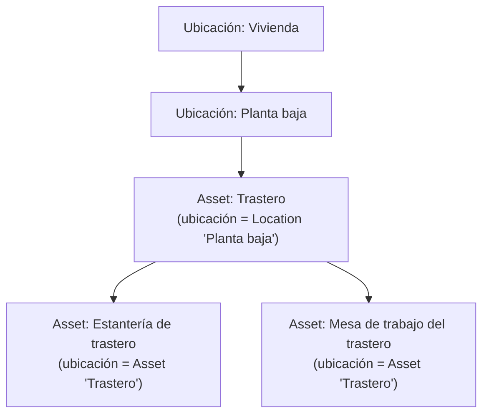
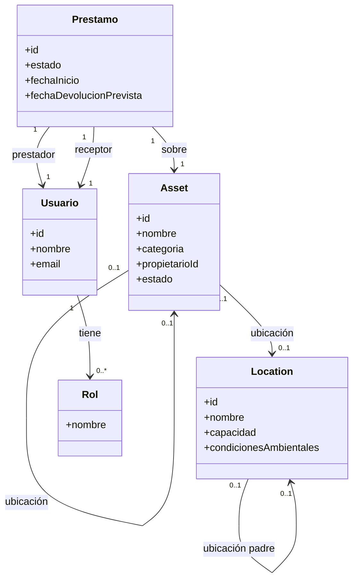
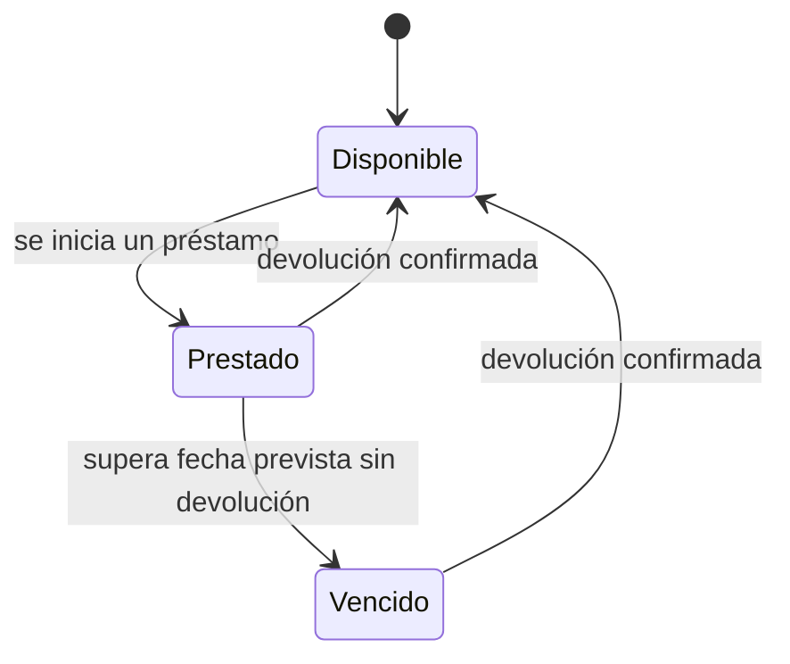
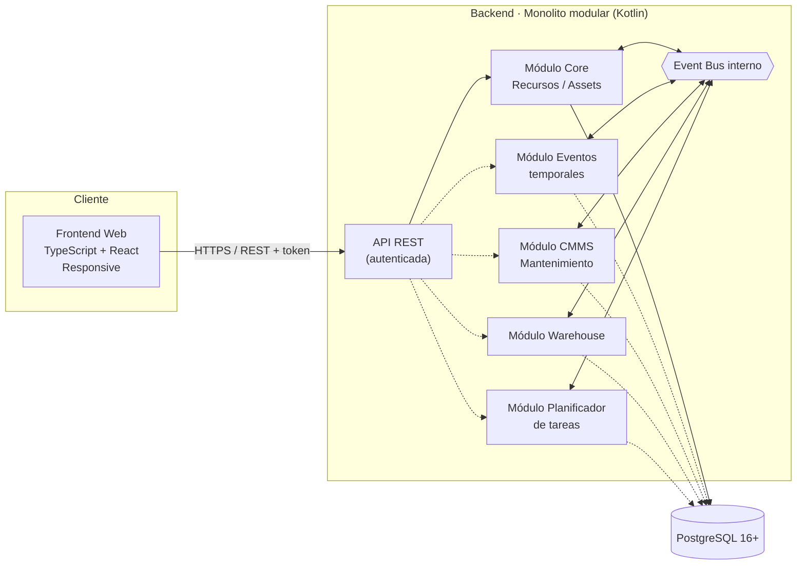
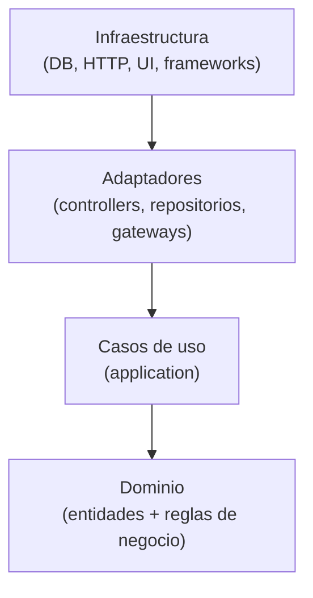
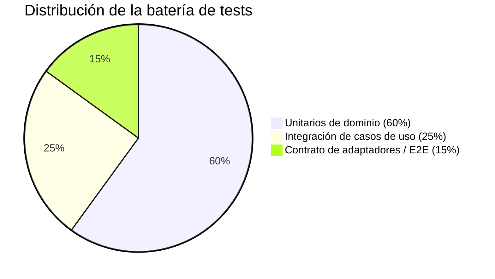

# DRP · Domestic Resource Planning

> **Estado del documento:** vivo — se actualiza a medida que el proyecto avanza.
> **Última actualización:** 2026-08-06
> **Fase actual:** Fase 0 — Definición detallada del core mínimo: modelo de dominio, event bus y API REST (pre-desarrollo)

---

## 1. Resumen ejecutivo

**DRP (Domestic Resource Planning)** es una solución para la gestión de recursos y assets en el entorno doméstico. Traslada al hogar el enfoque modular que ya ha demostrado su valor en los ERP empresariales: un **core mínimo** que resuelve lo esencial (dar de alta, ubicar y clasificar los recursos del hogar) sobre el que se pueden ir **activando módulos** a medida que aparece la necesidad (mantenimiento, inventario, planificación, eventos puntuales...).

El proyecto se construye como dos componentes claramente diferenciados —**backend** y **frontend web responsive**— que se comunican mediante una **API REST autenticada**.

---

## 2. Objetivo del proyecto

**Problema:** la información sobre los recursos de un hogar (electrodomésticos, vehículos, mobiliario, herramientas, garantías, revisiones...) suele estar dispersa entre hojas de cálculo, carpetas de papeles, recordatorios sueltos del móvil y la memoria de quien gestiona la casa. No existe un punto único de verdad, y mucho menos algo que crezca con las necesidades de cada hogar.

**Visión:** aplicar al hogar la disciplina de gestión que aporta un ERP a una empresa: un sistema central de recursos, extensible por módulos, sin obligar a implementar de golpe funcionalidades que un hogar concreto no necesita.

> **Ejemplo ilustrativo:** una familia con caldera, dos coches, electrodomésticos y un garaje lleno de herramientas.
> - **Sin DRP:** la fecha de la ITV está en el calendario del móvil, el manual de la caldera en un cajón, el inventario del garaje "en la cabeza", y las tareas de mantenimiento se recuerdan (o no) por costumbre.
> - **Con DRP:** todos los assets están dados de alta en el core con su documentación asociada. Si más adelante el hogar activa el módulo de **mantenimiento (CMMS)**, el sistema puede generar automáticamente los planes de revisión sin tener que rehacer nada de lo ya cargado.

---

## 3. Analogía ERP → DRP

| Concepto en un ERP empresarial | Equivalente en DRP (hogar) |
|---|---|
| Activos productivos (maquinaria, líneas) | Electrodomésticos, vehículos, mobiliario, herramientas |
| Mantenimiento preventivo/correctivo (CMMS) | Revisión de caldera, ITV, cambio de filtros, garantías |
| Gestión de almacén / inventario | Despensa, garaje, trastero, botiquín |
| Planificación de producción / tareas | Tareas domésticas, turnos, rutinas familiares |
| Gestión de proyectos / eventos puntuales | Mudanzas, reformas, celebraciones, viajes |

---

## 4. Alcance funcional

### 4.1 Core mínimo (obligatorio)

- **Gestión de recursos/assets:** alta, baja, modificación, categorización, ubicación (jerárquica), propietario/responsable y documentación asociada (facturas, garantías, manuales).
- **Gestión de ubicaciones:** estructura jerárquica de espacios físicos con características mínimas de almacenaje.
- **Gestión de usuarios del hogar:** autenticación y roles, incluyendo roles de acceso acotado para préstamos entre personas.
- **Event bus interno:** canal de comunicación entre módulos, para que el core no dependa de que un módulo esté activo o no.
- **API REST autenticada:** único canal de comunicación entre backend y frontend.

> Las subsecciones 4.1.1 a 4.1.7 recogen la primera pasada de profundización sobre el core mínimo.

#### 4.1.1 Recursos y assets

Un **asset** puede definirse de forma jerárquica como un conjunto de otros assets (composición). Por ejemplo, el asset **"Trastero"** puede estar compuesto por los assets **"Estantería de trastero"** y **"Mesa de trabajo del trastero"**.

Esta jerarquía se construye a través del campo **ubicación** de cada asset, que es polimórfico: un asset puede tener como ubicación **otro asset** (por ejemplo, la mesa de trabajo "está en" el asset Trastero) **o bien** una **ubicación** propiamente dicha (ver 4.1.2). Un asset puede no tener ubicación asignada todavía (por ejemplo, recién dado de alta y pendiente de clasificar).



**Atributos mínimos de un Asset:**
- Identificador, nombre, categoría
- Propietario/responsable (referencia a un usuario del hogar)
- Ubicación (referencia a otro Asset **o** a una Location — nunca ambas a la vez)
- Estado (p. ej. `DISPONIBLE`, `PRESTADO`, `BAJA`)
- Documentación asociada (facturas, garantías, manuales)

**Reglas mínimas de negocio:**
- Un asset no puede ser su propio ancestro en la jerarquía de composición (evita ciclos).
- Un asset no puede tener como ubicación simultáneamente otro asset y una Location: es una u otra.
- Un asset no puede eliminarse si tiene assets hijos o un préstamo activo, sin resolver antes esa dependencia.

#### 4.1.2 Ubicaciones

Una **ubicación (Location)** representa un espacio físico de almacenaje y, al igual que los assets, admite jerarquía (p. ej. Vivienda → Planta baja → Garaje → Estantería 2). A diferencia del asset, una ubicación no es un recurso del hogar en sí misma, sino el contenedor físico donde se guardan los recursos.

**Atributos mínimos de una Location:**
- Identificador, nombre
- Ubicación padre (opcional, para la jerarquía)
- Capacidad (p. ej. volumen, peso máximo o nº de unidades — a definir por tipo de ubicación)
- Condiciones ambientales de almacenaje (p. ej. rango de temperatura, rango de humedad, exposición a la luz) — todas opcionales, solo se informan si son relevantes para esa ubicación
- Notas/observaciones libres

**Reglas mínimas de negocio:**
- Una ubicación no puede ser su propia ancestra (evita ciclos).
- Si se informa una capacidad, el sistema debería poder advertir (no necesariamente bloquear, a definir) cuando se supera al asignar assets a esa ubicación.

#### 4.1.3 Modelo de dominio del core (vista conjunta)



#### 4.1.4 Usuarios y roles

Se contemplan cuatro roles, agrupados en dos tipos según su alcance:

| Rol | Tipo | Alcance | Permisos típicos |
|---|---|---|---|
| Administrador del hogar | Estructural | Todo el hogar | CRUD completo de assets, ubicaciones y usuarios; gestión de roles; activar/desactivar módulos |
| Miembro del hogar | Estructural | Todo el hogar | CRUD de assets y ubicaciones; iniciar y gestionar préstamos; sin gestión de usuarios ni módulos |
| Prestador | Contextual (ligado a un préstamo) | Un préstamo concreto | Consultar el estado del préstamo; confirmar la entrega del asset |
| Receptor del préstamo | Contextual (ligado a un préstamo) | Un préstamo concreto | Consultar el estado y la fecha prevista de devolución; confirmar la devolución |

Los roles **estructurales** (administrador/miembro) pertenecen a usuarios del hogar con cuenta completa. Los roles **contextuales** (prestador/receptor) pueden recaer tanto en miembros del hogar como en personas externas (p. ej. un vecino al que se le presta un taladro); el acceso acotado por token (ver 5.4.1) se aplica únicamente cuando la persona no tiene una cuenta completa en el sistema.

#### 4.1.5 Préstamos (concepto mínimo en el core)

Los roles de prestador y receptor no tienen sentido sin un concepto que los sustente, así que el core incorpora una versión **mínima** de gestión de préstamos: qué asset se presta, quién lo presta, quién lo recibe y en qué estado está.



**Atributos mínimos de un Préstamo:**
- Identificador, asset prestado
- Prestador y receptor (usuarios del hogar o personas externas)
- Fecha de inicio, fecha prevista de devolución (opcional), fecha real de devolución
- Estado (`ACTIVO`, `DEVUELTO`, `VENCIDO`)

**Regla mínima de negocio:** un asset no puede tener más de un préstamo en estado `ACTIVO` simultáneamente.

> **Nota de alcance:** esta es una versión mínima, suficiente para que los roles de prestador/receptor tengan algo que consultar. Si en el futuro el negocio de préstamos crece (recordatorios automáticos, penalizaciones, valoraciones, historial extenso), es candidato a extraerse como módulo propio, reutilizando el mismo mecanismo de event bus para no romper el core.

#### 4.1.6 Event bus y API REST

El event bus interno y la API REST autenticada se detallan en profundidad en las secciones 5.2 y 5.4 de este documento, para mantener toda la definición de arquitectura agrupada en la sección 5.

#### 4.1.7 Decisiones de diseño validadas

Las siguientes decisiones, inicialmente abiertas, han quedado validadas:

- **Roles Prestador/Receptor:** pueden ser tanto miembros del hogar como personas externas. El acceso acotado por token (ver 5.4.1) se aplica únicamente cuando la persona no tiene cuenta completa en el sistema.
- **Alcance de la gestión de préstamos:** se mantiene mínima dentro del core (ver 4.1.5) mientras no gane funcionalidad adicional; si en el futuro crece (recordatorios automáticos, penalizaciones, valoraciones, historial extenso), se extraerá como módulo propio.
- **Composición y ubicación física:** quedan unificadas en un único campo `ubicación` por asset (ver 4.1.1); no se distingue, por ahora, entre "de qué está compuesto" un asset y "dónde está físicamente".

> Si en el futuro surgen nuevas decisiones de diseño pendientes de validar, se recomienda añadirlas aquí siguiendo el mismo formato (pregunta + decisión + referencia a la sección afectada) hasta que se resuelvan.

### 4.2 Módulos futuros (activables progresivamente)

| Módulo | Descripción | Estado | Prioridad |
|---|---|---|---|
| Gestión de eventos temporales | Mudanzas, reformas, viajes, celebraciones: proyectos con inicio/fin y recursos asociados | Por diseñar | Baja |
| CMMS doméstico | Mantenimiento preventivo/correctivo de assets (planes, avisos, histórico) | Por diseñar | Alta |
| Warehouse | Inventario doméstico (despensa, garaje, trastero) con stock y consumo | Por diseñar | Alta |
| Planificador de tareas | Rutinas, turnos entre miembros del hogar, recordatorios | Por diseñar | Media |
| Gestión avanzada de préstamos | Recordatorios, penalizaciones, valoraciones e histórico extenso (el core ya cubre lo mínimo, ver 4.1.5) | Por diseñar | Baja |
| *(otros a definir)* | Candidatos futuros: gastos/presupuesto, seguros y garantías, energía | Backlog abierto | — |

> Esta tabla es el punto principal a mantener actualizado: a medida que un módulo pase de "por diseñar" a "en desarrollo" o "en producción", se debe reflejar aquí.

---

## 5. Arquitectura

### 5.1 Visión de componentes



*Las líneas discontinuas representan módulos opcionales: pueden no estar activos sin que el core deje de funcionar.*

### 5.2 Event bus interno

Así es como el core se mantiene independiente de los módulos, y cómo un módulo activo puede "engancharse" a algo que pasa en el core sin que este lo sepa:


Si el módulo CMMS no está activo, el evento `AssetCreated` simplemente no tiene ningún suscriptor: el core no necesita saber que el CMMS existe.

#### 5.2.1 Contrato de evento

Todo evento publicado por el core sigue una misma forma mínima:

```
DomainEvent
├─ eventId        UUID      identificador único del evento
├─ type           String    p.ej. "AssetCreated", "AssetMoved", "LoanStarted"
├─ occurredAt     Instant   marca temporal de cuándo ocurrió
├─ aggregateId    String    id del recurso afectado (p.ej. assetId)
├─ version        Int       versión del esquema del evento, para evolución futura
└─ payload        JSON      datos específicos de ese tipo de evento
```

#### 5.2.2 Mecanismo interno

```kotlin
interface EventBus {
    fun publish(event: DomainEvent)
    fun <T : DomainEvent> subscribe(eventType: KClass<T>, handler: (T) -> Unit)
}
```

- Al ser un monolito modular (no microservicios), el bus se implementa **in-process** (pub/sub en memoria).
- Entrega **at-least-once**: los handlers de los módulos deben ser idempotentes.
- Un fallo en el handler de un módulo **no debe** afectar a la transacción del core: el core persiste y responde con independencia de si los módulos consumidores fallan.
- Candidato de evolución: patrón **Transactional Outbox** (persistir el evento en la misma transacción que el cambio de estado) para no perder eventos si el proceso cae antes de notificarlos.

#### 5.2.3 Catálogo inicial de eventos del core

| Evento | Se publica cuando… | Ejemplo de consumidor futuro |
|---|---|---|
| `AssetCreated` | Se da de alta un asset | CMMS genera un plan de mantenimiento por defecto |
| `AssetMoved` | Cambia la ubicación de un asset | Warehouse actualiza el stock por ubicación |
| `AssetHierarchyChanged` | Cambia el asset padre/composición de un asset | Módulos que dependan de la estructura del hogar |
| `AssetDeactivated` | Se da de baja un asset | CMMS cancela los planes de mantenimiento asociados |
| `LocationCreated` | Se crea una ubicación | Warehouse la usa como posible punto de stock |
| `LoanStarted` | Se inicia un préstamo | Planificador de tareas crea un recordatorio de devolución |
| `LoanReturned` | Se confirma la devolución de un préstamo | Cierre de recordatorios asociados |

### 5.3 Clean Architecture (aplicable a BE y FE)

Ambos componentes siguen la regla de dependencia de Clean Architecture: las capas externas dependen de las internas, nunca al revés.



> **Ejemplo BE:** la entidad `Asset` y sus reglas (p. ej. "un asset no puede existir sin propietario") viven en el dominio, sin conocer PostgreSQL. El caso de uso `CrearAsset` orquesta esa regla. El adaptador `AssetPostgresRepository` implementa cómo se persiste, y es lo único que "sabe" que existe PostgreSQL.
>
> **Ejemplo FE:** un componente de React no debería contener lógica de negocio; consume un caso de uso/hook que a su vez habla con un adaptador HTTP hacia la API REST.

### 5.4 Comunicación frontend–backend

- API REST autenticada (token), respuestas en JSON.

#### 5.4.1 Autenticación

- **Usuarios del hogar** (administrador/miembro): JWT (bearer token), con claims mínimos `userId`, `householdId` y `roles[]`.
- **Usuarios externos de un préstamo** (prestador/receptor sin cuenta completa): token acotado de vida corta, vinculado a un `prestamoId` concreto (p. ej. enviado por email o SMS como enlace), sin necesidad de crear una cuenta. Su alcance se limita a la lectura del estado de ese préstamo y a confirmar la devolución.

#### 5.4.2 Recursos principales (ilustrativo, sujeto a definición detallada de contratos)

**Assets**
- `GET /api/v1/assets` — listar (filtros: `locationId`, `parentAssetId`, `ownerId`, `estado`)
- `POST /api/v1/assets` — dar de alta
- `GET /api/v1/assets/{id}` — detalle
- `PATCH /api/v1/assets/{id}` — modificar (incluye cambiar ubicación o asset padre)
- `GET /api/v1/assets/{id}/children` — hijos directos en la jerarquía de composición

**Locations**
- `GET /api/v1/locations` — listar
- `POST /api/v1/locations` — crear
- `GET /api/v1/locations/{id}/children` — hijos directos en la jerarquía

**Usuarios**
- `GET /api/v1/users` — listar miembros del hogar
- `POST /api/v1/users` — dar de alta un miembro (solo administrador)
- `PATCH /api/v1/users/{id}/roles` — modificar roles

**Préstamos**
- `POST /api/v1/loans` — iniciar un préstamo
- `GET /api/v1/loans/{id}` — consultar estado (accesible por el hogar y por el prestador/receptor asociado con su token acotado)
- `POST /api/v1/loans/{id}/return` — confirmar devolución

### 5.5 Frontend responsive

- Objetivo de rango de dispositivos: desde un **iPhone X (375px)** o equivalente en adelante, hasta **pantallas ultrawide** (2560px–3440px+).
- Enfoque **mobile-first**, con un sistema de diseño y breakpoints a definir en el detalle de la capa de UI.

---

## 6. Stack tecnológico

| Componente | Tecnología | Notas |
|---|---|---|
| Backend | Kotlin | Monolito modular |
| Persistencia | PostgreSQL 16+ | |
| Comunicación interna BE | Event bus (in-process) | Contrato definido (ver 5.2); librería concreta por definir; candidato a evolucionar con patrón Outbox |
| Comunicación FE ↔ BE | API REST autenticada | JWT para usuarios del hogar; tokens acotados de vida corta para usuarios externos de préstamo (ver 5.4.1) |
| Frontend | TypeScript | |
| Librería de UI sugerida | React | |
| Testing | Por definir (candidatos: Kotest/JUnit5 en BE, Vitest/Jest + Testing Library en FE) | A confirmar |

---

## 7. Estrategia de testing

La misma distribución de esfuerzo aplica a **backend y frontend**, alineada con las capas de Clean Architecture:



| Nivel | Qué cubre | Ejemplo |
|---|---|---|
| **Unitarios de dominio (60%)** | Entidades y reglas de negocio puras, sin dependencias externas | Verificar que `Asset` no se puede crear sin `ownerId` |
| **Integración de casos de uso (25%)** | Orquestación de un caso de uso completo, con dependencias reales o en memoria | Ejecutar `CrearAsset` y comprobar que persiste y que se publica el evento `AssetCreated` |
| **Contrato de adaptadores / E2E (15%)** | El adaptador cumple el contrato esperado por el mundo exterior | Test HTTP: `POST /api/v1/assets` responde `201` con el esquema JSON esperado |

**Ejemplos adicionales derivados de esta iteración del core:**
- *Unitario de dominio:* un `Asset` no puede definirse como su propio ancestro en la jerarquía de composición (evita ciclos).
- *Integración de caso de uso:* ejecutar `IniciarPrestamo` sobre un asset que ya tiene un préstamo en estado `ACTIVO` debe fallar.
- *Contrato de adaptador / E2E:* `GET /api/v1/loans/{id}` con el token acotado de un receptor externo solo debe exponer los campos permitidos para ese rol.

---

## 8. Roadmap y estado actual

| Fase | Contenido | Estado |
|---|---|---|
| **Fase 0 — Definición** | Arquitectura, stack, alcance del core, estrategia de testing | 🟡 En curso |
| **Fase 1 — Core MVP** | Gestión de recursos/assets, autenticación, API REST, event bus, FE responsive básico | ⚪ Pendiente |
| **Fase 2 — Primer módulo funcional** | Candidato a definir (CMMS o Warehouse) | ⚪ Pendiente |
| **Fase 3 — Módulos adicionales** | Según backlog de la sección 4.2 | ⚪ Pendiente |

### 8.1 Detalle de la Fase 0 (definición)

- [x] Arquitectura general y stack tecnológico
- [x] Alcance y prioridad de módulos futuros
- [x] Modelo de recursos/assets (jerarquía y ubicación polimórfica)
- [x] Modelo de ubicaciones (jerarquía y características de almacenaje)
- [x] Roles de usuario, incluyendo roles acotados para préstamos
- [x] Contrato y catálogo inicial del event bus
- [x] Recursos y esquema de autenticación de la API REST (nivel ilustrativo)
- [ ] Modelo de datos definitivo (tablas, tipos, constraints) y diagrama ER completo
- [ ] Casos de uso detallados del core (comandos y queries)
- [ ] Esquema de autenticación definitivo y gestión de tokens externos
- [ ] Contratos JSON definitivos de la API (request/response schemas)
- [x] Resolución de las decisiones de diseño abiertas (ver 4.1.7)

---

## 9. Documentación

La documentación detallada se organiza por ámbito en [`docs/`](docs/README.md):

- [`docs/common/`](docs/common/README.md) para producto, arquitectura transversal,
  contratos, estándares y skills compartidas.
- [`docs/backend/`](docs/backend/README.md) para el monolito modular, sus módulos,
  API, datos, seguridad, calidad y operación.
- [`docs/frontend/`](docs/frontend/README.md) para arquitectura web, diseño de
  producto, look and feel, design system, accesibilidad y calidad.

---


## 10. Historial de cambios de este documento

| Fecha | Cambio |
|---|---|
| 2026-08-05 | Creación inicial: objetivo, analogía ERP→DRP, alcance core/módulos, arquitectura, stack y estrategia de testing |
| 2026-08-06 | Profundización del core mínimo: jerarquía de assets/ubicaciones con ubicación polimórfica, características de almacenaje, roles de usuario (incl. préstamos), contrato y catálogo inicial del event bus, y ampliación de la definición de la API REST |
| 2026-08-06 | Validación de las decisiones de diseño abiertas (4.1.7): roles prestador/receptor abiertos a miembros del hogar o a externos, alcance mínimo de la gestión de préstamos en el core, y unificación del campo ubicación |

---

## 11. Cómo mantener este documento vivo

Al avanzar el proyecto, actualizar principalmente:

- **Sección 4.1.7** — añadir aquí nuevas decisiones de diseño pendientes cuando surjan, y trasladarlas a la lista de validadas en cuanto se resuelvan (dejando también constancia en el historial de cambios, sección 9).
- **Sección 4.2** — mover módulos de "por diseñar" a "en desarrollo"/"en producción" según corresponda.
- **Sección 8** — marcar fases y sub-tareas como en curso/completadas, y añadir nuevas fases si el roadmap se ajusta.
- **Sección 9** — añadir una línea por cada actualización relevante del documento (fecha + resumen del cambio).
- **Diagramas de la sección 5** — mantenerlos alineados con decisiones reales de arquitectura una vez se empiece a implementar.