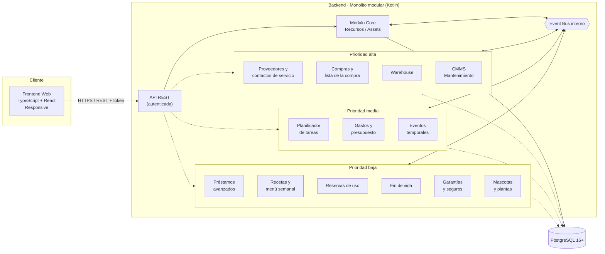
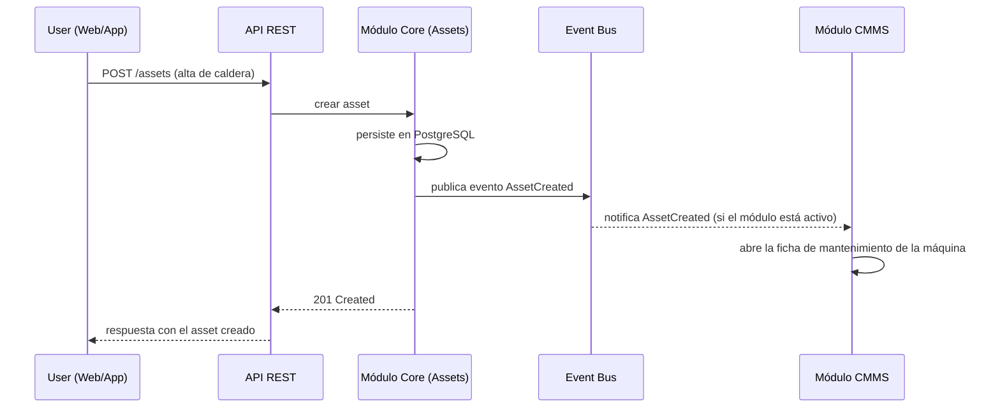
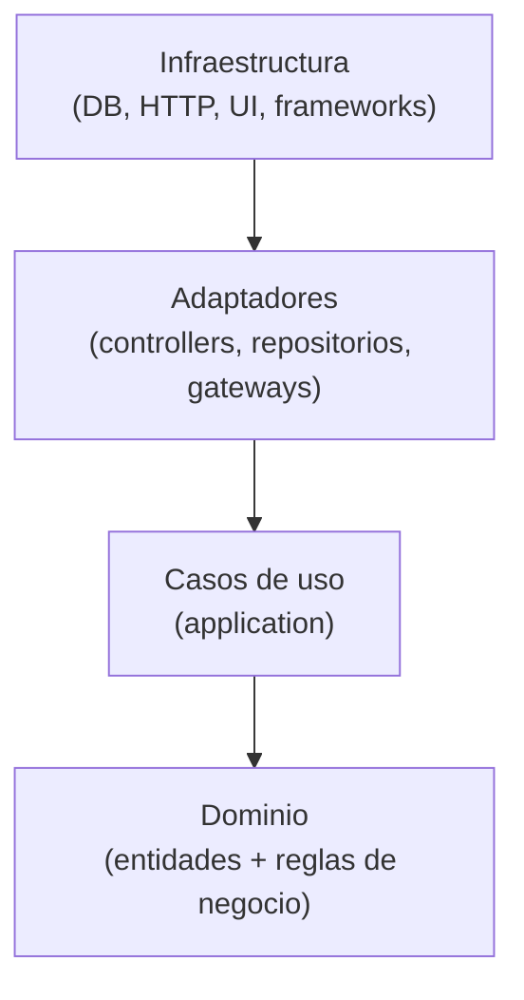
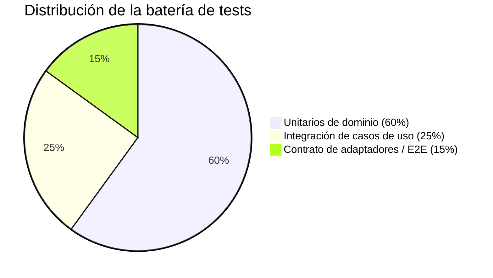

# DRP · Domestic Resource Planning

> **Estado del documento:** vivo — se actualiza a medida que el proyecto avanza.
> **Última actualización:** 2026-08-20
> **Fase actual:** **Fase 1 (Core MVP) y Fase 2 (Módulos activables) completadas**, el 2026-08-17 y el 2026-08-19. Cómo se hizo cada una, hito a hito, en [`roadmap.md`](docs/common/product/roadmap.md) y [`phase-2-roadmap.md`](docs/common/product/phase-2-roadmap.md). Lo entregado: **el core completo** —54 operaciones— más **el mecanismo de activación por hogar**, **la plataforma que programa las comprobaciones periódicas y entrega los avisos** y **los cuatro módulos de prioridad alta** de la sección 4.2: Proveedores, Warehouse, Compras y Mantenimiento. El contrato queda en **98 operaciones**, el modelo en **28 tablas** con Row-Level Security y la batería en **siete recorridos verticales** sobre un navegador de verdad. **En curso está el [cierre de huecos](docs/common/product/open-gaps-roadmap.md)** —seis hitos sobre los cuatro que las dos fases dejaron abiertos a propósito: la baja de un hogar, la conversión de HEIC, el Transactional Outbox y los cuatro atributos propuestos—, **planificado el 2026-08-19** y con su **Hito 0 cerrado el 2026-08-20**: un hogar que pide marcharse desaparece entero a los treinta días —sus filas, las de los cuatro módulos y sus ficheros en disco— y una persona puede cerrar su cuenta y llevarse su avatar. El contrato pasa a **102 operaciones**. No es una fase, y su documento dice por qué. Después va la **Fase 3** —los nueve módulos restantes de 4.2—, que **todavía no está planificada**: convertir una fase en un plan es su propia sesión de trabajo, como lo fue para la 2

---

## 1. Resumen ejecutivo

**DRP (Domestic Resource Planning)** es una solución para la gestión de recursos y assets en el entorno doméstico. Traslada al hogar el enfoque modular que ya ha demostrado su valor en los ERP empresariales: un **core mínimo** que resuelve lo esencial (dar de alta, ubicar y clasificar los recursos del hogar) sobre el que se pueden ir **activando módulos** a medida que aparece la necesidad (mantenimiento, inventario, planificación, eventos puntuales...).

El proyecto se construye como dos componentes claramente diferenciados —**backend** y **frontend web responsive**— que se comunican mediante una **API REST autenticada**.

---

## 2. Objetivo del proyecto

**Problema:** la información sobre los recursos de un hogar (electrodomésticos, vehículos, mobiliario, herramientas, garantías, revisiones...) suele estar dispersa entre hojas de cálculo, carpetas de papeles, recordatorios sueltos del móvil y la memoria de quien gestiona la casa. No existe un punto único de verdad, y mucho menos algo que crezca con las necesidades de cada hogar.

**Visión:** aplicar al hogar la disciplina de gestión que aporta un ERP a una empresa: un sistema central de recursos, extensible por módulos, sin obligar a implementar de golpe funcionalidades que un hogar concreto no necesita.

> **Ejemplo ilustrativo:** una familia con caldera, dos coches, electrodomésticos y un garaje lleno de herramientas.
> - **Sin DRP:** la fecha de la ITV está en el calendario del móvil, el manual de la caldera en un cajón, el inventario del garaje "en la cabeza", y las tareas de mantenimiento se recuerdan (o no) por costumbre.
> - **Con DRP:** todos los assets están dados de alta en el core con su documentación asociada. Si más adelante el hogar activa el módulo de **mantenimiento (CMMS)**, el sistema puede generar automáticamente los planes de revisión sin tener que rehacer nada de lo ya cargado.

---

## 3. Analogía ERP → DRP

| Concepto en un ERP empresarial | Equivalente en DRP (hogar) |
|---|---|
| Activos productivos (maquinaria, líneas) | Electrodomésticos, vehículos, mobiliario, herramientas |
| Mantenimiento preventivo/correctivo (CMMS) | Revisión de caldera, ITV, cambio de filtros, garantías |
| Gestión de almacén / inventario | Despensa, garaje, trastero, botiquín |
| Compras y aprovisionamiento | Lista de la compra, reposición de lo que se agota |
| Maestro de proveedores | Fontanero, servicio técnico de la caldera, taller |
| Planificación de producción / tareas | Tareas domésticas, turnos, rutinas familiares, menú semanal |
| Gestión de proyectos / eventos puntuales | Mudanzas, reformas, celebraciones, viajes |

---

## 4. Alcance funcional

### 4.1 Core mínimo (obligatorio)

- **Gestión del hogar:** unidad de aislamiento multi-tenant — varios hogares comparten la misma base de datos; agrupa a los usuarios, assets, ubicaciones y préstamos de una misma vivienda (ver el modelo de datos en 5.6).
- **Gestión de recursos/assets:** alta, baja, modificación, categorización, ubicación (jerárquica), propietario/responsable y documentación asociada. Cubre **todo el material del hogar**, no solo los bienes económicamente relevantes: desde una caldera hasta un paquete de harina (ver 4.1.1).
- **Gestión de ubicaciones:** estructura jerárquica de espacios físicos con características mínimas de almacenaje.
- **Gestión de usuarios del hogar:** autenticación y roles, incluyendo roles de acceso acotado para préstamos entre personas.
- **Event bus interno:** canal de comunicación entre módulos, para que el core no dependa de que un módulo esté activo o no.
- **API REST autenticada:** único canal de comunicación entre backend y frontend.

> Las subsecciones 4.1.1 a 4.1.7 recogen la primera pasada de profundización sobre el core mínimo.

#### 4.1.1 Recursos y assets

**Un asset es todo material del hogar**, no solo lo económicamente relevante, y se divide en dos naturalezas que se comportan distinto:

- **`DURABLE`** — identidad propia, una fila por unidad física. Es el único que puede actuar como ubicación de otros assets y el único que puede prestarse.
- **`CONSUMABLE`** — se agota y se repone. Una fila por **existencia**: un artículo en una ubicación, con `quantity`. Ceder un consumible es un ajuste de cantidad, no un préstamo.

El `type` es inmutable tras el alta, y el core mantiene solo un contador: el seguimiento de existencias —consumos, mínimos, caducidad, lotes— es del módulo Warehouse.

**Definición y existencia van separadas.** La ficha de qué es algo vive en un `Article`, que **no es un asset**: no ocupa sitio, no tiene cantidad y no se presta. Es obligatorio en un `CONSUMABLE` y opcional en un `DURABLE`, donde deja compartir modelo y documentación entre unidades idénticas. Alrededor giran `Category` —catálogo por hogar, no texto libre—, `Document` y `StoredFile`.

> **Definición completa** —atributos, las veintitrés reglas de negocio, la jerarquía de composición y la autoría de los cambios— en [`docs/common/product/core-model.md`](docs/common/product/core-model.md).

#### 4.1.2 Ubicaciones

Un espacio físico jerárquico (`HOUSE`, `FLOOR`, `ROOM`, `FURNITURE`, `SHELF`, `OTHER`) con capacidad y condiciones ambientales opcionales. Varias viviendas de un mismo hogar son `Location` raíz de tipo `HOUSE`, no una entidad propia. La ubicación de un asset es polimórfica: apunta a otra `Location` **o** a un asset `DURABLE`, nunca a las dos.

> **Definición completa** en [`docs/common/product/core-model.md`](docs/common/product/core-model.md#412-ubicaciones).

#### 4.1.3 Modelo de dominio del core (vista conjunta)

> El diagrama de entidades y sus relaciones, en [`docs/common/product/core-model.md`](docs/common/product/core-model.md#413-modelo-de-dominio-del-core-vista-conjunta).

#### 4.1.4 Usuarios y roles

**Persona y papel están separados.** `Identity` son las credenciales, únicas en la instalación; `HouseholdMember` es el rol dentro de un hogar (`HOUSEHOLD_ADMIN` o `HOUSEHOLD_MEMBER`). Todo lo que el dominio llama «usuario» —propietario de un asset, prestador, receptor, `createdBy`— apunta a la **pertenencia**; los refresh tokens, a la identidad. En el MVP una identidad tiene como mucho una pertenencia activa.

El alta es **autoservicio abierto** con verificación de correo obligatoria, y sumar a alguien a un hogar existente es siempre **por invitación**.

> **Definición completa** —enrolamiento, invitaciones, bajas, política de contraseñas, `Argon2id` y las caducidades de los siete tipos de token— en [`docs/common/product/users-and-access.md`](docs/common/product/users-and-access.md).

#### 4.1.5 Préstamos (concepto mínimo en el core)

Solo se presta un `DURABLE`, y solo si no tiene ya un préstamo abierto —`OVERDUE` sigue ocupando el asset, porque vencer no es devolver—. Prestador y receptor pueden ser miembros del hogar o personas externas, que entran con un token acotado. El vencimiento lo marca un proceso diario, no una lectura.

> **Definición completa** en [`docs/common/product/loans.md`](docs/common/product/loans.md).

#### 4.1.6 Event bus y API REST

El event bus interno y la API REST autenticada se detallan en profundidad en las secciones 5.2 y 5.4 de este documento, para mantener toda la definición de arquitectura agrupada en la sección 5.

#### 4.1.7 Decisiones de diseño validadas

El **registro vivo de decisiones** del core: treinta y tres validadas, cada una con su alternativa descartada y el motivo, más las que siguen abiertas a propósito. La de **peso y volumen de un asset** se resolvió en el Hito 3 de la Fase 2, y su respuesta fue que la pregunta era del core y no del módulo al que estaba asignada. De las tres que quedaban abiertas, **la baja de un hogar está hecha desde el 2026-08-20** —con ella el cierre de cuenta y el borrado del avatar, en la [ADR-012](docs/common/architecture/decisions/ADR-012-data-erasure-household-closure-and-account-closure.md)—, los **cuatro atributos propuestos** tienen plan en el [cierre de huecos](docs/common/product/open-gaps-roadmap.md) (ver 8.4), y **el análisis antivirus sigue fuera**, con el mismo motivo de siempre: es la defensa que toca añadir el día que un fichero pueda salir del hogar que lo subió.

> **Registro completo** en [`docs/common/product/decisions.md`](docs/common/product/decisions.md). Las decisiones nuevas se anotan **allí**, con el formato pregunta + decisión + referencia a la sección afectada, y dejan constancia en el historial de la sección 10 de este documento.

### 4.2 Módulos futuros (activables progresivamente)

| Módulo | Descripción | Estado | Prioridad |
|---|---|---|---|
| Proveedores y contactos de servicio | Fontanero, servicio técnico de la caldera, taller: quién arregla, quién cobra y quién responde de una garantía. Es dato maestro compartido — sin módulo propio lo duplicarían CMMS, gastos y garantías | **En desarrollo** | Alta |
| Compras y lista de la compra | Qué falta, qué hay que reponer y qué está pedido. Cierra el ciclo que abre Warehouse al detectar la falta y termina en gastos al pagarla. **Warehouse detecta la falta y Compras decide qué se compra y cuándo**; recibir una compra acaba en una entrada de consumible del core | **En desarrollo** | Alta |
| Warehouse | Inventario doméstico (despensa, garaje, trastero) con stock y consumo: movimientos de existencias, mínimos, caducidad y lotes. El core mantiene **un contador** y este módulo no lleva ninguno — lee el del core. Resolvió la pregunta heredada sobre peso y volumen de un asset, que resultó ser del core (ver 4.1.7) | **En desarrollo** | Alta |
| Mantenimiento (CMMS) | Mantenimiento preventivo/correctivo de assets: planes recurrentes sobre un `DURABLE`, intervenciones e histórico, con su aviso de revisión. **De CMMS es el cuándo y del planificador de tareas el quién lo hace** — un plan es una regla sobre una máquina, no un encargo con responsable y día | **En desarrollo** | Alta |
| Planificador de tareas | Rutinas, turnos entre miembros del hogar, recordatorios | Por diseñar | Media |
| Gastos y presupuesto | Lo que cuesta lo que entra en el hogar, y el presupuesto por periodo. El core guarda de dónde viene un asset, nunca cuánto valió (ver 4.1.1) | Por diseñar | Media |
| Eventos temporales | Mudanzas, reformas, viajes, celebraciones: proyectos con inicio/fin y recursos asociados | Por diseñar | Media |
| Gestión avanzada de préstamos | Recordatorios, penalizaciones, valoraciones e histórico extenso (el core ya cubre lo mínimo, ver 4.1.5) | Por diseñar | Baja |
| Recetas y menú semanal | Una receta es una lista de materiales y cocinar consume existencias: es la planificación de producción del hogar, y el consumidor natural de Warehouse | Por diseñar | Baja |
| Reservas de uso | Reservar un `DURABLE` para una ventana de tiempo: el coche el sábado, la habitación de invitados. No es un préstamo — no sale de casa y tiene fecha firme | Por diseñar | Baja |
| Fin de vida | Qué fue del asset cuando causa baja: venta, donación o retirada. El core publica `AssetDeactivated`, pero no guarda el destino | Por diseñar | Baja |
| Garantías y seguros | Cobertura y vencimiento de un `DURABLE`, apoyados en su fecha de adquisición y en la documentación que el core ya guarda | Por diseñar | Baja |
| Mascotas y plantas | Cuidados recurrentes de los seres vivos de la casa: vacunas, veterinario, desparasitación, riego, poda. **No son assets** — el core define un asset como todo el material del hogar, y un ser vivo no es material, así que el módulo trae su propia entidad en lugar de forzarla en el core. Tampoco es CMMS ni planificador de tareas, aunque comparta con ambos la forma del aviso recurrente: lo que se cuida aquí no está dado de alta en el core | Por diseñar | Baja |

> Esta tabla es el punto principal a mantener actualizado: a medida que un módulo pase de "por diseñar" a "en desarrollo" o "en producción", se debe reflejar aquí. Un candidato nuevo entra como fila propia, no como cajón de sastre: la lista no está cerrada, pero no se guardan ideas sin estado.
>
> **Los cuatro de prioridad alta fueron el alcance de la Fase 2**, cerrada el 2026-08-19 en [`docs/common/product/phase-2-roadmap.md`](docs/common/product/phase-2-roadmap.md): están construidos enteros —dominio, migraciones con RLS, contrato, siembra, avisos y pantallas— sobre el mecanismo de activación por hogar y la plataforma de avisos.
>
> **Y los cuatro se quedan en «En desarrollo» al cerrar la fase, que pide una explicación.** «En producción» significa algo distinto de «el código está entero», y lo que le falta al producto para decirlo no es código: **no hay ningún despliegue**. El VPS está elegido con [consumo medido](docs/backend/operations/capacity-measurements.md) y nada más — no hay servidor contratado, ni un hogar real dentro, ni nadie usando esto para saber dónde está el taladro. Mover los cuatro a «En producción» sería decir de ellos algo que no se puede decir **de ninguna parte del producto**, empezando por el core.
>
> Que la distinción no es formalismo se vio en este mismo cierre: dos de las decisiones que los módulos habían dejado abiertas —si la categoría de servicio pasa a catálogo por hogar, y si el consumo debe repartirse entre lotes— **preguntan qué eligen los hogares de verdad**, y no se pudieron contestar por eso mismo. Su responsable pasó a ser «la primera revisión de operación con hogares reales dentro», que es exactamente el hito que separa «En desarrollo» de «En producción» (ver 4.1.7).
>
> **El reparto entre las dos listas.** El catálogo canónico vive en [`docs/backend/modules/`](docs/backend/modules/README.md) y es quien fija el **nombre** de cada módulo y su responsabilidad; aquí se mantienen **el estado y la prioridad**, y solo aquí. Cada dato tiene un único dueño porque tenerlo en dos sitios acaba, sin falta, en dos versiones distintas: así ocurrió con «CMMS doméstico» y «Gestión de eventos temporales», que durante un tiempo se llamaron de otra forma en el catálogo.

> **Un patrón que se repite, y no lo posee nadie:** avisar por una fecha aparece en cinco módulos — caducidad en Warehouse, revisión en CMMS, vencimiento en garantías, devolución en préstamos, vacuna o riego en mascotas y plantas. **Cada módulo posee su propia regla** de qué se avisa y cuándo; programar la comprobación y entregar el aviso son capacidad de plataforma, igual que el correo que el core ya usa para verificar una identidad o cursar una invitación. Se descartó un módulo de avisos que lo centralizara: dejaría a cinco módulos dependiendo de que estuviera activo, que es justo lo que el event bus evita (ver 5.2).

---

## 5. Arquitectura

### 5.1 Visión de componentes



*Las líneas discontinuas representan módulos opcionales: pueden no estar activos sin que el core deje de funcionar. El agrupamiento es la **prioridad** de la sección 4.2, no una dependencia: dentro de un grupo los módulos no se necesitan entre sí, y cada uno habla con los demás solo por el event bus.*

### 5.2 Event bus interno

Así es como el core se mantiene independiente de los módulos, y cómo un módulo activo puede "engancharse" a algo que pasa en el core sin que este lo sepa:



Si el módulo CMMS no está activo, el evento `AssetCreated` simplemente no tiene ningún suscriptor: el core no necesita saber que el CMMS existe.

> **Lo que el módulo abre es la ficha de la máquina y no un plan**, y esa corrección la trajo el Hito 5 de la Fase 2 al construirlo. La versión anterior de este diagrama decía «genera un plan de mantenimiento por defecto», que se escribió en la Fase 0 como ejemplo de para qué sirve el bus y no como una decisión de producto: **por defecto ¿de qué?** Una caldera pide revisión anual y una silla no pide nada, y el core no modela de qué clase es cada máquina — su `Category` es un catálogo por hogar cuyos nombres edita cada casa. Un plan por cada `DURABLE` inundaría el hogar el día que enciende el módulo; ninguno dejaría a este handler sin trabajo. El razonamiento completo está en la [ficha del módulo](docs/backend/modules/maintenance.md) y en 4.1.7.

#### 5.2.1 Contrato de evento

Todo evento publicado por el core sigue una misma forma mínima:

```
DomainEvent
├─ eventId        UUID      identificador único del evento
├─ type           String    p.ej. "AssetCreated", "AssetMoved", "LoanStarted"
├─ occurredAt     Instant   marca temporal de cuándo ocurrió
├─ aggregateId    String    id del recurso afectado (p.ej. assetId)
├─ version        Int       versión del esquema del evento, para evolución futura
└─ payload        JSON      datos específicos de ese tipo de evento
```

#### 5.2.2 Mecanismo interno

```kotlin
interface EventBus {
    fun publish(event: DomainEvent)
    fun <T : DomainEvent> subscribe(eventType: KClass<T>, handler: (T) -> Unit)
}
```

- Al ser un monolito modular (no microservicios), el bus se implementa **in-process** (pub/sub en memoria).
- Entrega **at-least-once**: los handlers de los módulos deben ser idempotentes.
- Un fallo en el handler de un módulo **no debe** afectar a la transacción del core: el core persiste y responde con independencia de si los módulos consumidores fallan.
- Candidato de evolución: patrón **Transactional Outbox** (persistir el evento en la misma transacción que el cambio de estado) para no perder eventos si el proceso cae antes de notificarlos.

#### 5.2.3 Catálogo inicial de eventos del core

| Evento | Se publica cuando… | Ejemplo de consumidor futuro |
|---|---|---|
| `HouseholdCreated` | Un hogar queda **verificado y utilizable**, no cuando se inserta su fila | Cualquier módulo activo siembra sus datos iniciales para ese hogar |
| `ArticleCreated` | Se crea un artículo en el catálogo del hogar | Warehouse le asocia su stock mínimo y su política de caducidad por defecto |
| `AssetCreated` | Se da de alta un asset — incluida la primera existencia de un artículo en una ubicación | CMMS **abre la ficha de mantenimiento** de la máquina, desde la que nace su primer plan |
| `AssetMoved` | Cambia la ubicación de un asset | Warehouse actualiza el stock por ubicación |
| `AssetHierarchyChanged` | Cambia el asset padre/composición de un asset | Módulos que dependan de la estructura del hogar |
| `AssetQuantityChanged` | Cambia la cantidad de un asset `CONSUMABLE`, por ajuste o por entrada sobre una existencia ya creada | Warehouse registra el movimiento de existencias; compras añade el producto a la lista de la compra al llegar a 0 |
| `AssetDeactivated` | Se da de baja un asset, o una existencia se fusiona en otra | CMMS cancela los planes de mantenimiento asociados |
| `LocationCreated` | Se crea una ubicación | Warehouse la usa como posible punto de stock |
| `DocumentAttached` | Se adjunta un documento a un asset o a un artículo | CMMS enlaza el manual en la ficha de esa máquina. **Su agregado es el DOCUMENTO y el asset viaja anulable en el `payload`**: es el único evento del catálogo cuyo agregado no es la cosa que ha cambiado |
| `UserDeactivated` | Alguien deja el hogar — su pertenencia, no su cuenta | El planificador de tareas reparte sus rutinas entre el resto |
| `LoanStarted` | Se inicia un préstamo | El planificador de tareas crea un recordatorio de devolución, hasta que exista gestión avanzada de préstamos |
| `LoanOverdue` | El proceso diario detecta un préstamo pasado de fecha | Gestión avanzada de préstamos envía el aviso al receptor |
| `LoanReturned` | Se confirma la devolución de un préstamo | Cierre de recordatorios asociados |

> Crear o retirar una **categoría** no publica evento: es clasificación interna del hogar y ningún módulo previsto reacciona a ella. Se añadirá el día que alguno lo necesite, que es el criterio para entrar en este catálogo — no la simetría con las demás entidades.

> **La columna de consumidores nombra al dueño de hoy, no un compromiso del core**, y se lee contra la tabla de módulos de 4.2. Dos casos tenían dos dueños a la vez y se han resuelto: la **lista de la compra** pasa del planificador de tareas al módulo de compras, que es quien la posee; y el **recordatorio de devolución** nace en el planificador de tareas y se traspasa a gestión avanzada de préstamos cuando ese módulo exista — es el único traspaso previsto, y se anota aquí para que no vuelva a quedar ambiguo. Al core no le afecta ninguno de los dos: publica igual y no sabe quién escucha.

### 5.3 Clean Architecture (aplicable a BE y FE)

Ambos componentes siguen la regla de dependencia de Clean Architecture: las capas externas dependen de las internas, nunca al revés.



> **Ejemplo BE:** la entidad `Asset` y sus reglas (p. ej. "un asset no puede existir sin propietario") viven en el dominio, sin conocer PostgreSQL. El caso de uso `CreateAsset` orquesta esa regla. El adaptador `AssetPostgresRepository` implementa cómo se persiste, y es lo único que "sabe" que existe PostgreSQL.
>
> **Ejemplo FE:** un componente de React no debería contener lógica de negocio; consume un caso de uso/hook que a su vez habla con un adaptador HTTP hacia la API REST.

### 5.4 Comunicación frontend–backend

- API REST autenticada (token), respuestas en JSON.

#### 5.4.1 Autenticación (definitivo)

**Usuarios del hogar (administrador/miembro):**
- Implementación con **Spring Security** + JWT firmado (HS256; clave gestionada como secreto de despliegue, no en el repositorio).
- `POST /api/v1/auth/login` valida `email` + contraseña (hash `Argon2id` vía `PasswordEncoder` de Spring Security, envuelto en `DelegatingPasswordEncoder` para que el prefijo `{argon2}` deje migrar de algoritmo sin invalidar los hashes existentes) y devuelve un **access token** de vida corta (≈15 min) y un **refresh token** de vida larga (≈30 días). Se rechaza mientras el correo no esté verificado (ver 4.1.4).
- Claims del access token: `sub` (`identityId`), `memberId`, `householdId` y `role` (`HOUSEHOLD_ADMIN` | `HOUSEHOLD_MEMBER`).
- El `sub` identifica a la **persona** y el `memberId` a su **pertenencia** al hogar del token. Van los dos desde el principio aunque en el MVP haya una sola pertenencia por identidad: el día que haya varias, el token no cambia de forma — solo deja de resolverse sola cuál es.
- Un filtro (`OncePerRequestFilter`) valida el JWT en cada petición y puebla el `SecurityContext`; la autorización por rol se expresa con `@PreAuthorize` sobre casos de uso/controllers.
- `POST /api/v1/auth/password-reset` y `.../confirm` restablecen la contraseña de una identidad mediante token de un solo uso con **una hora** de caducidad; confirmar revoca todos los refresh tokens de esa identidad **antes** de emitir el par nuevo, y marca el correo como verificado si no lo estaba (ver 4.1.4).
- `POST /api/v1/auth/password` cambia la contraseña estando autenticado, exigiendo la actual, y revoca las demás sesiones.
- Los refresh tokens se guardan **hasheados** en la tabla `refresh_tokens` (ver 5.6), cuelgan de la **identidad** —la sesión es de la persona, no de su papel— y rotan en cada uso (`POST /api/v1/auth/refresh`); son revocables por el propio usuario o un administrador.
- **Aislamiento multi-tenant:** al compartir varios hogares la misma base de datos, todo caso de uso filtra siempre por el `householdId` del token — nunca se confía en un `householdId` recibido como parámetro del cliente.

**Usuarios externos de un préstamo (prestador/receptor sin cuenta completa):**
- Al iniciar un préstamo, el core genera un token acotado (JWT firmado, sin `sub` de usuario) con claims `loanId` y `role` (`LENDER` | `BORROWER`), enviado como enlace por email o SMS.
- El hash del token se guarda en `loan_access_tokens` (ver 5.6) junto a su expiración, lo que permite revocarlo o comprobar reutilización.
- Su alcance queda acotado a `GET /api/v1/loans/{id}` (del préstamo indicado) y a `POST /api/v1/loans/{id}/return`; no da acceso a ningún otro recurso del hogar.

#### 5.4.2 Recursos principales (ilustrativo, sujeto a definición detallada de contratos)

**Hogares**
- `POST /api/v1/households` — crear un hogar con su primer administrador. **Único endpoint de escritura sin autenticar**; responde siempre igual exista o no el correo (ver 4.1.4)

**Autenticación**
- `POST /api/v1/auth/verify-email` — consumir el token de verificación; devuelve el par de tokens
- `POST /api/v1/auth/resend-verification` — reenviar el enlace de verificación
- `POST /api/v1/auth/login` — iniciar sesión (usuarios del hogar)
- `POST /api/v1/auth/password-reset` — solicitar el restablecimiento; **sin credencial**, responde siempre igual
- `POST /api/v1/auth/password-reset/confirm` — fijar la contraseña nueva con el token recibido
- `POST /api/v1/auth/password` — cambiar la contraseña estando autenticado (exige la actual)
- `POST /api/v1/auth/refresh` — renovar el access token

**Catálogo de artículos**
- `GET /api/v1/articles` — listar y buscar (filtros: `q` sobre el nombre, `categoryId`, `barcode`); es lo que alimenta el autocompletado del alta. Devuelve solo artículos vigentes salvo `includeRetired=true`
- `POST /api/v1/articles` — crear un artículo
- `GET /api/v1/articles/{id}` — detalle
- `DELETE /api/v1/articles/{id}` — retirar del catálogo (retirada lógica, ver 5.7)

**Assets**
- `GET /api/v1/assets` — listar (filtros: `locationId`, `parentAssetId`, `ownerId`, `status`, `type`, `articleId`, `categoryId`). **Excluye las bajas** salvo que se pidan con `status=DECOMMISSIONED`: cada fusión deja una, y sin ese criterio la despensa se llenaría de existencias muertas. Con `withoutOwner=true` devuelve los huérfanos que dejó una baja de usuario (ver 4.1.4)
- `POST /api/v1/assets` — dar de alta un `DURABLE` (`articleId` opcional; `quantity` no se acepta)
- `POST /api/v1/assets/intake` — dar entrada a un `CONSUMABLE`: crea la existencia (`201`) o suma sobre la que ya hay en esa ubicación (`200`)
- `POST /api/v1/assets/{id}/merge` — fusionar la existencia `{id}` en otra del mismo artículo; `{id}` es la que **desaparece**
- `GET /api/v1/assets/{id}` — detalle
- `PATCH /api/v1/assets/{id}` — modificar (incluye cambiar ubicación, asset padre o fijar la `quantity` de un consumible). El `type` es inmutable; el `articleId` solo admite **asignarse** a un `DURABLE` que todavía no tenga artículo, nunca cambiarse ni retirarse. **No acepta `status`**: se cambia con las operaciones que lo gobiernan (`DELETE`, préstamo y devolución)
- `DELETE /api/v1/assets/{id}` — dar de baja (baja lógica: `status = DECOMMISSIONED`, ver 5.7)
- `GET /api/v1/assets/{id}/children` — hijos directos en la jerarquía de composición

**Categorías**
- `GET /api/v1/categories` — listar (solo vigentes salvo `includeRetired=true`)
- `POST /api/v1/categories` — crear
- `DELETE /api/v1/categories/{id}` — retirar (retirada lógica)

**Documentos**
- `GET /api/v1/documents` — listar (filtros: `assetId`, `articleId`, `type`)
- `POST /api/v1/documents` — adjuntar a un asset o a un artículo, con `url` **o** con `fileId`
- `DELETE /api/v1/documents/{id}` — eliminar el documento; si tenía fichero, lo marca para su retirada

**Ficheros**
- `POST /api/v1/files` — subir un fichero (`multipart/form-data`). Devuelve sus metadatos; adjuntarlo es un paso aparte, así que el frontend puede subir mientras se rellena el formulario
- `GET /api/v1/files` — listar los del hogar, **por tamaño descendente** (filtros: `attached`, `type`). Con `attached=false` salen los subidos y nunca adjuntados: es la respuesta a «¿qué está ocupando mi gigabyte?»
- `GET /api/v1/files/{id}` — metadatos (nombre, tipo, tamaño, fecha)
- `GET /api/v1/files/{id}/content` — descargar. La aplicación autoriza y los bytes se sirven por delegación. Es el camino de los **documentos**; una imagen se muestra con la URL firmada que ya viene en la entidad (ver 5.8.4)
- `DELETE /api/v1/files/{id}` — retirar uno que no esté adjunto a nada
- `GET /api/v1/storage` — bytes ocupados y cuota del hogar

**Locations**
- `GET /api/v1/locations` — listar
- `POST /api/v1/locations` — crear
- `GET /api/v1/locations/{id}/children` — hijos directos en la jerarquía

**Usuarios**
- `GET /api/v1/users` — listar miembros del hogar (excluye las bajas salvo `includeDeactivated=true`). Devuelve pertenencias, con el nombre y el correo resueltos desde la identidad
- `POST /api/v1/invitations` — invitar a alguien al hogar (solo administrador)
- `GET /api/v1/invitations` — listar las invitaciones vivas
- `DELETE /api/v1/invitations/{id}` — revocar una invitación
- `POST /api/v1/invitations/accept` — aceptar con el token recibido; **sin autenticar**, lo autoriza el token
- `PUT /api/v1/users/me/avatar` — subir o sustituir el avatar (`multipart/form-data`, máx. 1 MB). `me` resuelve a la **identidad** del token, no a la pertenencia: el avatar es de la persona
- `DELETE /api/v1/users/me/avatar` — quitarlo
- `PATCH /api/v1/users/{id}/roles` — modificar roles
- `DELETE /api/v1/users/{id}` — sacar del hogar (solo administrador; sus assets quedan sin propietario). Retira la pertenencia, no la cuenta

**Préstamos**
- `POST /api/v1/loans` — iniciar un préstamo
- `GET /api/v1/loans/{id}` — consultar estado (accesible por el hogar y por el prestador/receptor asociado con su token acotado)
- `POST /api/v1/loans/{id}/return` — confirmar devolución

#### 5.4.3 Contratos JSON (ejemplos)

El contrato completo vive en [`openapi.yaml`](openapi.yaml), que la [ADR-007](docs/common/architecture/decisions/ADR-007-openapi-contract-as-source-of-truth.md) declara **fuente de verdad** de la API. Dos convenciones transversales que conviene tener presentes al leerlo: las diez colecciones se devuelven **paginadas** con la envoltura `{ items, page, size, total }`, y los errores se parten en dos familias —`400` con `VALIDATION_ERROR` para los de forma, `409` con código concreto para los de negocio—.

> **Ejemplos comentados** de request y response de los recursos más representativos, en [`docs/common/contracts/json-examples.md`](docs/common/contracts/json-examples.md).

### 5.5 Frontend responsive

- Objetivo de rango de dispositivos: desde un **iPhone X (375px)** o equivalente en adelante, hasta **pantallas ultrawide** (2560px–3440px+).
- Enfoque **mobile-first**, con un sistema de diseño y breakpoints a definir en el detalle de la capa de UI.

### 5.6 Modelo de datos (PostgreSQL, multi-tenant)

Varios hogares comparten la misma base de datos, y el aislamiento se defiende en **dos capas independientes**: todo caso de uso y repositorio filtra por el `householdId` **del token** —nunca por uno recibido del cliente—, y debajo hay Row-Level Security de PostgreSQL ([ADR-003](docs/common/architecture/decisions/ADR-003-row-level-security.md)). Dos condiciones anulan la segunda capa entera: que el usuario de base de datos de la aplicación tenga `BYPASSRLS`, y que falte `FORCE ROW LEVEL SECURITY`.

Son **15 tablas**, con el esquema y las políticas versionados juntos como migraciones de Flyway ([ADR-004](docs/common/architecture/decisions/ADR-004-database-migrations.md)). Cinco quedan fuera de RLS por no tener `household_id`; entre ellas `identities`, que es **la única tabla con datos personales defendida por una sola capa**.

> **Modelo completo** —las 15 tablas con sus columnas, los índices únicos parciales, los `CHECK`, las claves ajenas compuestas de autoría, el diagrama ER y lo que la base de datos *no* puede garantizar— en [`docs/common/architecture/data-model.md`](docs/common/architecture/data-model.md).

### 5.7 Casos de uso del core (comandos y queries)

El core expone **36 comandos** —tres de ellos procesos diarios de sistema— y **16 queries**. Los tres procesos programados no nacen de una petición y por tanto no tienen token del que sacar el hogar: recorren los hogares uno a uno fijando `app.household_id` en cada transacción, **nunca con `BYPASSRLS`**, que desactivaría la segunda capa para toda la aplicación y no solo para el proceso.

> **Catálogo completo**, con la entrada principal, la regla clave y el evento publicado de cada uno, en [`docs/common/product/use-cases/`](docs/common/product/use-cases/README.md).

### 5.8 Almacenamiento de ficheros

El core guarda los binarios en el **sistema de ficheros del servidor**, en un volumen propio, con los metadatos en la tabla `files` y una cuota de **1 GB por hogar** ([ADR-005](docs/common/architecture/decisions/ADR-005-local-file-storage.md)). El enlace externo no desaparece: un documento apunta a una `url` **o** a un `fileId`, exactamente a uno.

El precio aceptado es que **el sistema de ficheros no tiene Row-Level Security**, así que la segunda capa de aislamiento no alcanza a los bytes. Se hereda derivando la ruta siempre de una fila que ya pasó por la política, nunca de nada que venga del cliente: cualquier atajo que construya rutas con entrada del usuario desactiva esa herencia sin producir ningún error visible.

> **Detalle completo** repartido por ámbito:
> - Dónde viven los bytes, y los caminos de subida y descarga: [`docs/backend/architecture/file-storage.md`](docs/backend/architecture/file-storage.md).
> - Controles de la OWASP File Upload Cheat Sheet: [`docs/backend/security/file-upload-controls.md`](docs/backend/security/file-upload-controls.md).
> - Dimensionado del volumen y copias de seguridad: [`docs/backend/operations/storage-sizing-and-backups.md`](docs/backend/operations/storage-sizing-and-backups.md).

## 6. Stack tecnológico

| Componente | Tecnología | Notas |
|---|---|---|
| Backend | Kotlin + Spring Boot | Monolito modular |
| Persistencia | PostgreSQL 16+ | |
| Multi-tenancy | Aislamiento por `household_id` en aplicación + Row-Level Security de PostgreSQL | Varios hogares comparten la misma base de datos; dos capas independientes de aislamiento (ver 5.6 y ADR-003) |
| Migraciones de BD | Flyway (SQL plano versionado) | Esquema y políticas de RLS versionados juntos (ver ADR-004) |
| Comunicación interna BE | Event bus (in-process) | Contrato definido (ver 5.2); se implementa como puerto `EventBus` propio sobre el `ApplicationEventPublisher` de Spring, sin dependencia añadida; candidato a evolucionar con patrón Outbox |
| Comunicación FE ↔ BE | API REST autenticada | Spring Security + JWT para usuarios del hogar; tokens acotados de vida corta (tabla `loan_access_tokens`) para usuarios externos de préstamo (ver 5.4.1) |
| Contratos de API | OpenAPI 3.0 (`openapi.yaml`) + ejemplos en el README | Ver 5.4.3 |
| Almacenamiento de ficheros | Sistema de ficheros del servidor, en volumen propio | Metadatos en PostgreSQL y cuota de 1 GB por hogar; se usa tras un puerto `FileStorage`, de modo que migrar a S3 sea un segundo adaptador (ver 5.8 y ADR-005) |
| Entrega de ficheros | nginx delante del backend | La aplicación autoriza y nginx sirve (`X-Accel-Redirect`), desde un **dominio distinto** al de la aplicación (ver 5.8.4) |
| Despliegue | VPS (OVHcloud **VPS-3**) | Elegido al cerrar la Fase 1 **con consumo medido**, no estimado: 60 kB de base de datos por hogar y las tres operaciones caras cronometradas. Decide el **disco** y no la CPU, porque la cuota de ficheros es lo único que acota cuántos hogares caben (ver [`capacity-measurements.md`](docs/backend/operations/capacity-measurements.md) y 5.8.2) |
| Correo saliente | Puerto `EmailSender` + adaptador SMTP | Mailpit en desarrollo y en pruebas; el proveedor real se configura al desplegar, sin tocar código (ver 4.1.4 y ADR-009) |
| Frontend | TypeScript + React sobre Vite | Aplicación de página única, con React Router y TanStack Query. Sin renderizado en servidor: va entera detrás del login (ver ADR-006) |
| Sistema de diseño | Propio, sobre Tailwind CSS y primitivas headless accesibles | La dirección visual se fija en `look-and-feel.md` y los componentes en `docs/frontend/design-system/` (ver ADR-006) |
| Accesibilidad | WCAG 2.2 nivel AA | Objetivo normativo verificable, de 375 px a ultrawide (ver ADR-006) |
| Repositorio y construcción | Monorepo: `backend/`, `frontend/`, `docs/` y el contrato en la raíz | Gradle con Kotlin DSL y Vite; integración continua en GitHub Actions (ver ADR-008) |
| Testing | JUnit 5 + Testcontainers + aserciones de Kotest (BE); Vitest + Testing Library y Playwright (FE) | Toda prueba que toque la base de datos se ejecuta con un usuario sujeto a RLS (ver 7 y ADR-008) |

---

## 7. Estrategia de testing

La misma distribución de esfuerzo aplica a **backend y frontend**, alineada con las capas de Clean Architecture:



| Nivel | Qué cubre | Ejemplo |
|---|---|---|
| **Unitarios de dominio (60%)** | Entidades y reglas de negocio puras, sin dependencias externas | Verificar que `Asset` no se puede crear sin `ownerId` |
| **Integración de casos de uso (25%)** | Orquestación de un caso de uso completo, con dependencias reales o en memoria | Ejecutar `CreateAsset` y comprobar que persiste y que se publica el evento `AssetCreated` |
| **Contrato de adaptadores / E2E (15%)** | El adaptador cumple el contrato esperado por el mundo exterior | Test HTTP: `POST /api/v1/assets` responde `201` con el esquema JSON esperado |

**Ejemplos adicionales derivados de esta iteración del core:**
- *Unitario de dominio:* un `Asset` no puede definirse como su propio ancestro en la jerarquía de composición (evita ciclos).
- *Unitario de dominio:* un `Asset` de tipo `DURABLE` no admite `quantity`, y un `CONSUMABLE` no puede quedar con cantidad negativa tras un ajuste ni existir sin artículo.
- *Integración de caso de uso:* ejecutar `StartLoan` sobre un asset que ya tiene un préstamo en estado `ACTIVE` debe fallar.
- *Integración de caso de uso:* ejecutar `AdjustAssetQuantity` sobre un `CONSUMABLE` debe persistir la nueva cantidad y publicar `AssetQuantityChanged`; sobre un `DURABLE` debe fallar sin publicar nada.
- *Integración de caso de uso:* ejecutar `RegisterConsumableIntake` dos veces con el mismo artículo y la misma ubicación debe dejar **una sola** existencia con la suma de ambas cantidades, publicando `AssetCreated` la primera vez y `AssetQuantityChanged` la segunda.
- *Integración de caso de uso:* `RegisterConsumableIntake` con un artículo nuevo debe crear artículo y existencia en la misma transacción; si el nombre ya existe en el hogar, debe reutilizar el artículo en lugar de duplicarlo.
- *Integración de caso de uso:* `MergeStockItems` sobre dos existencias del mismo artículo debe dejar el destino con la suma y el origen a `quantity = 0` y `status = DECOMMISSIONED`, publicando `AssetQuantityChanged` y `AssetDeactivated` correlacionados; con artículos distintos debe fallar sin tocar ninguna de las dos.
- *Integración de caso de uso:* tras fusionar (o dar de baja) la existencia de una ubicación, un `RegisterConsumableIntake` del mismo artículo en esa misma ubicación debe volver a crear existencia sin chocar con el índice único.
- *Integración de caso de uso:* `DecommissionAsset` sobre una existencia con cantidad pendiente debe dejarla a 0 y publicar `AssetQuantityChanged` antes de `AssetDeactivated`; sobre una que ya estaba a 0, solo el segundo.
- *Integración de caso de uso:* `RetireArticle` debe marcar `retired_at` sin borrar la fila, dejar el artículo fuera del autocompletado y seguir resolviendo el nombre de las existencias dadas de baja que lo referencian.
- *Contrato de adaptador / E2E:* `POST /api/v1/assets/intake` responde `201` la primera vez y `200` sobre la misma ubicación, con la cantidad acumulada y el nombre resuelto desde el artículo.
- *Contrato de adaptador / E2E:* `GET /api/v1/loans/{id}` con el token acotado de un receptor externo solo debe exponer los campos permitidos para ese rol.

**Ejemplos derivados de las contraseñas:**
- *Unitario de dominio:* la política acepta una frase larga sin mayúsculas ni símbolos y rechaza una de 11 caracteres, por larga que sea la lista de requisitos que cumpla.
- *Unitario de dominio:* una contraseña de la lista de comunes se rechaza aunque supere los 12 caracteres.
- *Contrato de adaptador:* dos contraseñas de más de 72 bytes que compartan los primeros 72 deben dar hashes distintos y no validarse la una contra la otra — es exactamente lo que BCrypt no garantizaba.
- *Contrato de adaptador / E2E:* `POST /api/v1/auth/login` con una contraseña de menos de 12 caracteres debe responder `401`, no `400`: ahí se comprueba una credencial, no se fija una.
- *Integración de caso de uso:* `ResetPassword` debe revocar **todos** los refresh tokens anteriores y dejar utilizable solo el par emitido en esa misma llamada.
- *Integración de caso de uso:* restablecer la contraseña de una identidad sin verificar debe dejarla verificada, y sacar su hogar de la cola de purga.
- *Integración de caso de uso:* pedir un segundo restablecimiento debe invalidar el primer token; el token caducado a la hora y un día debe rechazarse.
- *Integración de caso de uso:* `ChangePassword` con la contraseña actual equivocada debe fallar sin tocar nada, y con la correcta debe conservar viva la sesión en uso y tumbar las demás.
- *Contrato de adaptador / E2E:* `POST /api/v1/auth/password-reset` debe responder lo mismo con un correo registrado, uno desconocido y uno de una identidad dada de baja.

**Ejemplos derivados del enrolamiento:**
- *Integración de caso de uso:* `CreateHousehold` debe dejar identidad sin verificar, hogar, pertenencia `HOUSEHOLD_ADMIN` y categorías por defecto; si falla cualquiera de los pasos, no debe quedar ningún hogar a medias.
- *Integración de caso de uso:* iniciar sesión con el correo sin verificar debe fallar; tras `VerifyEmail` con un token válido debe funcionar, y el mismo token no debe servir dos veces.
- *Contrato de adaptador / E2E:* `POST /api/v1/households` debe responder lo mismo con un correo nuevo que con uno ya registrado — mismo código y mismo cuerpo.
- *Unitario de dominio:* y la mitad que no se delata **por el tiempo** se comprueba **contando y no cronometrando**: `CreateHousehold` debe llamar al hasher **exactamente una vez** por las dos ramas. Cronometrarlo fue lo que se hizo primero y falló dos veces en la CI sin que nada cambiara en el código; el reloj mide el síntoma en una máquina compartida y el contador mide la causa (ver 4.1.7).
- *Integración de caso de uso:* `AcceptInvitation` sobre una identidad que ya pertenece a otro hogar debe fallar mientras el MVP admita una sola pertenencia activa.
- *Integración de caso de uso:* aceptar una invitación debe dejar la identidad **verificada** sin pasar por `VerifyEmail`, y el token no debe servir dos veces ni después de revocarse.
- *Integración de caso de uso:* `PurgeUnverifiedHouseholds` debe borrar un hogar sin verificar de más de 7 días con todo lo sembrado, y no tocar ninguno verificado ni ninguno más reciente.
- *Unitario de dominio:* dejar un hogar marca la pertenencia, no la identidad; cerrar la cuenta marca la identidad e impide autenticarse en cualquier hogar.
- *Contrato de adaptador:* el repositorio de `identities` no debe exponer listado ni búsqueda por correo fuera del login — es la única tabla con datos personales sin RLS debajo.

**Ejemplos derivados de la autoría de los cambios:**
- *Integración de caso de uso:* cualquier comando debe rellenar `createdBy`/`updatedBy` con el usuario del token, e **ignorar** el valor si el cliente lo envía en el cuerpo.
- *Integración de caso de uso:* `MarkOverdueLoans` debe dejar `updatedBy` a nulo, porque no actúa en nombre de nadie.
- *Contrato de adaptador:* la clave ajena compuesta debe rechazar un `createdBy` que apunte a un usuario de otro hogar.
- *Integración de caso de uso:* dar de baja a un usuario no debe borrar su rastro — las filas que creó siguen resolviendo su nombre.

**Ejemplos derivados del almacenamiento de ficheros:**
- *Unitario de dominio:* un `Document` no puede llevar enlace y fichero a la vez, ni quedarse sin ninguno de los dos; un asset sí puede quedarse sin foto.
- *Unitario de dominio:* un SVG no está en la lista blanca por mucho que se declare como `image/png`.
- *Integración de caso de uso:* `UploadFile` con un fichero que dice ser `image/png` y cuyo contenido es otra cosa debe rechazarse por el tipo **real**, no por la extensión ni por lo declarado.
- *Integración de caso de uso:* subir una foto con coordenadas GPS en el EXIF debe almacenarla **sin ellas**, y el `sizeBytes` guardado debe ser el del fichero ya recodificado.
- *Integración de caso de uso:* una subida que transmite más de lo reservado debe abortar sin dejar bytes en disco, y su reserva debe desaparecer.
- *Integración de caso de uso:* dos reservas simultáneas que juntas superan lo que queda de cuota deben dejar pasar **una y solo una** — es lo que comprueba que el bloqueo de la fila del hogar está puesto.
- *Integración de caso de uso:* mientras una subida grande está transmitiendo, otra del mismo hogar **no debe quedarse esperando** — es lo que distingue reservar de bloquear durante toda la subida.
- *Integración de caso de uso:* una subida cortada a la mitad debe dejar la reserva con `uploadedAt` a nulo, seguir ocupando cuota, no poder adjuntarse, y desaparecer en la siguiente pasada de `PurgeUnusedFiles`.
- *Integración de caso de uso:* subir una imagen debe dejar también su miniatura, que **no** debe sumar a la cuota; un PDF no debe generar ninguna.
- *Integración de caso de uso:* adjuntar como foto un fichero que ya cuelga de un documento debe fallar — es el cruce que ningún índice único llega a ver.
- *Integración de caso de uso:* cerrar la cuenta debe borrar el avatar y no tocar ningún fichero del hogar.
- *Contrato de adaptador / E2E:* una URL firmada con la caducidad manipulada debe rechazarse, y la misma URL válida debe dejar de servir pasada su ventana.
- *Contrato de adaptador:* el log de acceso no debe contener la cadena de consulta de ninguna descarga — si aparece la firma, el control no está puesto.
- *Integración de caso de uso:* `DeleteDocument` sobre uno con fichero debe liberar la cuota en el acto y dejar los bytes en disco hasta que pase `PurgeUnusedFiles`.
- *Integración de caso de uso:* `PurgeUnusedFiles` debe desenlazar los marcados hace más de 24 h y los subidos y nunca adjuntados, sin tocar ninguno vivo, y no debe necesitar `BYPASSRLS` para recorrer los hogares.
- *Contrato de adaptador:* adjuntar un `fileId` de otro hogar debe responder `404`, y la clave ajena compuesta debe rechazarlo también si el caso de uso llegara a intentarlo.
- *Contrato de adaptador / E2E:* `GET /api/v1/files/{id}/content` debe responder siempre con `Content-Disposition: attachment` y `X-Content-Type-Options: nosniff`, incluso para una imagen.
- *Contrato de adaptador / E2E:* un nombre de fichero con `../` o con byte nulo debe almacenarse igual y no debe aparecer nunca en la ruta en disco.
- *Integración de caso de uso:* `SetIdentityAvatar` dos veces debe dejar un solo fichero, y no debe alterar la cuota de ningún hogar.

**Ejemplos derivados de la profundización de atributos:**
- *Unitario de dominio:* un `Document` no puede colgar a la vez de un asset y de un artículo, ni de ninguno de los dos.
- *Integración de caso de uso:* `DeactivateUser` sobre el único `HOUSEHOLD_ADMIN` activo debe fallar; sobre cualquier otro debe dejar sus assets con propietario nulo, revocar sus refresh tokens e impedirle autenticarse después.
- *Integración de caso de uso:* dar de alta un usuario con el email de alguien que causó baja debe funcionar, y hacerlo con el de un usuario activo escrito en mayúsculas debe fallar.
- *Integración de caso de uso:* `MarkOverdueLoans` debe pasar a `OVERDUE` solo los `ACTIVE` con fecha superada, ignorar los que no tienen fecha prevista, publicar un `LoanOverdue` por préstamo, y no volver a publicarlos en la siguiente ejecución.
- *Integración de caso de uso:* iniciar un préstamo sobre un asset cuyo préstamo anterior está `OVERDUE` debe fallar — vencer no libera el asset.
- *Unitario de dominio:* retirar una categoría que aún clasifica assets debe conservarla en ellos y solo sacarla de las opciones al clasificar.

---

## 8. Roadmap y estado actual

| Fase | Contenido | Estado |
|---|---|---|
| **Fase 0 — Definición** | Arquitectura, stack, alcance del core, estrategia de testing | 🟢 Completada |
| **Fase 1 — Core MVP** | Gestión de recursos/assets, autenticación, API REST, event bus y cliente web completo del core | 🟢 Completada |
| **Fase 2 — Módulos activables** | Activación de módulos por hogar, plataforma de programación y avisos, y los cuatro módulos de prioridad alta de la sección 4.2 | 🟢 Completada |
| **Cierre de huecos** (bloque entre fases, **no es una fase**) | Los cuatro que las Fases 1 y 2 dejaron abiertos a propósito: baja de hogar y de cuenta, conversión de HEIC, Transactional Outbox y los cuatro atributos propuestos | 🟡 **En curso** — Hito 0 cerrado el 2026-08-20 |
| **Fase 3 — Módulos adicionales** | Los nueve módulos restantes de la sección 4.2, por orden de prioridad | ⚪ Pendiente, **sin planificar** |

> **La Fase 1 se cerró el 2026-08-17**, con los cinco hitos completados y las
> **54 operaciones del contrato** implementadas. Los seis criterios de aceptación
> que las ADR exigían están demostrados con pruebas que se ejecutan: recorrido
> vertical en navegador real, aislamiento barrido sobre las 38 operaciones con
> identificador, PostgreSQL real con usuario sujeto a RLS, arranque en limpio
> desde las migraciones, ficheros con sus controles, y el correo leído de un
> servidor de verdad. El **despliegue deja de estar abierto**: el VPS se elige con
> [consumo medido](docs/backend/operations/capacity-measurements.md).
>
> **La tarea de arranque de la Fase 1 también está hecha:** el reparto a `docs/`
> de las secciones 4.1.x, 5.4.3, 5.6, 5.7 y 5.8, aplazado deliberadamente durante
> toda la Fase 0. Este documento pasó de 1821 a poco más de 600 líneas y conserva
> la visión de conjunto; el mapa de dónde vive cada cosa está en la sección 9.1.
>
> **La Fase 2 se cerró el 2026-08-19**, con sus siete hitos y siete pull requests.
> Lo que entrega son tres cosas y no una —el mecanismo de activación por hogar, la
> plataforma que programa y entrega avisos, y los **cuatro módulos** de prioridad
> alta—, y los **cuatro riesgos arquitectónicos** que se propuso retirar están
> retirados desde el Hito 4: un módulo aislado del core, un módulo que reacciona
> al core sin que el core lo sepa, **dos módulos que se hablan sin depender uno de
> que el otro esté activo**, y un módulo que lee el dato maestro de otro. El
> contrato pasa de 54 a **98 operaciones**, el modelo de 15 a **28 tablas** —todas
> con `household_id`, RLS y `FORCE`, sin tocar la lista de las que no llevan
> política— y la batería de recorridos verticales, de cinco a **siete**.
>
> Su hito de cierre no añadió producto: consolidó. **El barrido de aislamiento
> cubre ahora el contrato entero** —313 comprobaciones sobre las 98 operaciones,
> con el criterio de inclusión escrito—, la auditoría de accesibilidad recorre las
> seis pantallas nuevas con teclado, foco, reflujo y axe en los dos modos, y **la
> capacidad está vuelta a medir con los cuatro módulos dentro**: la elección de
> VPS-3 sigue en pie y sigue decidiéndola el disco. Los tres barridos encontraron
> cuatro defectos que ninguna prueba de recorrido podía ver, y están arreglados.
>
> **Y lo que se ejecuta a continuación no es la Fase 3, sino el cierre de los
> cuatro huecos** que las dos fases dejaron abiertos a propósito, planificado el
> 2026-08-19 en
> [`open-gaps-roadmap.md`](docs/common/product/open-gaps-roadmap.md). No es una
> fase —no avanza el producto, salda lo que las dos primeras dejaron a deber— y
> por eso tiene fila propia en la tabla de arriba en lugar de renumerar nada. Va
> antes que la Fase 3 porque **tres de los cuatro se encarecen con cada módulo
> nuevo**: el outbox toca el camino por el que llegan los eventos a los handlers,
> y la baja de un hogar borra en cascada las tablas de todos los módulos
> desplegados. El detalle está en 8.4.

### 8.1 Detalle de la Fase 0 (definición)

- [x] Arquitectura general y stack tecnológico
- [x] Alcance y prioridad de módulos futuros
- [x] Modelo de recursos/assets (jerarquía y ubicación polimórfica)
- [x] Modelo de ubicaciones (jerarquía y características de almacenaje)
- [x] Roles de usuario, incluyendo roles acotados para préstamos
- [x] Contrato y catálogo inicial del event bus
- [x] Recursos y esquema de autenticación de la API REST (nivel ilustrativo)
- [x] Modelo de datos definitivo (tablas, tipos, constraints) y diagrama ER completo (ver 5.6)
- [x] Casos de uso detallados del core (comandos y queries) (ver 5.7)
- [x] Esquema de autenticación definitivo y gestión de tokens externos (ver 5.4.1)
- [x] Contratos JSON definitivos de la API (request/response schemas) (ver 5.4.3 y `openapi.yaml`)
- [x] Resolución de las decisiones de diseño abiertas (ver 4.1.7)
- [x] Decidir activación de PostgreSQL Row-Level Security como capa adicional de aislamiento multi-tenant (activado, ver 5.6 y ADR-003)
- [x] Definir flujo de invitación/alta de nuevos usuarios en un hogar existente (revisado el 2026-08-09: invitación por email, ver 4.1.7)
- [x] Seleccionar librería de migraciones de base de datos (Flyway, ver ADR-004)

**La Fase 0 queda cerrada: no hay decisiones de diseño abiertas.** Su criterio de continuación ya estaba fijado en la ADR-001 y se conserva íntegro como criterio de aceptación de la Fase 1.

### 8.2 Fase 1 (Core MVP)

**Alcance:** el core completo definido en la Fase 0 —36 comandos, 16 queries y las 54 operaciones del contrato—, con cliente web para todos sus flujos. Se descartó recortarlo, porque cada pieza que se deja fuera deja sin validar invariantes que ya están definidos.

Se entrega en **cinco hitos**, cada uno atravesando las capas en vertical para que la validación no llegue al final. **Un hito por sesión de trabajo y un pull request por hito**, sin abrir el siguiente hasta que el anterior esté fusionado.

Los cinco hitos son: **andamiaje y contrato**, **aislamiento y enrolamiento**, **catálogo, ubicaciones y assets**, **ficheros y documentos**, y **préstamos y cierre de fase**.

> **Su contenido, su criterio de aceptación y su estado vivo** están en [`docs/common/product/roadmap.md`](docs/common/product/roadmap.md), y **solo allí**. Esa es la fuente que hay que leer para arrancar un hito y la que hay que actualizar al cerrarlo; aquí vive el estado de las **fases**, que es otra cosa.
>
> Aquí había una tabla con el estado de cada hito, y duplicar ese dato salió caro enseguida: el Hito 1 se cerró actualizando el roadmap y esta tabla se quedó diciendo que estaba pendiente. Se retira en lugar de corregirse, porque corregirla dejaría el mismo problema para la próxima vez.

### 8.3 Fase 2 (Módulos activables)

**Alcance:** los **cuatro módulos de prioridad alta** de la sección 4.2 —proveedores, warehouse, compras y CMMS— sobre **el mecanismo que permite activarlos y desactivarlos hogar por hogar**, y con **la capacidad de plataforma** que programa las comprobaciones periódicas y entrega los avisos.

Son tres cosas y no una. Sin activación, un módulo no es un módulo sino una funcionalidad más del core; sin plataforma, la caducidad de warehouse y la revisión de CMMS solo se ven si alguien entra a mirar. Y cuatro módulos y no uno porque los riesgos que hay que retirar son cuatro y distintos: un módulo aislado, un módulo que reacciona al core, **dos módulos que se hablan sin depender uno del otro**, y un módulo que lee el dato maestro de otro.

Se entregó en **siete hitos**, cada uno atravesando las capas en vertical, **uno por sesión de trabajo y un pull request por hito**. Los dos primeros no llevaban funcionalidad de producto: las fronteras de módulo con su activación, y la plataforma de programación y avisos. Al cerrar el cuarto la arquitectura estaba entera y con tres módulos funcionando —ese era el punto por el que la fase se habría partido, y el 2026-08-19 se declaró que no se partía—; el quinto cerró el cuarto módulo y **el sexto no añadió producto: consolidó**.

**Cerrada el 2026-08-19.** Lo que la fase deja detrás, además de los cuatro módulos: un empaquetado por módulos con **cuatro reglas de ArchUnit que fallan la construcción** y cuya lista de excepciones llega al final con **un solo nombre**, que era su propia condición de revisión; **un solo recorrido periódico**, hogar a hogar y sin `BYPASSRLS`, que hace que los tres procesos diarios del core por fin se ejecuten; y un camino de módulo recorrido cuatro veces, de la ficha escrita antes del código al recorrido vertical añadido a la batería existente.

> **Su contenido, su criterio de aceptación y su estado vivo** están en [`docs/common/product/phase-2-roadmap.md`](docs/common/product/phase-2-roadmap.md), y **solo allí**. Esa es la fuente que hay que leer para arrancar un hito y la que hay que actualizar al cerrarlo.
>
> La fase añade **dos ADR** a las nueve existentes, y las dos están ya escritas: fronteras de módulo y activación por hogar ([ADR-010](docs/common/architecture/decisions/ADR-010-module-boundaries-and-activation.md), al cerrar el Hito 0), y programación de comprobaciones y entrega de avisos ([ADR-011](docs/common/architecture/decisions/ADR-011-scheduled-checks-and-notice-delivery.md), al cerrar el Hito 1). Se escriben en el hito que las estrena, como se hizo en la Fase 1, no al planificar.

### 8.4 Cierre de huecos (bloque entre fases)

**Alcance:** los cuatro huecos que las Fases 1 y 2 dejaron **abiertos a propósito**, cada uno con su motivo escrito y —cuando lo tenía— su destinatario: la **baja de un hogar** y el borrado de sus ficheros, con la del avatar al cerrar la cuenta dentro porque resultó ser la misma pregunta; la **conversión de HEIC**, que hoy hace que la foto de un iPhone con los ajustes de fábrica se rechace con un `415`; el **Transactional Outbox** que nombra 5.2.2; y los **cuatro atributos propuestos** —estado de conservación, condición en préstamo, etiquetas libres, e icono y color de categoría—.

**No es una fase, y por eso no tiene número.** Se ejecuta como una —seis hitos, una sesión y un pull request por hito—, pero la numeración de fases describe el avance del producto y esto es saldo de lo que las dos primeras dejaron a deber. Se descartaron las dos alternativas: hacerlo **hito 0 de la Fase 3**, que obligaría a planificar esa fase para poder empezar por su hito 0, y **numerarlo como fase propia**, que exigiría renumerar los nueve módulos en tres documentos para decir algo que no es cierto.

Va **antes** que la Fase 3 porque tres de los cuatro se encarecen con cada módulo nuevo, y porque planificar la Fase 3 es su propia sesión de trabajo: colgar este bloque de una fase que aún no existe sería planificarla de rebote.

> **Su contenido, su criterio de aceptación y su estado vivo** están en [`docs/common/product/open-gaps-roadmap.md`](docs/common/product/open-gaps-roadmap.md), y **solo allí**. Esa es la fuente que hay que leer para arrancar un hito y la que hay que actualizar al cerrarlo.
>
> El bloque añade **cuatro ADR** a las once existentes, y ninguna está escrita todavía: supresión de datos (ADR-012, Hito 0), Transactional Outbox (ADR-013, Hito 1), conversión de HEIC (ADR-014, Hito 2) y color e icono elegidos por el usuario dentro de una paleta certificada (ADR-015, Hito 4). Se escriben en el hito que las estrena, como en las dos fases anteriores, no al planificar.
>
> Las decisiones que la planificación sí tomó —dónde encaja el bloque, el periodo de gracia de la baja, la dirección entre baja de hogar y baja de identidad, y que los cuatro atributos entran y son del core— están en 4.1.7 con su alternativa descartada.

---

## 9. Documentación

La documentación detallada se organiza por ámbito en [`docs/`](docs/README.md):

- [`docs/common/`](docs/common/README.md) para producto, arquitectura transversal,
  contratos, estándares y skills compartidas.
- [`docs/backend/`](docs/backend/README.md) para el monolito modular, sus módulos,
  API, datos, seguridad, calidad y operación.
- [`docs/frontend/`](docs/frontend/README.md) para arquitectura web, diseño de
  producto, look and feel, design system, accesibilidad y calidad.

El contrato completo de la API vive en [`openapi.yaml`](openapi.yaml) (OpenAPI
3.0); su proceso de validación y las convenciones asociadas se documentan en
[`docs/common/contracts/`](docs/common/contracts/README.md).

### 9.1 Dónde vive cada cosa

El reparto previsto para el arranque de la Fase 1 **ya está hecho**. Este
documento conserva la visión de conjunto —qué es DRP, qué alcance tiene, cómo
está organizado y en qué estado va— y el detalle vive por ámbito:

| Sección | Detalle completo en |
|---|---|
| 4.1.1 – 4.1.3 Assets, artículos, ubicaciones | [`common/product/core-model.md`](docs/common/product/core-model.md) |
| 4.1.4 Usuarios y roles | [`common/product/users-and-access.md`](docs/common/product/users-and-access.md) |
| 4.1.5 Préstamos | [`common/product/loans.md`](docs/common/product/loans.md) |
| 4.1.7 Decisiones de diseño | [`common/product/decisions.md`](docs/common/product/decisions.md) |
| 5.4.3 Ejemplos JSON | [`common/contracts/json-examples.md`](docs/common/contracts/json-examples.md) |
| 5.6 Modelo de datos | [`common/architecture/data-model.md`](docs/common/architecture/data-model.md) |
| 5.7 Casos de uso | [`common/product/use-cases/`](docs/common/product/use-cases/README.md) |
| 5.8 Ficheros | [`backend/architecture/`](docs/backend/architecture/file-storage.md), [`backend/security/`](docs/backend/security/file-upload-controls.md) y [`backend/operations/`](docs/backend/operations/storage-sizing-and-backups.md) |

> **Los números de sección se conservan tras el traslado.** Hay más de cien
> referencias cruzadas del tipo «ver 4.1.1» repartidas por el repositorio, y
> renumerarlas las habría roto todas de golpe. Así que 4.1.1 sigue llamándose
> 4.1.1 aunque su cuerpo viva ahora en `docs/`.

---

## 10. Historial de cambios de este documento

| Fecha | Cambio |
|---|---|
| 2026-08-20 | **Cierre de huecos, Hito 0 completado**: DRP aprende a **olvidar**. Llega la **baja de un hogar** con **treinta días de gracia** —un `HOUSEHOLD_ADMIN` la pide, el hogar queda marcado y **funciona exactamente igual** hasta que vence, porque dejarlo de solo lectura castigaría justo a quien todavía puede cancelar— y el **cierre de cuenta**, que activa por fin la regla que 4.1.4 llevaba escrita desde la Fase 1 sin nada a lo que engancharse. Formalizado en la [ADR-012](docs/common/architecture/decisions/ADR-012-data-erasure-household-closure-and-account-closure.md). La purga es **una `ScheduledCheck` más** del recorrido que ya existía, no un recorrido nuevo, y **se demuestra tabla por tabla** con un hogar lleno y los cuatro módulos encendidos: la cascada estaba probada desde la Fase 1 pero **con hogares vacíos**, así que lo único demostrado era que funciona donde no hay nada que arrastrar. Los ficheros se borran **por prefijo y no recorriendo `files`** —es lo único que permite afirmar que no queda un byte, porque recorrer las filas deja fuera lo que ya fuera huérfano— y son **dos** prefijos, que es el detalle que el dibujo de 5.8.1 no enseña. Se resuelve la pregunta que el plan asignó a este hito: **la identidad sin ninguna pertenencia se borra de verdad**, porque conservarla retiene datos personales de quien ya no puede entrar y **le quita el correo para siempre**; y «sin ninguna pertenencia» significa ninguna, no ninguna activa, lo que obliga a una **función acotada más** en `drp_resolver`. Se decide además que **el único administrador activo no puede cerrar su cuenta**, con el mismo `USER_LAST_ADMIN` de siempre. El orden del recorrido diario deja de ser **un accidente del alfabeto**: cada comprobación declara si puede purgar el hogar y las que pueden corren al final. Cuatro operaciones nuevas en el contrato —que pasa de 98 a **102**—, la migración `V14`, y en pantalla una **zona de peligro con confirmación escrita y no un botón**. Se cierran de paso dos promesas ajenas: la de `PurgeUnverifiedHouseholds` sobre el directorio del hogar, y el criterio de retención de cuatro de las cinco tablas sin techo. Y el recorrido vertical vuelve a encontrar lo suyo: **añadir dos pantallas a la auditoría sistemática agotó el limitador de frecuencia** —20 peticiones por IP cada cinco minutos, y cada recarga reanuda la sesión con un refresco—, de modo que las últimas pantallas aterrizaban en la pantalla de entrar y el síntoma —«el tabulador no encuentra el salto al contenido»— no se parecía en nada a la causa. Se resuelve donde ya estaba resuelto para la batería de integración: holgándolo **solo** en el arranque del backend de las pruebas, porque lo que se comprueba del limitador tiene su propia prueba con sus propios valores. Seis decisiones que la definición no preveía (ver 4.1.7) |
| 2026-08-20 | **Dos presentaciones sobre la plantilla de Slidesgo, y la skill que las hace**: [`DRP-comercial-minitheme.pptx`](docs/common/marketing/presentations/DRP-comercial-minitheme.pptx) y [`DRP-tecnico-minitheme.pptx`](docs/common/marketing/presentations/DRP-tecnico-minitheme.pptx), de dieciocho diapositivas cada una, con sus generadores versionados al lado. La decisión que las define es **no imitar la plantilla sino partir de ella**: un deck es una selección de sus diapositivas con el texto sustituido, y así viajan las ilustraciones, la textura y —lo que no se puede reproducir— **las tipografías incrustadas en el fichero**, que son 1,8 de sus 2,3 MB. Eso las separa de las de SKILL-001, que toman de la misma plantilla decisiones de diseño y no diapositivas, y por eso **el sufijo `-minitheme` marca la familia**: hay dos comerciales y no se pisan. La licencia de la plantilla queda **ejecutable y no recordada**: se descargó con cuenta gratuita, que exige conservar la diapositiva de agradecimiento, y tanto el generador como el verificador fallan si no está. La skill [`marketing-deck`](.claude/skills/marketing-deck/SKILL.md) recoge el catálogo de composiciones, el procedimiento y **siete trampas medidas**, entre ellas dos que no dan error y se ven solo en el render: la plantilla deja escrito cuánto encogió la letra para *su* texto —y aparecen dos tarjetas iguales con dos tamaños— y varios párrafos del relleno son enlaces cuyo verde y subrayado viven en el run. Una tercera no se ve en ninguna parte: el índice de la plantilla enlaza a sus diapositivas de recursos, que se quedaban dentro del fichero sin salir en la presentación, tres megabytes de GIF invisible. La verificación mide el encaje **calibrándose contra el relleno original**, porque las fuentes van incrustadas como EOT comprimido y no hay forma de leerlas |
| 2026-08-19 | **Presentación comercial de DRP.** El material de marketing pasa de una pieza a dos, y la nueva —[`DRP-comercial.pptx`](docs/common/marketing/presentations/DRP-comercial.pptx), dieciséis diapositivas— está dirigida a **quien no conoce el proyecto ni lee este documento**: inversión, colaboradores y primeros hogares piloto. Sale del mismo procedimiento que la de resumen, generada desde un script y verificada con `preview-pptx.py`, y no de una plantilla rellenada a mano. Tres cosas la definen. **Traduce en lugar de citar**: el aislamiento en dos capas se cuenta como «los datos de cada hogar están separados de los de los demás, con dos barreras y no una», y ni un término de arquitectura, stack o testing aparece en el texto visible. **No afirma de más**: la sección 4.2 dice que no hay despliegue, ni hogar real, ni nadie usando esto, y el deck lo declara en tres diapositivas distintas —una cifra de «0 hogares usándolo» incluida— en vez de esquivarlo; la escena de «un día con DRP» va marcada como ilustrativa en la propia diapositiva. Y **lleva créditos**: la dirección visual se tomó de la plantilla de Slidesgo de `references/`, descargada con cuenta gratuita, cuya licencia exige conservar la diapositiva de agradecimiento en cualquier derivado que salga fuera — así que va dentro, con mención a Freepik y Flaticon, y no se retira. Las dos presentaciones se mudan a `presentations/`, que cumplía por fin la condición que su propio índice tenía escrita. [SKILL-001](docs/common/skills/SKILL-001-readme-to-deck.md) sube a **1.1.0** con la variante comercial: mismo procedimiento, distinta selección, distinto tono y la obligación de créditos, más tres trampas medidas —la caja envolvente de una forma girada, la codificación con la que hay que invocar el validador en Windows, y el repaso de los cuatro datos que caducan ascendido a **paso cero** de la verificación—. El QA visual encontró cinco defectos que no se veían leyendo el script, entre ellos un distintivo de estado tapando la última línea de cinco tarjetas y un recuento de fases equivocado, «dos de tres» donde son **tres de cuatro** porque la Fase 0 también está cerrada |
| 2026-08-19 | **Planificado el cierre de los cuatro huecos** que las Fases 1 y 2 dejaron abiertos a propósito ([`open-gaps-roadmap.md`](docs/common/product/open-gaps-roadmap.md), 8.4): la **baja de un hogar** con el borrado de sus ficheros —y la del avatar al cerrar la cuenta dentro, porque resultó ser la misma pregunta—, la **conversión de HEIC**, el **Transactional Outbox** de 5.2.2 y los **cuatro atributos propuestos**. Seis hitos, un pull request cada uno, y **cuatro ADR nuevas** que se escribirán en el hito que las estrene. La decisión de encaje es propia y se razona: **es un bloque entre fases y no una fase** —no avanza el producto, salda lo que las dos primeras dejaron a deber—, y va **antes** que la Fase 3 porque tres de los cuatro se encarecen con cada módulo nuevo. Se toman ocho decisiones de planificación (ver 4.1.7), y dos merecen leerse: **la baja del hogar puede activar la de la identidad y nunca al revés** —`identities` no lleva `household_id`, así que borrar un hogar no puede borrar una persona— y **los cuatro atributos entran retirando el criterio que los dejaba fuera**, que era «hasta que haya un caso de uso que lo pida» y hoy bloquea: CMMS llegó y no quiso el estado de conservación, y el destinatario de la condición en préstamo es un módulo de prioridad Baja. **HEIC no se decide al planificar**: se le exigen dos medidas delante —el peso real del decodificador wasm sobre los 402 kB del bundle y el coste en servidor con los números del runner— porque la dirección que salga arrastra o un megabyte en el cliente o una enmienda de 5.8.3. El **análisis antivirus sigue fuera**, con su motivo intacto |
| 2026-08-19 | **Fase 2 completada (Hito 6, cierre de fase).** El hito no añade producto: consolida, y los tres barridos que lo componen encontraron **cuatro defectos que ninguna prueba de recorrido podía ver**. El **barrido de aislamiento** pasa de las 38 operaciones de la Fase 1 a **el contrato entero** —313 comprobaciones sobre las 98, sin una desviación— con **el criterio de inclusión por fin escrito**: entra la operación que puede *nombrar o devolver* algo del hogar de al lado, y queda fuera la que no acepta ningún identificador ni devuelve ninguna fila, porque esa prueba no podría fallar. Destapó que dos operaciones de Warehouse respondían **`500`** a un identificador de otro hogar donde el contrato declara `404`, y que recibir una compra **ignoraba en silencio** una línea que no fuera suya. La **auditoría de accesibilidad** recorre las seis pantallas nuevas entera —teclado con foco en cada parada, reflujo de 320 px a ultrawide y axe en los dos modos— y encontró que `input[type=date]` **no dibujaba anillo de foco**, porque Chromium delega el foco a su shadow DOM y el campo no casa con `:focus-visible` ni con `:focus`. La **capacidad está vuelta a medir** con los cuatro módulos: la pendiente por hogar pasa de 61 kB a **116 kB** y aparece una magnitud que no existía —lo que crece con lo que el hogar *hace*, **2457 B/día**—, así que la medición se parte en dos; **la elección de VPS-3 sigue en pie y sigue decidiéndola el disco**. Se cierra la **purga de las cinco tablas**, sin destinatario desde el Hito 1: no se escribe, y con un número delante en vez de por aplazamiento, pero su criterio de retención y su disparador quedan escritos. Se resuelven o reafirman las **cinco decisiones abiertas** de los módulos —incluida la antelación del aviso, que eran dos preguntas y es una: será **de plataforma**— y **la prueba del reloj del enrolamiento se retira**: la propiedad que medía se **cuenta** ahora en un test unitario determinista, medido en los dos sentidos. El deck de marketing se regenera desde su script. Doce decisiones que la definición no preveía (ver 4.1.7). **Los cuatro módulos se quedan en «En desarrollo» en la sección 4.2, y se dice por qué**: no hay ningún despliegue |
| 2026-08-19 | **Fase 2, Hito 5 completado, y con él los cuatro módulos de prioridad alta**: llega **Mantenimiento (CMMS)** — planes recurrentes sobre un `DURABLE`, intervenciones e histórico, con tres tablas que suben el recuento del modelo de veinticinco a **veintiocho** sin tocar la lista de las cinco sin política, once operaciones bajo `/api/v1/maintenance` que llevan el contrato de ochenta y siete a **noventa y ocho**, y pantallas bajo `/mantenimiento`. Es el único módulo cuya frontera principal se ha escrito **sin el otro lado delante**, contra el planificador de tareas: **de CMMS es el cuándo y del planificador el quién lo hace** — un plan es una regla sobre una máquina y una tarea un encargo con responsable y día, así que ninguna tabla lleva responsable, no hay ocurrencias materializadas y este módulo no consume `UserDeactivated`. Es también la **prueba de verdad del puerto de dato maestro**, que **no se ensancha** —filtrar por categoría escondería justo al contacto que hace falta, y agrupar el selector ya cabe en el `detail` que entrega— y que de paso ejercita por fin la garantía que Proveedores declaró por adelantado: un contacto **retirado sigue siendo legible** por su identificador. Y el primero cuyo **aviso por fecha se rearma**, colgado de la próxima fecha prevista y no del plan, para que cualquier camino que mueva esa fecha lo rearme sin acordarse. Se corrigen **dos afirmaciones de 5.2** que este hito destapó al construirlas: `AssetCreated` hace que CMMS abra **la ficha** de la máquina y no «un plan por defecto» —que no se sostiene: una caldera pide revisión anual y una silla no pide nada— y `DocumentAttached` es **el único evento del catálogo cuyo agregado no es la cosa que ha cambiado**. Se retira la última promesa autoprogramada del Hito 0, el campo `milestone` del cliente. Y el recorrido vertical —que pasa de cinco recorridos a **seis**— vuelve a encontrar lo que solo se ve en un navegador: **recargar la pestaña devolvía al login con la sesión viva en el servidor**, porque el refresh token rota y `StrictMode` lanzaba dos renovaciones con el mismo. Doce decisiones que la definición no preveía (ver 4.1.7). El módulo pasa a **En desarrollo** en la sección 4.2 |
| 2026-08-19 | **Fase 2, Hito 4 completado**: llega **Compras y lista de la compra**, el módulo que cierra el ciclo de la reposición y **retira el riesgo arquitectónico principal de la Fase 2** — dos módulos que se hablan sin depender uno de que el otro esté activo, con **las dos mitades medidas**: Warehouse apagado y Compras encendido (los eventos no llegan, la lista se llena a mano) y al revés (Warehouse publica y nadie escucha), contra un tercer hogar con los dos encendidos. Vence la pregunta que Proveedores dejó abierta en el Hito 2: **cómo lee un módulo el dato maestro de otro** se resuelve con un puerto en plataforma que **no nombra a ningún módulo** —`MasterDataDirectory`, pedido por la clave de su dueño— y con la degradación puesta en plataforma, de modo que un directorio apagado responde vacío y el consumidor no tiene una sola rama para ello; la lista de excepciones de ArchUnit sigue teniendo un solo nombre. Es además **el primer módulo que escribe en el core**: recibir una compra invoca `RegisterConsumableIntake`, que crea existencias, y eso deja un asiento en el cuaderno de Warehouse sin que ninguno de los dos sepa del otro. Dos tablas con `household_id`, RLS y `FORCE` que suben el recuento del modelo de veintitrés a veinticinco, diez operaciones bajo `/api/v1/purchasing`, siembra desde los consumibles que el core tiene a cero, y pantallas bajo `/compras`. Se resuelven las dos preguntas restantes de la fase: **lo que llega a cero entra solo en la lista** —y para que fuera cierto hubo que arreglar que `StockDepleted` no se publicaba sin mínimo declarado— y **la presentación de compra no necesita nombre propio** (ver 4.1.7). El módulo pasa a **En desarrollo** en la sección 4.2 |
| 2026-08-19 | **Fase 2, Hito 3 completado**: llega **Warehouse**, el módulo con más dominio de los cuatro y **el primero que reacciona a lo que pasa en el core** — consume seis de los trece eventos del catálogo por la base de handler del Hito 0, y hay prueba de que un hogar con el módulo apagado **no ve ni una fila escrita**. Cuatro tablas con `household_id`, RLS y `FORCE` que suben el recuento del modelo de diecinueve a veintitrés sin tocar la lista de tablas sin política, diez operaciones bajo `/api/v1/warehouse`, la **primera siembra de verdad** —y idempotente, porque reactivar la ejecuta— y los **dos primeros avisos por fecha de un módulo**, leídos del Mailpit real y sin repetirse cada noche. Se resuelve la pregunta que la Fase 1 dejó abierta con destinatario asignado: **el peso y el volumen de un asset van al core y van en el artículo**, en su propia migración `V11`, porque el aviso de capacidad de una ubicación es una regla del core y una regla del core no puede depender de un módulo que se puede apagar (ver 4.1.7). Con ello, ese aviso **deja de callar siempre** con capacidad en peso o volumen y dice lo que puede demostrar. Se construye además el `Combobox` que llevaba aplazado desde el Hito 2 de la Fase 1. El módulo pasa a **En desarrollo** en la sección 4.2 |
| 2026-08-18 | **Fase 2, Hito 2 completado**: llega el **primer módulo de verdad**, Proveedores y contactos de servicio, y con él la comprobación de que el camino de un módulo existe entero — ficha antes del código, dominio, migración `V9` con `household_id`, RLS y `FORCE` en sus dos tablas, siete operaciones bajo `/api/v1/suppliers`, siembra vacía escrita igual, pantallas bajo `/proveedores` y recorrido vertical añadido a la batería existente. **El gate tapa por fin una ruta que existe**: hasta ahora un módulo encendido respondía `404` porque no había controlador detrás. `ErrorCode` y la familia de `DomainError` se mudan del core a `com.drp.platform.error`, que era la deuda que la [ADR-010](docs/common/architecture/decisions/ADR-010-module-boundaries-and-activation.md) dejó anotada con su condición de revisión: el core no puede ser quien enumere las reglas de sus módulos. El módulo pasa a **En desarrollo** en la sección 4.2 y no a «en producción», que sería decir de él algo que no se puede decir de ninguna parte del producto todavía |
| 2026-08-18 | **Fase 2, Hito 1 completado**: la plataforma **programa las comprobaciones periódicas y entrega los avisos**. Se cierra el hueco que la Fase 1 dejó sin nombrar —los tres procesos diarios existían y no los invocaba nadie— con **un solo recorrido**: hogar a hogar, fijando `app.household_id` en cada transacción, nunca con `BYPASSRLS`, y **saltándose los hogares que tengan apagado el módulo que pide la comprobación**. Llega `household_notices` con RLS y `FORCE`, la bandeja del hogar con tres operaciones nuevas en el contrato, y el **resumen diario por correo, con lo que haya y ninguno cuando no hay nada**. Enviar correo y saber qué hogares hay se mudan a `com.drp.platform` en lugar de ensanchar la excepción de ArchUnit, que sigue teniendo un solo nombre. Formalizado en la [ADR-011](docs/common/architecture/decisions/ADR-011-scheduled-checks-and-notice-delivery.md) |
| 2026-08-18 | **Fase 2, Hito 0 completado**: el backend pasa a tres árboles —`com.drp.platform`, `com.drp.core` y `com.drp.module.<clave>`— con **cuatro reglas de ArchUnit que fallan la construcción**, medidas también en el sentido contrario sobre un árbol que las incumple. Llega la **activación por hogar**: `household_modules` con RLS y `FORCE`, un catálogo declarado en código, tres operaciones nuevas en el contrato y el gate en las tres capas —`403 MODULE_INACTIVE` en la API, silencio en el event bus y ausencia en la navegación—. Formalizado en la [ADR-010](docs/common/architecture/decisions/ADR-010-module-boundaries-and-activation.md) |
| 2026-08-18 | **Fase 2 planificada**, en [`phase-2-roadmap.md`](docs/common/product/phase-2-roadmap.md) y con su resumen en la nueva sección 8.3. Deja de ser «un primer módulo por elegir»: entra con los **cuatro** de prioridad alta, porque los riesgos que hay que retirar son cuatro y distintos, y con dos hitos previos sin funcionalidad de producto —las fronteras de módulo con su activación por hogar, y la plataforma que programa y entrega avisos—. La planificación destapó tres huecos que la Fase 1 no dejó abiertos por descuido sino por falta de consumidor: el backend no está empaquetado por módulos, no existe ninguna noción de activación, y **los tres procesos diarios del core no los programa nadie** |
| 2026-08-17 | **Fase 1 completada (Hito 4).** Préstamos con token acotado para externos, el vencimiento por proceso diario y el cliente web con la vista externa sin sesión: con ello el contrato queda en 54 de 54. Se cierra la fase con el recorrido vertical en navegador real, la auditoría axe y la **elección del VPS con consumo medido** —que resulta decidirla el disco y no la CPU—. El estado de la fase pasa a completada en la sección 8 y la fila del stack deja de decir «por decidir». |
| 2026-08-05 | Creación inicial: objetivo, analogía ERP→DRP, alcance core/módulos, arquitectura, stack y estrategia de testing |
| 2026-08-06 | Profundización del core mínimo: jerarquía de assets/ubicaciones con ubicación polimórfica, características de almacenaje, roles de usuario (incl. préstamos), contrato y catálogo inicial del event bus, y ampliación de la definición de la API REST |
| 2026-08-06 | Validación de las decisiones de diseño abiertas (4.1.7): roles prestador/receptor abiertos a miembros del hogar o a externos, alcance mínimo de la gestión de préstamos en el core, y unificación del campo ubicación |
| 2026-08-06 | Reajuste de prioridades de módulos futuros (4.2): Gestión de eventos temporales pasa de Media a Baja; Warehouse pasa de Media a Alta |
| 2026-08-07 | Cierre de los puntos pendientes de la Fase 0 (8.1): modelo de datos definitivo multi-tenant (5.6), catálogo de casos de uso del core (5.7), esquema de autenticación definitivo con Spring Security + JWT y gestión de tokens externos (5.4.1), y contratos JSON de la API (ejemplos en 5.4.3 + especificación OpenAPI en `openapi.yaml`) |
| 2026-08-07 | Decisión documentada de aplazar a la Fase 1 el reparto de contenido del README a `docs/`, con el destino previsto de cada sección (ver `docs/README.md`) |
| 2026-08-07 | Cierre de las decisiones abiertas de la Fase 0 (4.1.7): préstamo limitado a assets duraderos (la cesión de un consumible es un ajuste de cantidad), Row-Level Security activado como segunda capa de aislamiento (5.6, ADR-003), alta directa de usuarios en el MVP con invitación por email como evolución, y Flyway como librería de migraciones (ADR-004). La Fase 0 queda completada |
| 2026-08-07 | Reformulación del concepto de asset (4.1.1): todo material del hogar es un asset, con distinción `DURABLE`/`CONSUMABLE` y contador de cantidad en el core. Impacto en el diagrama de dominio (4.1.3), reglas de préstamo (4.1.5), decisiones validadas (4.1.7), evento `AssetQuantityChanged` (5.2.3), API (5.4.2, 5.4.3), modelo de datos (5.6), casos de uso con `AdjustAssetQuantity` (5.7), ejemplos de test (7) y `openapi.yaml` |
| 2026-08-07 | Profundización de los atributos de las entidades del core (4.1.1 a 4.1.5): `category` pasa a ser un catálogo por hogar (entidad `Category`); la documentación asociada se modela como entidad `Document` que guarda enlace y cuelga de un asset o de un artículo; el usuario gana baja lógica, normalización de email y `mustChangePassword`, y sus assets quedan sin propietario al causar baja; la ubicación gana `type` y esquema explícito de capacidad y condiciones ambientales, cerrando dos «a definir»; el préstamo estructura el contacto del externo y define cómo se alcanza `OVERDUE` mediante proceso programado. Corregido el índice único de préstamos, que solo miraba a `ACTIVE` y dejaba prestar un asset con préstamo `OVERDUE`. Impacto en 4.1.3, 4.1.7, 5.2.3, 5.4.2, 5.6, 5.7, 7 y `openapi.yaml` |
| 2026-08-07 | Revisión de la baja a la luz del modelo artículo/existencia: la retirada de un artículo pasa a ser lógica (`retired_at`), porque las existencias dadas de baja lo referencian por clave ajena; `DecommissionAsset` define qué ocurre con la cantidad pendiente y publica también `AssetQuantityChanged`; la baja gana endpoint propio (`DELETE /assets/{id}`) y el `PATCH` deja de aceptar `status`, que permitía saltarse `DecommissionAsset` e `StartLoan`; los listados excluyen bajas y retirados por defecto (4.1.1, 5.4.2, 5.6, 5.7, 7) |
| 2026-08-07 | Caso de uso `MergeStockItems` (5.7) para juntar dos existencias del mismo artículo creadas por separado, con endpoint `POST /assets/{id}/merge` (5.4.2, 5.4.3) y sin evento propio: reutiliza `AssetQuantityChanged` y `AssetDeactivated` correlacionados por payload. El índice único de existencias pasa a excluir las dadas de baja (5.6), que si no bloqueaban su ubicación para siempre |
| 2026-08-07 | Separación entre artículo y existencia en el alta de consumibles (4.1.1): se añade la entidad `Article` (tabla `articles`) como definición reutilizable, el asset `CONSUMABLE` pasa a ser una existencia con `quantity` y la `unit` sube al artículo. Dar entrada a un consumible ya conocido suma sobre su existencia en lugar de crear una fila nueva. Impacto en el diagrama de dominio (4.1.3), decisiones validadas (4.1.7), evento `ArticleCreated` (5.2.3), API con `/articles` y `/assets/intake` (5.4.2, 5.4.3), modelo de datos (5.6), casos de uso con `CreateArticle` y `RegisterConsumableIntake` (5.7), ejemplos de test (7) y `openapi.yaml` |
| 2026-08-08 | Enrolamiento de un inquilino (4.1.4): alta de hogar **autoservicio** con verificación de correo obligatoria en dos pasos (`CreateHousehold` + `VerifyEmail`), única escritura sin autenticar y sin delatar qué correos existen. Se separa `Identity` (credenciales, única en la instalación) de `HouseholdMember` (rol en un hogar), con una sola pertenencia activa en el MVP; `users` desaparece y todo lo que el dominio llamaba «usuario» pasa a la pertenencia, mientras los refresh tokens cuelgan de la identidad. Se hace explícito que un hogar puede tener **varias viviendas**, que son `Location` raíz de tipo `HOUSE`, y que el resto del dominio cuelga del hogar y no de la vivienda (4.1.2). `identities` queda fuera de RLS, lo que se marca como el único punto con datos personales a una sola capa (5.6). Impacto en 4.1.7, 5.2.3, 5.4.1, 5.4.2, 5.4.3, 5.6, 5.7, 7 y `openapi.yaml` |
| 2026-08-08 | Autoría de los cambios en todo el core: cada entidad gana `createdBy` y `updatedBy` (4.1.1), anulables y con nulo significando «el sistema», nunca aceptadas del cliente, y con clave ajena compuesta para que una autoría no pueda cruzarse de hogar (5.6). El hogar queda fuera, porque cuando su fila nace no hay ningún usuario al que apuntar. Impacto en las tablas de atributos, el modelo de datos, los ejemplos de test (7) y `openapi.yaml`. Quedan cuatro atributos pendientes en 4.1.7 |
| 2026-08-08 | Segunda pasada de nomenclatura: se traducen al inglés los **valores de los enumerados** (`DURABLE`, `CONSUMABLE`, `AVAILABLE`, `LENT`, `DECOMMISSIONED`, `ACTIVE`, `RETURNED`, `OVERDUE`, `HOUSEHOLD_ADMIN`…), los **nombres de los casos de uso** (`CreateAsset`, `RegisterConsumableIntake`, `MergeStockItems`, `MarkOverdueLoans`…) y los **nombres de clase** del modelo de dominio (`Article`, `Category`, `Document`, `User`, `Loan`, `Role`). La regla de 4.1.7 pasa a ser sin excepciones: todo nombre destinado a ser programado va en inglés. Los nombres de categoría sembrados dejan de parecer un enumerado y se escriben como lo que son, datos editables por el hogar |
| 2026-08-08 | Homogeneización de las tablas de atributos (4.1.x), que ahora dan **Nombre de definición (`nombreDePrograma`)** en la columna «Atributo», y unificación de toda la nomenclatura de programación en inglés camelCase: campos de API, columnas de BD y payloads de evento. El artículo pasa de `catalog_items`/`catalogItemId` a `articles`/`articleId`. Se amplían los atributos de todas las entidades: el hogar gana zona horaria —que necesitaba el proceso de vencidos—, el asset número de serie, fecha de adquisición y foto, el artículo modelo, contenido por envase y foto, el documento fecha de validez separada de la de emisión, el usuario teléfono, avatar y último acceso, y la ubicación foto. Cinco atributos más quedan propuestos y anotados como pendientes en 4.1.7 |
| 2026-08-09 | La pregunta abierta sobre el aviso de capacidad (4.1.2, 4.1.7) gana destinatario: **corresponde al módulo Warehouse**, que es quien necesitará medir lo que ocupa cada cosa, y se resolverá al definir los módulos en lugar de esperar a un «uso real» sin plazo. Anotada también en la fila de Warehouse de 4.2, para que la pregunta se encuentre desde el módulo y no solo desde el core |
| 2026-08-09 | Política de contraseñas (4.1.4, 4.1.7): **mínimo 12 caracteres sin reglas de composición**, más rechazo de las más comunes contra lista local, sin caducidad ni historial. Al fijarla salió que **BCrypt trunca en silencio a partir de 72 bytes**, justo lo que la política fomenta, así que el hash pasa a `Argon2id`; la ADR-002 no se reescribe y la revisión queda enlazada al final de esa ADR. El mínimo se declara en `openapi.yaml` en los cuatro puntos donde se fija una contraseña, y **no** en el login, donde validar la forma daría `400` en lugar de `401`. La configuración mínima de Argon2id queda fijada en la recomendada por OWASP: 19 MiB, 2 iteraciones y paralelismo 1 |
| 2026-08-09 | Recuperación y cambio de contraseña (4.1.4, 5.4.1, 5.7): `RequestPasswordReset` + `ResetPassword` con token de un solo uso de **una hora**, en tabla propia `password_reset_tokens` para no arriesgar confusión de propósito con la verificación; restablecer revoca **todas** las sesiones antes de emitir la nueva y marca el correo como verificado. Se añade `ChangePassword` para quien ya está autenticado, que exige la contraseña actual y conserva su sesión — hasta ahora no había ninguna forma de cambiar la contraseña. Anotada como pendiente la **política de contraseñas**, inexistente y ahora exigible en tres puntos distintos |
| 2026-08-09 | Cierre de los puntos que dejó abiertos el enrolamiento (4.1.7): el alta de miembros pasa de **alta directa a invitación por correo** (`InviteUser` + `AcceptInvitation`), ahora que la verificación obligatoria trae la infraestructura de correo al primer día; aceptar una invitación verifica el correo por sí solo, y desaparece `mustChangePassword`, que solo existía para el alta directa. Los hogares sin verificar se purgan **a los 7 días** con `PurgeUnverifiedHouseholds`, el único borrado real del core. Revisadas y mantenidas abiertas las dos pendientes restantes: peso y volumen del asset, y los cuatro atributos propuestos. Corregida la afirmación de que crear un hogar era la única escritura sin autenticar — es la única que no exige credencial alguna |
| 2026-08-10 | **Almacenamiento local de ficheros** (4.1.1, 4.1.7, nueva 5.8, [ADR-005](docs/common/architecture/decisions/ADR-005-local-file-storage.md)): el core deja de depender de un servicio externo para las fotos y la documentación y guarda los binarios en el disco del servidor, con la entidad `StoredFile` (tabla `files`) y **1 GB de cuota por hogar**. El enlace externo no desaparece: un documento apunta a `url` **o** a `fileId`, nunca a los dos, y lo mismo vale para las fotos de asset, artículo y ubicación. Se aplican los controles de la File Upload Cheat Sheet de OWASP — lista blanca por contenido real, renombrado en disco, volumen propio `noexec` fuera del árbol web, recodificación de imágenes que de paso borra el EXIF con la geolocalización de la casa, y entrega como adjunto desde otro dominio. El avatar de una identidad queda **fuera** del mecanismo por no tener hogar al que cargarle cuota, y pasa a columnas de `identities` con tope de 1 MB. Queda anotado que la cuota por hogar **no** protege el disco por sí sola mientras el alta sea autoservicio: hacen falta volumen propio y techo global (5.8.2). El análisis antivirus se anota como pendiente con motivo, no como descartado. Impacto en 4.1.2, 4.1.3, 4.1.4, 5.4.2, 5.4.3, 5.6, 5.7, 6, 7 y `openapi.yaml` |
| 2026-08-10 | Cierre de la revisión del mecanismo de ficheros. **Las imágenes se entregan con URL firmada de vida corta** que sirve nginx sin preguntar a la aplicación, porque un `` no puede enviar la cabecera `Authorization`; los documentos siguen por el endpoint autorizado, que comprueba el hogar en cada petición (4.1.7, 5.8.4). Se descartaron `fetch()` + blob —preflight por URL, memoria retenida y los bytes de vuelta en el origen de la app— y la cookie acotada al dominio de ficheros, que exige `SameSite=None` y empuja a compartir dominio registrable. Se añade la condición de **no registrar la cadena de consulta** en ningún log, sin la cual la firma acabaría en claro en el log de acceso. La cuota pasa a **reservarse** antes de transmitir, para que el bloqueo del hogar dure milisegundos y no toda la subida (5.8.3, columna `uploaded_at` nueva). Se define la miniatura —320 px, WebP, fuera de la cuota—, se añade `GET /api/v1/files` para poder ver qué ocupa el gigabyte, se hace explícito que «un fichero se adjunta una sola vez» solo es expresable a medias en la base de datos (5.6), y **cerrar la cuenta pasa a borrar el avatar** (4.1.4). Queda anotada como pendiente la supresión de los ficheros de un hogar entero, que es una pregunta de baja de hogar y no de ficheros. Impacto en 5.4.2, 5.6, 5.7, 7, `openapi.yaml` y ADR-005 |
| 2026-08-10 | Refinado el listado de módulos futuros (4.2), que pasa de cinco filas más un cajón de sastre a **trece módulos con prioridad**. Entran seis nuevos: **proveedores y contactos de servicio** y **compras y lista de la compra** en prioridad alta, y **recetas y menú semanal**, **reservas de uso**, **fin de vida** y **mascotas y plantas** en baja. Este último cierra además una pregunta de alcance: un ser vivo no es material del hogar, así que no es un asset ni cabe en CMMS — el módulo trae su propia entidad en lugar de forzarla en el core. **Gastos y presupuesto** (media) y **garantías y seguros** (baja) suben de la fila «(otros a definir)» a fila propia, y con ellos desaparece esa fila: un candidato nuevo entra con estado y prioridad o no entra. Se retira **energía**, demasiado lejos del modelo de assets. La analogía ERP→DRP (3) gana las dos áreas que quedaban sin equivalente, compras y maestro de proveedores, y el diagrama de componentes (5.1) se redibuja con los trece módulos agrupados por prioridad |
| 2026-08-10 | Resueltas las tres fronteras que el listado ampliado dejaba en disputa (4.2, 5.2.3): la **lista de la compra** pasa del planificador de tareas al módulo de compras, su dueño natural; el **recordatorio de devolución** se queda en el planificador y se traspasa a gestión avanzada de préstamos cuando ese módulo exista, único traspaso previsto y ahora anotado; y el **aviso por fecha** —caducidad, revisión, garantía, devolución, riego— no gana módulo propio: cada módulo posee su regla y el mecanismo de programación y entrega es plataforma, como el correo que el core ya usa. Un módulo de avisos centralizado dejaría a cinco módulos dependiendo de que estuviera activo, que es lo que el event bus existe para evitar. El core no cambia en ninguno de los tres casos |
| 2026-08-10 | Verificado el entorno local contra PostgreSQL 16 real, y de ahí un ajuste en la política de RLS (5.6, [ADR-003](docs/common/architecture/decisions/ADR-003-row-level-security.md)). Queda confirmado que el usuario de la aplicación nace **sin `SUPERUSER` ni `BYPASSRLS`**, que sin `app.household_id` fijado no se devuelve ninguna fila, y que pedir explícitamente el identificador de otro hogar tampoco la devuelve — el criterio de la ADR-002, comprobado ya. Pero la política escrita como `current_setting('app.household_id')::uuid` **lanza un error** en dos situaciones normales: sesión sin el ajuste fijado y, menos evidente, después de un `RESET`, que no lo deja sin valor sino en **cadena vacía**, y `''::uuid` no convierte. La forma vigente añade el segundo argumento de `current_setting` y un `nullif`, para que en ambos casos falle **cerrada** —cero filas— en vez de reventar con un error de conversión. El cuerpo de la ADR-003 no se reescribe: la revisión queda enlazada al final |
| 2026-08-10 | Corregidos los desajustes que la documentación había ido acumulando sin que nada los detectara. Los **nombres de dos módulos** diferían entre la sección 4.2 y el catálogo de [`docs/backend/modules/`](docs/backend/modules/README.md) —«CMMS doméstico» frente a «Mantenimiento (CMMS)», y «Gestión de eventos temporales» frente a «Eventos temporales»—; se unifican y, sobre todo, se reparte la propiedad del dato para que no vuelva a pasar: el catálogo fija **nombre y responsabilidad**, esta sección fija **estado y prioridad**. El **deck de marketing** estaba congelado en el estado del 2026-08-07 y afirmaba cosas ya falsas —Fase 0 como último hito, testing «por definir», cuatro ADR, dos módulos de prioridad alta—: se actualiza el generador, se regenera y se comprueba con `preview-pptx.py`. Se añade a la sección 11, porque es el tipo de artefacto que se desactualiza **en silencio**: sigue generándose igual de bien con datos que ya no son ciertos. Corregidos también los enlaces «README principal» de las ADR, que por estar un nivel más abajo que el resto de `docs/` apuntaban a `docs/README.md` en lugar de a la raíz — el comprobador no lo veía porque el destino existía |
| 2026-08-10 | **Reparto del README a `docs/`**, la tarea de arranque de la Fase 1, aplazada deliberadamente durante toda la Fase 0 y ejecutada ahora que existe documentación de backend y frontend que compite con este documento por ser fuente de verdad. Se trasladan **1192 líneas** —el documento pasa de 1821 a poco más de 600— y queda aquí un resumen y el enlace de cada una: la definición del core (4.1.1 a 4.1.5 y 4.1.7) a [`common/product/`](docs/common/product/README.md), el modelo de datos (5.6) a [`common/architecture/`](docs/common/architecture/data-model.md), los casos de uso (5.7) a [`common/product/use-cases/`](docs/common/product/use-cases/README.md), los ejemplos JSON (5.4.3) a [`common/contracts/`](docs/common/contracts/json-examples.md), y los ficheros (5.8) repartidos entre [`backend/architecture/`](docs/backend/architecture/file-storage.md), [`backend/security/`](docs/backend/security/file-upload-controls.md) y [`backend/operations/`](docs/backend/operations/storage-sizing-and-backups.md). De los dos destinos previstos para los casos de uso se elige `product/use-cases/`: un catálogo de comandos describe qué hace el producto, no cómo está construido. **Los números de sección se conservan** —4.1.1 sigue siendo 4.1.1 aunque viva en `docs/`—, porque renumerarlos habría roto de golpe el centenar largo de referencias cruzadas del repositorio sin que ninguna herramienta lo detectara. Nueva sección 9.1 con el mapa, y la 11 reescrita: el detalle ya no se escribe aquí |
| 2026-08-10 | **Saneado del contrato** (5.4.3, 5.7, `openapi.yaml`), primera consecuencia de que la [ADR-007](docs/common/architecture/decisions/ADR-007-openapi-contract-as-source-of-truth.md) lo convierta en fuente de verdad: pasa de 47 operaciones sin un solo `operationId` a 54 con nombre estable, que es lo que el cliente generado necesita. Las **diez colecciones se paginan** con la envoltura `{ items, page, size, total }` — hasta ahora devolvían arrays desnudos, y añadirla después habría sido un cambio incompatible simultáneo en todas con el frontend ya escrito encima. Se declaran las respuestas que faltaban (`400`, `401`, `429`, `500` y `default`), se separa el error de **forma** —`400` con `VALIDATION_ERROR`— del de **negocio** —`409` con su código—, y los 41 códigos pasan de vivir en prosa a estar **enumerados en el esquema**. Se expresan como `oneOf`/`not` las reglas de «exactamente uno de» que solo estaban descritas: destino y contenido de un documento, participante de un préstamo, artículo de una entrada, y la foto, que admite enlace o fichero o **ninguno de los dos**. Corregidas cuatro erratas heredadas del renombrado a `articles`: `CATALOG_ITEM_*` → `ARTICLE_*` y `MERGE_NOT_CONSUMIBLE` → `MERGE_NOT_CONSUMABLE`, que mezclaba idiomas. Los claims de `bearerAuth` recuperan `memberId`, que se había quedado en la versión anterior a separar identidad de pertenencia. Y entran las **siete operaciones que el core ya daba por hechas**: `GET`/`PATCH`/`DELETE /locations/{id}`, `PATCH /articles/{id}`, `PATCH /categories/{id}`, `GET /loans` y `POST /auth/logout`, con sus casos de uso en 5.7 |
| 2026-08-10 | **Arranque de la Fase 1** (cabecera, 4.1.7, 6, nueva 8.2): se fija el alcance —el core completo, con cliente web para todos sus flujos, entregado en cinco hitos verticales— y se cierran las decisiones que faltaban. Cuatro nuevas ADR: **React confirmado sobre Vite** con sistema de diseño propio y WCAG 2.2 AA ([ADR-006](docs/common/architecture/decisions/ADR-006-frontend-stack-and-design-system.md)), **el contrato OpenAPI como fuente de verdad** con paginación uniforme en las diez colecciones ([ADR-007](docs/common/architecture/decisions/ADR-007-openapi-contract-as-source-of-truth.md)), **monorepo y cadena de construcción** con JUnit 5 + Testcontainers y Vitest + Playwright ([ADR-008](docs/common/architecture/decisions/ADR-008-repository-layout-and-build-chain.md)), y **envío de correo saliente** tras un puerto `EmailSender` ([ADR-009](docs/common/architecture/decisions/ADR-009-outbound-email.md)) — este último cubría un hueco que no estaba ni marcado: el enrolamiento entero dependía del correo y nada decía cómo salía. La tabla de stack (6) deja de tener «por definir» salvo el VPS, que se elige al cerrar la fase con consumo medido; la librería del event bus se resuelve sin dependencia nueva. Entran además las operaciones que el core ya daba por hechas —consultar, editar y borrar una ubicación, editar artículo y categoría, listar préstamos y cerrar sesión—, mientras que cerrar la cuenta y dar de baja un hogar se quedan fuera por ser decisiones nuevas. La [ADR-001](docs/common/architecture/decisions/ADR-001-solution-architecture-baseline.md) gana sección de enlace hacia adelante, sin reescribir su cuerpo. Corregido el historial, que tenía las filas de 08-07 y 08-08 detrás de las de 08-10 |
| 2026-08-11 | **Hito 1 de la Fase 1 completado** — aislamiento y enrolamiento (5.6, 4.1.7, `docs/common/product/roadmap.md`). El esquema deja de ser definición y pasa a ser una base de datos real: las **15 tablas** con sus `CHECK`, las claves ajenas compuestas y todos los índices únicos parciales, políticas de Row-Level Security con `FORCE` en las diez tablas con `household_id`, y un `TenantContext` que fija `app.household_id` al abrir **cada** transacción. Entran Argon2id y el JWT de 5.4.1, las 16 operaciones del enrolamiento, el limitador de frecuencia de los ocho endpoints anónimos y el cliente web de todos esos flujos, sobre un sistema de diseño con las ocho dimensiones de look and feel cerradas. **Corregido el recuento de tablas: eran 15, no 16** — la cifra salía de contar las filas de la tabla de restricciones de 5.6, donde `assets` aparece dos veces. Y se anotan en 4.1.7 las tres decisiones que solo aparecieron al ejecutar: la **resolución de inquilino** con funciones acotadas en lugar de `BYPASSRLS` —hay tres momentos en los que el hogar todavía no se conoce y la política deniega, correctamente, impidiendo arrancar—, el claim `sid` que hace posible conservar la sesión en uso al cambiar la contraseña, y el límite de frecuencia **por correo** además de por IP, que es lo que impide inundar el buzón de un tercero |
| 2026-08-12 | **Hito 2 de la Fase 1 completado** — catálogo, ubicaciones y assets (`docs/common/product/roadmap.md`, 4.1.7). Las **23 operaciones** del contrato que caen en este hito, con sus casos de uso: son más casos de uso que endpoints, porque `MoveAsset` y `AdjustAssetQuantity` no tienen ruta propia y entran los dos por `PATCH /assets/{id}`. Entran las dos naturalezas con la entrada que suma sobre la existencia, la fusión, el ajuste absoluto y la baja lógica; las tres validaciones que la base de datos no puede garantizar; el **event bus** sobre `ApplicationEventPublisher` con handlers idempotentes desde el principio, que publica los siete eventos del catálogo que tocan a este hito y el `HouseholdCreated` que el Hito 1 dejó esperando; y el cliente web de las cuatro pantallas, con las fichas de componente y patrón del sistema de diseño que el Hito 1 aplazó. **El contrato gana un campo**, `warnings` en el esquema `Asset` (5.4.3): el aviso de capacidad tiene que advertir sin bloquear y no había por dónde contarlo, así que superar la capacidad declarada devuelve un `201` **con** advertencia, que no es un `409`. Se corrigen tres cosas que estaban mal desde antes: «las diez colecciones paginadas» eran **once** —con nueve esquemas `*Page`, porque los dos listados de hijos reutilizan el de su tipo—, `ASSET_LOCATION_CONFLICT` estaba en el enumerado sin que ninguna operación lo nombrase, y la tabla de estado de los hitos de 8.2 se retira por duplicar el roadmap: se había quedado diciendo que el Hito 1 estaba pendiente. Se anotan en 4.1.7 las cuatro decisiones que hubo que tomar al implementar |
| 2026-08-13 | **Hito 3 de la Fase 1 completado** — ficheros y documentos (`docs/common/product/roadmap.md`, 4.1.7). Las **11 operaciones** del contrato que caen en este hito —seis de ficheros, tres de documentos y dos de avatar—, con las que la Fase 1 se queda a cuatro del total. Entra el puerto `FileStorage` con adaptador de sistema de ficheros y los controles de la File Upload Cheat Sheet: lista blanca **por contenido real**, renombrado en disco a partir del identificador y recodificación que **borra el EXIF por construcción** —se decodifica a píxeles y se pinta en un lienzo nuevo, así que lo que no son píxeles no llega al escritor, que es más fiable que una lista de bloques a borrar—. La cuota de 1 GB **se reserva antes de transmitir**, con la fila del hogar bloqueada milisegundos y no toda la subida; entra `PurgeUnusedFiles`, el tercero de los procesos diarios, y **nginx en `compose.yaml`** con `X-Accel-Redirect`, dominio propio y el log de acceso sin cadena de consulta. El cliente web gana subida con progreso, galería, adjuntos, avatar y consumo de cuota. **El contrato no cambia**: la reserva se resuelve con el multipart en diferido en lugar de con dos operaciones nuevas. Se anotan en 4.1.7 las cinco decisiones que hubo que tomar al implementar —entre ellas que la firma va con MD5 con clave y no con el HMAC-SHA256 que dice 5.8.4, porque es lo único que nginx verifica de serie— y dos reglas que quedan escritas sin poder activarse: «cerrar la cuenta borra el avatar», que no tiene caso de uso al que engancharse en esta fase, y la conversión de HEIC, que 5.8.3 asigna al frontend y el frontend todavía no tiene. Un barrido de verificación encontró que **un JPEG cortado por la mitad entraba como bueno** —el lector de la JVM avisa en vez de lanzar—, y su arreglo hubo que acotarlo porque rechazar ante cualquier aviso habría rechazado fotos legítimas |

---

## 11. Cómo mantener este documento vivo

Al avanzar el proyecto, actualizar principalmente:

- **[`docs/common/product/decisions.md`](docs/common/product/decisions.md)** — el registro vivo de decisiones, que salió de la sección 4.1.7 con el reparto. Las pendientes se anotan como pregunta y pasan a validadas al resolverse, con la alternativa descartada y su motivo. Deja **también** constancia aquí, en la sección 10.
- **Sección 4.2** — mover módulos de "por diseñar" a "en desarrollo"/"en producción" según corresponda. El estado y la prioridad viven aquí y solo aquí; [`docs/backend/modules/`](docs/backend/modules/README.md) aporta la responsabilidad y el enlace, no el estado.
- **Sección 8** — marcar **fases** como en curso o completadas, y añadir nuevas si el roadmap se ajusta. El estado de los **hitos** se lleva en el documento de ejecución que toque —hoy [`open-gaps-roadmap.md`](docs/common/product/open-gaps-roadmap.md), y antes [`roadmap.md`](docs/common/product/roadmap.md) y [`phase-2-roadmap.md`](docs/common/product/phase-2-roadmap.md)—, que es también lo que hay que leer para arrancar uno.
- **Sección 10** — añadir una línea por cada actualización relevante del documento (fecha + resumen del cambio).
- **Diagramas de la sección 5** — mantenerlos alineados con decisiones reales de arquitectura una vez se empiece a implementar.
- **Las presentaciones de [`docs/common/marketing/`](docs/common/marketing/README.md)** — salen de este documento y **no avisan cuando se quedan atrás**: siguen generándose igual de bien con datos que ya no son ciertos. El deck de resumen estuvo congelado en el estado del 2026-08-07 mientras el README seguía avanzando. Son **cuatro**, cada una con su generador, y al cambiar algo sustantivo hay que volver a ejecutarlos: `build-drp-resumen.js` y `build-drp-comercial.js`, del procedimiento de [SKILL-001](docs/common/skills/SKILL-001-readme-to-deck.md), y `build-drp-comercial-minitheme.py` y `build-drp-tecnico-minitheme.py`, de la skill [`marketing-deck`](.claude/skills/marketing-deck/SKILL.md).
  - Lo que hay que repasar en las cuatro, porque es lo que más rápido caduca: **la fase en curso, el número de ADR, el de operaciones del contrato y cuántos módulos hay construidos**.
  - Y algo que solo les pasa a las comerciales: **se envían fuera**. Un dato desfasado en la de resumen lo contradice alguien del proyecto; en una comercial ya ha salido por la puerta. Si un cambio de este documento afecta a lo que el producto dice de sí mismo —sobre todo al estado de la sección 4.2 y a la 8—, esas piezas se regeneran **antes** del siguiente envío, no después.

Y una regla que el reparto hace más fácil de incumplir: **el detalle ya no se
escribe aquí**. Si un cambio toca el modelo de datos, los casos de uso o la
definición del core, va a su documento de `docs/` (ver 9.1), y este README solo
se toca si cambia el resumen. Duplicarlo es la vía rápida a que las dos versiones
se contradigan.
