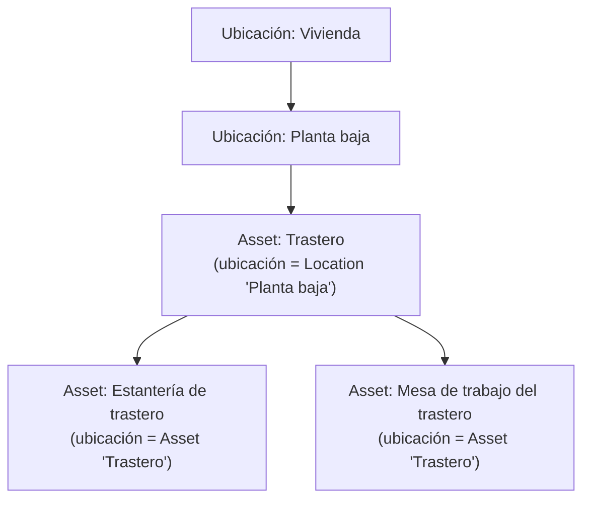
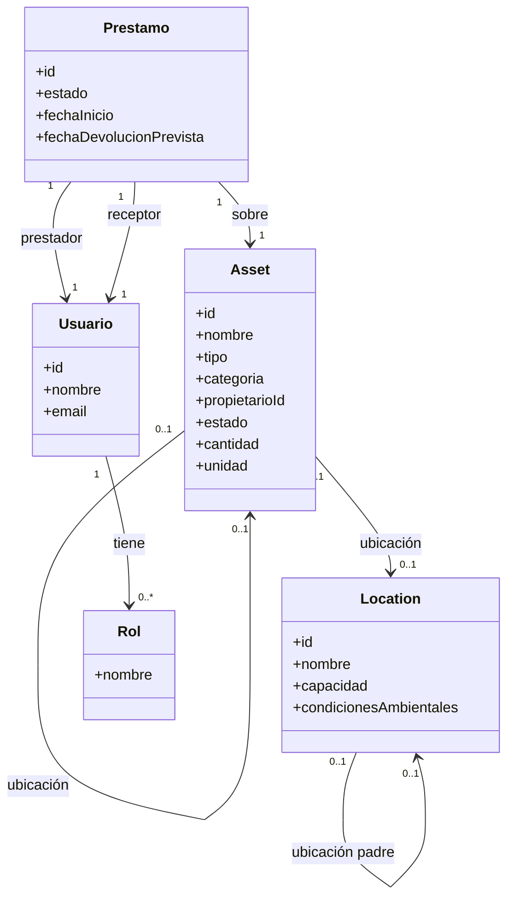
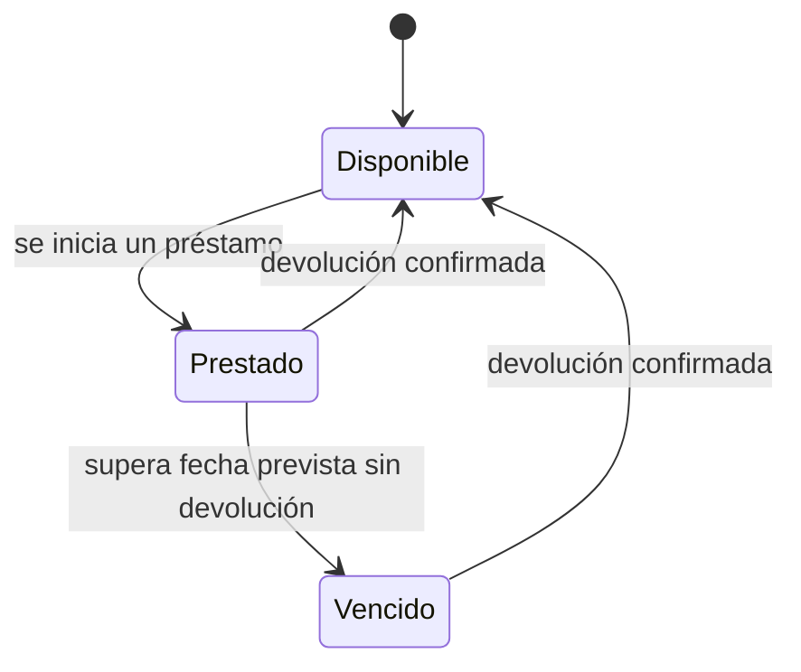
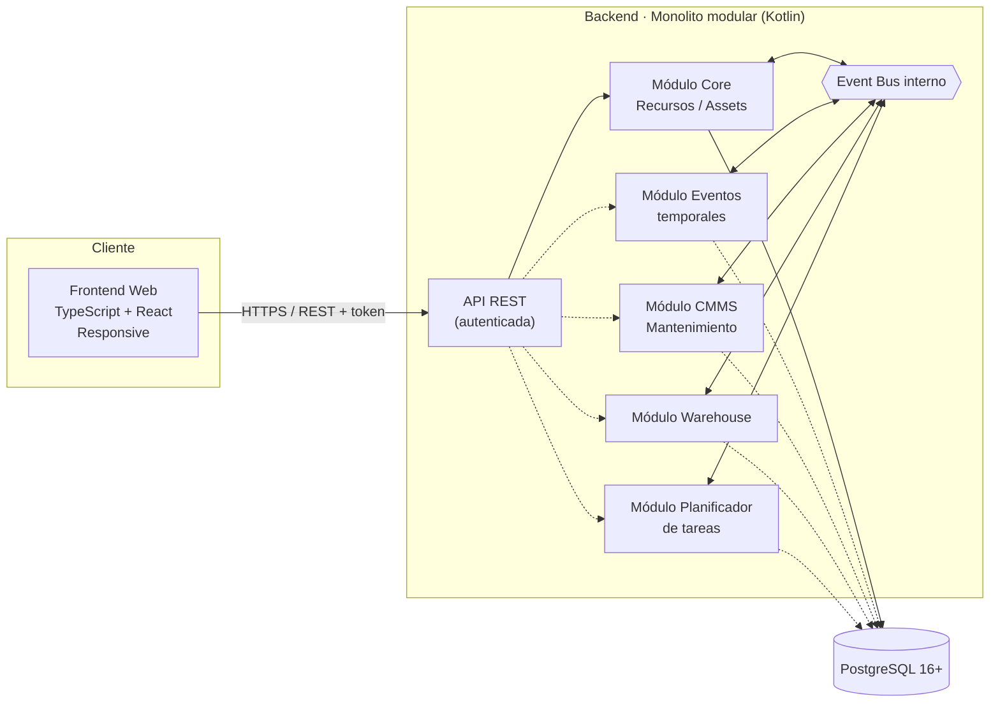
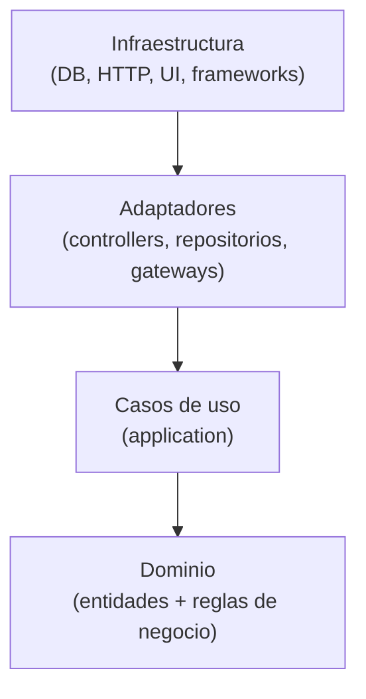
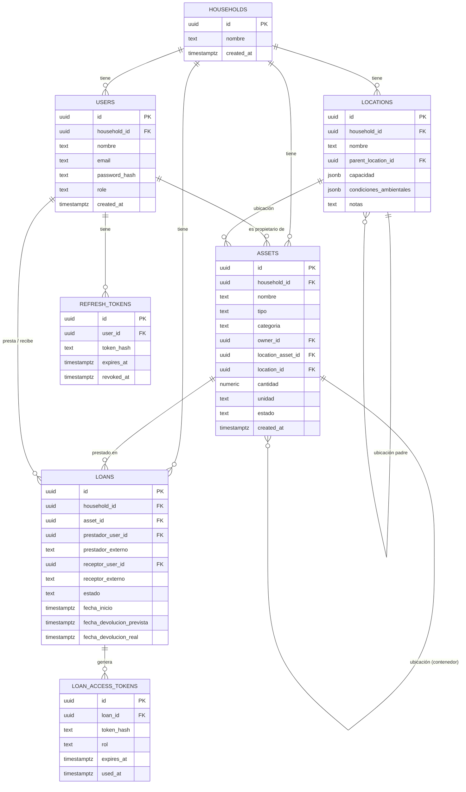
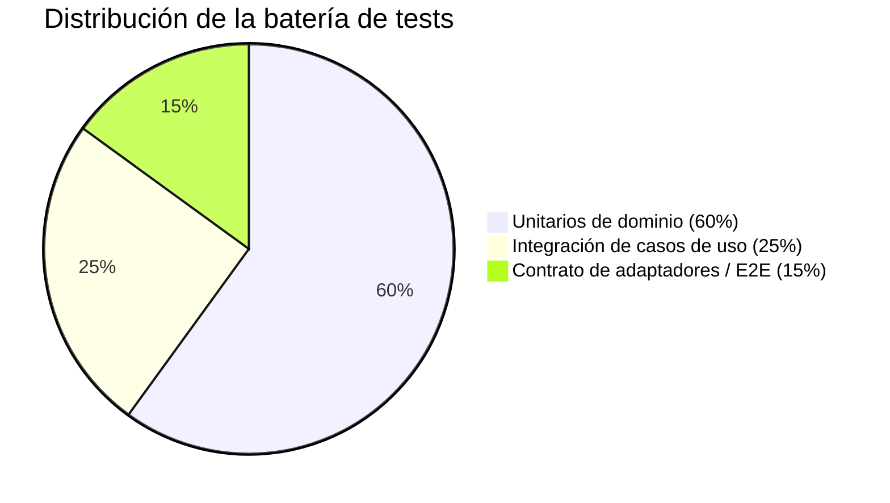

# DRP · Domestic Resource Planning

> **Estado del documento:** vivo — se actualiza a medida que el proyecto avanza.
> **Última actualización:** 2026-08-07
> **Fase actual:** Fase 0 completada — core mínimo definido y sin decisiones de diseño abiertas; lista para iniciar la Fase 1 (Core MVP)

---

## 1. Resumen ejecutivo

**DRP (Domestic Resource Planning)** es una solución para la gestión de recursos y assets en el entorno doméstico. Traslada al hogar el enfoque modular que ya ha demostrado su valor en los ERP empresariales: un **core mínimo** que resuelve lo esencial (dar de alta, ubicar y clasificar los recursos del hogar) sobre el que se pueden ir **activando módulos** a medida que aparece la necesidad (mantenimiento, inventario, planificación, eventos puntuales...).

El proyecto se construye como dos componentes claramente diferenciados —**backend** y **frontend web responsive**— que se comunican mediante una **API REST autenticada**.

---

## 2. Objetivo del proyecto

**Problema:** la información sobre los recursos de un hogar (electrodomésticos, vehículos, mobiliario, herramientas, garantías, revisiones...) suele estar dispersa entre hojas de cálculo, carpetas de papeles, recordatorios sueltos del móvil y la memoria de quien gestiona la casa. No existe un punto único de verdad, y mucho menos algo que crezca con las necesidades de cada hogar.

**Visión:** aplicar al hogar la disciplina de gestión que aporta un ERP a una empresa: un sistema central de recursos, extensible por módulos, sin obligar a implementar de golpe funcionalidades que un hogar concreto no necesita.

> **Ejemplo ilustrativo:** una familia con caldera, dos coches, electrodomésticos y un garaje lleno de herramientas.
> - **Sin DRP:** la fecha de la ITV está en el calendario del móvil, el manual de la caldera en un cajón, el inventario del garaje "en la cabeza", y las tareas de mantenimiento se recuerdan (o no) por costumbre.
> - **Con DRP:** todos los assets están dados de alta en el core con su documentación asociada. Si más adelante el hogar activa el módulo de **mantenimiento (CMMS)**, el sistema puede generar automáticamente los planes de revisión sin tener que rehacer nada de lo ya cargado.

---

## 3. Analogía ERP → DRP

| Concepto en un ERP empresarial | Equivalente en DRP (hogar) |
|---|---|
| Activos productivos (maquinaria, líneas) | Electrodomésticos, vehículos, mobiliario, herramientas |
| Mantenimiento preventivo/correctivo (CMMS) | Revisión de caldera, ITV, cambio de filtros, garantías |
| Gestión de almacén / inventario | Despensa, garaje, trastero, botiquín |
| Planificación de producción / tareas | Tareas domésticas, turnos, rutinas familiares |
| Gestión de proyectos / eventos puntuales | Mudanzas, reformas, celebraciones, viajes |

---

## 4. Alcance funcional

### 4.1 Core mínimo (obligatorio)

- **Gestión del hogar:** unidad de aislamiento multi-tenant — varios hogares comparten la misma base de datos; agrupa a los usuarios, assets, ubicaciones y préstamos de una misma vivienda (ver el modelo de datos en 5.6).
- **Gestión de recursos/assets:** alta, baja, modificación, categorización, ubicación (jerárquica), propietario/responsable y documentación asociada. Cubre **todo el material del hogar**, no solo los bienes económicamente relevantes: desde una caldera hasta un paquete de harina (ver 4.1.1).
- **Gestión de ubicaciones:** estructura jerárquica de espacios físicos con características mínimas de almacenaje.
- **Gestión de usuarios del hogar:** autenticación y roles, incluyendo roles de acceso acotado para préstamos entre personas.
- **Event bus interno:** canal de comunicación entre módulos, para que el core no dependa de que un módulo esté activo o no.
- **API REST autenticada:** único canal de comunicación entre backend y frontend.

> Las subsecciones 4.1.1 a 4.1.7 recogen la primera pasada de profundización sobre el core mínimo.

#### 4.1.1 Recursos y assets

Un **asset** es **cualquier material presente en el hogar**, no solo el que resulta relevante por su valor económico, su depreciación, su seguro o su mantenimiento. Un taladro es un asset, pero también lo son un bote de detergente, un paquete de arroz o un cuadro del salón. Restringir el concepto a los bienes "importantes" dejaría fuera la mayor parte de lo que un hogar realmente gestiona.

Ahora bien, no todo el material se comporta igual, y esa diferencia condiciona el modelo:

| Naturaleza | Qué es | Cómo se cuenta | Ejemplos |
|---|---|---|---|
| **`DURADERO`** | Tiene identidad propia y se usa de forma repetida sin agotarse | Una fila por unidad física | Caldera, taladro, sofá, coche, cuadro |
| **`CONSUMIBLE`** | Se agota o se repone con el uso; las unidades son intercambiables entre sí | Una fila por existencia, con `cantidad` y `unidad` | Harina, detergente, pilas, bombillas |

Dar de alta trescientos gramos de harina como trescientas filas no tendría sentido; tampoco lo tendría gestionar dos taladros idénticos como "cantidad: 2", porque cada uno tiene su propia ubicación, su propio préstamo y su propio mantenimiento. De ahí la distinción.

> **Alcance deliberado:** el core mantiene un contador simple (`cantidad` + `unidad`) y nada más. El seguimiento de existencias real — consumos, mínimos, reposición, caducidades, lotes — pertenece al módulo **Warehouse** (ver 4.2), que se engancha vía event bus. El core no debe convertirse en un gestor de inventario (ver la decisión en 4.1.7).

**Jerarquía y composición.** Un asset puede definirse como un conjunto de otros assets (composición). Por ejemplo, el asset **"Trastero"** puede estar compuesto por los assets **"Estantería de trastero"** y **"Mesa de trabajo del trastero"**.

Esta jerarquía se construye a través del campo **ubicación** de cada asset, que es polimórfico: un asset puede tener como ubicación **otro asset** (por ejemplo, la mesa de trabajo "está en" el asset Trastero) **o bien** una **ubicación** propiamente dicha (ver 4.1.2). Un asset puede no tener ubicación asignada todavía (por ejemplo, recién dado de alta y pendiente de clasificar).



**Atributos mínimos de un Asset:**

| Atributo | Aplica a | Descripción |
|---|---|---|
| Identificador, nombre | Ambos | — |
| `tipo` | Ambos | `DURADERO` o `CONSUMIBLE`. Se fija en el alta y **no es modificable** después: cambiar la naturaleza de un asset equivale a darlo de baja y crear otro |
| `categoria` | Ambos | Clasificación funcional, independiente del tipo (`MOBILIARIO`, `ALIMENTACION`, `LIMPIEZA`, `HERRAMIENTA`, `DECORACION`…) |
| Propietario/responsable | Ambos | Referencia a un usuario del hogar |
| Ubicación | Ambos | Referencia a otro Asset **o** a una Location — nunca ambas a la vez |
| Estado | Ambos | `DISPONIBLE`, `PRESTADO`, `BAJA` |
| `cantidad` + `unidad` | Solo `CONSUMIBLE` | Existencia actual y su unidad de medida (`UNIDAD`, `GRAMO`, `KILOGRAMO`, `MILILITRO`, `LITRO`, `METRO`, `PAQUETE`) |
| Documentación asociada | Opcional, típicamente `DURADERO` | Facturas, garantías, manuales. Deja de ser un atributo asumido: un paquete de arroz no tiene manual |

**Reglas mínimas de negocio:**
- Un asset no puede ser su propio ancestro en la jerarquía de composición (evita ciclos).
- Un asset no puede tener como ubicación simultáneamente otro asset y una Location: es una u otra.
- Un asset no puede eliminarse si tiene assets hijos o un préstamo activo, sin resolver antes esa dependencia.
- Un `CONSUMIBLE` debe tener `cantidad` (≥ 0) y `unidad`; un `DURADERO` no puede tener ninguna de las dos — su cantidad implícita es siempre 1.
- Solo un `DURADERO` puede actuar como ubicación de otros assets: una estantería contiene cosas, un paquete de harina no.
- Solo un `DURADERO` puede prestarse. Un consumible no se presta, se consume o se entrega; la semántica de devolución no le aplica (ver 4.1.5).
- Un `CONSUMIBLE` con `cantidad = 0` **sigue existiendo** como asset (agotado, pendiente de reposición). Llegar a cero no da de baja nada: esa es una decisión del hogar, no del sistema.

#### 4.1.2 Ubicaciones

Una **ubicación (Location)** representa un espacio físico de almacenaje y, al igual que los assets, admite jerarquía (p. ej. Vivienda → Planta baja → Garaje → Estantería 2). A diferencia del asset, una ubicación no es un recurso del hogar en sí misma, sino el contenedor físico donde se guardan los recursos.

**Atributos mínimos de una Location:**
- Identificador, nombre
- Ubicación padre (opcional, para la jerarquía)
- Capacidad (p. ej. volumen, peso máximo o nº de unidades — a definir por tipo de ubicación)
- Condiciones ambientales de almacenaje (p. ej. rango de temperatura, rango de humedad, exposición a la luz) — todas opcionales, solo se informan si son relevantes para esa ubicación
- Notas/observaciones libres

**Reglas mínimas de negocio:**
- Una ubicación no puede ser su propia ancestra (evita ciclos).
- Si se informa una capacidad, el sistema debería poder advertir (no necesariamente bloquear, a definir) cuando se supera al asignar assets a esa ubicación.

#### 4.1.3 Modelo de dominio del core (vista conjunta)



#### 4.1.4 Usuarios y roles

Se contemplan cuatro roles, agrupados en dos tipos según su alcance:

| Rol | Tipo | Alcance | Permisos típicos |
|---|---|---|---|
| Administrador del hogar | Estructural | Todo el hogar | CRUD completo de assets, ubicaciones y usuarios; gestión de roles; activar/desactivar módulos |
| Miembro del hogar | Estructural | Todo el hogar | CRUD de assets y ubicaciones; iniciar y gestionar préstamos; sin gestión de usuarios ni módulos |
| Prestador | Contextual (ligado a un préstamo) | Un préstamo concreto | Consultar el estado del préstamo; confirmar la entrega del asset |
| Receptor del préstamo | Contextual (ligado a un préstamo) | Un préstamo concreto | Consultar el estado y la fecha prevista de devolución; confirmar la devolución |

Los roles **estructurales** (administrador/miembro) pertenecen a usuarios del hogar con cuenta completa. Los roles **contextuales** (prestador/receptor) pueden recaer tanto en miembros del hogar como en personas externas (p. ej. un vecino al que se le presta un taladro); el acceso acotado por token (ver 5.4.1) se aplica únicamente cuando la persona no tiene una cuenta completa en el sistema.

#### 4.1.5 Préstamos (concepto mínimo en el core)

Los roles de prestador y receptor no tienen sentido sin un concepto que los sustente, así que el core incorpora una versión **mínima** de gestión de préstamos: qué asset se presta, quién lo presta, quién lo recibe y en qué estado está.



**Atributos mínimos de un Préstamo:**
- Identificador, asset prestado
- Prestador y receptor (usuarios del hogar o personas externas)
- Fecha de inicio, fecha prevista de devolución (opcional), fecha real de devolución
- Estado (`ACTIVO`, `DEVUELTO`, `VENCIDO`)

**Reglas mínimas de negocio:**
- Un asset no puede tener más de un préstamo en estado `ACTIVO` simultáneamente.
- Solo se prestan assets `DURADERO` (ver 4.1.1): un consumible se consume o se entrega, y la semántica de devolución no le aplica.

> **¿Y ceder un consumible?** Dar azúcar a un vecino no necesita ningún concepto nuevo: es un `AjustarCantidadAsset` que descuenta la cantidad (ver 5.7). Si te lo reponen, otro ajuste que la suma. Modelarlo como préstamo obligaría a llevar cantidad en el préstamo y a permitir varios préstamos activos sobre el mismo asset, complicando el core para un caso que el contador ya resuelve.

> **Nota de alcance:** esta es una versión mínima, suficiente para que los roles de prestador/receptor tengan algo que consultar. Si en el futuro el negocio de préstamos crece (recordatorios automáticos, penalizaciones, valoraciones, historial extenso), es candidato a extraerse como módulo propio, reutilizando el mismo mecanismo de event bus para no romper el core.

#### 4.1.6 Event bus y API REST

El event bus interno y la API REST autenticada se detallan en profundidad en las secciones 5.2 y 5.4 de este documento, para mantener toda la definición de arquitectura agrupada en la sección 5.

#### 4.1.7 Decisiones de diseño validadas

Las siguientes decisiones, inicialmente abiertas, han quedado validadas:

- **Roles Prestador/Receptor:** pueden ser tanto miembros del hogar como personas externas. El acceso acotado por token (ver 5.4.1) se aplica únicamente cuando la persona no tiene cuenta completa en el sistema.
- **Alcance de la gestión de préstamos:** se mantiene mínima dentro del core (ver 4.1.5) mientras no gane funcionalidad adicional; si en el futuro crece (recordatorios automáticos, penalizaciones, valoraciones, historial extenso), se extraerá como módulo propio.
- **Composición y ubicación física:** quedan unificadas en un único campo `ubicación` por asset (ver 4.1.1); no se distingue, por ahora, entre "de qué está compuesto" un asset y "dónde está físicamente".
- **Préstamo de consumibles:** solo se prestan assets `DURADERO`. La cesión de un consumible (dar azúcar a un vecino) se modela como un ajuste de cantidad, no como un préstamo (ver la nota en 4.1.5). Se descartaron las alternativas de llevar cantidad en el préstamo —que obligaría a permitir varios préstamos activos sobre el mismo asset, rompiendo el índice único parcial de 5.6— y de añadir una entidad "cesión" al core, que no aporta nada que el contador de cantidad no cubra ya.
- **Alcance del concepto de asset y gestión de cantidad:** un asset es todo material del hogar, no solo el económicamente relevante. Se distingue `DURADERO` de `CONSUMIBLE` (ver 4.1.1), y el core se limita a un contador simple (`cantidad` + `unidad`) sobre los consumibles. Todo el seguimiento de existencias — consumos, mínimos, reposición, caducidad, lotes — queda fuera del core y pertenece al módulo **Warehouse** (4.2), que se suscribe a `AssetQuantityChanged`. La alternativa de no guardar cantidad alguna en el core se descartó porque dejaría los consumibles sin representación útil hasta que Warehouse exista.

- **Aislamiento multi-tenant con Row-Level Security:** se activa RLS de PostgreSQL desde el principio, **además** del filtrado por `household_id` en la aplicación (ver 5.6). Son dos capas independientes: si un repositorio olvida el filtro, la base de datos sigue sin devolver filas de otro hogar. Se descartó dejarlo solo en la aplicación porque convierte cada consulta nueva en una posible fuga entre hogares, y diferirlo a antes de producción porque retrofitar RLS obliga a revisar todas las consultas ya escritas. Registrado en [ADR-003](docs/common/architecture/decisions/ADR-003-row-level-security.md).
- **Alta de usuarios en un hogar existente:** el MVP usa **alta directa** por parte de un `ADMIN_HOGAR` (`CrearUsuario`, ver 5.7), con contraseña inicial que el usuario cambia al entrar. La **invitación por email con token de un solo uso** queda como evolución posterior, no como alternativa descartada: se implementará cuando exista infraestructura de correo, que de todos modos hace falta para enviar los tokens acotados de préstamo (ver 5.4.1). Evita bloquear el core a la espera de esa infraestructura.
- **Librería de migraciones:** **Flyway**, con migraciones en SQL plano versionado. Se descartó Liquibase porque su principal ventaja —la abstracción sobre el motor— no aporta nada con PostgreSQL ya fijado, y su ceremonia de changelogs complica revisar una política de RLS, que se lee mucho mejor como SQL. Registrado en [ADR-004](docs/common/architecture/decisions/ADR-004-database-migrations.md).

> Si en el futuro surgen nuevas decisiones de diseño pendientes de validar, se recomienda añadirlas aquí siguiendo el mismo formato (pregunta + decisión + referencia a la sección afectada) hasta que se resuelvan. En este momento no queda ninguna abierta.

### 4.2 Módulos futuros (activables progresivamente)

| Módulo | Descripción | Estado | Prioridad |
|---|---|---|---|
| Gestión de eventos temporales | Mudanzas, reformas, viajes, celebraciones: proyectos con inicio/fin y recursos asociados | Por diseñar | Baja |
| CMMS doméstico | Mantenimiento preventivo/correctivo de assets (planes, avisos, histórico) | Por diseñar | Alta |
| Warehouse | Inventario doméstico (despensa, garaje, trastero) con stock y consumo | Por diseñar | Alta |
| Planificador de tareas | Rutinas, turnos entre miembros del hogar, recordatorios | Por diseñar | Media |
| Gestión avanzada de préstamos | Recordatorios, penalizaciones, valoraciones e histórico extenso (el core ya cubre lo mínimo, ver 4.1.5) | Por diseñar | Baja |
| *(otros a definir)* | Candidatos futuros: gastos/presupuesto, seguros y garantías, energía | Backlog abierto | — |

> Esta tabla es el punto principal a mantener actualizado: a medida que un módulo pase de "por diseñar" a "en desarrollo" o "en producción", se debe reflejar aquí.

---

## 5. Arquitectura

### 5.1 Visión de componentes



*Las líneas discontinuas representan módulos opcionales: pueden no estar activos sin que el core deje de funcionar.*

### 5.2 Event bus interno

Así es como el core se mantiene independiente de los módulos, y cómo un módulo activo puede "engancharse" a algo que pasa en el core sin que este lo sepa:


Si el módulo CMMS no está activo, el evento `AssetCreated` simplemente no tiene ningún suscriptor: el core no necesita saber que el CMMS existe.

#### 5.2.1 Contrato de evento

Todo evento publicado por el core sigue una misma forma mínima:

```
DomainEvent
├─ eventId        UUID      identificador único del evento
├─ type           String    p.ej. "AssetCreated", "AssetMoved", "LoanStarted"
├─ occurredAt     Instant   marca temporal de cuándo ocurrió
├─ aggregateId    String    id del recurso afectado (p.ej. assetId)
├─ version        Int       versión del esquema del evento, para evolución futura
└─ payload        JSON      datos específicos de ese tipo de evento
```

#### 5.2.2 Mecanismo interno

```kotlin
interface EventBus {
    fun publish(event: DomainEvent)
    fun <T : DomainEvent> subscribe(eventType: KClass<T>, handler: (T) -> Unit)
}
```

- Al ser un monolito modular (no microservicios), el bus se implementa **in-process** (pub/sub en memoria).
- Entrega **at-least-once**: los handlers de los módulos deben ser idempotentes.
- Un fallo en el handler de un módulo **no debe** afectar a la transacción del core: el core persiste y responde con independencia de si los módulos consumidores fallan.
- Candidato de evolución: patrón **Transactional Outbox** (persistir el evento en la misma transacción que el cambio de estado) para no perder eventos si el proceso cae antes de notificarlos.

#### 5.2.3 Catálogo inicial de eventos del core

| Evento | Se publica cuando… | Ejemplo de consumidor futuro |
|---|---|---|
| `AssetCreated` | Se da de alta un asset | CMMS genera un plan de mantenimiento por defecto |
| `AssetMoved` | Cambia la ubicación de un asset | Warehouse actualiza el stock por ubicación |
| `AssetHierarchyChanged` | Cambia el asset padre/composición de un asset | Módulos que dependan de la estructura del hogar |
| `AssetQuantityChanged` | Cambia la cantidad de un asset `CONSUMIBLE` | Warehouse registra el movimiento de existencias; el planificador de tareas añade el producto a la lista de la compra al llegar a 0 |
| `AssetDeactivated` | Se da de baja un asset | CMMS cancela los planes de mantenimiento asociados |
| `LocationCreated` | Se crea una ubicación | Warehouse la usa como posible punto de stock |
| `LoanStarted` | Se inicia un préstamo | Planificador de tareas crea un recordatorio de devolución |
| `LoanReturned` | Se confirma la devolución de un préstamo | Cierre de recordatorios asociados |

### 5.3 Clean Architecture (aplicable a BE y FE)

Ambos componentes siguen la regla de dependencia de Clean Architecture: las capas externas dependen de las internas, nunca al revés.



> **Ejemplo BE:** la entidad `Asset` y sus reglas (p. ej. "un asset no puede existir sin propietario") viven en el dominio, sin conocer PostgreSQL. El caso de uso `CrearAsset` orquesta esa regla. El adaptador `AssetPostgresRepository` implementa cómo se persiste, y es lo único que "sabe" que existe PostgreSQL.
>
> **Ejemplo FE:** un componente de React no debería contener lógica de negocio; consume un caso de uso/hook que a su vez habla con un adaptador HTTP hacia la API REST.

### 5.4 Comunicación frontend–backend

- API REST autenticada (token), respuestas en JSON.

#### 5.4.1 Autenticación (definitivo)

**Usuarios del hogar (administrador/miembro):**
- Implementación con **Spring Security** + JWT firmado (HS256; clave gestionada como secreto de despliegue, no en el repositorio).
- `POST /api/v1/auth/login` valida `email` + contraseña (hash `BCrypt` vía `PasswordEncoder` de Spring Security) y devuelve un **access token** de vida corta (≈15 min) y un **refresh token** de vida larga (≈30 días).
- Claims del access token: `sub` (userId), `householdId`, `role` (`ADMIN_HOGAR` | `MIEMBRO_HOGAR`).
- Un filtro (`OncePerRequestFilter`) valida el JWT en cada petición y puebla el `SecurityContext`; la autorización por rol se expresa con `@PreAuthorize` sobre casos de uso/controllers.
- Los refresh tokens se guardan **hasheados** en la tabla `refresh_tokens` (ver 5.6) y rotan en cada uso (`POST /api/v1/auth/refresh`); son revocables por el propio usuario o un administrador.
- **Aislamiento multi-tenant:** al compartir varios hogares la misma base de datos, todo caso de uso filtra siempre por el `householdId` del token — nunca se confía en un `householdId` recibido como parámetro del cliente.

**Usuarios externos de un préstamo (prestador/receptor sin cuenta completa):**
- Al iniciar un préstamo, el core genera un token acotado (JWT firmado, sin `sub` de usuario) con claims `loanId` y `role` (`PRESTADOR` | `RECEPTOR`), enviado como enlace por email o SMS.
- El hash del token se guarda en `loan_access_tokens` (ver 5.6) junto a su expiración, lo que permite revocarlo o comprobar reutilización.
- Su alcance queda acotado a `GET /api/v1/loans/{id}` (del préstamo indicado) y a `POST /api/v1/loans/{id}/return`; no da acceso a ningún otro recurso del hogar.

#### 5.4.2 Recursos principales (ilustrativo, sujeto a definición detallada de contratos)

**Autenticación**
- `POST /api/v1/auth/login` — iniciar sesión (usuarios del hogar)
- `POST /api/v1/auth/refresh` — renovar el access token

**Assets**
- `GET /api/v1/assets` — listar (filtros: `locationId`, `parentAssetId`, `ownerId`, `estado`, `tipo`)
- `POST /api/v1/assets` — dar de alta (`tipo` obligatorio; `cantidad` y `unidad` solo si es `CONSUMIBLE`)
- `GET /api/v1/assets/{id}` — detalle
- `PATCH /api/v1/assets/{id}` — modificar (incluye cambiar ubicación, asset padre o la `cantidad` de un consumible; el `tipo` es inmutable)
- `GET /api/v1/assets/{id}/children` — hijos directos en la jerarquía de composición

**Locations**
- `GET /api/v1/locations` — listar
- `POST /api/v1/locations` — crear
- `GET /api/v1/locations/{id}/children` — hijos directos en la jerarquía

**Usuarios**
- `GET /api/v1/users` — listar miembros del hogar
- `POST /api/v1/users` — dar de alta un miembro (solo administrador)
- `PATCH /api/v1/users/{id}/roles` — modificar roles

**Préstamos**
- `POST /api/v1/loans` — iniciar un préstamo
- `GET /api/v1/loans/{id}` — consultar estado (accesible por el hogar y por el prestador/receptor asociado con su token acotado)
- `POST /api/v1/loans/{id}/return` — confirmar devolución

#### 5.4.3 Contratos JSON (ejemplos)

El contrato completo, con todos los recursos, parámetros y esquemas de error, se mantiene versionado en el archivo `openapi.yaml` adjunto a este documento (especificación OpenAPI 3.0). Aquí se muestran ejemplos ilustrativos de los recursos más representativos.

**`POST /api/v1/assets`** — request, asset **duradero**
```json
{
  "nombre": "Estantería de trastero",
  "tipo": "DURADERO",
  "categoria": "MOBILIARIO",
  "ownerId": "3d0a1e2c-...-000000000001",
  "ubicacion": { "tipo": "ASSET", "id": "9f21b4a0-...-000000000002" }
}
```

**`POST /api/v1/assets`** — response (`201 Created`)
```json
{
  "id": "7c44f8b1-...-000000000003",
  "nombre": "Estantería de trastero",
  "tipo": "DURADERO",
  "categoria": "MOBILIARIO",
  "ownerId": "3d0a1e2c-...-000000000001",
  "ubicacion": { "tipo": "ASSET", "id": "9f21b4a0-...-000000000002" },
  "estado": "DISPONIBLE",
  "createdAt": "2026-08-06T10:15:00Z"
}
```

**`POST /api/v1/assets`** — request, asset **consumible**
```json
{
  "nombre": "Harina de trigo",
  "tipo": "CONSUMIBLE",
  "categoria": "ALIMENTACION",
  "ownerId": "3d0a1e2c-...-000000000001",
  "ubicacion": { "tipo": "LOCATION", "id": "5b83c7d2-...-000000000005" },
  "cantidad": 1000,
  "unidad": "GRAMO"
}
```

**`PATCH /api/v1/assets/{id}`** — ajustar la cantidad de un consumible
```json
{ "cantidad": 700 }
```
> Publica `AssetQuantityChanged`. Enviar `cantidad` sobre un `DURADERO`, o un valor negativo, se rechaza con `409` y el código `ASSET_QUANTITY_NOT_APPLICABLE` / `ASSET_QUANTITY_NEGATIVE`.

**`GET /api/v1/loans/{id}`** — response con **token acotado de receptor**
```json
{
  "id": "1a2b3c4d-...-000000000004",
  "assetNombre": "Taladro",
  "estado": "ACTIVO",
  "fechaInicio": "2026-08-01T09:00:00Z",
  "fechaDevolucionPrevista": "2026-08-15T09:00:00Z"
}
```
> El token acotado solo expone estos campos; la vista completa (usuarios del hogar) añade `assetId`, `prestador`, `receptor` y `householdId`.

**Formato de error (todos los endpoints)**
```json
{
  "code": "ASSET_LOCATION_CONFLICT",
  "message": "Un asset no puede tener como ubicación un Asset y una Location a la vez",
  "details": {}
}
```

### 5.5 Frontend responsive

- Objetivo de rango de dispositivos: desde un **iPhone X (375px)** o equivalente en adelante, hasta **pantallas ultrawide** (2560px–3440px+).
- Enfoque **mobile-first**, con un sistema de diseño y breakpoints a definir en el detalle de la capa de UI.

### 5.6 Modelo de datos (PostgreSQL, multi-tenant)

Varios hogares comparten la misma base de datos, y el aislamiento entre ellos se defiende en **dos capas independientes**:

1. **Aplicación:** todo caso de uso y todo repositorio filtra siempre por el `householdId` del token de quien hace la petición. Nunca se confía en un `householdId` recibido como parámetro del cliente.
2. **Base de datos (Row-Level Security):** cada tabla con `household_id` tiene RLS activado y una política que restringe las filas visibles al hogar de la sesión. Si un repositorio olvidase el filtro, PostgreSQL sigue sin devolver filas ajenas.

```sql
ALTER TABLE assets ENABLE ROW LEVEL SECURITY;
ALTER TABLE assets FORCE ROW LEVEL SECURITY;

CREATE POLICY assets_household_isolation ON assets
    USING (household_id = current_setting('app.household_id')::uuid);
```

La aplicación fija `SET LOCAL app.household_id = '<uuid>'` al abrir cada transacción, a partir del claim del token. Dos condiciones que es fácil pasar por alto y que invalidan la protección entera: el usuario de base de datos de la aplicación **no** debe ser superusuario ni tener `BYPASSRLS`, y hace falta `FORCE ROW LEVEL SECURITY` para que la política también se aplique al propietario de la tabla.

Las políticas se versionan como migraciones Flyway, igual que el esquema (ver 4.1.7). El detalle de ambas decisiones está en [ADR-003](docs/common/architecture/decisions/ADR-003-row-level-security.md) y [ADR-004](docs/common/architecture/decisions/ADR-004-database-migrations.md).



**Restricciones y notas por tabla:**

| Tabla | Restricciones clave |
|---|---|
| `households` | — |
| `users` | `email` único **dentro del hogar** (`UNIQUE(household_id, email)`); `role` con `CHECK IN ('ADMIN_HOGAR','MIEMBRO_HOGAR')` |
| `assets` | `CHECK (location_asset_id IS NULL OR location_id IS NULL)` — nunca ambas ubicaciones a la vez; `tipo` con `CHECK IN ('DURADERO','CONSUMIBLE')`; `estado` con `CHECK IN ('DISPONIBLE','PRESTADO','BAJA')`; coherencia de cantidad con `CHECK ((tipo = 'CONSUMIBLE' AND cantidad IS NOT NULL AND cantidad >= 0 AND unidad IS NOT NULL) OR (tipo = 'DURADERO' AND cantidad IS NULL AND unidad IS NULL))`; `unidad` con `CHECK IN ('UNIDAD','GRAMO','KILOGRAMO','MILILITRO','LITRO','METRO','PAQUETE')`. Que `location_asset_id` apunte a un `DURADERO` no es expresable como `CHECK` simple: se valida en el caso de uso |
| `locations` | `parent_location_id` referencia a la propia tabla; la validación anti-ciclo se resuelve a nivel de aplicación (caso de uso), no es expresable como `CHECK` simple |
| `loans` | exactamente uno de `prestador_user_id`/`prestador_externo` informado (ídem para receptor); `estado` con `CHECK IN ('ACTIVO','DEVUELTO','VENCIDO')`; índice único parcial `(asset_id) WHERE estado = 'ACTIVO'` para no permitir más de un préstamo activo por asset. Que el asset prestado sea `DURADERO` se valida en el caso de uso, no como `CHECK` |
| `loan_access_tokens` | `token_hash` único; `rol` con `CHECK IN ('PRESTADOR','RECEPTOR')` |
| `refresh_tokens` | `token_hash` único; se marca `revoked_at` en lugar de borrarse, para poder auditar |

Todas las tablas del core (excepto `loan_access_tokens` y `refresh_tokens`, que cuelgan de `loans`/`users`) incluyen `household_id` para el filtrado multi-tenant.

### 5.7 Casos de uso del core (comandos y queries)

Catálogo ilustrativo de los comandos y queries que expone la capa de aplicación del core (capa "Casos de uso" de Clean Architecture, ver 5.3). Cada comando valida sus reglas de negocio y, cuando corresponde, publica un evento en el bus (ver 5.2.3).

| Tipo | Nombre | Entrada principal | Regla clave | Evento publicado |
|---|---|---|---|---|
| Comando | `CrearAsset` | nombre, tipo, categoría, ownerId, ubicación (opcional), cantidad y unidad (si `CONSUMIBLE`) | ubicación no puede ser Asset y Location a la vez; `CONSUMIBLE` exige cantidad ≥ 0 y unidad, `DURADERO` las prohíbe | `AssetCreated` |
| Comando | `MoverAsset` | assetId, nueva ubicación | evita ciclos en la jerarquía; si la ubicación es un Asset, este debe ser `DURADERO` | `AssetMoved` / `AssetHierarchyChanged` |
| Comando | `AjustarCantidadAsset` | assetId, nueva cantidad (absoluta) o delta | solo sobre `CONSUMIBLE`; la cantidad resultante no puede ser negativa | `AssetQuantityChanged` |
| Comando | `DarDeBajaAsset` | assetId | sin hijos activos ni préstamo `ACTIVO`; llegar a `cantidad = 0` no da de baja por sí solo | `AssetDeactivated` |
| Comando | `CrearLocation` | nombre, parentLocationId (opcional), capacidad, condiciones | evita ciclos en la jerarquía | `LocationCreated` |
| Comando | `CrearUsuario` | nombre, email, role, contraseña inicial | solo `ADMIN_HOGAR`; email único en el hogar; obliga a cambiar la contraseña en el primer acceso | — |
| Comando | `ModificarRolUsuario` | userId, nuevo role | no puede quitarse el único `ADMIN_HOGAR` del hogar | — |
| Comando | `IniciarPrestamo` | assetId, prestador, receptor, fecha de devolución prevista | el asset debe ser `DURADERO` y no tener otro préstamo `ACTIVO` | `LoanStarted` |
| Comando | `ConfirmarDevolucion` | loanId | solo prestador, receptor o un usuario del hogar | `LoanReturned` |
| Comando | `GenerarTokenAccesoExterno` | loanId, rol (`PRESTADOR`\|`RECEPTOR`) | vinculado a un préstamo `ACTIVO`; expira | — |
| Query | `ListarAssets` | filtros: locationId, parentAssetId, ownerId, estado, tipo | resultado acotado al `householdId` del token | — |
| Query | `ObtenerAsset` / `ListarHijosDeAsset` | assetId | — | — |
| Query | `ListarLocations` / `ObtenerLocation` | filtros: parentLocationId | — | — |
| Query | `ListarUsuarios` | — | solo usuarios del propio hogar | — |
| Query | `ObtenerPrestamo` | loanId | accesible por el hogar o por token acotado, con campos distintos (ver 5.4.3) | — |

> Este catálogo es ilustrativo y crecerá a medida que se implementen los casos de uso; cada nuevo comando/query debería añadirse aquí siguiendo el mismo formato.
>
> **Previsto para más adelante:** `InvitarUsuario` (invitación por email con token de un solo uso) sustituirá o convivirá con `CrearUsuario` cuando exista infraestructura de correo, y requerirá una tabla de invitaciones que no forma parte del esquema del MVP (ver la decisión en 4.1.7).

---

## 6. Stack tecnológico

| Componente | Tecnología | Notas |
|---|---|---|
| Backend | Kotlin + Spring Boot | Monolito modular |
| Persistencia | PostgreSQL 16+ | |
| Multi-tenancy | Aislamiento por `household_id` en aplicación + Row-Level Security de PostgreSQL | Varios hogares comparten la misma base de datos; dos capas independientes de aislamiento (ver 5.6 y ADR-003) |
| Migraciones de BD | Flyway (SQL plano versionado) | Esquema y políticas de RLS versionados juntos (ver ADR-004) |
| Comunicación interna BE | Event bus (in-process) | Contrato definido (ver 5.2); librería concreta por definir; candidato a evolucionar con patrón Outbox |
| Comunicación FE ↔ BE | API REST autenticada | Spring Security + JWT para usuarios del hogar; tokens acotados de vida corta (tabla `loan_access_tokens`) para usuarios externos de préstamo (ver 5.4.1) |
| Contratos de API | OpenAPI 3.0 (`openapi.yaml`) + ejemplos en el README | Ver 5.4.3 |
| Frontend | TypeScript | |
| Librería de UI sugerida | React | |
| Testing | Por definir (candidatos: Kotest/JUnit5 + Testcontainers en BE, Vitest/Jest + Testing Library en FE) | A confirmar |

---

## 7. Estrategia de testing

La misma distribución de esfuerzo aplica a **backend y frontend**, alineada con las capas de Clean Architecture:



| Nivel | Qué cubre | Ejemplo |
|---|---|---|
| **Unitarios de dominio (60%)** | Entidades y reglas de negocio puras, sin dependencias externas | Verificar que `Asset` no se puede crear sin `ownerId` |
| **Integración de casos de uso (25%)** | Orquestación de un caso de uso completo, con dependencias reales o en memoria | Ejecutar `CrearAsset` y comprobar que persiste y que se publica el evento `AssetCreated` |
| **Contrato de adaptadores / E2E (15%)** | El adaptador cumple el contrato esperado por el mundo exterior | Test HTTP: `POST /api/v1/assets` responde `201` con el esquema JSON esperado |

**Ejemplos adicionales derivados de esta iteración del core:**
- *Unitario de dominio:* un `Asset` no puede definirse como su propio ancestro en la jerarquía de composición (evita ciclos).
- *Unitario de dominio:* un `Asset` de tipo `DURADERO` no admite `cantidad` ni `unidad`, y un `CONSUMIBLE` no puede quedar con cantidad negativa tras un ajuste.
- *Integración de caso de uso:* ejecutar `IniciarPrestamo` sobre un asset que ya tiene un préstamo en estado `ACTIVO` debe fallar.
- *Integración de caso de uso:* ejecutar `AjustarCantidadAsset` sobre un `CONSUMIBLE` debe persistir la nueva cantidad y publicar `AssetQuantityChanged`; sobre un `DURADERO` debe fallar sin publicar nada.
- *Contrato de adaptador / E2E:* `GET /api/v1/loans/{id}` con el token acotado de un receptor externo solo debe exponer los campos permitidos para ese rol.

---

## 8. Roadmap y estado actual

| Fase | Contenido | Estado |
|---|---|---|
| **Fase 0 — Definición** | Arquitectura, stack, alcance del core, estrategia de testing | 🟢 Completada |
| **Fase 1 — Core MVP** | Gestión de recursos/assets, autenticación, API REST, event bus, FE responsive básico | 🟡 Siguiente |
| **Fase 2 — Primer módulo funcional** | Candidato a definir (CMMS o Warehouse) | ⚪ Pendiente |
| **Fase 3 — Módulos adicionales** | Según backlog de la sección 4.2 | ⚪ Pendiente |

### 8.1 Detalle de la Fase 0 (definición)

- [x] Arquitectura general y stack tecnológico
- [x] Alcance y prioridad de módulos futuros
- [x] Modelo de recursos/assets (jerarquía y ubicación polimórfica)
- [x] Modelo de ubicaciones (jerarquía y características de almacenaje)
- [x] Roles de usuario, incluyendo roles acotados para préstamos
- [x] Contrato y catálogo inicial del event bus
- [x] Recursos y esquema de autenticación de la API REST (nivel ilustrativo)
- [x] Modelo de datos definitivo (tablas, tipos, constraints) y diagrama ER completo (ver 5.6)
- [x] Casos de uso detallados del core (comandos y queries) (ver 5.7)
- [x] Esquema de autenticación definitivo y gestión de tokens externos (ver 5.4.1)
- [x] Contratos JSON definitivos de la API (request/response schemas) (ver 5.4.3 y `openapi.yaml`)
- [x] Resolución de las decisiones de diseño abiertas (ver 4.1.7)
- [x] Decidir activación de PostgreSQL Row-Level Security como capa adicional de aislamiento multi-tenant (activado, ver 5.6 y ADR-003)
- [x] Definir flujo de invitación/alta de nuevos usuarios en un hogar existente (alta directa en el MVP, invitación por email como evolución, ver 4.1.7)
- [x] Seleccionar librería de migraciones de base de datos (Flyway, ver ADR-004)

**La Fase 0 queda cerrada: no hay decisiones de diseño abiertas.** El siguiente paso es la Fase 1, cuyo criterio de validación ya está fijado en la ADR-001: un recorrido vertical que atraviese frontend, API autenticada, aplicación, dominio y PostgreSQL, con pruebas en los tres niveles.

---

## 9. Documentación

La documentación detallada se organiza por ámbito en [`docs/`](docs/README.md):

- [`docs/common/`](docs/common/README.md) para producto, arquitectura transversal,
  contratos, estándares y skills compartidas.
- [`docs/backend/`](docs/backend/README.md) para el monolito modular, sus módulos,
  API, datos, seguridad, calidad y operación.
- [`docs/frontend/`](docs/frontend/README.md) para arquitectura web, diseño de
  producto, look and feel, design system, accesibilidad y calidad.

El contrato completo de la API vive en [`openapi.yaml`](openapi.yaml) (OpenAPI
3.0); su proceso de validación y las convenciones asociadas se documentan en
[`docs/common/contracts/`](docs/common/contracts/README.md).

---

## 10. Historial de cambios de este documento

| Fecha | Cambio |
|---|---|
| 2026-08-05 | Creación inicial: objetivo, analogía ERP→DRP, alcance core/módulos, arquitectura, stack y estrategia de testing |
| 2026-08-06 | Profundización del core mínimo: jerarquía de assets/ubicaciones con ubicación polimórfica, características de almacenaje, roles de usuario (incl. préstamos), contrato y catálogo inicial del event bus, y ampliación de la definición de la API REST |
| 2026-08-06 | Validación de las decisiones de diseño abiertas (4.1.7): roles prestador/receptor abiertos a miembros del hogar o a externos, alcance mínimo de la gestión de préstamos en el core, y unificación del campo ubicación |
| 2026-08-06 | Reajuste de prioridades de módulos futuros (4.2): Gestión de eventos temporales pasa de Media a Baja; Warehouse pasa de Media a Alta |
| 2026-08-07 | Cierre de los puntos pendientes de la Fase 0 (8.1): modelo de datos definitivo multi-tenant (5.6), catálogo de casos de uso del core (5.7), esquema de autenticación definitivo con Spring Security + JWT y gestión de tokens externos (5.4.1), y contratos JSON de la API (ejemplos en 5.4.3 + especificación OpenAPI en `openapi.yaml`) |
| 2026-08-07 | Cierre de las decisiones abiertas de la Fase 0 (4.1.7): préstamo limitado a assets duraderos (la cesión de un consumible es un ajuste de cantidad), Row-Level Security activado como segunda capa de aislamiento (5.6, ADR-003), alta directa de usuarios en el MVP con invitación por email como evolución, y Flyway como librería de migraciones (ADR-004). La Fase 0 queda completada |
| 2026-08-07 | Reformulación del concepto de asset (4.1.1): todo material del hogar es un asset, con distinción `DURADERO`/`CONSUMIBLE` y contador de cantidad en el core. Impacto en el diagrama de dominio (4.1.3), reglas de préstamo (4.1.5), decisiones validadas (4.1.7), evento `AssetQuantityChanged` (5.2.3), API (5.4.2, 5.4.3), modelo de datos (5.6), casos de uso con `AjustarCantidadAsset` (5.7), ejemplos de test (7) y `openapi.yaml` |

---

## 11. Cómo mantener este documento vivo

Al avanzar el proyecto, actualizar principalmente:

- **Sección 4.1.7** — añadir aquí nuevas decisiones de diseño pendientes cuando surjan, y trasladarlas a la lista de validadas en cuanto se resuelvan (dejando también constancia en el historial de cambios, sección 10).
- **Sección 4.2** — mover módulos de "por diseñar" a "en desarrollo"/"en producción" según corresponda.
- **Sección 8** — marcar fases y sub-tareas como en curso/completadas, y añadir nuevas fases si el roadmap se ajusta.
- **Sección 10** — añadir una línea por cada actualización relevante del documento (fecha + resumen del cambio).
- **Diagramas de la sección 5** — mantenerlos alineados con decisiones reales de arquitectura una vez se empiece a implementar.
