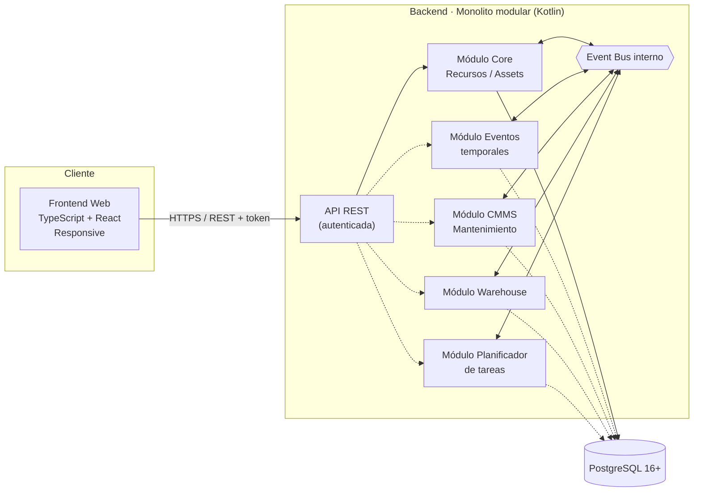
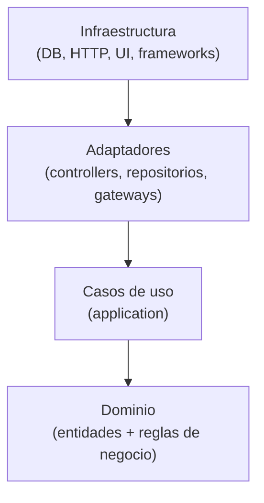
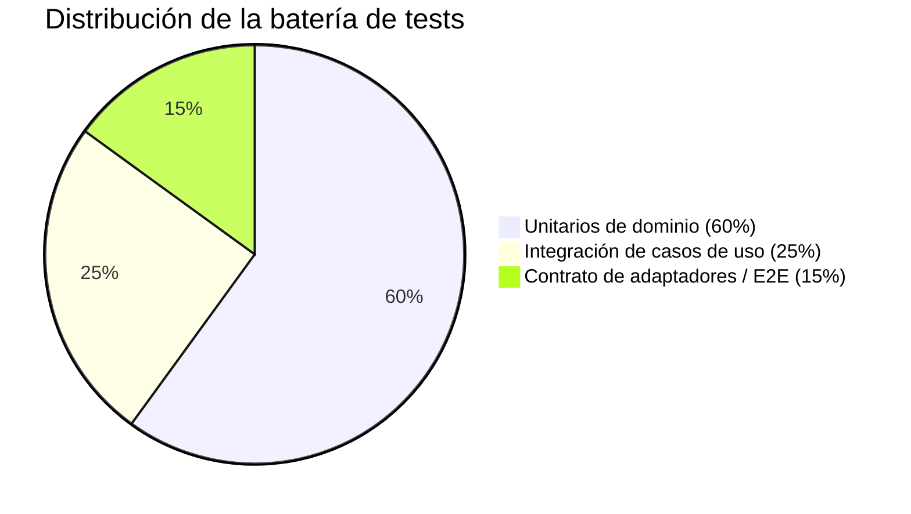

# DRP · Domestic Resource Planning

> **Estado del documento:** vivo — se actualiza a medida que el proyecto avanza.
> **Última actualización:** 2026-08-05
> **Fase actual:** Fase 0 — Definición de arquitectura y alcance del core mínimo (pre-desarrollo)

---

## 1. Resumen ejecutivo

**DRP (Domestic Resource Planning)** es una solución para la gestión de recursos y assets en el entorno doméstico. Traslada al hogar el enfoque modular que ya ha demostrado su valor en los ERP empresariales: un **core mínimo** que resuelve lo esencial (dar de alta, ubicar y clasificar los recursos del hogar) sobre el que se pueden ir **activando módulos** a medida que aparece la necesidad (mantenimiento, inventario, planificación, eventos puntuales...).

El proyecto se construye como dos componentes claramente diferenciados —**backend** y **frontend web responsive**— que se comunican mediante una **API REST autenticada**.

---

## 2. Objetivo del proyecto

**Problema:** la información sobre los recursos de un hogar (electrodomésticos, vehículos, mobiliario, herramientas, garantías, revisiones...) suele estar dispersa entre hojas de cálculo, carpetas de papeles, recordatorios sueltos del móvil y la memoria de quien gestiona la casa. No existe un punto único de verdad, y mucho menos algo que crezca con las necesidades de cada hogar.

**Visión:** aplicar al hogar la disciplina de gestión que aporta un ERP a una empresa: un sistema central de recursos, extensible por módulos, sin obligar a implementar de golpe funcionalidades que un hogar concreto no necesita.

> **Ejemplo ilustrativo:** una familia con caldera, dos coches, electrodomésticos y un garaje lleno de herramientas.
> - **Sin DRP:** la fecha de la ITV está en el calendario del móvil, el manual de la caldera en un cajón, el inventario del garaje "en la cabeza", y las tareas de mantenimiento se recuerdan (o no) por costumbre.
> - **Con DRP:** todos los assets están dados de alta en el core con su documentación asociada. Si más adelante el hogar activa el módulo de **mantenimiento (CMMS)**, el sistema puede generar automáticamente los planes de revisión sin tener que rehacer nada de lo ya cargado.

---

## 3. Analogía ERP → DRP

| Concepto en un ERP empresarial | Equivalente en DRP (hogar) |
|---|---|
| Activos productivos (maquinaria, líneas) | Electrodomésticos, vehículos, mobiliario, herramientas |
| Mantenimiento preventivo/correctivo (CMMS) | Revisión de caldera, ITV, cambio de filtros, garantías |
| Gestión de almacén / inventario | Despensa, garaje, trastero, botiquín |
| Planificación de producción / tareas | Tareas domésticas, turnos, rutinas familiares |
| Gestión de proyectos / eventos puntuales | Mudanzas, reformas, celebraciones, viajes |

---

## 4. Alcance funcional

### 4.1 Core mínimo (obligatorio)

- **Gestión de recursos/assets:** alta, baja, modificación, categorización, ubicación, propietario/responsable y documentación asociada (facturas, garantías, manuales).
- **Gestión de usuarios del hogar:** autenticación y roles (p. ej. administrador del hogar vs. miembro).
- **Event bus interno:** canal de comunicación entre módulos, para que el core no dependa de que un módulo esté activo o no.
- **API REST autenticada:** único canal de comunicación entre backend y frontend.

### 4.2 Módulos futuros (activables progresivamente)

| Módulo | Descripción | Estado | Prioridad |
|---|---|---|---|
| Gestión de eventos temporales | Mudanzas, reformas, viajes, celebraciones: proyectos con inicio/fin y recursos asociados | Por diseñar | Media |
| CMMS doméstico | Mantenimiento preventivo/correctivo de assets (planes, avisos, histórico) | Por diseñar | Alta |
| Warehouse | Inventario doméstico (despensa, garaje, trastero) con stock y consumo | Por diseñar | Media |
| Planificador de tareas | Rutinas, turnos entre miembros del hogar, recordatorios | Por diseñar | Media |
| *(otros a definir)* | Candidatos futuros: gastos/presupuesto, seguros y garantías, energía | Backlog abierto | — |

> Esta tabla es el punto principal a mantener actualizado: a medida que un módulo pase de "por diseñar" a "en desarrollo" o "en producción", se debe reflejar aquí.

---

## 5. Arquitectura

### 5.1 Visión de componentes

*Las líneas discontinuas representan módulos opcionales: pueden no estar activos sin que el core deje de funcionar.*

### 5.2 Ejemplo de flujo entre módulos vía event bus

Así es como el core se mantiene independiente de los módulos, y cómo un módulo activo puede "engancharse" a algo que pasa en el core sin que este lo sepa:

Si el módulo CMMS no está activo, el evento `AssetCreated` simplemente no tiene ningún suscriptor: el core no necesita saber que el CMMS existe.

### 5.3 Clean Architecture (aplicable a BE y FE)

Ambos componentes siguen la regla de dependencia de Clean Architecture: las capas externas dependen de las internas, nunca al revés.

> **Ejemplo BE:** la entidad `Asset` y sus reglas (p. ej. "un asset no puede existir sin propietario") viven en el dominio, sin conocer PostgreSQL. El caso de uso `CrearAsset` orquesta esa regla. El adaptador `AssetPostgresRepository` implementa cómo se persiste, y es lo único que "sabe" que existe PostgreSQL.
>
> **Ejemplo FE:** un componente de React no debería contener lógica de negocio; consume un caso de uso/hook que a su vez habla con un adaptador HTTP hacia la API REST.

### 5.4 Comunicación frontend–backend

- API REST autenticada (token), respuestas en JSON.
- Ejemplo ilustrativo de endpoints del core (sujeto a definición detallada más adelante):
  - `GET /api/v1/assets` — listar recursos del hogar
  - `POST /api/v1/assets` — dar de alta un recurso
  - `GET /api/v1/assets/{id}` — detalle de un recurso

### 5.5 Frontend responsive

- Objetivo de rango de dispositivos: desde un **iPhone X (375px)** o equivalente en adelante, hasta **pantallas ultrawide** (2560px–3440px+).
- Enfoque **mobile-first**, con un sistema de diseño y breakpoints a definir en el detalle de la capa de UI.

---

## 6. Stack tecnológico

| Componente | Tecnología | Notas |
|---|---|---|
| Backend | Kotlin | Monolito modular |
| Persistencia | PostgreSQL 16+ | |
| Comunicación interna BE | Event bus (in-process) | Librería concreta por definir |
| Comunicación FE ↔ BE | API REST autenticada | Esquema de auth por definir (candidato: JWT) |
| Frontend | TypeScript | |
| Librería de UI sugerida | React | |
| Testing | Por definir (candidatos: Kotest/JUnit5 en BE, Vitest/Jest + Testing Library en FE) | A confirmar |

---

## 7. Estrategia de testing

La misma distribución de esfuerzo aplica a **backend y frontend**, alineada con las capas de Clean Architecture:

| Nivel | Qué cubre | Ejemplo |
|---|---|---|
| **Unitarios de dominio (60%)** | Entidades y reglas de negocio puras, sin dependencias externas | Verificar que `Asset` no se puede crear sin `ownerId` |
| **Integración de casos de uso (25%)** | Orquestación de un caso de uso completo, con dependencias reales o en memoria | Ejecutar `CrearAsset` y comprobar que persiste y que se publica el evento `AssetCreated` |
| **Contrato de adaptadores / E2E (15%)** | El adaptador cumple el contrato esperado por el mundo exterior | Test HTTP: `POST /api/v1/assets` responde `201` con el esquema JSON esperado |

---

## 8. Roadmap y estado actual

| Fase | Contenido | Estado |
|---|---|---|
| **Fase 0 — Definición** | Arquitectura, stack, alcance del core, estrategia de testing | 🟡 En curso |
| **Fase 1 — Core MVP** | Gestión de recursos/assets, autenticación, API REST, event bus, FE responsive básico | ⚪ Pendiente |
| **Fase 2 — Primer módulo funcional** | Candidato a definir (CMMS o Warehouse) | ⚪ Pendiente |
| **Fase 3 — Módulos adicionales** | Según backlog de la sección 4.2 | ⚪ Pendiente |

---

## 9. Historial de cambios de este documento

| Fecha | Cambio |
|---|---|
| 2026-08-05 | Creación inicial: objetivo, analogía ERP→DRP, alcance core/módulos, arquitectura, stack y estrategia de testing |

---

## 10. Cómo mantener este documento vivo

Al avanzar el proyecto, actualizar principalmente:

- **Sección 4.2** — mover módulos de "por diseñar" a "en desarrollo"/"en producción" según corresponda.
- **Sección 8** — marcar fases como en curso/completadas y añadir nuevas fases si el roadmap se ajusta.
- **Sección 9** — añadir una línea por cada actualización relevante del documento (fecha + resumen del cambio).
- **Diagramas de la sección 5** — mantenerlos alineados con decisiones reales de arquitectura una vez se empiece a implementar.
