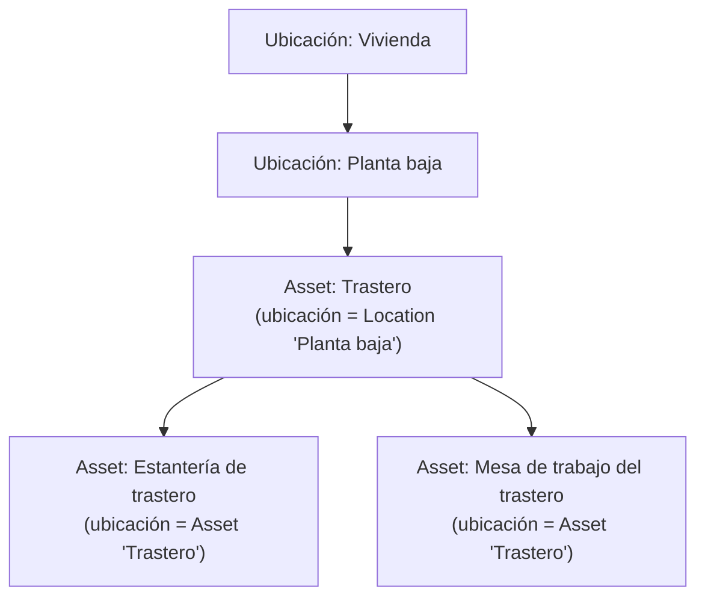
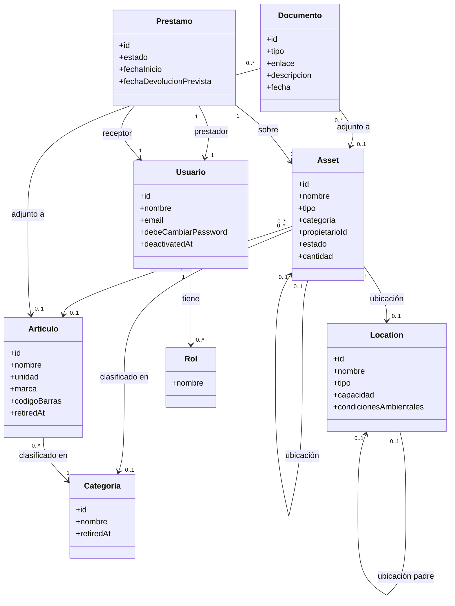
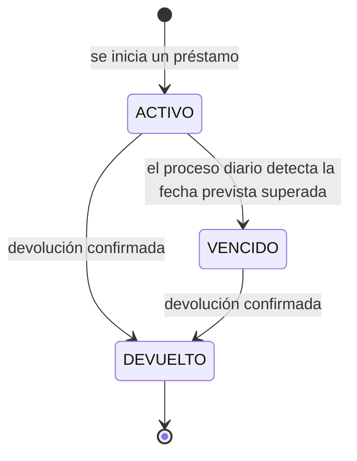
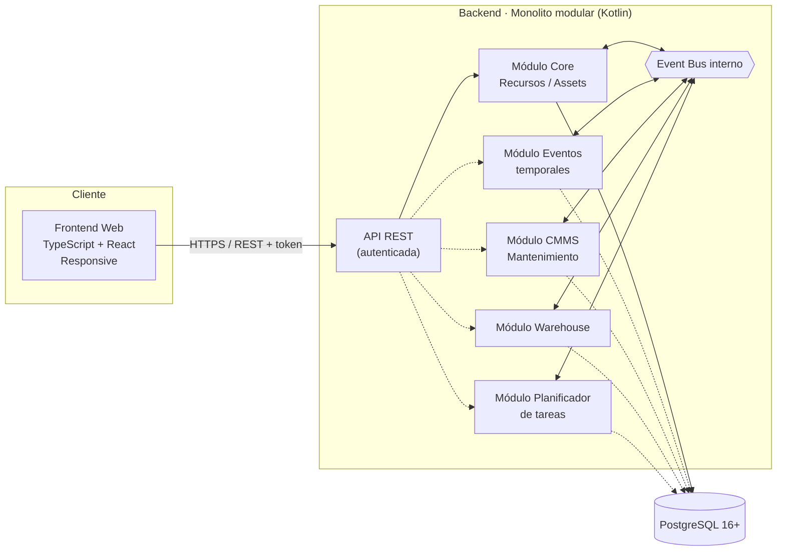
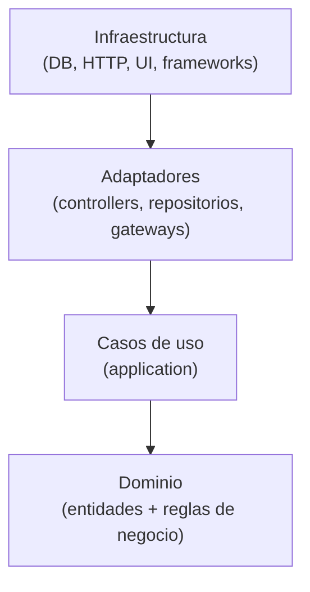
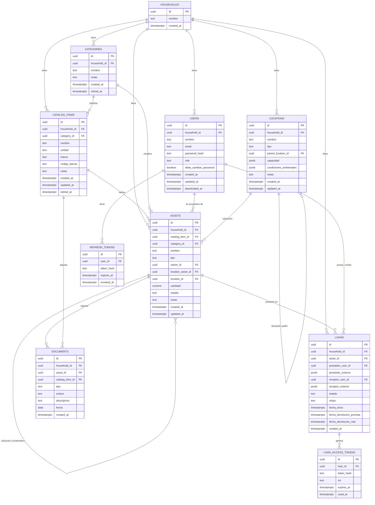
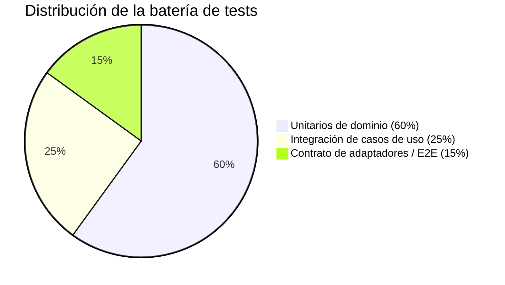

# DRP · Domestic Resource Planning

> **Estado del documento:** vivo — se actualiza a medida que el proyecto avanza.
> **Última actualización:** 2026-08-07
> **Fase actual:** Fase 0 completada — core mínimo definido y sin decisiones de diseño abiertas; lista para iniciar la Fase 1 (Core MVP)

---

## 1. Resumen ejecutivo

**DRP (Domestic Resource Planning)** es una solución para la gestión de recursos y assets en el entorno doméstico. Traslada al hogar el enfoque modular que ya ha demostrado su valor en los ERP empresariales: un **core mínimo** que resuelve lo esencial (dar de alta, ubicar y clasificar los recursos del hogar) sobre el que se pueden ir **activando módulos** a medida que aparece la necesidad (mantenimiento, inventario, planificación, eventos puntuales...).

El proyecto se construye como dos componentes claramente diferenciados —**backend** y **frontend web responsive**— que se comunican mediante una **API REST autenticada**.

---

## 2. Objetivo del proyecto

**Problema:** la información sobre los recursos de un hogar (electrodomésticos, vehículos, mobiliario, herramientas, garantías, revisiones...) suele estar dispersa entre hojas de cálculo, carpetas de papeles, recordatorios sueltos del móvil y la memoria de quien gestiona la casa. No existe un punto único de verdad, y mucho menos algo que crezca con las necesidades de cada hogar.

**Visión:** aplicar al hogar la disciplina de gestión que aporta un ERP a una empresa: un sistema central de recursos, extensible por módulos, sin obligar a implementar de golpe funcionalidades que un hogar concreto no necesita.

> **Ejemplo ilustrativo:** una familia con caldera, dos coches, electrodomésticos y un garaje lleno de herramientas.
> - **Sin DRP:** la fecha de la ITV está en el calendario del móvil, el manual de la caldera en un cajón, el inventario del garaje "en la cabeza", y las tareas de mantenimiento se recuerdan (o no) por costumbre.
> - **Con DRP:** todos los assets están dados de alta en el core con su documentación asociada. Si más adelante el hogar activa el módulo de **mantenimiento (CMMS)**, el sistema puede generar automáticamente los planes de revisión sin tener que rehacer nada de lo ya cargado.

---

## 3. Analogía ERP → DRP

| Concepto en un ERP empresarial | Equivalente en DRP (hogar) |
|---|---|
| Activos productivos (maquinaria, líneas) | Electrodomésticos, vehículos, mobiliario, herramientas |
| Mantenimiento preventivo/correctivo (CMMS) | Revisión de caldera, ITV, cambio de filtros, garantías |
| Gestión de almacén / inventario | Despensa, garaje, trastero, botiquín |
| Planificación de producción / tareas | Tareas domésticas, turnos, rutinas familiares |
| Gestión de proyectos / eventos puntuales | Mudanzas, reformas, celebraciones, viajes |

---

## 4. Alcance funcional

### 4.1 Core mínimo (obligatorio)

- **Gestión del hogar:** unidad de aislamiento multi-tenant — varios hogares comparten la misma base de datos; agrupa a los usuarios, assets, ubicaciones y préstamos de una misma vivienda (ver el modelo de datos en 5.6).
- **Gestión de recursos/assets:** alta, baja, modificación, categorización, ubicación (jerárquica), propietario/responsable y documentación asociada. Cubre **todo el material del hogar**, no solo los bienes económicamente relevantes: desde una caldera hasta un paquete de harina (ver 4.1.1).
- **Gestión de ubicaciones:** estructura jerárquica de espacios físicos con características mínimas de almacenaje.
- **Gestión de usuarios del hogar:** autenticación y roles, incluyendo roles de acceso acotado para préstamos entre personas.
- **Event bus interno:** canal de comunicación entre módulos, para que el core no dependa de que un módulo esté activo o no.
- **API REST autenticada:** único canal de comunicación entre backend y frontend.

> Las subsecciones 4.1.1 a 4.1.7 recogen la primera pasada de profundización sobre el core mínimo.

#### 4.1.1 Recursos y assets

Un **asset** es **cualquier material presente en el hogar**, no solo el que resulta relevante por su valor económico, su depreciación, su seguro o su mantenimiento. Un taladro es un asset, pero también lo son un bote de detergente, un paquete de arroz o un cuadro del salón. Restringir el concepto a los bienes "importantes" dejaría fuera la mayor parte de lo que un hogar realmente gestiona.

Ahora bien, no todo el material se comporta igual, y esa diferencia condiciona el modelo:

| Naturaleza | Qué es | Cómo se cuenta | Ejemplos |
|---|---|---|---|
| **`DURADERO`** | Tiene identidad propia y se usa de forma repetida sin agotarse | Una fila por unidad física | Caldera, taladro, sofá, coche, cuadro |
| **`CONSUMIBLE`** | Se agota o se repone con el uso; las unidades son intercambiables entre sí | Una fila por existencia —un artículo en una ubicación—, con `cantidad` | Harina, detergente, pilas, bombillas |

Dar de alta trescientos gramos de harina como trescientas filas no tendría sentido; tampoco lo tendría gestionar dos taladros idénticos como "cantidad: 2", porque cada uno tiene su propia ubicación, su propio préstamo y su propio mantenimiento. De ahí la distinción.

> **Alcance deliberado:** el core mantiene un contador simple (`cantidad`) y nada más. El seguimiento de existencias real — consumos, mínimos, reposición, caducidades, lotes — pertenece al módulo **Warehouse** (ver 4.2), que se engancha vía event bus. El core no debe convertirse en un gestor de inventario (ver la decisión en 4.1.7).

**Artículo y existencia: el alta de un consumible no se repite.**

Traer a casa un paquete de azúcar de 1 kg no da de alta nada nuevo: el hogar ya sabe qué es el azúcar y en qué unidad lo lleva. Por eso la **definición** de un consumible se separa de sus **existencias**:

| Concepto | Qué es | Qué guarda | Equivalente ERP |
|---|---|---|---|
| **`Articulo`** | La ficha reutilizable de *qué* es algo | `nombre`, `categoria`, `unidad`, y opcionalmente marca y código de barras | Material maestro |
| **Asset `CONSUMIBLE`** | Una existencia concreta de ese artículo en un sitio | `cantidad`, ubicación, propietario, estado | Stock |

Un artículo **no es un asset**: no es material, no ocupa sitio, no tiene cantidad y no se presta. Es solo la ficha que evita reescribir «Azúcar / `ALIMENTACION` / `GRAMO`» en cada compra.

> **Nomenclatura.** Igual que `Prestamo` se persiste en la tabla `loans`, el concepto se llama `Articulo` en el dominio y `catalog_items` en la base de datos (ver 5.6), con `catalogItemId` como campo y `/api/v1/catalog-items` como recurso de la API (ver 5.4.2).

De ahí que dar entrada a un consumible sea siempre la misma operación, `RegistrarEntradaConsumible` (ver 5.7): se indica el artículo —eligiéndolo del catálogo del hogar, o creándolo en el mismo gesto si aún no existe—, la ubicación y la cantidad que entra. Si ya hay una existencia de ese artículo en esa ubicación, **la operación suma sobre ella**; si no la hay, la crea. Nunca aparece una segunda fila «Azúcar» en la despensa.

Reglas que sostienen ese comportamiento:

- **Una existencia por artículo y ubicación.** El azúcar de la despensa y el del trastero son dos existencias del mismo artículo, cada una con su cantidad y su propietario.
- **La `unidad` la fija el artículo**, no la existencia. Si el azúcar se lleva en gramos, todas sus existencias van en gramos; comprar «un paquete de 1 kg» es una conversión en la entrada, no otra unidad guardada. Convertir entre unidad de compra y unidad de consumo es del módulo Warehouse, no del core.
- **En un `DURADERO` el artículo es opcional.** Dos taladros idénticos pueden compartir artículo (misma marca, mismo modelo, mismo manual) sin dejar de ser dos assets con su ubicación, su préstamo y su mantenimiento propios. Un sofá único no necesita artículo: se da de alta con su `nombre` y su `categoria` propios.
- El catálogo es **de cada hogar**, como el resto de tablas del core (ver 5.6). Un catálogo compartido entre hogares, o sembrado desde una base de códigos de barras, sería una evolución posterior.

> **Esto tampoco es gestión de inventario.** El catálogo es dato maestro: qué cosas existen y cómo se llaman. Cuánto queda, cuándo caduca y cuándo hay que reponer sigue siendo de Warehouse.

**Jerarquía y composición.** Un asset puede definirse como un conjunto de otros assets (composición). Por ejemplo, el asset **"Trastero"** puede estar compuesto por los assets **"Estantería de trastero"** y **"Mesa de trabajo del trastero"**.

Esta jerarquía se construye a través del campo **ubicación** de cada asset, que es polimórfico: un asset puede tener como ubicación **otro asset** (por ejemplo, la mesa de trabajo "está en" el asset Trastero) **o bien** una **ubicación** propiamente dicha (ver 4.1.2). Un asset puede no tener ubicación asignada todavía (por ejemplo, recién dado de alta y pendiente de clasificar).



**Atributos mínimos de un Asset:**

| Atributo | Aplica a | Descripción |
|---|---|---|
| Identificador | Ambos | — |
| `tipo` | Ambos | `DURADERO` o `CONSUMIBLE`. Se fija en el alta y **no es modificable** después: cambiar la naturaleza de un asset equivale a darlo de baja y crear otro |
| `articuloId` | Obligatorio en `CONSUMIBLE`, opcional en `DURADERO` | Referencia al artículo del catálogo del hogar que define qué es este asset |
| `nombre` | Ambos | Propio del asset, o heredado de su artículo cuando lo tiene. Un asset sin artículo debe informarlo |
| `categoriaId` | Ambos | Clasificación funcional, independiente del tipo. Referencia al catálogo de categorías del hogar (ver más abajo). Se hereda del artículo igual que el nombre |
| Propietario/responsable | Ambos | Referencia a un usuario del hogar |
| Ubicación | Ambos | Referencia a otro Asset **o** a una Location — nunca ambas a la vez |
| Estado | Ambos | `DISPONIBLE`, `PRESTADO`, `BAJA` |
| `cantidad` | Solo `CONSUMIBLE` | Existencia actual, expresada en la `unidad` de su artículo |
| `notas` | Ambos | Texto libre, opcional |
| Documentación asociada | Opcional, típicamente `DURADERO` | Facturas, garantías, manuales. No es un campo del asset sino una entidad propia (ver más abajo): un paquete de arroz no tiene manual |

**Atributos mínimos de un Articulo:**

| Atributo | Descripción |
|---|---|
| Identificador | — |
| `nombre` | Único dentro del hogar (comparado normalizado, sin distinguir mayúsculas ni acentos) |
| `categoriaId` | La misma clasificación funcional que en un asset, contra el mismo catálogo |
| `unidad` | Unidad de medida en la que se llevan todas sus existencias (`UNIDAD`, `GRAMO`, `KILOGRAMO`, `MILILITRO`, `LITRO`, `METRO`, `PAQUETE`) |
| Marca, código de barras | Opcionales. Si se informa el código de barras, es único en el hogar y sirve para localizar el artículo al dar entrada |
| `notas` | Texto libre, opcional |

**Categorías: un catálogo por hogar.**

La clasificación funcional no es una lista fija del sistema sino una **entidad propia**, `Categoria`, con una fila por categoría y por hogar. Cada hogar arranca con un juego sembrado al crearse —`MOBILIARIO`, `ALIMENTACION`, `LIMPIEZA`, `HERRAMIENTA`, `DECORACION`— y a partir de ahí lo edita: quien guarda material de escalada o repuestos de bici no tiene por qué encajarlos en «herramienta».

| Atributo | Descripción |
|---|---|
| Identificador | — |
| `nombre` | Único entre las categorías vigentes del hogar, comparado normalizado |
| `notas` | Texto libre, opcional |

Se retira igual que un artículo, y por el mismo motivo: los assets la referencian por clave ajena, así que borrar la fila rompería el historial. Una categoría retirada deja de ofrecerse al clasificar, pero los assets que ya la tenían la conservan.

**Documentación asociada.**

Facturas, garantías y manuales se modelan como una entidad `Documento` que **guarda un enlace, no el fichero**. El core no almacena binarios: la factura suele estar ya en el correo y el manual en la web del fabricante, y sostener subida de ficheros exigiría decidir almacenamiento, tamaños y tipos permitidos antes de escribir la primera línea de la Fase 1. Subir el fichero queda como evolución posterior, y encaja sin romper nada: el día que exista, es una segunda forma de rellenar el mismo `enlace`.

| Atributo | Descripción |
|---|---|
| Identificador | — |
| `tipo` | `FACTURA`, `GARANTIA`, `MANUAL`, `OTRO` |
| `enlace` | URL al documento. Obligatorio |
| `descripcion` | Texto libre, opcional |
| `fecha` | Fecha del documento (la de la factura, la de fin de garantía…), opcional |

Un documento cuelga **de un asset o de un artículo, nunca de ambos**, y la distinción es la que ya estaba implícita en el modelo: la factura y la garantía son de la unidad física que compraste, y el manual es del modelo. Colgarlo del artículo es lo que hace que dos taladros idénticos compartan manual sin duplicarlo, que es justo lo que 4.1.7 prometía al abrir el artículo a los duraderos.

**Reglas mínimas de negocio:**
- Un asset no puede ser su propio ancestro en la jerarquía de composición (evita ciclos).
- Un asset no puede tener como ubicación simultáneamente otro asset y una Location: es una u otra.
- Un asset no puede darse de baja si tiene assets hijos o un préstamo **abierto** —`ACTIVO` o `VENCIDO`—, sin resolver antes esa dependencia. La baja es siempre lógica (`estado = BAJA`): nada se borra, para no perder el historial.
- Un `CONSUMIBLE` nunca está `PRESTADO`, porque no se presta: su estado es `DISPONIBLE` o `BAJA`.
- Dar de baja una existencia que aún tenía cantidad la deja a 0 — se da por perdida — en lugar de dejar un resto colgando en una fila muerta que ninguna suma de existencias volvería a mirar.
- Un `CONSUMIBLE` debe tener `articuloId` y `cantidad` (≥ 0); un `DURADERO` no puede tener `cantidad` — la suya implícita es siempre 1.
- El nombre y la categoría efectivos de un asset son los de su artículo cuando lo tiene; un asset sin artículo debe informarlos él. No se guardan por duplicado.
- Una categoría no se borra: se retira cuando el hogar deja de usarla, y los assets que ya la tenían la conservan.
- Un documento cuelga de un asset **o** de un artículo, nunca de los dos ni de ninguno.
- El propietario de un asset es opcional: queda vacío cuando quien lo tenía a su nombre causa baja en el hogar (ver 4.1.4).
- No puede haber dos existencias vivas del mismo artículo en la misma ubicación: dar entrada sobre una existente suma cantidad. Cuando dos existencias del mismo artículo ya están creadas por separado y se quieren juntar, eso es `FusionarExistencias` (ver 5.7), no un movimiento.
- Una existencia dada de baja deja de ocupar su hueco: se puede volver a dar entrada de ese artículo en esa ubicación, y la fila antigua se conserva por historial.
- Un artículo no se borra nunca: se **retira** del catálogo cuando ya no le queda ninguna existencia viva, y deja de ofrecerse en el alta. Las existencias dadas de baja siguen apuntando a él, así que la fila tiene que permanecer.
- Solo un `DURADERO` puede actuar como ubicación de otros assets: una estantería contiene cosas, un paquete de harina no.
- Solo un `DURADERO` puede prestarse. Un consumible no se presta, se consume o se entrega; la semántica de devolución no le aplica (ver 4.1.5).
- Un `CONSUMIBLE` con `cantidad = 0` **sigue existiendo** como asset (agotado, pendiente de reposición). Llegar a cero no da de baja nada: esa es una decisión del hogar, no del sistema. Su artículo sigue en el catálogo en cualquier caso.

#### 4.1.2 Ubicaciones

Una **ubicación (Location)** representa un espacio físico de almacenaje y, al igual que los assets, admite jerarquía (p. ej. Vivienda → Planta baja → Garaje → Estantería 2). A diferencia del asset, una ubicación no es un recurso del hogar en sí misma, sino el contenedor físico donde se guardan los recursos.

**Atributos mínimos de una Location:**

| Atributo | Descripción |
|---|---|
| Identificador | — |
| `nombre` | Único entre las ubicaciones hermanas, es decir, con el mismo padre: dos «Estantería 2» pueden convivir en garajes distintos, pero no en el mismo |
| `tipo` | `VIVIENDA`, `PLANTA`, `HABITACION`, `MUEBLE`, `ESTANTE`, `OTRO`. Lista fija: describe la naturaleza del contenedor, no lo que el hogar guarda en él |
| Ubicación padre | Opcional, para la jerarquía |
| `capacidad` | Opcional, y con forma única: un `tipo` (`PESO`, `VOLUMEN`, `UNIDADES`), un `maximo` numérico y su unidad. No se modela por tipo de ubicación — un estante aguanta kilos y un armario litros, pero ambos caben en la misma terna |
| Condiciones ambientales | Opcionales, todas: `temperaturaMin`/`Max` en °C, `humedadMin`/`Max` en %, y `exposicionLuz` (`DIRECTA`, `INDIRECTA`, `OSCURIDAD`). Solo se informan si son relevantes para esa ubicación |
| `notas` | Texto libre, opcional |

**Reglas mínimas de negocio:**
- Una ubicación no puede ser su propia ancestra (evita ciclos).
- Si se informa una capacidad, superarla al asignar un asset **advierte pero no bloquea**: el sistema no sabe cuánto ocupa cada cosa —el asset no lleva peso ni volumen— así que solo puede contar unidades con certeza. Bloquear con datos incompletos impediría guardar algo que sí cabe.
- Una ubicación no puede eliminarse si tiene ubicaciones hijas o assets dentro.

> **Por decidir:** que el aviso de capacidad sea útil más allá de contar unidades exige que el asset lleve peso o volumen, y eso solo tiene sentido si alguien los rellena. Queda anotado como pregunta en 4.1.7 en lugar de inventar un campo que nadie mantendría.

#### 4.1.3 Modelo de dominio del core (vista conjunta)



#### 4.1.4 Usuarios y roles

Se contemplan cuatro roles, agrupados en dos tipos según su alcance:

| Rol | Tipo | Alcance | Permisos típicos |
|---|---|---|---|
| Administrador del hogar | Estructural | Todo el hogar | CRUD completo de assets, ubicaciones y usuarios; gestión de roles; activar/desactivar módulos |
| Miembro del hogar | Estructural | Todo el hogar | CRUD de assets y ubicaciones; iniciar y gestionar préstamos; sin gestión de usuarios ni módulos |
| Prestador | Contextual (ligado a un préstamo) | Un préstamo concreto | Consultar el estado del préstamo; confirmar la entrega del asset |
| Receptor del préstamo | Contextual (ligado a un préstamo) | Un préstamo concreto | Consultar el estado y la fecha prevista de devolución; confirmar la devolución |

**Atributos mínimos de un Usuario:**

| Atributo | Descripción |
|---|---|
| Identificador | — |
| `nombre` | Nombre con el que aparece en el hogar |
| `email` | Identifica al usuario dentro del hogar. Se compara **normalizado a minúsculas**: `Kike@x.com` y `kike@x.com` son la misma persona |
| `role` | `ADMIN_HOGAR` o `MIEMBRO_HOGAR` (ver arriba) |
| `passwordHash` | `BCrypt`, nunca la contraseña en claro (ver 5.4.1) |
| `debeCambiarPassword` | Lo activa el alta directa y lo apaga el primer cambio. Sin este campo, la regla de «cambiar la contraseña al entrar» que fija 4.1.7 no tenía dónde apoyarse |
| `deactivatedAt` | Informado si el usuario ha causado baja en el hogar |

**Baja de un usuario.** Quien deja el hogar no se borra: se marca `deactivatedAt`, deja de poder autenticarse y se le revocan los refresh tokens. La fila permanece porque los préstamos y el historial la referencian.

Sus assets **quedan sin propietario**, no se reasignan solos. Aparecen en un listado de huérfanos (`ListarAssets` con el filtro correspondiente, ver 5.7) y se reasignan cuando el hogar decida. La alternativa —exigir el destino de todo lo suyo en el mismo gesto— convierte una baja en un inventario completo, y con cuarenta cosas a su nombre eso significa que la baja no se hace.

Un `ADMIN_HOGAR` no puede causar baja si es el único que queda: el hogar se quedaría sin quien gestione usuarios y módulos.

Los roles **estructurales** (administrador/miembro) pertenecen a usuarios del hogar con cuenta completa. Los roles **contextuales** (prestador/receptor) pueden recaer tanto en miembros del hogar como en personas externas (p. ej. un vecino al que se le presta un taladro); el acceso acotado por token (ver 5.4.1) se aplica únicamente cuando la persona no tiene una cuenta completa en el sistema.

#### 4.1.5 Préstamos (concepto mínimo en el core)

Los roles de prestador y receptor no tienen sentido sin un concepto que los sustente, así que el core incorpora una versión **mínima** de gestión de préstamos: qué asset se presta, quién lo presta, quién lo recibe y en qué estado está.



*Estos son los estados del **préstamo**. El asset acompaña: pasa a `PRESTADO` mientras el préstamo está `ACTIVO` o `VENCIDO`, y vuelve a `DISPONIBLE` con la devolución.*

**Atributos mínimos de un Préstamo:**

| Atributo | Descripción |
|---|---|
| Identificador, asset prestado | — |
| Prestador y receptor | Usuario del hogar **o** persona externa, exactamente uno de los dos por cada lado |
| Contacto del externo | `nombre` y un canal —`email` o `telefono`, al menos uno— porque es por donde se envía el enlace con el token acotado (ver 5.4.1). Un `text` suelto no sirve para eso |
| `fechaInicio` | — |
| `fechaDevolucionPrevista` | Opcional. Sin ella el préstamo nunca vence: es un préstamo sin plazo, no un plazo infinito |
| `fechaDevolucionReal` | Informada al confirmar la devolución |
| `estado` | `ACTIVO`, `DEVUELTO`, `VENCIDO` |
| `notas` | Texto libre, opcional |

**Cómo se llega a `VENCIDO`.** No lo provoca ninguna acción del usuario, así que hace falta algo que lo marque: un **proceso programado** recorre a diario los préstamos `ACTIVO` con `fechaDevolucionPrevista` ya pasada, los pasa a `VENCIDO` y publica `LoanOverdue` (ver 5.2.3). Es el primer proceso de fondo del sistema, y de ahí cuelgan los recordatorios automáticos que la gestión avanzada de préstamos (4.2) necesitará.

Que el estado se persista, en vez de derivarse al leer, es lo que permite publicar ese evento: un valor calculado no tiene momento en el que ocurrir, y sin evento no hay recordatorio al que engancharse.

> **Cuidado con el aislamiento multi-tenant.** Este proceso no nace de una petición, así que no hay token del que sacar el `householdId` (ver 5.6). No debe resolverse dando `BYPASSRLS` al usuario de base de datos —eso anula la segunda capa de aislamiento para toda la aplicación, no solo para el job—: recorre los hogares uno a uno, fijando `app.household_id` en cada transacción como haría cualquier petición.

**Reglas mínimas de negocio:**
- Un asset no puede tener más de un préstamo en estado `ACTIVO` simultáneamente. Un préstamo `VENCIDO` sigue ocupando ese hueco: vencer no es devolver.
- Solo se prestan assets `DURADERO` (ver 4.1.1): un consumible se consume o se entrega, y la semántica de devolución no le aplica.
- Un préstamo sin `fechaDevolucionPrevista` no puede vencer, y el proceso lo ignora.

> **¿Y ceder un consumible?** Dar azúcar a un vecino no necesita ningún concepto nuevo: es un `AjustarCantidadAsset` que descuenta la cantidad (ver 5.7). Si te lo reponen, otro ajuste que la suma. Modelarlo como préstamo obligaría a llevar cantidad en el préstamo y a permitir varios préstamos activos sobre el mismo asset, complicando el core para un caso que el contador ya resuelve.

> **Nota de alcance:** esta es una versión mínima, suficiente para que los roles de prestador/receptor tengan algo que consultar. Si en el futuro el negocio de préstamos crece (recordatorios automáticos, penalizaciones, valoraciones, historial extenso), es candidato a extraerse como módulo propio, reutilizando el mismo mecanismo de event bus para no romper el core.

#### 4.1.6 Event bus y API REST

El event bus interno y la API REST autenticada se detallan en profundidad en las secciones 5.2 y 5.4 de este documento, para mantener toda la definición de arquitectura agrupada en la sección 5.

#### 4.1.7 Decisiones de diseño validadas

Las siguientes decisiones, inicialmente abiertas, han quedado validadas:

- **Roles Prestador/Receptor:** pueden ser tanto miembros del hogar como personas externas. El acceso acotado por token (ver 5.4.1) se aplica únicamente cuando la persona no tiene cuenta completa en el sistema.
- **Alcance de la gestión de préstamos:** se mantiene mínima dentro del core (ver 4.1.5) mientras no gane funcionalidad adicional; si en el futuro crece (recordatorios automáticos, penalizaciones, valoraciones, historial extenso), se extraerá como módulo propio.
- **Composición y ubicación física:** quedan unificadas en un único campo `ubicación` por asset (ver 4.1.1); no se distingue, por ahora, entre "de qué está compuesto" un asset y "dónde está físicamente".
- **Préstamo de consumibles:** solo se prestan assets `DURADERO`. La cesión de un consumible (dar azúcar a un vecino) se modela como un ajuste de cantidad, no como un préstamo (ver la nota en 4.1.5). Se descartaron las alternativas de llevar cantidad en el préstamo —que obligaría a permitir varios préstamos activos sobre el mismo asset, rompiendo el índice único parcial de 5.6— y de añadir una entidad "cesión" al core, que no aporta nada que el contador de cantidad no cubra ya.
- **Alcance del concepto de asset y gestión de cantidad:** un asset es todo material del hogar, no solo el económicamente relevante. Se distingue `DURADERO` de `CONSUMIBLE` (ver 4.1.1), y el core se limita a un contador simple (`cantidad` + `unidad`) sobre los consumibles. Todo el seguimiento de existencias — consumos, mínimos, reposición, caducidad, lotes — queda fuera del core y pertenece al módulo **Warehouse** (4.2), que se suscribe a `AssetQuantityChanged`. La alternativa de no guardar cantidad alguna en el core se descartó porque dejaría los consumibles sin representación útil hasta que Warehouse exista.
- **Alta de consumibles y catálogo de artículos:** la definición de un consumible (`nombre`, `categoria`, `unidad`, marca y código de barras) se separa en una entidad propia, `Articulo`, y el asset `CONSUMIBLE` pasa a ser una **existencia** de ese artículo en una ubicación, con `cantidad` (ver 4.1.1). Dar entrada a un consumible ya existente suma sobre su existencia en vez de crear una fila nueva, así que traer otro paquete de azúcar no obliga a reintroducir nada. El artículo es obligatorio en `CONSUMIBLE` y opcional en `DURADERO`, donde permite compartir modelo y documentación entre unidades idénticas sin forzar a fichar un mueble único. Se descartaron dos alternativas: resolver el alta como *find-or-create* sobre el nombre del asset, porque la clave sería texto libre y la definición se reteclearía en cada ubicación nueva, y dejarlo en un autocompletado del frontend, porque la regla anti-duplicados viviría solo en la UI y la API seguiría admitiendo duplicados. Se acepta a sabiendas de que añade una entidad al core: retrofitarla cuando llegue Warehouse —que colgará mínimos, caducidades y lotes del artículo— obligaría a migrar cada consumible existente partiendo texto libre. Juntar dos existencias del mismo artículo que ya se crearon por separado es un caso de uso explícito, `FusionarExistencias` (ver 5.7), y no un efecto colateral de `MoverAsset`: la fusión tiene que decidir qué ubicación y qué propietario sobreviven, y esa decisión es del usuario, no del sistema.

- **Aislamiento multi-tenant con Row-Level Security:** se activa RLS de PostgreSQL desde el principio, **además** del filtrado por `household_id` en la aplicación (ver 5.6). Son dos capas independientes: si un repositorio olvida el filtro, la base de datos sigue sin devolver filas de otro hogar. Se descartó dejarlo solo en la aplicación porque convierte cada consulta nueva en una posible fuga entre hogares, y diferirlo a antes de producción porque retrofitar RLS obliga a revisar todas las consultas ya escritas. Registrado en [ADR-003](docs/common/architecture/decisions/ADR-003-row-level-security.md).
- **Alta de usuarios en un hogar existente:** el MVP usa **alta directa** por parte de un `ADMIN_HOGAR` (`CrearUsuario`, ver 5.7), con contraseña inicial que el usuario cambia al entrar. La **invitación por email con token de un solo uso** queda como evolución posterior, no como alternativa descartada: se implementará cuando exista infraestructura de correo, que de todos modos hace falta para enviar los tokens acotados de préstamo (ver 5.4.1). Evita bloquear el core a la espera de esa infraestructura.
- **Librería de migraciones:** **Flyway**, con migraciones en SQL plano versionado. Se descartó Liquibase porque su principal ventaja —la abstracción sobre el motor— no aporta nada con PostgreSQL ya fijado, y su ceremonia de changelogs complica revisar una política de RLS, que se lee mucho mejor como SQL. Registrado en [ADR-004](docs/common/architecture/decisions/ADR-004-database-migrations.md).

- **Clasificación funcional:** `categoria` deja de ser texto libre y pasa a ser un **catálogo por hogar** (entidad `Categoria`, ver 4.1.1), sembrado con un juego por defecto al crear el hogar y editable después. Se descartó la lista fija con `CHECK`, que es más consistente con `tipo`/`estado`/`unidad` pero obliga a una migración cada vez que un hogar guarda algo que no encaja en cinco cajones pensados por otro; y se descartó dejarlo en texto libre, que no da filtros ni agrupaciones fiables. Se retira lógicamente, igual que un artículo y por el mismo motivo de clave ajena.
- **Documentación asociada:** se modela como entidad `Documento` que guarda **un enlace, no el fichero** (ver 4.1.1). El core no gana almacenamiento de binarios, que exigiría decidir backend de ficheros, tamaños y tipos permitidos, y modificar el stack antes de empezar la Fase 1. Subir el fichero queda como evolución, no como alternativa descartada: cuando exista, será otra forma de rellenar el mismo campo. Un documento cuelga de un asset o de un artículo, lo que hace que el manual se comparta entre unidades idénticas y la factura no.
- **Baja de un usuario:** baja lógica (`deactivatedAt`), y sus assets **quedan sin propietario** en lugar de reasignarse (ver 4.1.4). Se descartó exigir la reasignación en el mismo gesto porque convierte la baja en un inventario completo y, con muchos assets a nombre de esa persona, en la práctica hace que la baja no se ejecute. El precio es aceptar assets huérfanos, que se acota con un filtro de listado para localizarlos. `owner_id` pasa a ser opcional en `assets`.
- **Transición a `VENCIDO`:** la marca un **proceso programado** diario, que además publica `LoanOverdue` (ver 4.1.5 y 5.2.3). Se descartó derivar el estado al leer —más simple, sin proceso de fondo, pero un valor calculado no tiene un instante en el que ocurra y por tanto no puede publicar el evento del que colgarán los recordatorios— y marcarlo en la consulta, que convierte una lectura en escritura y deja el estado a merced de que alguien mire. El proceso no nace de una petición, así que debe recorrer los hogares fijando `app.household_id` en cada transacción, nunca con `BYPASSRLS`.

> **Pendiente de validar:** el aviso por capacidad de una ubicación (4.1.2) solo puede contar unidades, porque un asset no lleva peso ni volumen. ¿Merece la pena que los tenga? Solo si alguien los rellena, y un hogar que no pesa sus cajas obtendría un aviso peor que ninguno. Queda abierta hasta tener uso real; mientras tanto, el aviso se limita a lo que el sistema sabe con certeza.

> Si en el futuro surgen nuevas decisiones de diseño pendientes de validar, se recomienda añadirlas aquí siguiendo el mismo formato (pregunta + decisión + referencia a la sección afectada) hasta que se resuelvan.

### 4.2 Módulos futuros (activables progresivamente)

| Módulo | Descripción | Estado | Prioridad |
|---|---|---|---|
| Gestión de eventos temporales | Mudanzas, reformas, viajes, celebraciones: proyectos con inicio/fin y recursos asociados | Por diseñar | Baja |
| CMMS doméstico | Mantenimiento preventivo/correctivo de assets (planes, avisos, histórico) | Por diseñar | Alta |
| Warehouse | Inventario doméstico (despensa, garaje, trastero) con stock y consumo | Por diseñar | Alta |
| Planificador de tareas | Rutinas, turnos entre miembros del hogar, recordatorios | Por diseñar | Media |
| Gestión avanzada de préstamos | Recordatorios, penalizaciones, valoraciones e histórico extenso (el core ya cubre lo mínimo, ver 4.1.5) | Por diseñar | Baja |
| *(otros a definir)* | Candidatos futuros: gastos/presupuesto, seguros y garantías, energía | Backlog abierto | — |

> Esta tabla es el punto principal a mantener actualizado: a medida que un módulo pase de "por diseñar" a "en desarrollo" o "en producción", se debe reflejar aquí.

---

## 5. Arquitectura

### 5.1 Visión de componentes



*Las líneas discontinuas representan módulos opcionales: pueden no estar activos sin que el core deje de funcionar.*

### 5.2 Event bus interno

Así es como el core se mantiene independiente de los módulos, y cómo un módulo activo puede "engancharse" a algo que pasa en el core sin que este lo sepa:


Si el módulo CMMS no está activo, el evento `AssetCreated` simplemente no tiene ningún suscriptor: el core no necesita saber que el CMMS existe.

#### 5.2.1 Contrato de evento

Todo evento publicado por el core sigue una misma forma mínima:

```
DomainEvent
├─ eventId        UUID      identificador único del evento
├─ type           String    p.ej. "AssetCreated", "AssetMoved", "LoanStarted"
├─ occurredAt     Instant   marca temporal de cuándo ocurrió
├─ aggregateId    String    id del recurso afectado (p.ej. assetId)
├─ version        Int       versión del esquema del evento, para evolución futura
└─ payload        JSON      datos específicos de ese tipo de evento
```

#### 5.2.2 Mecanismo interno

```kotlin
interface EventBus {
    fun publish(event: DomainEvent)
    fun <T : DomainEvent> subscribe(eventType: KClass<T>, handler: (T) -> Unit)
}
```

- Al ser un monolito modular (no microservicios), el bus se implementa **in-process** (pub/sub en memoria).
- Entrega **at-least-once**: los handlers de los módulos deben ser idempotentes.
- Un fallo en el handler de un módulo **no debe** afectar a la transacción del core: el core persiste y responde con independencia de si los módulos consumidores fallan.
- Candidato de evolución: patrón **Transactional Outbox** (persistir el evento en la misma transacción que el cambio de estado) para no perder eventos si el proceso cae antes de notificarlos.

#### 5.2.3 Catálogo inicial de eventos del core

| Evento | Se publica cuando… | Ejemplo de consumidor futuro |
|---|---|---|
| `CatalogItemCreated` | Se crea un artículo en el catálogo del hogar | Warehouse le asocia su stock mínimo y su política de caducidad por defecto |
| `AssetCreated` | Se da de alta un asset — incluida la primera existencia de un artículo en una ubicación | CMMS genera un plan de mantenimiento por defecto |
| `AssetMoved` | Cambia la ubicación de un asset | Warehouse actualiza el stock por ubicación |
| `AssetHierarchyChanged` | Cambia el asset padre/composición de un asset | Módulos que dependan de la estructura del hogar |
| `AssetQuantityChanged` | Cambia la cantidad de un asset `CONSUMIBLE`, por ajuste o por entrada sobre una existencia ya creada | Warehouse registra el movimiento de existencias; el planificador de tareas añade el producto a la lista de la compra al llegar a 0 |
| `AssetDeactivated` | Se da de baja un asset, o una existencia se fusiona en otra | CMMS cancela los planes de mantenimiento asociados |
| `LocationCreated` | Se crea una ubicación | Warehouse la usa como posible punto de stock |
| `DocumentAttached` | Se adjunta un documento a un asset o a un artículo | CMMS enlaza el manual en el plan de mantenimiento que genera |
| `UserDeactivated` | Un usuario causa baja en el hogar | El planificador de tareas reparte sus rutinas entre el resto |
| `LoanStarted` | Se inicia un préstamo | Planificador de tareas crea un recordatorio de devolución |
| `LoanOverdue` | El proceso diario detecta un préstamo pasado de fecha | Gestión avanzada de préstamos envía el aviso al receptor |
| `LoanReturned` | Se confirma la devolución de un préstamo | Cierre de recordatorios asociados |

> Crear o retirar una **categoría** no publica evento: es clasificación interna del hogar y ningún módulo previsto reacciona a ella. Se añadirá el día que alguno lo necesite, que es el criterio para entrar en este catálogo — no la simetría con las demás entidades.

### 5.3 Clean Architecture (aplicable a BE y FE)

Ambos componentes siguen la regla de dependencia de Clean Architecture: las capas externas dependen de las internas, nunca al revés.



> **Ejemplo BE:** la entidad `Asset` y sus reglas (p. ej. "un asset no puede existir sin propietario") viven en el dominio, sin conocer PostgreSQL. El caso de uso `CrearAsset` orquesta esa regla. El adaptador `AssetPostgresRepository` implementa cómo se persiste, y es lo único que "sabe" que existe PostgreSQL.
>
> **Ejemplo FE:** un componente de React no debería contener lógica de negocio; consume un caso de uso/hook que a su vez habla con un adaptador HTTP hacia la API REST.

### 5.4 Comunicación frontend–backend

- API REST autenticada (token), respuestas en JSON.

#### 5.4.1 Autenticación (definitivo)

**Usuarios del hogar (administrador/miembro):**
- Implementación con **Spring Security** + JWT firmado (HS256; clave gestionada como secreto de despliegue, no en el repositorio).
- `POST /api/v1/auth/login` valida `email` + contraseña (hash `BCrypt` vía `PasswordEncoder` de Spring Security) y devuelve un **access token** de vida corta (≈15 min) y un **refresh token** de vida larga (≈30 días).
- Claims del access token: `sub` (userId), `householdId`, `role` (`ADMIN_HOGAR` | `MIEMBRO_HOGAR`).
- Un filtro (`OncePerRequestFilter`) valida el JWT en cada petición y puebla el `SecurityContext`; la autorización por rol se expresa con `@PreAuthorize` sobre casos de uso/controllers.
- Los refresh tokens se guardan **hasheados** en la tabla `refresh_tokens` (ver 5.6) y rotan en cada uso (`POST /api/v1/auth/refresh`); son revocables por el propio usuario o un administrador.
- **Aislamiento multi-tenant:** al compartir varios hogares la misma base de datos, todo caso de uso filtra siempre por el `householdId` del token — nunca se confía en un `householdId` recibido como parámetro del cliente.

**Usuarios externos de un préstamo (prestador/receptor sin cuenta completa):**
- Al iniciar un préstamo, el core genera un token acotado (JWT firmado, sin `sub` de usuario) con claims `loanId` y `role` (`PRESTADOR` | `RECEPTOR`), enviado como enlace por email o SMS.
- El hash del token se guarda en `loan_access_tokens` (ver 5.6) junto a su expiración, lo que permite revocarlo o comprobar reutilización.
- Su alcance queda acotado a `GET /api/v1/loans/{id}` (del préstamo indicado) y a `POST /api/v1/loans/{id}/return`; no da acceso a ningún otro recurso del hogar.

#### 5.4.2 Recursos principales (ilustrativo, sujeto a definición detallada de contratos)

**Autenticación**
- `POST /api/v1/auth/login` — iniciar sesión (usuarios del hogar)
- `POST /api/v1/auth/refresh` — renovar el access token

**Catálogo de artículos**
- `GET /api/v1/catalog-items` — listar y buscar (filtros: `q` sobre el nombre, `categoria`, `codigoBarras`); es lo que alimenta el autocompletado del alta. Devuelve solo artículos vigentes salvo `incluirRetirados=true`
- `POST /api/v1/catalog-items` — crear un artículo
- `GET /api/v1/catalog-items/{id}` — detalle
- `DELETE /api/v1/catalog-items/{id}` — retirar del catálogo (retirada lógica, ver 5.7)

**Assets**
- `GET /api/v1/assets` — listar (filtros: `locationId`, `parentAssetId`, `ownerId`, `estado`, `tipo`, `catalogItemId`). **Excluye las bajas** salvo que se pidan con `estado=BAJA`: cada fusión deja una, y sin ese criterio la despensa se llenaría de existencias muertas. Con `sinPropietario=true` devuelve los huérfanos que dejó una baja de usuario (ver 4.1.4)
- `POST /api/v1/assets` — dar de alta un `DURADERO` (`catalogItemId` opcional; `cantidad` no se acepta)
- `POST /api/v1/assets/intake` — dar entrada a un `CONSUMIBLE`: crea la existencia (`201`) o suma sobre la que ya hay en esa ubicación (`200`)
- `POST /api/v1/assets/{id}/merge` — fusionar la existencia `{id}` en otra del mismo artículo; `{id}` es la que **desaparece**
- `GET /api/v1/assets/{id}` — detalle
- `PATCH /api/v1/assets/{id}` — modificar (incluye cambiar ubicación, asset padre o fijar la `cantidad` de un consumible). El `tipo` es inmutable; el `catalogItemId` solo admite **asignarse** a un `DURADERO` que todavía no tenga artículo, nunca cambiarse ni retirarse. **No acepta `estado`**: se cambia con las operaciones que lo gobiernan (`DELETE`, préstamo y devolución)
- `DELETE /api/v1/assets/{id}` — dar de baja (baja lógica: `estado = BAJA`, ver 5.7)
- `GET /api/v1/assets/{id}/children` — hijos directos en la jerarquía de composición

**Categorías**
- `GET /api/v1/categories` — listar (solo vigentes salvo `incluirRetiradas=true`)
- `POST /api/v1/categories` — crear
- `DELETE /api/v1/categories/{id}` — retirar (retirada lógica)

**Documentos**
- `GET /api/v1/documents` — listar (filtros: `assetId`, `catalogItemId`, `tipo`)
- `POST /api/v1/documents` — adjuntar a un asset o a un artículo
- `DELETE /api/v1/documents/{id}` — eliminar el enlace

**Locations**
- `GET /api/v1/locations` — listar
- `POST /api/v1/locations` — crear
- `GET /api/v1/locations/{id}/children` — hijos directos en la jerarquía

**Usuarios**
- `GET /api/v1/users` — listar miembros del hogar (excluye las bajas salvo `incluirBajas=true`)
- `POST /api/v1/users` — dar de alta un miembro (solo administrador)
- `PATCH /api/v1/users/{id}/roles` — modificar roles
- `DELETE /api/v1/users/{id}` — dar de baja en el hogar (solo administrador; sus assets quedan sin propietario)

**Préstamos**
- `POST /api/v1/loans` — iniciar un préstamo
- `GET /api/v1/loans/{id}` — consultar estado (accesible por el hogar y por el prestador/receptor asociado con su token acotado)
- `POST /api/v1/loans/{id}/return` — confirmar devolución

#### 5.4.3 Contratos JSON (ejemplos)

El contrato completo, con todos los recursos, parámetros y esquemas de error, se mantiene versionado en el archivo `openapi.yaml` adjunto a este documento (especificación OpenAPI 3.0). Aquí se muestran ejemplos ilustrativos de los recursos más representativos.

**`POST /api/v1/assets`** — request, asset **duradero**
```json
{
  "nombre": "Estantería de trastero",
  "tipo": "DURADERO",
  "categoriaId": "c1a70de5-...-00000000000b",
  "ownerId": "3d0a1e2c-...-000000000001",
  "ubicacion": { "tipo": "ASSET", "id": "9f21b4a0-...-000000000002" }
}
```

**`POST /api/v1/assets`** — response (`201 Created`)
```json
{
  "id": "7c44f8b1-...-000000000003",
  "nombre": "Estantería de trastero",
  "tipo": "DURADERO",
  "categoriaId": "c1a70de5-...-00000000000b",
  "categoria": "MOBILIARIO",
  "ownerId": "3d0a1e2c-...-000000000001",
  "ubicacion": { "tipo": "ASSET", "id": "9f21b4a0-...-000000000002" },
  "estado": "DISPONIBLE",
  "createdAt": "2026-08-06T10:15:00Z"
}
```
> `categoriaId` es lo que se escribe; `categoria` es su nombre resuelto para lectura. Mismo patrón que `nombre` y `unidad` con el artículo: se guarda una vez y se resuelve al leer.

**`POST /api/v1/documents`** — adjuntar el manual a un **artículo**, no a una unidad
```json
{
  "catalogItemId": "e71c0d93-...-000000000009",
  "tipo": "MANUAL",
  "enlace": "https://ejemplo.com/manual-taladro.pdf",
  "descripcion": "Manual de usuario"
}
```
> Colgado del artículo, lo comparten todas las unidades idénticas. La factura y la garantía irían con `assetId`, porque son de la unidad concreta que se compró. Informar los dos, o ninguno, se rechaza con `409` y el código `DOCUMENT_TARGET_INVALID`.

**`POST /api/v1/catalog-items`** — request, artículo del catálogo
```json
{
  "nombre": "Harina de trigo",
  "categoriaId": "8e3b91a4-...-00000000000c",
  "unidad": "GRAMO",
  "marca": "Marca Blanca",
  "codigoBarras": "8412345678905"
}
```
> Publica `CatalogItemCreated`. Un nombre ya existente en el hogar (comparado normalizado) o un `codigoBarras` repetido se rechazan con `409` y el código `CATALOG_ITEM_DUPLICATE`.

**`POST /api/v1/assets/intake`** — request, entrada de un **consumible** con artículo ya existente
```json
{
  "catalogItemId": "e71c0d93-...-000000000009",
  "ownerId": "3d0a1e2c-...-000000000001",
  "ubicacion": { "tipo": "LOCATION", "id": "5b83c7d2-...-000000000005" },
  "cantidad": 1000
}
```
> La `cantidad` va siempre en la `unidad` del artículo (aquí, gramos). En lugar de `catalogItemId` puede enviarse un objeto `catalogItem` con los mismos campos que `POST /api/v1/catalog-items`, y el artículo se crea en la misma operación.

**`POST /api/v1/assets/intake`** — response cuando **ya había** existencia en esa ubicación (`200 OK`)
```json
{
  "id": "b0f5a217-...-00000000000a",
  "nombre": "Harina de trigo",
  "tipo": "CONSUMIBLE",
  "categoriaId": "8e3b91a4-...-00000000000c",
  "categoria": "ALIMENTACION",
  "catalogItemId": "e71c0d93-...-000000000009",
  "ownerId": "3d0a1e2c-...-000000000001",
  "ubicacion": { "tipo": "LOCATION", "id": "5b83c7d2-...-000000000005" },
  "estado": "DISPONIBLE",
  "cantidad": 1300,
  "unidad": "GRAMO",
  "createdAt": "2026-08-06T10:15:00Z"
}
```
> `nombre`, `categoria` y `unidad` se devuelven resueltos desde el artículo, aunque no se guarden en la fila del asset. La respuesta es `200` porque sumó sobre una existencia previa (había 300 g) y publica `AssetQuantityChanged`; si no hubiera existido, sería `201` con `AssetCreated`.

**`POST /api/v1/assets/{id}/merge`** — fusionar dos existencias del mismo artículo
```json
{ "destinoAssetId": "b0f5a217-...-00000000000a" }
```
> `{id}` es la existencia que **desaparece**: queda a `cantidad = 0` y `estado = BAJA`, y su cantidad se suma a la del destino, que conserva su ubicación y su propietario. La respuesta es `200` con el asset destino ya actualizado. Fusionar existencias de artículos distintos se rechaza con `409` y el código `MERGE_CATALOG_ITEM_MISMATCH`.

**`PATCH /api/v1/assets/{id}`** — corregir la cantidad de un consumible
```json
{ "cantidad": 700 }
```
> A diferencia de la entrada, aquí la cantidad es **absoluta**: sustituye, no suma. Publica `AssetQuantityChanged`. Enviar `cantidad` sobre un `DURADERO`, o un valor negativo, se rechaza con `409` y el código `ASSET_QUANTITY_NOT_APPLICABLE` / `ASSET_QUANTITY_NEGATIVE`.

**`GET /api/v1/loans/{id}`** — response con **token acotado de receptor**
```json
{
  "id": "1a2b3c4d-...-000000000004",
  "assetNombre": "Taladro",
  "estado": "ACTIVO",
  "fechaInicio": "2026-08-01T09:00:00Z",
  "fechaDevolucionPrevista": "2026-08-15T09:00:00Z"
}
```
> El token acotado solo expone estos campos; la vista completa (usuarios del hogar) añade `assetId`, `prestador`, `receptor` y `householdId`.

**Formato de error (todos los endpoints)**
```json
{
  "code": "ASSET_LOCATION_CONFLICT",
  "message": "Un asset no puede tener como ubicación un Asset y una Location a la vez",
  "details": {}
}
```

### 5.5 Frontend responsive

- Objetivo de rango de dispositivos: desde un **iPhone X (375px)** o equivalente en adelante, hasta **pantallas ultrawide** (2560px–3440px+).
- Enfoque **mobile-first**, con un sistema de diseño y breakpoints a definir en el detalle de la capa de UI.

### 5.6 Modelo de datos (PostgreSQL, multi-tenant)

Varios hogares comparten la misma base de datos, y el aislamiento entre ellos se defiende en **dos capas independientes**:

1. **Aplicación:** todo caso de uso y todo repositorio filtra siempre por el `householdId` del token de quien hace la petición. Nunca se confía en un `householdId` recibido como parámetro del cliente.
2. **Base de datos (Row-Level Security):** cada tabla con `household_id` tiene RLS activado y una política que restringe las filas visibles al hogar de la sesión. Si un repositorio olvidase el filtro, PostgreSQL sigue sin devolver filas ajenas.

```sql
ALTER TABLE assets ENABLE ROW LEVEL SECURITY;
ALTER TABLE assets FORCE ROW LEVEL SECURITY;

CREATE POLICY assets_household_isolation ON assets
    USING (household_id = current_setting('app.household_id')::uuid);
```

La aplicación fija `SET LOCAL app.household_id = '<uuid>'` al abrir cada transacción, a partir del claim del token. Dos condiciones que es fácil pasar por alto y que invalidan la protección entera: el usuario de base de datos de la aplicación **no** debe ser superusuario ni tener `BYPASSRLS`, y hace falta `FORCE ROW LEVEL SECURITY` para que la política también se aplique al propietario de la tabla.

Las políticas se versionan como migraciones Flyway, igual que el esquema (ver 4.1.7). El detalle de ambas decisiones está en [ADR-003](docs/common/architecture/decisions/ADR-003-row-level-security.md) y [ADR-004](docs/common/architecture/decisions/ADR-004-database-migrations.md).



**Restricciones y notas por tabla:**

| Tabla | Restricciones clave |
|---|---|
| `households` | — |
| `users` | `email` único entre los usuarios **activos** del hogar y comparado en minúsculas: índice único parcial sobre `(household_id, lower(email)) WHERE deactivated_at IS NULL`. Sin el `lower()`, `Kike@x.com` y `kike@x.com` serían dos cuentas; sin el parcial, el email de quien causa baja quedaría bloqueado para siempre. `role` con `CHECK IN ('ADMIN_HOGAR','MIEMBRO_HOGAR')`. Que no se pueda dar de baja al único `ADMIN_HOGAR` activo no es expresable como `CHECK`: se valida en el caso de uso |
| `categories` | `nombre` único entre las categorías vigentes del hogar, con índice único parcial sobre `(household_id, lower(unaccent(nombre))) WHERE retired_at IS NULL` — mismo tratamiento que `catalog_items`, y por el mismo motivo: la retirada es lógica porque `assets` y `catalog_items` la referencian |
| `documents` | Cuelga de exactamente uno de los dos, con `CHECK ((asset_id IS NULL) <> (catalog_item_id IS NULL))`; `tipo` con `CHECK IN ('FACTURA','GARANTIA','MANUAL','OTRO')`; `enlace` obligatorio. Borrar un documento sí es un `DELETE` real: no lo referencia nada y no forma parte del historial de ninguna otra entidad |
| `catalog_items` | `nombre` único entre los artículos **vigentes** del hogar, sin distinguir mayúsculas ni acentos: índice único parcial sobre `(household_id, lower(unaccent(nombre))) WHERE retired_at IS NULL` — requiere la extensión `unaccent`, que se instala en su propia migración; `codigo_barras` con el mismo tratamiento, `(household_id, codigo_barras) WHERE codigo_barras IS NOT NULL AND retired_at IS NULL`; `unidad` con `CHECK IN ('UNIDAD','GRAMO','KILOGRAMO','MILILITRO','LITRO','METRO','PAQUETE')`. La retirada es **lógica** (`retired_at`), no un `DELETE`: las existencias dadas de baja conservan su `catalog_item_id`, así que borrar la fila rompería la clave ajena y con ella el historial |
| `assets` | `CHECK (location_asset_id IS NULL OR location_id IS NULL)` — nunca ambas ubicaciones a la vez; `tipo` con `CHECK IN ('DURADERO','CONSUMIBLE')`; `estado` con `CHECK IN ('DISPONIBLE','PRESTADO','BAJA')`; coherencia de cantidad y artículo con `CHECK ((tipo = 'CONSUMIBLE' AND catalog_item_id IS NOT NULL AND cantidad IS NOT NULL AND cantidad >= 0) OR (tipo = 'DURADERO' AND cantidad IS NULL))`; todo asset tiene nombre y categoría efectivos, con `CHECK (catalog_item_id IS NOT NULL OR (nombre IS NOT NULL AND category_id IS NOT NULL))`; un consumible nunca está prestado, con `CHECK (tipo = 'DURADERO' OR estado <> 'PRESTADO')`. `owner_id` es **anulable**: lo deja vacío la baja de su propietario (ver 4.1.4). Que `location_asset_id` apunte a un `DURADERO` no es expresable como `CHECK` simple: se valida en el caso de uso |
| `assets` (existencias) | Una sola existencia **viva** por artículo y ubicación: `CREATE UNIQUE INDEX ON assets (household_id, catalog_item_id, location_asset_id, location_id) NULLS NOT DISTINCT WHERE tipo = 'CONSUMIBLE' AND estado <> 'BAJA'`. El `NULLS NOT DISTINCT` (PostgreSQL 15+) es lo que hace que la regla siga aplicando cuando la existencia aún no tiene ubicación asignada; sin él, cada entrada sin ubicar crearía una fila nueva. El `estado <> 'BAJA'` es igual de necesario: sin él, una existencia dada de baja o fusionada seguiría ocupando su hueco para siempre y ningún `RegistrarEntradaConsumible` posterior podría volver a usar esa ubicación |
| `locations` | `parent_location_id` referencia a la propia tabla; la validación anti-ciclo se resuelve a nivel de aplicación (caso de uso), no es expresable como `CHECK` simple. `tipo` con `CHECK IN ('VIVIENDA','PLANTA','HABITACION','MUEBLE','ESTANTE','OTRO')`; `nombre` único entre hermanas, con índice único sobre `(household_id, parent_location_id, lower(unaccent(nombre))) NULLS NOT DISTINCT` — el `NULLS NOT DISTINCT` cubre las ubicaciones raíz, que no tienen padre |
| `loans` | exactamente uno de `prestador_user_id`/`prestador_externo` informado (ídem para receptor); `estado` con `CHECK IN ('ACTIVO','DEVUELTO','VENCIDO')`; índice único parcial `(asset_id) WHERE estado IN ('ACTIVO','VENCIDO')` para no permitir más de un préstamo abierto por asset — **un préstamo vencido sigue ocupando el asset**, así que el índice no puede mirar solo a `ACTIVO`. El contacto del externo es `jsonb` con `nombre` y al menos uno de `email`/`telefono`, que es lo que necesita el enlace del token acotado. Que el asset prestado sea `DURADERO` se valida en el caso de uso, no como `CHECK` |
| `loan_access_tokens` | `token_hash` único; `rol` con `CHECK IN ('PRESTADOR','RECEPTOR')` |
| `refresh_tokens` | `token_hash` único; se marca `revoked_at` en lugar de borrarse, para poder auditar |

Todas las tablas del core (excepto `loan_access_tokens` y `refresh_tokens`, que cuelgan de `loans`/`users`) incluyen `household_id` para el filtrado multi-tenant.

### 5.7 Casos de uso del core (comandos y queries)

Catálogo ilustrativo de los comandos y queries que expone la capa de aplicación del core (capa "Casos de uso" de Clean Architecture, ver 5.3). Cada comando valida sus reglas de negocio y, cuando corresponde, publica un evento en el bus (ver 5.2.3).

| Tipo | Nombre | Entrada principal | Regla clave | Evento publicado |
|---|---|---|---|---|
| Comando | `CrearCategoria` | nombre, notas (opcional) | nombre único entre las vigentes del hogar (normalizado) | — |
| Comando | `RetirarCategoria` | categoriaId | retirada lógica; deja de ofrecerse al clasificar, y los assets y artículos que ya la tenían la conservan | — |
| Comando | `CrearArticulo` | nombre, categoriaId, unidad, marca y código de barras (opcionales) | nombre único en el hogar (normalizado); código de barras único si se informa; la categoría debe estar vigente | `CatalogItemCreated` |
| Comando | `CrearAsset` | nombre, tipo `DURADERO`, categoriaId, ownerId, ubicación y catalogItemId (opcionales) | ubicación no puede ser Asset y Location a la vez; no admite `cantidad`; sin `catalogItemId` son obligatorios nombre y categoría; un `CONSUMIBLE` no entra por aquí, sino por `RegistrarEntradaConsumible` | `AssetCreated` |
| Comando | `AdjuntarDocumento` | assetId **o** catalogItemId, tipo, enlace, descripción y fecha (opcionales) | exactamente uno de los dos destinos; el core guarda el enlace, no el fichero | `DocumentAttached` |
| Comando | `EliminarDocumento` | documentId | borrado real: no lo referencia nada | — |
| Comando | `RegistrarEntradaConsumible` | catalogItemId **o** datos de artículo nuevo, ubicación, cantidad, ownerId | crea el artículo si no existe; resuelve la existencia de ese artículo en esa ubicación y **suma** la cantidad, o la crea si no hay ninguna; la cantidad de entrada debe ser > 0 y va en la unidad del artículo | `CatalogItemCreated` (si creó artículo) + `AssetCreated` o `AssetQuantityChanged` |
| Comando | `MoverAsset` | assetId, nueva ubicación | evita ciclos en la jerarquía; si la ubicación es un Asset, este debe ser `DURADERO`; mover una existencia a una ubicación que ya tiene otra viva del mismo artículo se rechaza con `EXISTENCE_ALREADY_IN_LOCATION` — eso es una fusión, y se resuelve con `FusionarExistencias` | `AssetMoved` / `AssetHierarchyChanged` |
| Comando | `FusionarExistencias` | assetId origen, assetId destino | ambas `CONSUMIBLE` vivas del **mismo artículo** y distintas entre sí; el destino se queda con la suma de las cantidades y conserva su ubicación y su propietario; el origen queda a `cantidad = 0` y `estado = BAJA` | `AssetQuantityChanged` (destino) + `AssetDeactivated` (origen) |
| Comando | `AjustarCantidadAsset` | assetId, nueva cantidad (absoluta) o delta | solo sobre `CONSUMIBLE`; la cantidad resultante no puede ser negativa. Es la corrección o el consumo, no la entrada de compra | `AssetQuantityChanged` |
| Comando | `DarDeBajaAsset` | assetId | sin hijos activos ni préstamo abierto (`ACTIVO` o `VENCIDO`); llegar a `cantidad = 0` no da de baja por sí solo. Si es una existencia con cantidad pendiente, la baja la lleva a 0: lo que quedaba se da por perdido | `AssetDeactivated`, precedido de `AssetQuantityChanged` si había cantidad que dar de baja |
| Comando | `RetirarArticulo` | catalogItemId | solo si no le queda ninguna existencia viva. Es una retirada **lógica** (`retired_at`): el artículo deja de salir en el catálogo y no admite nuevas entradas, pero la fila permanece porque las existencias dadas de baja siguen apuntando a ella. La `unidad` de un artículo que ya tiene existencias no es modificable | — |
| Comando | `CrearLocation` | nombre, parentLocationId (opcional), capacidad, condiciones | evita ciclos en la jerarquía | `LocationCreated` |
| Comando | `CrearUsuario` | nombre, email, role, contraseña inicial | solo `ADMIN_HOGAR`; email único en el hogar; obliga a cambiar la contraseña en el primer acceso | — |
| Comando | `ModificarRolUsuario` | userId, nuevo role | no puede quitarse el único `ADMIN_HOGAR` del hogar | — |
| Comando | `DarDeBajaUsuario` | userId | solo `ADMIN_HOGAR`; no puede ser el único administrador activo; marca `deactivated_at`, revoca sus refresh tokens y deja sus assets **sin propietario**. Sus préstamos, activos o pasados, se conservan | `UserDeactivated` |
| Comando | `IniciarPrestamo` | assetId, prestador, receptor, fecha de devolución prevista | el asset debe ser `DURADERO` y no tener otro préstamo abierto: un `VENCIDO` sigue ocupándolo | `LoanStarted` |
| Comando | `ConfirmarDevolucion` | loanId | solo prestador, receptor o un usuario del hogar | `LoanReturned` |
| Comando | `GenerarTokenAccesoExterno` | loanId, rol (`PRESTADOR`\|`RECEPTOR`) | vinculado a un préstamo abierto —también `VENCIDO`, que es justo cuando hace falta reclamar la devolución—; expira | — |
| Comando de sistema | `MarcarPrestamosVencidos` | — (proceso diario) | pasa a `VENCIDO` los `ACTIVO` con `fechaDevolucionPrevista` ya superada; ignora los que no la tienen. No nace de una petición: recorre los hogares fijando `app.household_id` en cada transacción, nunca con `BYPASSRLS`. Idempotente por construcción — solo mira los `ACTIVO` | `LoanOverdue` por cada préstamo marcado |
| Query | `ListarArticulos` | filtros: texto de búsqueda, categoría, código de barras | acotado al hogar; excluye los retirados salvo que se pidan; alimenta el autocompletado del alta de consumibles | — |
| Query | `ListarAssets` | filtros: locationId, parentAssetId, ownerId, estado, tipo, catalogItemId, categoriaId, sinPropietario | resultado acotado al `householdId` del token; excluye los `BAJA` salvo que se filtre por ese estado; `sinPropietario` devuelve los huérfanos de una baja de usuario; el nombre y la categoría se resuelven desde el artículo cuando el asset lo tiene | — |
| Query | `ListarCategorias` | — | excluye las retiradas salvo que se pidan | — |
| Query | `ListarDocumentos` | filtros: assetId, catalogItemId, tipo | acotado al hogar | — |
| Query | `ObtenerAsset` / `ListarHijosDeAsset` | assetId | — | — |
| Query | `ListarLocations` / `ObtenerLocation` | filtros: parentLocationId | — | — |
| Query | `ListarUsuarios` | — | solo usuarios del propio hogar; excluye las bajas salvo que se pidan | — |
| Query | `ObtenerPrestamo` | loanId | accesible por el hogar o por token acotado, con campos distintos (ver 5.4.3) | — |

> **Por qué `FusionarExistencias` no publica un evento propio.** Emite los dos que ya existen —`AssetQuantityChanged` sobre el destino y `AssetDeactivated` sobre el origen— y los correlaciona por payload: el primero lleva `mergedFromAssetId` y el segundo `mergedIntoAssetId`. Así un módulo que solo escuche cambios de cantidad no se pierde el del destino, que es lo que pasaría si la fusión se anunciara únicamente con un evento nuevo; y Warehouse, que sí necesita saber que las existencias del origen se mudan al destino en vez de haberse perdido, lo distingue por la referencia cruzada.

> Este catálogo es ilustrativo y crecerá a medida que se implementen los casos de uso; cada nuevo comando/query debería añadirse aquí siguiendo el mismo formato.
>
> **Hueco conocido:** el juego de categorías por defecto se siembra **al crear el hogar**, pero la creación del hogar no está catalogada aquí — nunca lo estuvo. Habrá que definirla antes de la Fase 1, junto con el alta del primer `ADMIN_HOGAR`, que tiene el mismo problema del huevo y la gallina: no puede crearlo un administrador porque todavía no hay ninguno.
>
> **Previsto para más adelante:** `InvitarUsuario` (invitación por email con token de un solo uso) sustituirá o convivirá con `CrearUsuario` cuando exista infraestructura de correo, y requerirá una tabla de invitaciones que no forma parte del esquema del MVP (ver la decisión en 4.1.7).

---

## 6. Stack tecnológico

| Componente | Tecnología | Notas |
|---|---|---|
| Backend | Kotlin + Spring Boot | Monolito modular |
| Persistencia | PostgreSQL 16+ | |
| Multi-tenancy | Aislamiento por `household_id` en aplicación + Row-Level Security de PostgreSQL | Varios hogares comparten la misma base de datos; dos capas independientes de aislamiento (ver 5.6 y ADR-003) |
| Migraciones de BD | Flyway (SQL plano versionado) | Esquema y políticas de RLS versionados juntos (ver ADR-004) |
| Comunicación interna BE | Event bus (in-process) | Contrato definido (ver 5.2); librería concreta por definir; candidato a evolucionar con patrón Outbox |
| Comunicación FE ↔ BE | API REST autenticada | Spring Security + JWT para usuarios del hogar; tokens acotados de vida corta (tabla `loan_access_tokens`) para usuarios externos de préstamo (ver 5.4.1) |
| Contratos de API | OpenAPI 3.0 (`openapi.yaml`) + ejemplos en el README | Ver 5.4.3 |
| Frontend | TypeScript | |
| Librería de UI sugerida | React | |
| Testing | Por definir (candidatos: Kotest/JUnit5 + Testcontainers en BE, Vitest/Jest + Testing Library en FE) | A confirmar |

---

## 7. Estrategia de testing

La misma distribución de esfuerzo aplica a **backend y frontend**, alineada con las capas de Clean Architecture:



| Nivel | Qué cubre | Ejemplo |
|---|---|---|
| **Unitarios de dominio (60%)** | Entidades y reglas de negocio puras, sin dependencias externas | Verificar que `Asset` no se puede crear sin `ownerId` |
| **Integración de casos de uso (25%)** | Orquestación de un caso de uso completo, con dependencias reales o en memoria | Ejecutar `CrearAsset` y comprobar que persiste y que se publica el evento `AssetCreated` |
| **Contrato de adaptadores / E2E (15%)** | El adaptador cumple el contrato esperado por el mundo exterior | Test HTTP: `POST /api/v1/assets` responde `201` con el esquema JSON esperado |

**Ejemplos adicionales derivados de esta iteración del core:**
- *Unitario de dominio:* un `Asset` no puede definirse como su propio ancestro en la jerarquía de composición (evita ciclos).
- *Unitario de dominio:* un `Asset` de tipo `DURADERO` no admite `cantidad`, y un `CONSUMIBLE` no puede quedar con cantidad negativa tras un ajuste ni existir sin artículo.
- *Integración de caso de uso:* ejecutar `IniciarPrestamo` sobre un asset que ya tiene un préstamo en estado `ACTIVO` debe fallar.
- *Integración de caso de uso:* ejecutar `AjustarCantidadAsset` sobre un `CONSUMIBLE` debe persistir la nueva cantidad y publicar `AssetQuantityChanged`; sobre un `DURADERO` debe fallar sin publicar nada.
- *Integración de caso de uso:* ejecutar `RegistrarEntradaConsumible` dos veces con el mismo artículo y la misma ubicación debe dejar **una sola** existencia con la suma de ambas cantidades, publicando `AssetCreated` la primera vez y `AssetQuantityChanged` la segunda.
- *Integración de caso de uso:* `RegistrarEntradaConsumible` con un artículo nuevo debe crear artículo y existencia en la misma transacción; si el nombre ya existe en el hogar, debe reutilizar el artículo en lugar de duplicarlo.
- *Integración de caso de uso:* `FusionarExistencias` sobre dos existencias del mismo artículo debe dejar el destino con la suma y el origen a `cantidad = 0` y `estado = BAJA`, publicando `AssetQuantityChanged` y `AssetDeactivated` correlacionados; con artículos distintos debe fallar sin tocar ninguna de las dos.
- *Integración de caso de uso:* tras fusionar (o dar de baja) la existencia de una ubicación, un `RegistrarEntradaConsumible` del mismo artículo en esa misma ubicación debe volver a crear existencia sin chocar con el índice único.
- *Integración de caso de uso:* `DarDeBajaAsset` sobre una existencia con cantidad pendiente debe dejarla a 0 y publicar `AssetQuantityChanged` antes de `AssetDeactivated`; sobre una que ya estaba a 0, solo el segundo.
- *Integración de caso de uso:* `RetirarArticulo` debe marcar `retired_at` sin borrar la fila, dejar el artículo fuera del autocompletado y seguir resolviendo el nombre de las existencias dadas de baja que lo referencian.
- *Contrato de adaptador / E2E:* `POST /api/v1/assets/intake` responde `201` la primera vez y `200` sobre la misma ubicación, con la cantidad acumulada y el nombre resuelto desde el artículo.
- *Contrato de adaptador / E2E:* `GET /api/v1/loans/{id}` con el token acotado de un receptor externo solo debe exponer los campos permitidos para ese rol.

**Ejemplos derivados de la profundización de atributos:**
- *Unitario de dominio:* un `Documento` no puede colgar a la vez de un asset y de un artículo, ni de ninguno de los dos.
- *Integración de caso de uso:* `DarDeBajaUsuario` sobre el único `ADMIN_HOGAR` activo debe fallar; sobre cualquier otro debe dejar sus assets con propietario nulo, revocar sus refresh tokens e impedirle autenticarse después.
- *Integración de caso de uso:* dar de alta un usuario con el email de alguien que causó baja debe funcionar, y hacerlo con el de un usuario activo escrito en mayúsculas debe fallar.
- *Integración de caso de uso:* `MarcarPrestamosVencidos` debe pasar a `VENCIDO` solo los `ACTIVO` con fecha superada, ignorar los que no tienen fecha prevista, publicar un `LoanOverdue` por préstamo, y no volver a publicarlos en la siguiente ejecución.
- *Integración de caso de uso:* iniciar un préstamo sobre un asset cuyo préstamo anterior está `VENCIDO` debe fallar — vencer no libera el asset.
- *Unitario de dominio:* retirar una categoría que aún clasifica assets debe conservarla en ellos y solo sacarla de las opciones al clasificar.

---

## 8. Roadmap y estado actual

| Fase | Contenido | Estado |
|---|---|---|
| **Fase 0 — Definición** | Arquitectura, stack, alcance del core, estrategia de testing | 🟢 Completada |
| **Fase 1 — Core MVP** | Gestión de recursos/assets, autenticación, API REST, event bus, FE responsive básico | 🟡 Siguiente |
| **Fase 2 — Primer módulo funcional** | Candidato a definir (CMMS o Warehouse) | ⚪ Pendiente |
| **Fase 3 — Módulos adicionales** | Según backlog de la sección 4.2 | ⚪ Pendiente |

> **Tarea de arranque de la Fase 1:** repartir a `docs/` las secciones de este
> documento que corresponden por ámbito a `common/` (5.4.3, 5.6, 5.7 y la
> definición del core en 4.1.x), dejando aquí un resumen y el enlace. Se aplazó
> deliberadamente durante la Fase 0; el motivo y el destino de cada sección están
> en [`docs/README.md`](docs/README.md).

### 8.1 Detalle de la Fase 0 (definición)

- [x] Arquitectura general y stack tecnológico
- [x] Alcance y prioridad de módulos futuros
- [x] Modelo de recursos/assets (jerarquía y ubicación polimórfica)
- [x] Modelo de ubicaciones (jerarquía y características de almacenaje)
- [x] Roles de usuario, incluyendo roles acotados para préstamos
- [x] Contrato y catálogo inicial del event bus
- [x] Recursos y esquema de autenticación de la API REST (nivel ilustrativo)
- [x] Modelo de datos definitivo (tablas, tipos, constraints) y diagrama ER completo (ver 5.6)
- [x] Casos de uso detallados del core (comandos y queries) (ver 5.7)
- [x] Esquema de autenticación definitivo y gestión de tokens externos (ver 5.4.1)
- [x] Contratos JSON definitivos de la API (request/response schemas) (ver 5.4.3 y `openapi.yaml`)
- [x] Resolución de las decisiones de diseño abiertas (ver 4.1.7)
- [x] Decidir activación de PostgreSQL Row-Level Security como capa adicional de aislamiento multi-tenant (activado, ver 5.6 y ADR-003)
- [x] Definir flujo de invitación/alta de nuevos usuarios en un hogar existente (alta directa en el MVP, invitación por email como evolución, ver 4.1.7)
- [x] Seleccionar librería de migraciones de base de datos (Flyway, ver ADR-004)

**La Fase 0 queda cerrada: no hay decisiones de diseño abiertas.** El siguiente paso es la Fase 1, cuyo criterio de validación ya está fijado en la ADR-001: un recorrido vertical que atraviese frontend, API autenticada, aplicación, dominio y PostgreSQL, con pruebas en los tres niveles.

---

## 9. Documentación

La documentación detallada se organiza por ámbito en [`docs/`](docs/README.md):

- [`docs/common/`](docs/common/README.md) para producto, arquitectura transversal,
  contratos, estándares y skills compartidas.
- [`docs/backend/`](docs/backend/README.md) para el monolito modular, sus módulos,
  API, datos, seguridad, calidad y operación.
- [`docs/frontend/`](docs/frontend/README.md) para arquitectura web, diseño de
  producto, look and feel, design system, accesibilidad y calidad.

El contrato completo de la API vive en [`openapi.yaml`](openapi.yaml) (OpenAPI
3.0); su proceso de validación y las convenciones asociadas se documentan en
[`docs/common/contracts/`](docs/common/contracts/README.md).

> **Este documento sigue siendo la fuente vigente de la definición del core.**
> Parte de su contenido (5.4.3, 5.6, 5.7) corresponde por ámbito a `docs/common/`,
> y se repartirá al iniciar la Fase 1, cuando exista documentación propia de
> backend y frontend que compita con él. El motivo del aplazamiento y el destino
> previsto de cada sección están en
> [`docs/README.md`](docs/README.md#estado-actual-la-definición-de-fase-0-vive-en-el-readme-principal).

---

## 10. Historial de cambios de este documento

| Fecha | Cambio |
|---|---|
| 2026-08-05 | Creación inicial: objetivo, analogía ERP→DRP, alcance core/módulos, arquitectura, stack y estrategia de testing |
| 2026-08-06 | Profundización del core mínimo: jerarquía de assets/ubicaciones con ubicación polimórfica, características de almacenaje, roles de usuario (incl. préstamos), contrato y catálogo inicial del event bus, y ampliación de la definición de la API REST |
| 2026-08-06 | Validación de las decisiones de diseño abiertas (4.1.7): roles prestador/receptor abiertos a miembros del hogar o a externos, alcance mínimo de la gestión de préstamos en el core, y unificación del campo ubicación |
| 2026-08-06 | Reajuste de prioridades de módulos futuros (4.2): Gestión de eventos temporales pasa de Media a Baja; Warehouse pasa de Media a Alta |
| 2026-08-07 | Cierre de los puntos pendientes de la Fase 0 (8.1): modelo de datos definitivo multi-tenant (5.6), catálogo de casos de uso del core (5.7), esquema de autenticación definitivo con Spring Security + JWT y gestión de tokens externos (5.4.1), y contratos JSON de la API (ejemplos en 5.4.3 + especificación OpenAPI en `openapi.yaml`) |
| 2026-08-07 | Decisión documentada de aplazar a la Fase 1 el reparto de contenido del README a `docs/`, con el destino previsto de cada sección (ver `docs/README.md`) |
| 2026-08-07 | Cierre de las decisiones abiertas de la Fase 0 (4.1.7): préstamo limitado a assets duraderos (la cesión de un consumible es un ajuste de cantidad), Row-Level Security activado como segunda capa de aislamiento (5.6, ADR-003), alta directa de usuarios en el MVP con invitación por email como evolución, y Flyway como librería de migraciones (ADR-004). La Fase 0 queda completada |
| 2026-08-07 | Reformulación del concepto de asset (4.1.1): todo material del hogar es un asset, con distinción `DURADERO`/`CONSUMIBLE` y contador de cantidad en el core. Impacto en el diagrama de dominio (4.1.3), reglas de préstamo (4.1.5), decisiones validadas (4.1.7), evento `AssetQuantityChanged` (5.2.3), API (5.4.2, 5.4.3), modelo de datos (5.6), casos de uso con `AjustarCantidadAsset` (5.7), ejemplos de test (7) y `openapi.yaml` |
| 2026-08-07 | Profundización de los atributos de las entidades del core (4.1.1 a 4.1.5): `categoria` pasa a ser un catálogo por hogar (entidad `Categoria`); la documentación asociada se modela como entidad `Documento` que guarda enlace y cuelga de un asset o de un artículo; el usuario gana baja lógica, normalización de email y `debeCambiarPassword`, y sus assets quedan sin propietario al causar baja; la ubicación gana `tipo` y esquema explícito de capacidad y condiciones ambientales, cerrando dos «a definir»; el préstamo estructura el contacto del externo y define cómo se alcanza `VENCIDO` mediante proceso programado. Corregido el índice único de préstamos, que solo miraba a `ACTIVO` y dejaba prestar un asset con préstamo `VENCIDO`. Impacto en 4.1.3, 4.1.7, 5.2.3, 5.4.2, 5.6, 5.7, 7 y `openapi.yaml` |
| 2026-08-07 | Revisión de la baja a la luz del modelo artículo/existencia: la retirada de un artículo pasa a ser lógica (`retired_at`), porque las existencias dadas de baja lo referencian por clave ajena; `DarDeBajaAsset` define qué ocurre con la cantidad pendiente y publica también `AssetQuantityChanged`; la baja gana endpoint propio (`DELETE /assets/{id}`) y el `PATCH` deja de aceptar `estado`, que permitía saltarse `DarDeBajaAsset` e `IniciarPrestamo`; los listados excluyen bajas y retirados por defecto (4.1.1, 5.4.2, 5.6, 5.7, 7) |
| 2026-08-07 | Caso de uso `FusionarExistencias` (5.7) para juntar dos existencias del mismo artículo creadas por separado, con endpoint `POST /assets/{id}/merge` (5.4.2, 5.4.3) y sin evento propio: reutiliza `AssetQuantityChanged` y `AssetDeactivated` correlacionados por payload. El índice único de existencias pasa a excluir las dadas de baja (5.6), que si no bloqueaban su ubicación para siempre |
| 2026-08-07 | Separación entre artículo y existencia en el alta de consumibles (4.1.1): se añade la entidad `Articulo` (tabla `catalog_items`) como definición reutilizable, el asset `CONSUMIBLE` pasa a ser una existencia con `cantidad` y la `unidad` sube al artículo. Dar entrada a un consumible ya conocido suma sobre su existencia en lugar de crear una fila nueva. Impacto en el diagrama de dominio (4.1.3), decisiones validadas (4.1.7), evento `CatalogItemCreated` (5.2.3), API con `/catalog-items` y `/assets/intake` (5.4.2, 5.4.3), modelo de datos (5.6), casos de uso con `CrearArticulo` y `RegistrarEntradaConsumible` (5.7), ejemplos de test (7) y `openapi.yaml` |

---

## 11. Cómo mantener este documento vivo

Al avanzar el proyecto, actualizar principalmente:

- **Sección 4.1.7** — añadir aquí nuevas decisiones de diseño pendientes cuando surjan, y trasladarlas a la lista de validadas en cuanto se resuelvan (dejando también constancia en el historial de cambios, sección 10).
- **Sección 4.2** — mover módulos de "por diseñar" a "en desarrollo"/"en producción" según corresponda.
- **Sección 8** — marcar fases y sub-tareas como en curso/completadas, y añadir nuevas fases si el roadmap se ajusta.
- **Sección 10** — añadir una línea por cada actualización relevante del documento (fecha + resumen del cambio).
- **Diagramas de la sección 5** — mantenerlos alineados con decisiones reales de arquitectura una vez se empiece a implementar.
