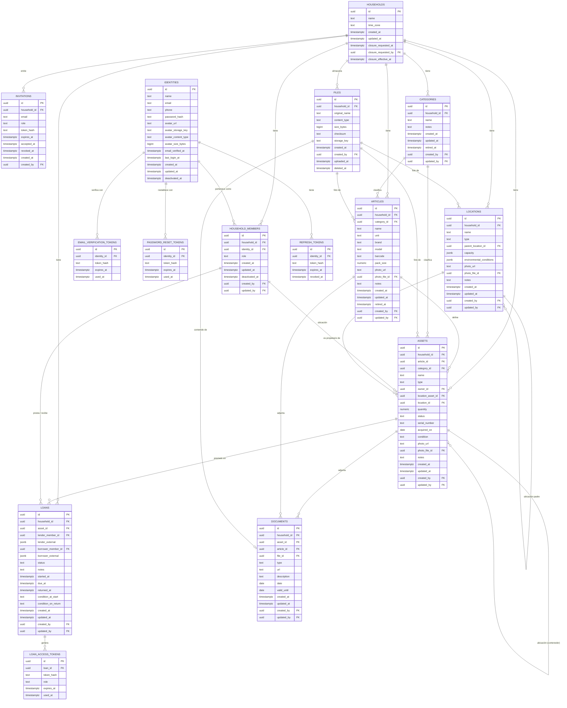

# 5.6 Modelo de datos (PostgreSQL, multi-tenant)

| Campo | Valor |
|---|---|
| Estado | Vigente |
| Responsable | Equipo DRP |
| Ámbito | Persistencia del core en PostgreSQL |
| Última revisión | 2026-08-20 |

> Trasladado desde la sección 5.6 del [`README principal`](../../../README.md) al iniciar la Fase 1. **Los números de sección se conservan**: hay más de cien referencias cruzadas del tipo «ver 4.1.1» repartidas por el repositorio, y renumerarlas las rompería todas.

Varios hogares comparten la misma base de datos, y el aislamiento entre ellos se defiende en **dos capas independientes**:

1. **Aplicación:** todo caso de uso y todo repositorio filtra siempre por el `householdId` del token de quien hace la petición. Nunca se confía en un `householdId` recibido como parámetro del cliente.
2. **Base de datos (Row-Level Security):** cada tabla con `household_id` tiene RLS activado y una política que restringe las filas visibles al hogar de la sesión. Si un repositorio olvidase el filtro, PostgreSQL sigue sin devolver filas ajenas.

```sql
ALTER TABLE assets ENABLE ROW LEVEL SECURITY;
ALTER TABLE assets FORCE ROW LEVEL SECURITY;

CREATE POLICY assets_household_isolation ON assets
    USING (household_id = nullif(current_setting('app.household_id', true), '')::uuid);
```

La aplicación fija `SET LOCAL app.household_id = '<uuid>'` al abrir cada transacción, a partir del claim del token. Dos condiciones que es fácil pasar por alto y que invalidan la protección entera: el usuario de base de datos de la aplicación **no** debe ser superusuario ni tener `BYPASSRLS`, y hace falta `FORCE ROW LEVEL SECURITY` para que la política también se aplique al propietario de la tabla.

> **Por qué el `nullif` y el segundo argumento de `current_setting`.** Comprobado contra PostgreSQL 16 en el entorno local (2026-08-10). Escrita como `current_setting('app.household_id')::uuid` a secas, la política **lanza un error** en dos situaciones normales: si el ajuste nunca se fijó en la sesión, y —menos evidente— después de un `RESET`, que no lo deja sin valor sino en **cadena vacía**, y `''::uuid` no es convertible. El `true` evita lo primero devolviendo `NULL`, y el `nullif` convierte la cadena vacía en `NULL`; en ambos casos la comparación da `NULL`, la política no deja pasar ninguna fila y la petición falla **cerrada** en vez de reventar con un error de conversión. Nunca al revés: sin contexto, cero filas.

Las políticas se versionan como migraciones Flyway, igual que el esquema (ver 4.1.7). El detalle de ambas decisiones está en [ADR-003](decisions/ADR-003-row-level-security.md) y [ADR-004](decisions/ADR-004-database-migrations.md).

> **Lo que necesariamente precede al contexto: la resolución de inquilino.** Añadido al implementar el Hito 1, porque la definición dejaba abierto un hueco que solo aparece al escribir el código. Las políticas parten de que `app.household_id` ya está fijado, y hay **tres momentos en los que todavía no se sabe cuál es el hogar**, que son justo los momentos en los que hay que averiguarlo: el **login** —la identidad se resuelve por correo, pero su pertenencia vive en `household_members`, que sí tiene política—, la **aceptación de una invitación** —quien llega con el token no pertenece aún a ningún hogar— y los **tres procesos diarios**, que no nacen de una petición y tienen que recorrer todos los hogares. En los tres casos la política deniega, que es su comportamiento correcto, y a la vez impide arrancar.
>
> La salida fácil sería dar `BYPASSRLS` al usuario de la aplicación, que es exactamente lo que la ADR-003 prohíbe: desactivaría la segunda capa para **toda** la aplicación y no solo para esos tres momentos. La salida adoptada son **tres funciones `SECURITY DEFINER`** (`list_household_ids`, `find_household_for_active_member` y `find_household_for_invitation_token`), que se ejecutan con los privilegios de su **propietario** en lugar de los de quien las llama. Tres propiedades las hacen aceptables donde `BYPASSRLS` no lo es: el permiso queda en tres funciones concretas y auditables en vez de en el rol —que sigue siendo `NOBYPASSRLS`—; **solo devuelven identificadores de hogar**, ni un dato, ni una fila, ni un correo, así que lo que se haga después vuelve a pasar por la política; y cada una responde a una pregunta cerrada, sin ninguna con la que recorrer datos ajenos. Llevan `SET search_path` fijado, que en una función `SECURITY DEFINER` no es opcional, y el `EXECUTE` revocado de `PUBLIC`.
>
> **Y quién es ese propietario importa más de lo que parece.** La suposición natural —que las posea el propietario del esquema, porque «el dueño de la tabla ve sus filas»— es **falsa aquí**, y conviene dejarlo escrito porque es un error fácil de repetir: `SECURITY DEFINER` cambia el `current_user` al dueño de la función, pero las políticas llevan `FORCE ROW LEVEL SECURITY`, que existe justamente para que se apliquen **también al propietario de la tabla**. Con ese montaje las tres funciones devolverían cero filas. Si en una primera versión funcionaron fue por una coincidencia del entorno y no por el diseño: el propietario del esquema es el usuario de arranque del contenedor de PostgreSQL y por tanto **superusuario**, y un superusuario se salta RLS pase lo que pase. Eso dejaba la única grieta deliberada del aislamiento corriendo con privilegios totales, y —peor— hacía que endurecer ese usuario, que es hacia donde empuja la ADR-003, rompiera el recorrido de los procesos diarios **en silencio**: cero hogares, sin error y sin traza. Por eso las funciones pertenecen a un rol propio, `drp_resolver`, **sin login, sin superusuario y sin `BYPASSRLS`**, al que tres políticas de `SELECT` —una por tabla— le abren la puerta de forma explícita. Así la excepción se lee en `pg_policies`, junto a las demás, en lugar de esconderse en una propiedad del rol que nadie mira.

> **Y desde entonces han llegado dos más, con el mismo criterio y no como excepción nueva.** `find_household_for_loan_token` (V6) resuelve el cuarto momento sin hogar conocido —el enlace acotado de un préstamo, y el único en el que quien pregunta **no tiene cuenta**—, y `list_households_for_identity` (V14, [ADR-012](decisions/ADR-012-data-erasure-household-closure-and-account-closure.md)) responde el quinto: **en qué hogares consta una persona**, que es lo que la baja de hogar necesita para saber si alguien se queda sin ninguna pertenencia, y que por definición no cabe dentro del hogar que se está borrando. Las dos cumplen las tres propiedades de arriba —solo identificadores, pregunta cerrada, y de `drp_resolver`— y esa es la condición para entrar en la familia: **una función que devolviera un dato dejaría de ser una grieta acotada para ser un agujero**. La de la baja cuenta además las pertenencias **dadas de baja**, al contrario que `find_household_for_active_member`, porque la pregunta no es dónde puede entrar esa persona sino dónde consta: una pertenencia dada de baja sigue siendo historial de aquel hogar.

> **Y una sexta, con el Transactional Outbox** ([ADR-013](decisions/ADR-013-transactional-outbox.md), V15). `list_households_with_pending_events` responde **qué hogares tienen eventos pendientes de repartir**, que es por donde arranca cada pasada del relay. Sin ella el relay solo tendría dos salidas y las dos son la misma: recorrer en vacío los mil hogares de la instalación **cada pocos segundos** para encontrar el que tiene una fila. Cumple las tres propiedades de la familia —solo identificadores de hogar, pregunta cerrada y de `drp_resolver`— y el corte por fecha viaja como **parámetro y no como constante**, porque el periodo de gracia del relay es configuración de despliegue y grabarlo en el esquema obligaría a una migración para moverlo.

> **Y una función más, que no es de seguridad sino de aritmética: `immutable_unaccent`.** Los tres índices únicos que comparan nombres sin acentos —`categories`, `articles` y `locations`— no se pueden crear tal y como se describen más abajo. `unaccent(text)` es `STABLE`, no `IMMUTABLE`, porque resuelve el diccionario de búsqueda a partir de la configuración de la sesión, y PostgreSQL rechaza cualquier función no `IMMUTABLE` en la expresión de un índice —«functions in index expression must be marked IMMUTABLE»—, con razón: el índice guarda el resultado ya calculado, así que una función que pueda devolver otra cosa mañana lo dejaría mintiendo en silencio. La solución es un envoltorio propio que fija el diccionario de forma explícita con la variante de dos argumentos, y que por tanto **sí** es inmutable de verdad y no declarado a la fuerza. Donde este documento escribe `lower(unaccent(name))`, la migración escribe `lower(immutable_unaccent(name))`.



**Restricciones y notas por tabla:**

| Tabla | Restricciones clave |
|---|---|
| `households` | `time_zone` con un identificador IANA válido; se valida en el caso de uso, no como `CHECK`. No lleva `created_by` ni `updated_by`: cuando la fila nace no existe ningún usuario al que apuntar. Es lo que usa el proceso de vencidos para saber cuándo ha pasado la fecha en ese hogar |
| `households` | Las tres columnas de la baja (`closure_*`) llegan con la [ADR-012](decisions/ADR-012-data-erasure-household-closure-and-account-closure.md) y van **las tres juntas o ninguna**, con `CHECK (num_nonnulls(...) IN (0, 3))`: media baja —pedida sin fecha de vencimiento, o vencida sin que nadie la pidiera— no es un estado que deba poder representarse. Un segundo `CHECK` exige que el vencimiento vaya por delante de la solicitud, que es lo que impide un borrado inmediato por la puerta de atrás. `closure_requested_by` apunta a la **pertenencia** con la clave ajena compuesta `(id, closure_requested_by)`, donde el `household_id` de la compuesta es la propia clave primaria. Índice **parcial** sobre `closure_effective_at`, porque la pregunta del recorrido diario —qué hogares han vencido— es una minoría diminuta y la fila desaparece al purgarla |
| `identities` | `email` único en **toda la instalación**, comparado en minúsculas: índice único sobre `lower(email)`. Ya no es parcial por baja — la identidad sobrevive a cualquier hogar, así que su correo no se libera. Sin el `lower()`, `Kike@x.com` y `kike@x.com` serían dos cuentas. **No lleva `household_id`**: queda fuera de RLS (ver más abajo). El avatar subido vive en tres columnas de aquí y no en `files`, con `CHECK (avatar_url IS NULL OR avatar_storage_key IS NULL)` —enlace o fichero, nunca los dos— y `CHECK (avatar_size_bytes IS NULL OR avatar_size_bytes <= 1048576)`, el megabyte de tope. Al ser una sola columna que se sustituye, no hay acumulación que contar |
| `household_members` | `UNIQUE (household_id, identity_id)` — nadie pertenece dos veces al mismo hogar; `role` con `CHECK IN ('HOUSEHOLD_ADMIN','HOUSEHOLD_MEMBER')`. Que en el MVP una identidad tenga como mucho **una** pertenencia activa se garantiza con un índice único parcial `(identity_id) WHERE deactivated_at IS NULL`: quitarlo es todo lo que hará falta el día que se admitan varias. Que no se pueda dar de baja al único `HOUSEHOLD_ADMIN` activo no es expresable como `CHECK`: se valida en el caso de uso |
| `invitations` | `token_hash` único; una sola invitación viva por correo y hogar, con índice único parcial `(household_id, lower(email)) WHERE accepted_at IS NULL AND revoked_at IS NULL`; `role` con `CHECK IN ('HOUSEHOLD_ADMIN','HOUSEHOLD_MEMBER')`. El estado no es una columna: se deduce de `expires_at`, `accepted_at` y `revoked_at` |
| `password_reset_tokens` | `token_hash` único; un solo token vivo por identidad, con índice único parcial `(identity_id) WHERE used_at IS NULL` — pedir uno nuevo marca el anterior como usado antes de insertar. Caduca a la hora. Tabla propia y no un `purpose` compartido con la verificación: con una sola tabla, un filtro mal escrito convierte un token de verificación en uno de cambio de contraseña, que es una clase de vulnerabilidad conocida |
| `email_verification_tokens` | `token_hash` único; un solo uso, marcado con `used_at`; expira. Mismo patrón que `loan_access_tokens`, y por el mismo motivo: el token viaja por correo y hay que poder comprobar reutilización |
| `categories` | `name` único entre las categorías vigentes del hogar, con índice único parcial sobre `(household_id, lower(unaccent(name))) WHERE retired_at IS NULL` — mismo tratamiento que `articles`, y por el mismo motivo: la retirada es lógica porque `assets` y `articles` la referencian |
| `documents` | Cuelga de exactamente uno de los dos, con `CHECK ((asset_id IS NULL) <> (article_id IS NULL))`; `type` con `CHECK IN ('INVOICE','WARRANTY','MANUAL','OTHER')`; el contenido, también en exactamente uno, con `CHECK ((url IS NULL) <> (file_id IS NULL))` — misma forma que el destino, y por el mismo motivo; `CHECK (valid_until IS NULL OR date IS NULL OR valid_until >= date)`, porque una garantía no puede caducar antes de emitirse. Borrar un documento sigue siendo un `DELETE` real: no lo referencia nada y no forma parte del historial de ninguna otra entidad. Si tenía fichero, la misma transacción marca su `deleted_at` en `files`; los bytes los desenlaza el proceso diario |
| `files` | `UNIQUE (household_id, id)`, que es lo que permite declarar las claves ajenas compuestas que impiden adjuntar el fichero de otro hogar — la misma técnica que ya protege la autoría, más abajo; `storage_key` único; `CHECK (size_bytes > 0 AND size_bytes <= 26214400)`, los 25 MB de tope por fichero; `content_type` con `CHECK IN ('image/jpeg','image/png','image/webp','application/pdf')`, que es la lista blanca de 5.8.3 expresada también aquí — ampliarla exige una migración, y esa fricción es deliberada. Índice `(household_id) WHERE deleted_at IS NULL` para que la suma de la cuota no recorra los borrados. `uploaded_at` a nulo marca la reserva de una subida en curso, que ya ocupa cuota y todavía no se puede adjuntar (ver 5.8.3). **La cuota de 1 GB no es un `CHECK`:** es una suma sobre las filas vivas del hogar, y se valida en el caso de uso con la fila del hogar bloqueada durante la reserva. El borrado es lógico aunque no lo referencie nadie, porque los bytes se desenlazan aparte: borrar la fila en el acto dejaría el fichero en disco sin nadie que supiera que sobra |
| `articles` | `name` único entre los artículos **vigentes** del hogar, sin distinguir mayúsculas ni acentos: índice único parcial sobre `(household_id, lower(unaccent(name))) WHERE retired_at IS NULL` — requiere la extensión `unaccent`, que se instala en su propia migración; `barcode` con el mismo tratamiento, `(household_id, barcode) WHERE barcode IS NOT NULL AND retired_at IS NULL`; `unit` con `CHECK IN ('UNIT','GRAM','KILOGRAM','MILLILITER','LITER','METER','PACK')`; `CHECK (pack_size IS NULL OR pack_size > 0)`. La retirada es **lógica** (`retired_at`), no un `DELETE`: las existencias dadas de baja conservan su `article_id`, así que borrar la fila rompería la clave ajena y con ella el historial |
| `assets` | `CHECK (location_asset_id IS NULL OR location_id IS NULL)` — nunca ambas ubicaciones a la vez; `type` con `CHECK IN ('DURABLE','CONSUMABLE')`; `status` con `CHECK IN ('AVAILABLE','LENT','DECOMMISSIONED')`; coherencia de cantidad y artículo con `CHECK ((type = 'CONSUMABLE' AND article_id IS NOT NULL AND quantity IS NOT NULL AND quantity >= 0) OR (type = 'DURABLE' AND quantity IS NULL))`; todo asset tiene nombre y categoría efectivos, con `CHECK (article_id IS NOT NULL OR (name IS NOT NULL AND category_id IS NOT NULL))`; un consumible nunca está prestado, con `CHECK (type = 'DURABLE' OR status <> 'LENT')`; `serial_number`, `acquired_on` y `condition` solo tienen sentido en un duradero, con `CHECK (type = 'DURABLE' OR (serial_number IS NULL AND acquired_on IS NULL AND condition IS NULL))` — la misma restricción ampliada y no una segunda, porque la regla es una sola: lo que describe una unidad física no cabe en una existencia. `condition` con `CHECK IN ('NEW','GOOD','WORN','DAMAGED','UNUSABLE')`, la escala de conservación de 4.1.1. `owner_id` es **anulable**: lo deja vacío la baja de su propietario (ver 4.1.4). Que `location_asset_id` apunte a un `DURABLE` no es expresable como `CHECK` simple: se valida en el caso de uso |
| `assets` (existencias) | Una sola existencia **viva** por artículo y ubicación: `CREATE UNIQUE INDEX ON assets (household_id, article_id, location_asset_id, location_id) NULLS NOT DISTINCT WHERE type = 'CONSUMABLE' AND status <> 'DECOMMISSIONED'`. El `NULLS NOT DISTINCT` (PostgreSQL 15+) es lo que hace que la regla siga aplicando cuando la existencia aún no tiene ubicación asignada; sin él, cada entrada sin ubicar crearía una fila nueva. El `status <> 'DECOMMISSIONED'` es igual de necesario: sin él, una existencia dada de baja o fusionada seguiría ocupando su hueco para siempre y ningún `RegisterConsumableIntake` posterior podría volver a usar esa ubicación |
| `locations` | `parent_location_id` referencia a la propia tabla; la validación anti-ciclo se resuelve a nivel de aplicación (caso de uso), no es expresable como `CHECK` simple. `type` con `CHECK IN ('HOUSE','FLOOR','ROOM','FURNITURE','SHELF','OTHER')`; `name` único entre hermanas, con índice único sobre `(household_id, parent_location_id, lower(unaccent(name))) NULLS NOT DISTINCT` — el `NULLS NOT DISTINCT` cubre las ubicaciones raíz, que no tienen padre |
| `loans` | exactamente uno de `lender_member_id`/`lender_external` informado (ídem para receptor); `status` con `CHECK IN ('ACTIVE','RETURNED','OVERDUE')`; índice único parcial `(asset_id) WHERE status IN ('ACTIVE','OVERDUE')` para no permitir más de un préstamo abierto por asset — **un préstamo vencido sigue ocupando el asset**, así que el índice no puede mirar solo a `ACTIVE`. El contacto del externo es `jsonb` con `name` y al menos uno de `email`/`phone`, que es lo que necesita el enlace del token acotado. Que el asset prestado sea `DURABLE` se valida en el caso de uso, no como `CHECK`. Las dos condiciones del préstamo llevan el mismo `CHECK IN (...)` que `assets.condition` —es la misma escala— y una tercera restricción propia: `CHECK (condition_on_return IS NULL OR returned_at IS NOT NULL)`, porque anotar cómo volvió algo que sigue fuera de casa no significa nada |
| `loan_access_tokens` | `token_hash` único; `role` con `CHECK IN ('LENDER','BORROWER')` |
| `refresh_tokens` | `token_hash` único; cuelga de `identities`, no de la pertenencia; se marca `revoked_at` en lugar de borrarse, para poder auditar |

**Foto: enlace o fichero.** Las tres tablas con foto —`assets`, `articles` y `locations`— llevan `CHECK (photo_url IS NULL OR photo_file_id IS NULL)`. Es un `OR` y no el `<>` de `documents` a propósito: un documento sin contenido no es nada, pero un asset sin foto es lo habitual.

**Un fichero no cruza de hogar.** `photo_file_id` y `documents.file_id` no son claves ajenas simples, sino compuestas contra el `UNIQUE (household_id, id)` de `files`, exactamente igual que la autoría:

```sql
ALTER TABLE assets ADD CONSTRAINT assets_photo_same_household
    FOREIGN KEY (household_id, photo_file_id) REFERENCES files (household_id, id);
```

Así, aunque alguien acertara el identificador de un fichero ajeno y el caso de uso se despistara, la base de datos rechaza la referencia. Es la misma defensa en dos capas de siempre.

> **Y no es el único sitio: son todos.** La versión anterior de este párrafo decía que el fichero era «el único sitio donde un identificador de otro hogar podría llegar del cliente», y no era cierto — `categoryId`, `articleId`, `locationId` y `assetId` llegan del cliente exactamente igual. Lo que lo convierte en un problema y no en una redundancia es un detalle de PostgreSQL que se descubre al probarlo: **la comprobación de una clave ajena no pasa por las políticas de RLS**. Una fila de otro hogar es invisible a un `SELECT` y aun así se puede referenciar. Por eso **todas** las referencias que pueden llegar del cliente son compuestas contra `(household_id, id)` —autoría, propietario, participantes de un préstamo, ficheros, categoría, artículo, ubicación y asset contenedor—, y cada tabla referenciada lleva su `UNIQUE (household_id, id)` para poder serlo.

Todas las tablas del core incluyen `household_id` para el filtrado multi-tenant, con cinco excepciones: `loan_access_tokens` cuelga de `loans`, y `refresh_tokens`, `email_verification_tokens`, `password_reset_tokens` e `identities` cuelgan de la identidad, que por definición no pertenece a ningún hogar.

> **Ojo con `identities`.** Las otras tres excepciones son tablas de tokens, sin más contenido que un hash. `identities` no: guarda nombre, correo y teléfono de personas reales, y al no llevar `household_id` **no puede tener política de RLS**. Es la única tabla con datos personales que depende de una sola capa de aislamiento, la de la aplicación. Su repositorio debe resolver siempre por identidad autenticada —nunca listar, nunca buscar por correo salvo en el login— porque ahí no hay red debajo. Lo mismo vale ahora para el avatar que cuelga de ella: es la única imagen del sistema sin política de RLS detrás, y su ruta se deriva del `identityId`, resuelto del token y jamás recibido como parámetro.

> **Y ojo con lo que RLS no alcanza.** Las políticas protegen filas, no ficheros: los bytes de `files` viven en el disco, donde PostgreSQL no manda. La segunda capa se sostiene ahí porque **la ruta se deriva de una fila que ya pasó por la política** (ver 5.8.1), nunca de un dato del cliente. Cualquier atajo que construya una ruta a partir de algo recibido —un nombre de fichero, una clave de almacenamiento— desactiva esa herencia sin que nada falle de forma visible.

**Autoría, y su integridad entre hogares.** Todas ellas llevan además `created_by` y `updated_by`, ambas anulables y referenciando a `household_members`: nulo significa que el cambio no lo hizo una persona sino el sistema (ver 4.1.1). `households` es la excepción, porque en el instante de crearse no existe todavía ningún usuario al que apuntar, y `files` lleva solo `created_by`, porque un fichero no se modifica.

Que esas referencias no puedan cruzarse de hogar sí es expresable en base de datos, y merece la pena porque es exactamente el tipo de fuga que ADR-003 quiere evitar en dos capas. Con `UNIQUE (household_id, id)` en `household_members`, cada tabla puede declarar la clave ajena compuesta:

```sql
ALTER TABLE assets ADD CONSTRAINT assets_created_by_same_household
    FOREIGN KEY (household_id, created_by) REFERENCES household_members (household_id, id);
```

Así la propia base de datos rechaza atribuir un cambio a un usuario de otro hogar, aunque el caso de uso se despistara.

**Y lo que la base de datos no puede garantizar de los ficheros.** Que un fichero se adjunte **una sola vez** (ver 4.1.1) solo es expresable a medias. Un índice único parcial en cada columna que apunta a `files` —`documents (file_id)`, y `photo_file_id` en `assets`, `articles` y `locations`— impide que dos documentos compartan fichero, o dos assets la misma foto:

```sql
CREATE UNIQUE INDEX documents_file_unique ON documents (file_id) WHERE file_id IS NOT NULL;
```

Lo que ninguno de los cuatro ve es el cruce: un documento y una foto apuntando al mismo fichero. Eso no cabe en una restricción y **se valida en el caso de uso**, igual que el anti-ciclo de la jerarquía o que la ubicación de un asset tenga que ser `DURABLE`.
