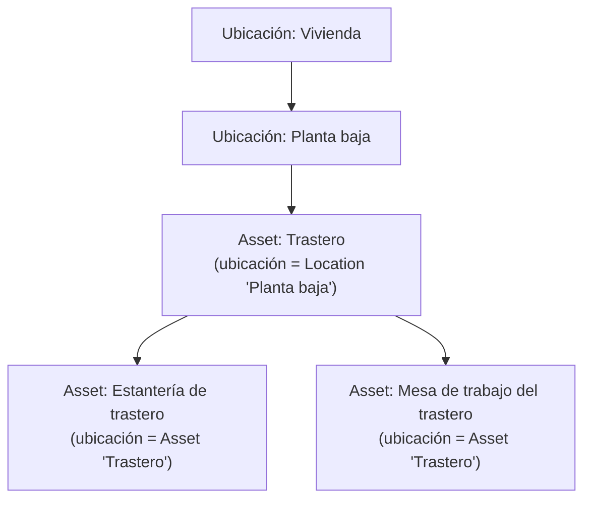
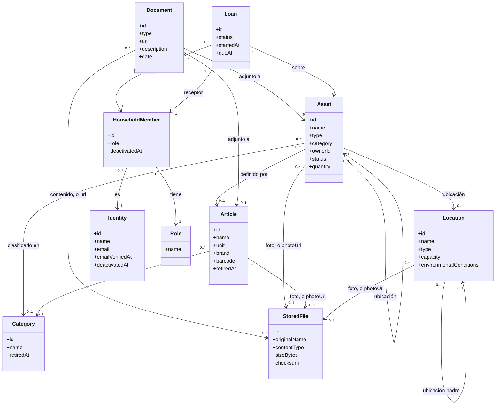

# 4.1.1 Recursos y assets

| Campo | Valor |
|---|---|
| Estado | Vigente |
| Responsable | Equipo DRP |
| Ámbito | Assets, articulos, ubicaciones y documentacion del core |
| Última revisión | 2026-08-20 |

> Trasladado desde las secciones 4.1.1 a 4.1.3 del [`README principal`](../../../README.md) al iniciar la Fase 1. **Los números de sección se conservan**: hay más de cien referencias cruzadas del tipo «ver 4.1.1» repartidas por el repositorio, y renumerarlas las rompería todas.

Un **asset** es **cualquier material presente en el hogar**, no solo el que resulta relevante por su valor económico, su depreciación, su seguro o su mantenimiento. Un taladro es un asset, pero también lo son un bote de detergente, un paquete de arroz o un cuadro del salón. Restringir el concepto a los bienes "importantes" dejaría fuera la mayor parte de lo que un hogar realmente gestiona.

Ahora bien, no todo el material se comporta igual, y esa diferencia condiciona el modelo:

| Naturaleza | Qué es | Cómo se cuenta | Ejemplos |
|---|---|---|---|
| **`DURABLE`** | Tiene identidad propia y se usa de forma repetida sin agotarse | Una fila por unidad física | Caldera, taladro, sofá, coche, cuadro |
| **`CONSUMABLE`** | Se agota o se repone con el uso; las unidades son intercambiables entre sí | Una fila por existencia —un artículo en una ubicación—, con `quantity` | Harina, detergente, pilas, bombillas |

Dar de alta trescientos gramos de harina como trescientas filas no tendría sentido; tampoco lo tendría gestionar dos taladros idénticos como "cantidad: 2", porque cada uno tiene su propia ubicación, su propio préstamo y su propio mantenimiento. De ahí la distinción.

> **Alcance deliberado:** el core mantiene un contador simple (`quantity`) y nada más. El seguimiento de existencias real — consumos, mínimos, reposición, caducidades, lotes — pertenece al módulo **Warehouse** (ver 4.2), que se engancha vía event bus. El core no debe convertirse en un gestor de inventario (ver la decisión en 4.1.7).

**Artículo y existencia: el alta de un consumible no se repite.**

Traer a casa un paquete de azúcar de 1 kg no da de alta nada nuevo: el hogar ya sabe qué es el azúcar y en qué unidad lo lleva. Por eso la **definición** de un consumible se separa de sus **existencias**:

| Concepto | Qué es | Qué guarda | Equivalente ERP |
|---|---|---|---|
| **`Article`** | La ficha reutilizable de *qué* es algo | `name`, `category`, `unit`, y opcionalmente marca y código de barras | Material maestro |
| **Asset `CONSUMABLE`** | Una existencia concreta de ese artículo en un sitio | `quantity`, ubicación, propietario, estado | Stock |

Un artículo **no es un asset**: no es material, no ocupa sitio, no tiene cantidad y no se presta. Es solo la ficha que evita reescribir «Azúcar / Alimentación / `GRAM`» en cada compra.

> **Nomenclatura.** En castellano el concepto es «artículo»; en código es `article` — tabla `articles`, campo `articleId`, recurso `/api/v1/articles`. Las tablas de atributos de aquí en adelante dan las dos formas: **Nombre de definición (`nombreDePrograma`)**, con la regla completa en 4.1.7.

De ahí que dar entrada a un consumible sea siempre la misma operación, `RegisterConsumableIntake` (ver 5.7): se indica el artículo —eligiéndolo del catálogo del hogar, o creándolo en el mismo gesto si aún no existe—, la ubicación y la cantidad que entra. Si ya hay una existencia de ese artículo en esa ubicación, **la operación suma sobre ella**; si no la hay, la crea. Nunca aparece una segunda fila «Azúcar» en la despensa.

Reglas que sostienen ese comportamiento:

- **Una existencia por artículo y ubicación.** El azúcar de la despensa y el del trastero son dos existencias del mismo artículo, cada una con su cantidad y su propietario.
- **La `unit` la fija el artículo**, no la existencia. Si el azúcar se lleva en gramos, todas sus existencias van en gramos; comprar «un paquete de 1 kg» es una conversión en la entrada, no otra unidad guardada. Convertir entre unidad de compra y unidad de consumo es del módulo Warehouse, no del core.
- **En un `DURABLE` el artículo es opcional.** Dos taladros idénticos pueden compartir artículo (misma marca, mismo modelo, mismo manual) sin dejar de ser dos assets con su ubicación, su préstamo y su mantenimiento propios. Un sofá único no necesita artículo: se da de alta con su `name` y su `category` propios.
- El catálogo es **de cada hogar**, como el resto de tablas del core (ver 5.6). Un catálogo compartido entre hogares, o sembrado desde una base de códigos de barras, sería una evolución posterior.

> **Esto tampoco es gestión de inventario.** El catálogo es dato maestro: qué cosas existen y cómo se llaman. Cuánto queda, cuándo caduca y cuándo hay que reponer sigue siendo de Warehouse.

**Jerarquía y composición.** Un asset puede definirse como un conjunto de otros assets (composición). Por ejemplo, el asset **"Trastero"** puede estar compuesto por los assets **"Estantería de trastero"** y **"Mesa de trabajo del trastero"**.

Esta jerarquía se construye a través del campo **ubicación** de cada asset, que es polimórfico: un asset puede tener como ubicación **otro asset** (por ejemplo, la mesa de trabajo "está en" el asset Trastero) **o bien** una **ubicación** propiamente dicha (ver 4.1.2). Un asset puede no tener ubicación asignada todavía (por ejemplo, recién dado de alta y pendiente de clasificar).

**Atributos mínimos de un Asset:**

| Atributo | Aplica a | Descripción |
|---|---|---|
| Identificador (`id`) | Ambos | — |
| Tipo (`type`) | Ambos | `DURABLE` o `CONSUMABLE`. Se fija en el alta y **no es modificable** después: cambiar la naturaleza de un asset equivale a darlo de baja y crear otro |
| Artículo (`articleId`) | Obligatorio en `CONSUMABLE`, opcional en `DURABLE` | Referencia al artículo del catálogo del hogar que define qué es este asset |
| Nombre (`name`) | Ambos | Propio del asset, o heredado de su artículo cuando lo tiene. Un asset sin artículo debe informarlo |
| Categoría (`categoryId`) | Ambos | Clasificación funcional, independiente del tipo. Referencia al catálogo de categorías del hogar (ver más abajo). Se hereda del artículo igual que el nombre |
| Propietario (`ownerId`) | Ambos | Referencia a un usuario del hogar. Opcional: queda vacío cuando su propietario causa baja (ver 4.1.4) |
| Ubicación (`location`) | Ambos | Referencia a otro Asset **o** a una Location — nunca ambas a la vez |
| Estado (`status`) | Ambos | `AVAILABLE`, `LENT`, `DECOMMISSIONED` |
| Cantidad (`quantity`) | Solo `CONSUMABLE` | Existencia actual, expresada en la unidad de su artículo |
| Número de serie (`serialNumber`) | Solo `DURABLE`, opcional | Lo que distingue dos unidades por lo demás idénticas, y lo que pide un fabricante al reclamar una garantía. **Se corrige después del alta**, que es cuando se sabe: la etiqueta está pegada detrás del aparato |
| Fecha de adquisición (`acquiredOn`) | Solo `DURABLE`, opcional | Cuándo entró en el hogar. Es procedencia, no valor: el importe pertenece al módulo de gastos. Se corrige después del alta, igual que el número de serie |
| Estado de conservación (`condition`) | Solo `DURABLE`, opcional | En qué estado está la cosa: `NEW`, `GOOD`, `WORN`, `DAMAGED`, `UNUSABLE`. **Nulo significa que nadie lo ha anotado**, que es el caso normal, y no que esté bien. Se corrige cuando cambia, que es lo que lo distingue de los dos anteriores: el número de serie de un taladro es el mismo el día que se compra y el día que se tira |
| Foto (`photoUrl` / `photoFileId`) | Ambos, opcional | Una imagen, en forma de **enlace externo o de fichero guardado en el servidor** —nunca las dos a la vez— igual que en la documentación (ver «Ficheros almacenados»). Reconocer una cosa de un vistazo es la mitad de un inventario doméstico |
| Notas (`notes`) | Ambos, opcional | Texto libre |
| Fecha de alta (`createdAt`) | Ambos | — |
| Última modificación (`updatedAt`) | Ambos | — |
| Creado por (`createdBy`) | Ambos | Ver «Autoría de los cambios» |
| Modificado por (`updatedBy`) | Ambos | Ídem |
| Documentación asociada | Opcional, típicamente `DURABLE` | Facturas, garantías, manuales. No es un campo del asset sino una entidad propia (ver más abajo): un paquete de arroz no tiene manual |

**El estado de conservación es del core, y es un enumerado cerrado.** Las dos
mitades se decidieron juntas (ver 4.1.7). Es **del core** porque describe la cosa
y no su mantenimiento: un hogar con todos los módulos apagados sigue queriendo
saber que el taladro está para tirarlo, igual que guarda su número de serie —y
una regla del core no puede depender de un módulo que se puede apagar. Y es un
**enumerado** y no texto libre porque texto libre ya existe, es `notes`: un
atributo que no se puede filtrar ni comparar no añadiría nada sobre una nota, y
lo que este permite es preguntar «qué hay para tirar».

| Valor | Qué dice |
|---|---|
| `NEW` | Nuevo, sin usar |
| `GOOD` | Buen estado |
| `WORN` | Desgastado: funciona y se nota el uso |
| `DAMAGED` | Deteriorado: tiene algo roto o le falta una pieza |
| `UNUSABLE` | Inservible: no sirve para lo que era |

Solo aplica a un `DURABLE`, como el número de serie y la fecha de adquisición, y
por el mismo motivo: describe **una unidad física**. Trescientos gramos de harina
no están «desgastados», y lo que le pasa a un lote —que caduque, que se
estropee— es del módulo Warehouse y se sigue en su tabla.

**La misma escala se usa en los dos momentos de un préstamo** (ver 4.1.5), y esa
es la razón de que sea una sola: el motivo entero de la condición en préstamo es
poder decir «salió bien y volvió rayado», y con dos escalas distintas esa frase
no se puede construir.

**Atributos mínimos de un Articulo:**

| Atributo | Descripción |
|---|---|
| Identificador (`id`) | — |
| Nombre (`name`) | Único dentro del hogar (comparado normalizado, sin distinguir mayúsculas ni acentos) |
| Categoría (`categoryId`) | La misma clasificación funcional que en un asset, contra el mismo catálogo |
| Unidad (`unit`) | Unidad de medida en la que se llevan todas sus existencias (`UNIT`, `GRAM`, `KILOGRAM`, `MILLILITER`, `LITER`, `METER`, `PACK`) |
| Marca (`brand`) | Opcional |
| Modelo (`model`) | Opcional. Marca y modelo juntos son la identidad real de un duradero, y lo que hace que compartir artículo entre dos unidades signifique algo |
| Código de barras (`barcode`) | Opcional. Si se informa, es único en el hogar y sirve para localizar el artículo al dar entrada |
| Contenido por envase (`packSize`) | Opcional, en la unidad del artículo. Es lo que permite dar entrada a «dos paquetes» de algo que se lleva en gramos sin que nadie multiplique a mano — la fricción que quedó señalada al subir la unidad al artículo |
| Foto (`photoUrl` / `photoFileId`) | Opcional, enlace o fichero como en el asset. Sirve a todas sus existencias a la vez |
| Notas (`notes`) | Texto libre, opcional |
| Fecha de alta (`createdAt`) | — |
| Última modificación (`updatedAt`) | — |
| Fecha de retirada (`retiredAt`) | Informada si el artículo está retirado del catálogo |
| Creado por (`createdBy`) | Ver «Autoría de los cambios» |
| Modificado por (`updatedBy`) | Ídem |

**Categorías: un catálogo por hogar.**

La clasificación funcional no es una lista fija del sistema sino una **entidad propia**, `Category`, con una fila por categoría y por hogar. Cada hogar arranca con un juego sembrado al crearse —«Mobiliario», «Alimentación», «Limpieza», «Herramientas», «Decoración»— y a partir de ahí lo edita: quien guarda material de escalada o repuestos de bici no tiene por qué encajarlos en «herramienta».

| Atributo | Descripción |
|---|---|
| Identificador (`id`) | — |
| Nombre (`name`) | Único entre las categorías vigentes del hogar, comparado normalizado |
| Notas (`notes`) | Texto libre, opcional |
| Fecha de alta (`createdAt`) | — |
| Última modificación (`updatedAt`) | — |
| Fecha de retirada (`retiredAt`) | Informada si la categoría está retirada |
| Creado por (`createdBy`) | Ver «Autoría de los cambios» |
| Modificado por (`updatedBy`) | Ídem |

A diferencia de `type`, `status` o `unit`, los nombres de categoría **no son valores de un enumerado**: son datos que el hogar edita y que se le muestran tal cual, así que van en su idioma y no siguen la regla de nomenclatura de 4.1.7.

Se retira igual que un artículo, y por el mismo motivo: los assets la referencian por clave ajena, así que borrar la fila rompería el historial. Una categoría retirada deja de ofrecerse al clasificar, pero los assets que ya la tenían la conservan.

**Documentación asociada.**

Facturas, garantías y manuales se modelan como una entidad `Document` que apunta **a un enlace externo o a un fichero guardado en el servidor**, nunca a los dos. Las dos vías conviven porque las dos son reales: la factura ya está en el correo y el manual en la web del fabricante, así que obligar a descargarlos y volverlos a subir sería trabajo inventado; pero la garantía que llegó en un sobre y el manual que solo existe en papel no tienen URL ninguna, y hasta ahora no cabían en el modelo.

| Atributo | Descripción |
|---|---|
| Identificador (`id`) | — |
| Tipo (`type`) | `INVOICE`, `WARRANTY`, `MANUAL`, `OTHER` |
| Enlace (`url`) | URL al documento, cuando vive fuera. **Exactamente uno** de `url` o `fileId` |
| Fichero (`fileId`) | Referencia al `StoredFile` subido, cuando vive aquí. Ver «Ficheros almacenados» |
| Descripción (`description`) | Texto libre, opcional |
| Fecha del documento (`date`) | Cuándo se emitió: la fecha de la factura, la de la garantía. Opcional |
| Válido hasta (`validUntil`) | Cuándo deja de valer, que en una garantía es el dato que importa. Opcional, y distinto del anterior: tenerlos en un solo campo obligaba a elegir cuál de los dos se pierde |
| Alta (`createdAt`) | — |
| Última modificación (`updatedAt`) | — |
| Creado por (`createdBy`) | Ver «Autoría de los cambios» |
| Modificado por (`updatedBy`) | Ídem |

Un documento cuelga **de un asset o de un artículo, nunca de ambos**, y la distinción es la que ya estaba implícita en el modelo: la factura y la garantía son de la unidad física que compraste, y el manual es del modelo. Colgarlo del artículo es lo que hace que dos taladros idénticos compartan manual sin duplicarlo, que es justo lo que 4.1.7 prometía al abrir el artículo a los duraderos.

**Ficheros almacenados.**

Un `StoredFile` es un binario guardado en el servidor: la foto que alguien acaba de hacer con el móvil, el manual escaneado, la garantía que llegó en papel. **No es un asset** —no ocupa sitio en el hogar, no se clasifica ni se presta— igual que tampoco lo es un artículo: es un adjunto, con dueño, tamaño y fecha.

| Atributo | Descripción |
|---|---|
| Identificador (`id`) | — |
| Nombre original (`originalName`) | El nombre con el que llegó, saneado. Es **solo un dato**: nunca forma parte de la ruta en disco (ver 5.8) |
| Tipo de contenido (`contentType`) | El **detectado** al inspeccionar el contenido, no el que declaró quien subió el fichero |
| Tamaño (`sizeBytes`) | El del fichero ya almacenado, después de recodificarlo si era una imagen. Es lo que suma la cuota |
| Suma de verificación (`checksum`) | SHA-256 del contenido. Detecta corrupción silenciosa y permite cuadrar una restauración contra la base de datos |
| Clave de almacenamiento (`storageKey`) | Ruta relativa dentro del volumen de ficheros. **La genera la aplicación** a partir del identificador y no se acepta jamás de la petición. Se guarda en vez de recalcularse al vuelo para que cambiar la distribución en disco —o migrar a otro almacén— no obligue a reescribir la historia |
| Fecha de alta (`createdAt`) | — |
| Creado por (`createdBy`) | Ver «Autoría de los cambios» |
| Subida completada (`uploadedAt`) | Nulo mientras la subida está en curso: la fila existe y **ya ocupa cuota**, pero el fichero todavía no se puede adjuntar (ver 5.8.3) |
| Borrado (`deletedAt`) | Marca de retirada. Los bytes los desenlaza un proceso diario, no la transacción que borra la fila |

No lleva `updatedAt` ni `updatedBy`: un fichero no se modifica. Cambiar la foto de un asset es subir otra y apuntar a ella, no editar la que había — así el `checksum` sigue significando algo.

**Toda imagen tiene miniatura**, generada al subirla y servida en los listados para que un móvil no descargue el original a tamaño completo. No es un atributo: existe siempre que el fichero sea una imagen, porque generarla forma parte de la misma recodificación que le quita el EXIF — si no se puede generar, es que tampoco se ha podido recodificar, y entonces el fichero se rechaza. Un PDF no tiene.

**Un gigabyte por hogar.** Varios hogares comparten un mismo servidor, así que el almacenamiento es un recurso común, y sin límite se lo queda entero el primero que suba los vídeos de la reforma. Cada hogar dispone de **1 GB**, que es la suma de `sizeBytes` de sus ficheros vivos. De ahí salen cuatro consecuencias que conviene no descubrir tarde:

- **La cuota se comprueba dos veces**: contra el tamaño declarado antes de recibir nada, y contra el real mientras se recibe, abortando en cuanto se pasa. Lo declarado lo escribe el cliente, así que no es una fuente de verdad.
- **Cuenta lo que hay, no lo que se usa.** Un fichero subido y nunca adjuntado ocupa cuota mientras exista; si nadie lo adjunta, el proceso diario lo retira a las 24 horas.
- **Dar de baja un asset no libera nada.** Su foto y sus facturas siguen ahí, porque el historial es justo lo que protege la baja lógica. Liberar espacio es un gesto explícito —borrar el documento, quitar la foto—, nunca un efecto colateral.
- **Las miniaturas no cuentan.** Las genera el sistema para que un listado en un móvil no descargue el original, así que no son decisión del hogar. El disco realmente ocupado por un hogar es algo mayor que su cuota, y eso es cosa del dimensionado (ver 5.8), no del usuario.

**El avatar no es un fichero del hogar.** Una `Identity` no pertenece a ninguno (ver 4.1.4), así que su avatar no se puede cargar a ninguna cuota ni proteger con Row-Level Security. Por eso **no** es un `StoredFile`: vive en columnas de la propia `identities`, es uno solo y **siempre se sustituye**, y su límite no es una cuota acumulable sino un tamaño máximo por fichero —1 MB—. Sin acumulación posible no hay nada que contar.

Cómo se guardan, se validan y se sirven estos ficheros es materia de arquitectura, y está en **5.8**.

**Autoría de los cambios (transversal).**

Un hogar es un sitio compartido, y la pregunta que más se hace no es qué cambió sino **quién lo cambió**: quién movió el taladro, quién se llevó la última bombilla. Por eso toda entidad del core lleva dos referencias más, junto a sus fechas:

| Atributo | Descripción |
|---|---|
| Creado por (`createdBy`) | Usuario que dio de alta la fila |
| Modificado por (`updatedBy`) | Usuario del último cambio |

Tres cosas que se derivan y conviene no olvidar:

- **Ambos pueden estar vacíos, y vacío significa «el sistema».** El proceso diario que marca los préstamos vencidos (4.1.5) no actúa en nombre de nadie, así que deja `updatedBy` a nulo. Inventar un usuario técnico para rellenarlo daría una autoría falsa.
- **Nunca se aceptan del cliente.** Salen del token de quien hace la petición, igual que el `householdId`. Un campo de autoría que el cliente pueda rellenar no vale para nada, porque se puede falsear.
- **El usuario referenciado puede estar de baja.** Como los usuarios no se borran (ver 4.1.4), la referencia sigue resolviendo: el historial no pierde el nombre de quien hizo las cosas cuando esa persona deja el hogar.

El hogar es la excepción: no lleva autoría propia porque, en el instante en que su fila nace, todavía no existe ningún usuario que pueda figurar. Un fichero lleva solo la mitad —`createdBy`—, porque no se modifica nunca (ver «Ficheros almacenados»).

**Reglas mínimas de negocio:**
- Un asset no puede ser su propio ancestro en la jerarquía de composición (evita ciclos).
- Un asset no puede tener como ubicación simultáneamente otro asset y una Location: es una u otra.
- Un asset no puede darse de baja si tiene assets hijos o un préstamo **abierto** —`ACTIVE` o `OVERDUE`—, sin resolver antes esa dependencia. La baja es siempre lógica (`status = DECOMMISSIONED`): nada se borra, para no perder el historial.
- Un `CONSUMABLE` nunca está `LENT`, porque no se presta: su estado es `AVAILABLE` o `DECOMMISSIONED`.
- Dar de baja una existencia que aún tenía cantidad la deja a 0 — se da por perdida — en lugar de dejar un resto colgando en una fila muerta que ninguna suma de existencias volvería a mirar.
- Un `CONSUMABLE` debe tener `articleId` y `quantity` (≥ 0); un `DURABLE` no puede tener `quantity` — la suya implícita es siempre 1.
- El nombre y la categoría efectivos de un asset son los de su artículo cuando lo tiene; un asset sin artículo debe informarlos él. No se guardan por duplicado.
- Una categoría no se borra: se retira cuando el hogar deja de usarla, y los assets que ya la tenían la conservan.
- Un documento cuelga de un asset **o** de un artículo, nunca de los dos ni de ninguno.
- Un documento apunta a un enlace **o** a un fichero, nunca a los dos ni a ninguno. Una foto también es enlace **o** fichero, pero ahí sí caben los dos vacíos: no tener foto es lo normal.
- Un fichero pertenece a un hogar y **no puede referenciarse desde otro**, ni siquiera adjuntándolo a mano por identificador.
- Un fichero se adjunta **una sola vez**: ni dos documentos ni un documento y una foto comparten fichero. Compartir haría ambiguo qué pasa al borrar y qué cuenta en la cuota; para que dos unidades idénticas compartan manual ya está el artículo.
- La suma de los ficheros vivos de un hogar no puede superar **1 GB**, y ningún fichero suelto puede pasar de **25 MB**.
- Borrar un fichero no borra sus bytes en el acto: marca la fila, y un proceso diario los desenlaza. La **cuota sí se libera en el acto**, aunque el disco tarde hasta 24 horas en enterarse; ese desfase lo absorbe el dimensionado del volumen (ver 5.8.2), no el usuario esperando. Ese margen no es una función de deshacer —no hay ningún gesto que restaure lo borrado— sino la ventana en la que un operador todavía puede recuperar un borrado por error sin ir a la copia de seguridad.
- **Cerrar la cuenta borra el avatar.** Es la única imagen que retrata a una persona, y la baja de la identidad es el momento en que deja de haber motivo para conservarla. Los ficheros del hogar no se van con ella: son del hogar, no suyos.
- El propietario de un asset es opcional: queda vacío cuando quien lo tenía a su nombre causa baja en el hogar (ver 4.1.4).
- No puede haber dos existencias vivas del mismo artículo en la misma ubicación: dar entrada sobre una existente suma cantidad. Cuando dos existencias del mismo artículo ya están creadas por separado y se quieren juntar, eso es `MergeStockItems` (ver 5.7), no un movimiento.
- Una existencia dada de baja deja de ocupar su hueco: se puede volver a dar entrada de ese artículo en esa ubicación, y la fila antigua se conserva por historial.
- Un artículo no se borra nunca: se **retira** del catálogo cuando ya no le queda ninguna existencia viva, y deja de ofrecerse en el alta. Las existencias dadas de baja siguen apuntando a él, así que la fila tiene que permanecer.
- Solo un `DURABLE` puede actuar como ubicación de otros assets: una estantería contiene cosas, un paquete de harina no.
- Solo un `DURABLE` puede prestarse. Un consumible no se presta, se consume o se entrega; la semántica de devolución no le aplica (ver 4.1.5).
- Un `CONSUMABLE` con `quantity = 0` **sigue existiendo** como asset (agotado, pendiente de reposición). Llegar a cero no da de baja nada: esa es una decisión del hogar, no del sistema. Su artículo sigue en el catálogo en cualquier caso.

## 4.1.2 Ubicaciones

Una **ubicación (Location)** representa un espacio físico de almacenaje y, al igual que los assets, admite jerarquía (p. ej. Vivienda → Planta baja → Garaje → Estantería 2). A diferencia del asset, una ubicación no es un recurso del hogar en sí misma, sino el contenedor físico donde se guardan los recursos.

**Atributos mínimos de una Location:**

| Atributo | Descripción |
|---|---|
| Identificador (`id`) | — |
| Nombre (`name`) | Único entre las ubicaciones hermanas, es decir, con el mismo padre: dos «Estantería 2» pueden convivir en garajes distintos, pero no en el mismo |
| Tipo (`type`) | `HOUSE`, `FLOOR`, `ROOM`, `FURNITURE`, `SHELF`, `OTHER`. Lista fija: describe la naturaleza del contenedor, no lo que el hogar guarda en él |
| Ubicación padre (`parentLocationId`) | Opcional, para la jerarquía |
| Capacidad (`capacity`) | Opcional, y con forma única: un tipo (`WEIGHT`, `VOLUME`, `UNITS`), un máximo numérico y su unidad. No se modela por tipo de ubicación — un estante aguanta kilos y un armario litros, pero ambos caben en la misma terna |
| Condiciones ambientales (`environmentalConditions`) | Opcionales, todas: temperatura mínima y máxima en °C, humedad mínima y máxima en %, y exposición a la luz (`DIRECT`, `INDIRECT`, `DARKNESS`). Solo se informan si son relevantes para esa ubicación |
| Foto (`photoUrl` / `photoFileId`) | Opcional, enlace o fichero como en el asset. Una foto del estante ahorra describir dónde está la caja |
| Notas (`notes`) | Texto libre, opcional |
| Fecha de alta (`createdAt`) | — |
| Última modificación (`updatedAt`) | — |
| Creado por (`createdBy`) | Ver «Autoría de los cambios» |
| Modificado por (`updatedBy`) | Ídem |

**Varias viviendas bajo un mismo hogar.** El hogar no es una casa: es el conjunto de personas y cosas que se gestionan juntas. De él pueden colgar **varias viviendas** —la principal, la de verano, el trastero alquilado aparte—, y cada una es simplemente una `Location` sin padre y de tipo `HOUSE`. No hace falta entidad nueva: la jerarquía ya admite varias raíces.

Lo que **no** se hace es colgar el resto del dominio de la vivienda. Categorías, artículos, usuarios y assets pertenecen al **hogar**, no a una vivienda concreta: el mismo catálogo de artículos sirve para la despensa de las dos casas, y un taladro puede viajar de una a otra sin cambiar de dueño ni de categoría. Un asset tampoco está obligado a estar en ninguna vivienda — su ubicación es opcional (ver 4.1.1).

**Reglas mínimas de negocio:**
- Una ubicación no puede ser su propia ancestra (evita ciclos).
- Si se informa una capacidad, superarla al asignar un asset **advierte pero no bloquea**: bloquear con datos incompletos impediría guardar algo que sí cabe. **Las tres formas se comprueban desde el Hito 3 de la Fase 2**, que resolvió la pregunta abierta de 4.1.7 poniendo la medida en el artículo (`unitWeightGrams`, `unitVolumeMl`) y no en el asset ni en un módulo. `UNITS` es exacta; con peso o volumen se suma lo que los artículos declaren y **solo se avisa cuando lo conocido ya se pasa** —una suma incompleta únicamente puede quedarse corta, así que pasarse es concluyente y caber no lo es—.
- Una ubicación no puede eliminarse si tiene ubicaciones hijas o assets dentro.

> **Resuelta el 2026-08-19, en el Hito 3 de la Fase 2, y retirada de aquí el 2026-08-19 al cerrar la fase.** Esta nota decía que el peso y el volumen eran «terreno del módulo Warehouse» y que se resolverían al definir los módulos. Se resolvieron, y **resultaron no ser de Warehouse sino del core**: el aviso de capacidad es una regla del core y una regla del core no puede depender de un módulo que se puede apagar, así que `unitWeightGrams` y `unitVolumeMl` viven en `articles`, con su propia migración `V11`. El párrafo de arriba ya lo dice; esta nota llevaba dos días contradiciéndolo justo debajo. Se conserva el rastro en lugar de borrarlo sin más porque **el error que hay que no repetir no es haberla escrito sino no haberla retirado**: una promesa cumplida al lado de la afirmación que la cumple es lo que un lector lee como una pregunta todavía abierta. El registro completo está en 4.1.7.

## 4.1.3 Modelo de dominio del core (vista conjunta)

