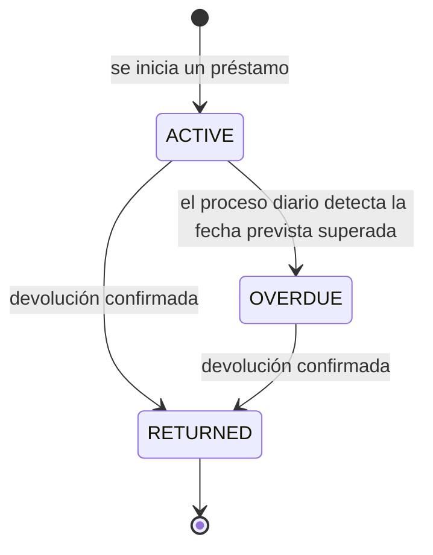

# 4.1.5 Préstamos (concepto mínimo en el core)

| Campo | Valor |
|---|---|
| Estado | Vigente |
| Responsable | Equipo DRP |
| Ámbito | Prestamos, concepto minimo del core |
| Última revisión | 2026-08-10 |

> Trasladado desde la sección 4.1.5 del [`README principal`](../../../README.md) al iniciar la Fase 1. **Los números de sección se conservan**: hay más de cien referencias cruzadas del tipo «ver 4.1.1» repartidas por el repositorio, y renumerarlas las rompería todas.

Los roles de prestador y receptor no tienen sentido sin un concepto que los sustente, así que el core incorpora una versión **mínima** de gestión de préstamos: qué asset se presta, quién lo presta, quién lo recibe y en qué estado está.

*Estos son los estados del **préstamo**. El asset acompaña: pasa a `LENT` mientras el préstamo está `ACTIVE` o `OVERDUE`, y vuelve a `AVAILABLE` con la devolución.*

**Atributos mínimos de un Préstamo:**

| Atributo | Descripción |
|---|---|
| Identificador (`id`) | — |
| Asset prestado (`assetId`) | — |
| Prestador (`lender`) | Usuario del hogar **o** persona externa, exactamente uno de los dos |
| Receptor (`borrower`) | Ídem |
| Contacto del externo (`external`) | Nombre y un canal —correo o teléfono, al menos uno— porque es por donde se envía el enlace con el token acotado (ver 5.4.1). Un texto suelto no sirve para eso |
| Fecha de inicio (`startedAt`) | — |
| Fecha prevista de devolución (`dueAt`) | Opcional. Sin ella el préstamo nunca vence: es un préstamo sin plazo, no un plazo infinito |
| Fecha real de devolución (`returnedAt`) | Informada al confirmar la devolución |
| Estado (`status`) | `ACTIVE`, `RETURNED`, `OVERDUE` |
| Notas (`notes`) | Texto libre, opcional |
| Fecha de alta (`createdAt`) | — |
| Última modificación (`updatedAt`) | — |
| Creado por (`createdBy`) | Ver «Autoría de los cambios» |
| Modificado por (`updatedBy`) | Ídem |

**Cómo se llega a `OVERDUE`.** No lo provoca ninguna acción del usuario, así que hace falta algo que lo marque: un **proceso programado** recorre a diario los préstamos `ACTIVE` con `dueAt` ya pasada, los pasa a `OVERDUE` y publica `LoanOverdue` (ver 5.2.3). Es el primer proceso de fondo del sistema, y de ahí cuelgan los recordatorios automáticos que la gestión avanzada de préstamos (4.2) necesitará.

Que el estado se persista, en vez de derivarse al leer, es lo que permite publicar ese evento: un valor calculado no tiene momento en el que ocurrir, y sin evento no hay recordatorio al que engancharse.

> **Cuidado con el aislamiento multi-tenant.** Este proceso no nace de una petición, así que no hay token del que sacar el `householdId` (ver 5.6). No debe resolverse dando `BYPASSRLS` al usuario de base de datos —eso anula la segunda capa de aislamiento para toda la aplicación, no solo para el job—: recorre los hogares uno a uno, fijando `app.household_id` en cada transacción como haría cualquier petición.

**Reglas mínimas de negocio:**
- Un asset no puede tener más de un préstamo en estado `ACTIVE` simultáneamente. Un préstamo `OVERDUE` sigue ocupando ese hueco: vencer no es devolver.
- Solo se prestan assets `DURABLE` (ver 4.1.1): un consumible se consume o se entrega, y la semántica de devolución no le aplica.
- Un préstamo sin `dueAt` no puede vencer, y el proceso lo ignora.

> **¿Y ceder un consumible?** Dar azúcar a un vecino no necesita ningún concepto nuevo: es un `AdjustAssetQuantity` que descuenta la cantidad (ver 5.7). Si te lo reponen, otro ajuste que la suma. Modelarlo como préstamo obligaría a llevar cantidad en el préstamo y a permitir varios préstamos activos sobre el mismo asset, complicando el core para un caso que el contador ya resuelve.

> **Nota de alcance:** esta es una versión mínima, suficiente para que los roles de prestador/receptor tengan algo que consultar. Si en el futuro el negocio de préstamos crece (recordatorios automáticos, penalizaciones, valoraciones, historial extenso), es candidato a extraerse como módulo propio, reutilizando el mismo mecanismo de event bus para no romper el core.
